# 라이브 커머스 쇼핑몰 - 종합 개발 기획서

> **작성일**: 2025-11-04
> **버전**: 1.0
> **목적**: 본격 개발 착수 전 완벽한 설계 및 검증

---

## 📋 목차

1. [Part 1: 사이트 구조 설계](#part-1-사이트-구조-설계)
2. [Part 2: 페이지별 상세 기능 명세](#part-2-페이지별-상세-기능-명세)
3. [Part 3: 사용자 경험 설계](#part-3-사용자-경험-설계)
4. [Part 4: 기술 설계](#part-4-기술-설계)
5. [Part 5: 시퀀스 다이어그램](#part-5-시퀀스-다이어그램)
6. [Part 6: 와이어프레임 가이드](#part-6-와이어프레임-가이드)
7. [Part 7: 컴포넌트 설계](#part-7-컴포넌트-설계)
8. [Part 8: 에러 처리](#part-8-에러-처리)
9. [Part 9: 최종 체크리스트](#part-9-최종-체크리스트)

---

# Part 1: 사이트 구조 설계

## 1.1 전체 사이트맵

### 사용자 영역 (11개 페이지)

```
/ (홈)
├── /products (상품 목록)
│   └── /products/[id] (상품 상세)
├── /cart (장바구니)
├── /checkout (주문하기)
├── /order-complete (주문 완료)
├── /orders (주문 내역)
│   └── /orders/[id] (주문 상세)
├── /mypage (마이페이지)
│   ├── /mypage/profile (프로필 수정)
│   └── /mypage/coupons (내 쿠폰)
├── /live (라이브 방송)
└── /login (로그인)
    └── /signup (회원가입)
```

### 관리자 영역 (25개 페이지)

```
/admin
├── /dashboard (대시보드)
├── /products (상품 관리)
│   ├── / (상품 목록)
│   ├── /create (상품 등록)
│   ├── /[id] (상품 상세)
│   └── /[id]/edit (상품 수정)
├── /orders (주문 관리)
│   ├── / (주문 목록)
│   ├── /[id] (주문 상세)
│   ├── /deposits (입금 확인)
│   └── /shipping (배송 관리)
├── /coupons (쿠폰 관리)
│   ├── / (쿠폰 목록)
│   ├── /create (쿠폰 생성)
│   └── /distribute (쿠폰 배포)
├── /purchase-orders (발주 관리)
│   ├── / (발주 목록)
│   ├── /create (발주 생성)
│   └── /[id] (발주 상세)
├── /suppliers (공급처 관리)
│   ├── / (공급처 목록)
│   ├── /create (공급처 등록)
│   └── /[id] (공급처 상세)
├── /live (라이브 관리)
│   ├── / (방송 목록)
│   ├── /create (방송 생성)
│   └── /[id] (방송 관리)
├── /customers (고객 관리)
│   ├── / (고객 목록)
│   └── /[id] (고객 상세)
├── /analytics (통계 분석)
│   ├── /sales (매출 분석)
│   ├── /products (상품 분석)
│   └── /customers (고객 분석)
└── /settings (시스템 설정)
    ├── /general (일반 설정)
    ├── /payment (결제 설정)
    └── /shipping (배송 설정)
```

---

# Part 2: 페이지별 상세 기능 명세

## 2.1 사용자 페이지

### 2.1.1 홈 페이지 (`/`)

**페이지 목적**: 신규 방문자를 고객으로 전환, 주요 상품 노출

**주요 기능**:

1. **히어로 섹션**
   - 현재 진행 중인 라이브 방송 표시 (있을 경우)
   - 메인 배너 슬라이더 (수동 관리)
   - CTA 버튼 (라이브 입장 or 인기 상품 보기)

2. **카테고리 퀵 링크**
   - 주요 카테고리 아이콘 + 이름
   - 클릭 시 해당 카테고리 상품 목록 이동

3. **추천 상품 섹션**
   - "신상품" (최신 등록 순 8개)
   - "베스트 상품" (주문 수 기준 8개)
   - "할인 상품" (할인율 높은 순 8개)

4. **라이브 방송 예고**
   - 예정된 라이브 방송 일정 표시
   - D-Day 카운터

**API 호출**:
- `GET /api/products?featured=true&limit=8`
- `GET /api/live/broadcasts?status=upcoming`

**상태 관리**:
- 로컬: 배너 슬라이더 인덱스
- 서버: 상품 목록, 라이브 정보

**에러 처리**:
- API 실패 시 캐시된 데이터 표시
- 이미지 로드 실패 시 플레이스홀더

---

### 2.1.2 상품 상세 페이지 (`/products/[id]`)

**페이지 목적**: 상품 정보 제공, 구매 결정 유도

**주요 기능**:

1. **상품 정보 표시**
   - 상품 이미지 갤러리 (메인 + 썸네일)
   - 상품명, 상품번호
   - 가격 (정가, 할인가, 할인율)
   - 배송비 정보

2. **옵션 선택**
   - 옵션 선택 드롭다운 (색상, 사이즈 등)
   - 선택된 옵션 목록 표시
   - 옵션별 수량 조절 (+/-)
   - 재고 부족 시 "품절" 표시

3. **구매 액션**
   - 총 금액 계산 (실시간)
   - "장바구니 담기" 버튼
   - "바로 구매" 버튼
   - "찜하기" 버튼

4. **상품 상세 정보**
   - 상세 설명 (HTML 렌더링)
   - 배송/교환/반품 안내
   - 상품 후기 (향후 기능)

**API 호출**:
- `GET /api/products/:id`
- `GET /api/products/:id/variants`
- `POST /api/cart/items` (장바구니 담기)

**상태 관리**:
- 선택된 옵션 목록 (배열)
- 총 금액
- 이미지 갤러리 인덱스

**유효성 검사**:
- 옵션 필수 선택 확인
- 최소 수량 1개 이상
- 재고 수량 체크

**에러 처리**:
- 품절 상품 구매 방지
- 장바구니 추가 실패 시 알림
- 상품 정보 로드 실패 시 404 페이지

---

### 2.1.3 장바구니 페이지 (`/cart`)

**페이지 목적**: 구매 예정 상품 확인 및 수정

**주요 기능**:

1. **장바구니 상품 목록**
   - 상품 이미지, 이름, 옵션
   - 단가, 수량, 소계
   - 수량 변경 버튼 (+/-)
   - 개별 삭제 버튼 (X)

2. **선택/삭제 기능**
   - 전체 선택 체크박스
   - 개별 선택 체크박스
   - 선택 삭제 버튼

3. **주문 요약**
   - 총 상품 금액
   - 총 배송비 (30,000원 이상 무료)
   - 총 결제 금액
   - "주문하기" 버튼

4. **추천 상품**
   - 장바구니 하단에 "이런 상품은 어때요?" 섹션

**API 호출**:
- `GET /api/cart`
- `PATCH /api/cart/items/:id` (수량 변경)
- `DELETE /api/cart/items/:id` (삭제)

**상태 관리**:
- 선택된 상품 ID 배열
- 장바구니 상품 목록
- 총 금액 계산

**에러 처리**:
- 재고 부족 시 최대 수량으로 제한
- 품절 상품 회색 처리 + 구매 불가 표시
- API 실패 시 재시도 버튼

---

### 2.1.4 주문하기 페이지 (`/checkout`)

**페이지 목적**: 주문 정보 입력 및 결제

**주요 기능**:

1. **주문 상품 확인**
   - 주문 상품 목록 (장바구니에서 선택한 항목)
   - 옵션, 수량, 금액 표시

2. **주문자 정보**
   - 이름, 전화번호
   - 이메일 (자동 입력, 수정 가능)

3. **배송지 정보**
   - 수령인 이름, 전화번호
   - 우편번호 (다음 우편번호 API)
   - 주소, 상세주소
   - 배송 요청사항 (선택)
   - "주문자 정보와 동일" 체크박스

4. **쿠폰 선택**
   - 사용 가능한 쿠폰 목록
   - 쿠폰 선택 모달
   - 적용된 쿠폰 표시 및 해제

5. **결제 수단**
   - 무통장 입금 (현재)
   - Toss Payments (향후)

6. **최종 금액 확인**
   - 총 상품 금액
   - 배송비
   - 쿠폰 할인
   - 최종 결제 금액

7. **주문 동의**
   - 개인정보 수집 동의
   - 결제 대행 서비스 약관 동의
   - "주문하기" 버튼

**API 호출**:
- `GET /api/cart` (주문 상품 가져오기)
- `GET /api/coupons/available` (사용 가능 쿠폰)
- `POST /api/coupons/validate` (쿠폰 검증)
- `POST /api/orders` (주문 생성)

**상태 관리**:
- 주문자 정보 (form state)
- 배송지 정보 (form state)
- 선택된 쿠폰 ID
- 계산된 금액들

**유효성 검사**:
- 필수 입력 필드 검증
- 전화번호 형식 (010-0000-0000)
- 우편번호 입력 확인
- 동의 체크박스 필수

**에러 처리**:
- 품절 상품 주문 방지
- 쿠폰 적용 실패 시 알림
- 주문 생성 실패 시 재시도
- 결제 정보 저장 실패 대응

---

### 2.1.5 주문 완료 페이지 (`/order-complete`)

**페이지 목적**: 주문 완료 확인, 입금 안내

**주요 기능**:

1. **주문 완료 메시지**
   - 주문번호 표시
   - 주문 일시

2. **입금 안내** (무통장 입금 선택 시)
   - 입금 은행, 계좌번호
   - 입금자명 안내
   - 입금 기한 (24시간)

3. **주문 내역 요약**
   - 주문 상품 목록
   - 배송지 정보
   - 결제 금액

4. **다음 액션**
   - "주문 상세 보기" 버튼
   - "계속 쇼핑하기" 버튼

**API 호출**:
- `GET /api/orders/:id` (주문 정보 확인)

**상태 관리**:
- URL 파라미터로 주문 ID 전달
- 주문 정보 (서버에서 가져옴)

**에러 처리**:
- 주문 ID 없을 시 홈으로 리다이렉트
- 주문 정보 로드 실패 시 재시도

---

### 2.1.6 주문 내역 페이지 (`/orders`)

**페이지 목적**: 과거 주문 내역 조회

**주요 기능**:

1. **주문 목록**
   - 주문번호, 주문일시
   - 주문 상품 대표 이미지
   - 상품명 (외 N개)
   - 주문 상태 (입금대기, 결제완료, 배송중, 배송완료, 주문취소)
   - 결제 금액

2. **필터링**
   - 기간 선택 (1개월, 3개월, 6개월, 전체)
   - 주문 상태별 필터

3. **주문별 액션**
   - "주문 상세" 버튼
   - "주문 취소" 버튼 (입금대기 상태만)
   - "배송 조회" 버튼 (배송중/완료 상태)

**API 호출**:
- `GET /api/orders?status=&period=`
- `POST /api/orders/:id/cancel` (주문 취소)

**상태 관리**:
- 선택된 기간 필터
- 선택된 상태 필터
- 주문 목록

**에러 처리**:
- 주문 내역 없을 시 안내 메시지
- 주문 취소 실패 시 알림

---

## 2.2 관리자 페이지

### 2.2.1 대시보드 (`/admin/dashboard`)

**페이지 목적**: 전체 비즈니스 현황 한눈에 파악

**주요 기능**:

1. **핵심 지표 카드**
   - 오늘 매출 (전일 대비 증감)
   - 오늘 주문 수 (전일 대비)
   - 입금 대기 주문 수
   - 배송 대기 주문 수

2. **매출 차트**
   - 최근 7일 매출 추이 (라인 차트)
   - 최근 30일 매출 추이 (라인 차트)

3. **주문 현황**
   - 주문 상태별 건수 (파이 차트)
   - 최근 주문 목록 (최근 10개)

4. **인기 상품**
   - 베스트셀러 TOP 5
   - 상품명, 판매 수량, 매출액

5. **재고 알림**
   - 재고 부족 상품 (10개 이하)
   - 품절 상품

6. **퀵 액션**
   - "상품 등록" 버튼
   - "입금 확인" 버튼
   - "발주 생성" 버튼

**API 호출**:
- `GET /api/admin/stats/today`
- `GET /api/admin/stats/sales?period=7days`
- `GET /api/admin/orders?status=pending&limit=10`
- `GET /api/admin/products/best-sellers?limit=5`
- `GET /api/admin/products/low-stock?threshold=10`

**상태 관리**:
- 대시보드 데이터 (서버 상태)
- 차트 기간 선택

**에러 처리**:
- API 실패 시 해당 섹션만 에러 표시
- 재시도 버튼 제공

---

### 2.2.2 상품 목록 (`/admin/products`)

**페이지 목적**: 등록된 상품 관리

**주요 기능**:

1. **상품 목록 테이블**
   - 상품 이미지 (썸네일)
   - 상품번호, 상품명
   - 카테고리
   - 판매가, 할인가
   - 재고 수량
   - 노출 여부 (ON/OFF 토글)
   - 등록일

2. **검색 및 필터**
   - 상품명/상품번호 검색
   - 카테고리 필터
   - 노출 상태 필터
   - 재고 상태 필터 (전체, 정상, 부족, 품절)

3. **정렬**
   - 등록일 순
   - 판매 수량 순
   - 재고 수량 순

4. **대량 액션**
   - 선택 상품 노출/숨김
   - 선택 상품 삭제

5. **페이지네이션**
   - 페이지당 20개
   - 이전/다음 버튼

**API 호출**:
- `GET /api/admin/products?page=&search=&category=&status=`
- `PATCH /api/admin/products/:id` (노출 토글)
- `DELETE /api/admin/products` (대량 삭제)

**상태 관리**:
- 검색어, 필터 상태
- 선택된 상품 ID 배열
- 현재 페이지

---

### 2.2.3 상품 등록 (`/admin/products/create`)

**페이지 목적**: 신규 상품 등록

**주요 기능**:

1. **기본 정보**
   - 상품명 (필수)
   - 상품번호 (자동 생성 or 수동 입력)
   - 카테고리 선택 (필수)
   - 공급처 선택
   - 판매가 (필수)
   - 할인가
   - 노출 여부

2. **상품 이미지**
   - 메인 이미지 업로드 (필수, 1개)
   - 추가 이미지 업로드 (최대 9개)
   - 드래그 앤 드롭 지원
   - 순서 변경 가능

3. **옵션 설정**
   - 옵션 사용 여부 체크박스
   - 옵션명 입력 (예: 색상, 사이즈)
   - 옵션값 입력 (예: 빨강, 파랑)
   - 옵션 조합별 추가 금액
   - 옵션 조합별 재고 수량

4. **상세 설명**
   - 에디터 (Tiptap)
   - 이미지 업로드
   - HTML 미리보기

5. **배송 정보**
   - 배송비 (기본 3,000원)
   - 무료 배송 조건 (30,000원 이상)

6. **저장 액션**
   - "임시 저장" 버튼 (노출 OFF로 저장)
   - "저장 및 노출" 버튼 (노출 ON으로 저장)

**API 호출**:
- `POST /api/admin/products` (상품 생성)
- `POST /api/admin/products/images` (이미지 업로드)

**유효성 검사**:
- 필수 필드 입력 확인
- 가격 0원 이상
- 이미지 파일 형식 (jpg, png, webp)
- 이미지 크기 제한 (10MB)

**에러 처리**:
- 이미지 업로드 실패 시 재시도
- 상품 등록 실패 시 입력 데이터 보존
- 중복 상품번호 경고

---

### 2.2.4 주문 관리 (`/admin/orders`)

**페이지 목적**: 전체 주문 관리

**주요 기능**:

1. **주문 목록 테이블**
   - 주문번호, 주문일시
   - 주문자명, 전화번호
   - 주문 상품 (대표 상품명 + 외 N개)
   - 주문 금액
   - 주문 상태 (배지)
   - 입금자명 (무통장 입금)

2. **검색 및 필터**
   - 주문번호/주문자명/전화번호 검색
   - 주문 상태 필터
   - 날짜 범위 선택

3. **정렬**
   - 주문일시 순 (최신/과거)
   - 주문 금액 순

4. **주문별 액션**
   - "상세 보기" 버튼
   - "입금 확인" 버튼 (입금대기 상태)
   - "배송 처리" 버튼 (결제완료 상태)

5. **대량 액션**
   - 선택 주문 엑셀 다운로드

**API 호출**:
- `GET /api/admin/orders?page=&search=&status=&date_from=&date_to=`
- `PATCH /api/admin/orders/:id/status` (상태 변경)

**상태 관리**:
- 검색어, 필터, 날짜 범위
- 선택된 주문 ID 배열

---

### 2.2.5 입금 확인 (`/admin/orders/deposits`)

**페이지 목적**: 무통장 입금 확인 및 처리

**주요 기능**:

1. **입금 대기 주문 목록**
   - 주문번호, 주문일시
   - 주문자명
   - 입금자명 (주문 시 입력)
   - 주문 금액
   - 입금 기한 (남은 시간 표시)

2. **입금 확인 처리**
   - 개별 "입금 확인" 버튼
   - 확인 시 주문 상태 → "결제완료"
   - 확인 모달 (금액 재확인)

3. **입금 기한 관리**
   - 기한 초과 주문 자동 취소 (시스템)
   - 수동 취소 버튼

**API 호출**:
- `GET /api/admin/orders?status=pending_payment`
- `POST /api/admin/orders/:id/confirm-payment`
- `POST /api/admin/orders/:id/cancel`

**상태 관리**:
- 입금 대기 주문 목록

**에러 처리**:
- 입금 확인 실패 시 재시도
- 중복 확인 방지

---

### 2.2.6 배송 관리 (`/admin/orders/shipping`)

**페이지 목적**: 배송 처리 및 추적

**주요 기능**:

1. **배송 대기 주문 목록**
   - 주문번호
   - 수령인, 배송지
   - 주문 상품
   - 결제 완료 일시

2. **배송 처리**
   - 택배사 선택 (CJ대한통운, 우체국 등)
   - 송장번호 입력
   - "배송 시작" 버튼
   - 일괄 업로드 (엑셀)

3. **배송 중 주문 목록**
   - 송장번호
   - 배송사
   - 배송 조회 링크

**API 호출**:
- `GET /api/admin/orders?status=paid`
- `POST /api/admin/orders/:id/ship`
- `POST /api/admin/orders/bulk-ship` (일괄 처리)

**유효성 검사**:
- 송장번호 형식 확인

---

### 2.2.7 쿠폰 관리 (`/admin/coupons`)

**페이지 목적**: 쿠폰 생성 및 관리

**주요 기능**:

1. **쿠폰 목록**
   - 쿠폰명
   - 쿠폰 코드
   - 할인 유형 (정액/정률)
   - 할인 금액/할인율
   - 최소 주문 금액
   - 사용 기간
   - 발급/사용 수

2. **쿠폰 생성**
   - 쿠폰명 (내부 관리용)
   - 쿠폰 코드 (고객 입력용)
   - 할인 유형 선택
   - 할인 금액 or 할인율
   - 최소 주문 금액
   - 유효 기간 (시작일, 종료일)
   - 발급 수량 제한 (선택)

3. **쿠폰 배포**
   - 전체 고객 배포
   - 특정 고객 선택 배포
   - 신규 가입 자동 배포 설정

**API 호출**:
- `GET /api/admin/coupons`
- `POST /api/admin/coupons`
- `POST /api/admin/coupons/:id/distribute`

---

### 2.2.8 쿠폰 생성 (`/admin/coupons/create`)

**주요 기능**:

1. **기본 정보**
   - 쿠폰명 (필수)
   - 쿠폰 설명
   - 쿠폰 코드 (자동 생성 or 수동)

2. **할인 설정**
   - 할인 유형 (정액/정률)
   - 할인 금액 (정액 선택 시)
   - 할인율 (정률 선택 시, 최대 100%)
   - 최대 할인 금액 (정률 선택 시)

3. **사용 조건**
   - 최소 주문 금액
   - 사용 가능 카테고리 (전체 or 특정)
   - 중복 사용 가능 여부

4. **발급 설정**
   - 발급 수량 제한 (무제한 or 제한)
   - 1인당 발급 수량
   - 유효 기간 (시작일, 종료일)

**유효성 검사**:
- 할인 금액/율 0보다 큰 값
- 종료일이 시작일보다 나중

---

### 2.2.9 쿠폰 배포 (`/admin/coupons/distribute`)

**주요 기능**:

1. **배포 대상 선택**
   - 전체 고객
   - 특정 고객 검색 및 선택
   - 고객 등급별 선택 (향후)

2. **배포할 쿠폰 선택**
   - 사용 가능한 쿠폰 목록
   - 라디오 버튼으로 선택

3. **배포 실행**
   - "배포하기" 버튼
   - 배포 결과 표시 (성공/실패 건수)

**API 호출**:
- `GET /api/admin/customers?search=`
- `POST /api/admin/coupons/:id/distribute`

---

### 2.2.10 발주 관리 (`/admin/purchase-orders`)

**페이지 목적**: 공급처별 상품 발주 관리

**주요 기능**:

1. **발주 목록**
   - 발주번호
   - 공급처명
   - 발주일
   - 발주 상품 수
   - 총 발주 금액
   - 발주 상태 (대기, 완료)

2. **발주 생성**
   - 공급처 선택
   - 상품 검색 및 추가
   - 수량 입력
   - 자동 총액 계산

3. **발주 상세**
   - 발주 상품 목록
   - 상품별 수량, 단가
   - 입고 처리 (재고 자동 증가)

**API 호출**:
- `GET /api/admin/purchase-orders`
- `POST /api/admin/purchase-orders`
- `POST /api/admin/purchase-orders/:id/receive` (입고 처리)

---

# Part 3: 사용자 경험 설계

## 3.1 주요 사용자 시나리오

### 시나리오 1: 첫 구매 고객 (신규 가입 → 구매)

**목표**: 신규 방문자가 5분 내 구매 완료

**단계**:

1. **진입** (0:00)
   - 홈 페이지 방문
   - 메인 배너 확인

2. **상품 탐색** (0:30)
   - 카테고리 or 베스트 상품 클릭
   - 상품 목록 스크롤
   - 관심 상품 클릭

3. **상품 상세** (1:00)
   - 이미지 확인
   - 가격 확인
   - 옵션 선택
   - "바로 구매" 클릭

4. **로그인 유도** (2:00)
   - 로그인 모달 표시
   - "간편 가입하고 구매하기" 선택
   - Kakao 로그인 진행
   - 전화번호 추가 입력

5. **주문하기** (3:00)
   - 주문자 정보 자동 입력 (Kakao에서)
   - 배송지 입력 (다음 우편번호 API)
   - 쿠폰 확인 (신규 가입 쿠폰 자동 적용)
   - 결제 수단 선택 (무통장 입금)
   - "주문하기" 클릭

6. **주문 완료** (4:00)
   - 주문번호 확인
   - 입금 계좌 정보 확인
   - 입금자명 메모

**소요 시간**: 약 5분

**핵심 UX**:
- 간편 가입 (Kakao 로그인)
- 자동 입력 (주문자 정보)
- 신규 쿠폰 자동 적용

---

### 시나리오 2: 재구매 고객

**목표**: 로그인 후 1분 내 구매 완료

**단계**:

1. **진입** (0:00)
   - 홈 페이지 방문 (로그인 상태)
   - 상품 클릭

2. **상품 상세** (0:15)
   - 이전 구매 옵션 기억
   - 옵션 선택
   - "바로 구매" 클릭

3. **주문하기** (0:30)
   - 주문자 정보 자동 입력
   - 이전 배송지 선택 (저장된 주소)
   - 쿠폰 선택
   - "주문하기" 클릭

4. **주문 완료** (1:00)
   - 입금 정보 확인

**소요 시간**: 약 1분

**핵심 UX**:
- 저장된 배송지
- 빠른 체크아웃

---

### 시나리오 3: 라이브 방송 → 구매

**목표**: 라이브 중 충동 구매 유도

**단계**:

1. **라이브 시청** (0:00)
   - 라이브 페이지 진입
   - 방송 시청

2. **상품 노출** (1:00)
   - 호스트가 상품 소개
   - 화면 하단에 상품 카드 표시
   - 한정 수량 표시 (30개 남음!)

3. **빠른 구매** (1:30)
   - 상품 카드 클릭
   - 옵션 선택 모달 (라이브 화면 유지)
   - "바로 구매" 클릭

4. **간편 체크아웃** (2:00)
   - 최소 입력 (배송지만)
   - "주문하기" 클릭

5. **구매 완료** (2:30)
   - 라이브 화면으로 복귀

**소요 시간**: 약 2분 30초

**핵심 UX**:
- 라이브 중단 최소화
- 한정 수량 긴급성
- 간편 체크아웃

---

### 시나리오 4: 관리자 - 상품 등록

**목표**: 신규 상품 10분 내 등록

**단계**:

1. **로그인** (0:00)
   - 관리자 로그인

2. **상품 등록 페이지** (0:30)
   - "상품 등록" 클릭

3. **기본 정보 입력** (2:00)
   - 상품명, 카테고리, 가격 입력
   - 공급처 선택

4. **이미지 업로드** (4:00)
   - 메인 이미지 + 추가 이미지 업로드
   - 드래그 앤 드롭 활용

5. **옵션 설정** (6:00)
   - 옵션명, 옵션값 입력
   - 옵션 조합별 재고 입력

6. **상세 설명 작성** (8:00)
   - 에디터로 상세 설명 작성
   - 이미지 추가

7. **저장** (10:00)
   - "저장 및 노출" 클릭
   - 완료 메시지 확인

**소요 시간**: 약 10분

**핵심 UX**:
- 직관적인 폼
- 드래그 앤 드롭
- 자동 저장 (선택)

---

### 시나리오 5: 관리자 - 입금 확인 → 발주

**목표**: 주문 처리 및 재고 관리

**단계**:

1. **대시보드 확인** (0:00)
   - "입금 대기 10건" 확인

2. **입금 확인** (1:00)
   - 입금 확인 페이지 이동
   - 은행 계좌 확인
   - 입금자명 대조
   - "입금 확인" 클릭 (10건)

3. **재고 확인** (5:00)
   - 대시보드로 복귀
   - "재고 부족 상품 5개" 확인

4. **발주 생성** (7:00)
   - 발주 관리 페이지 이동
   - "발주 생성" 클릭
   - 공급처 선택
   - 재고 부족 상품 검색 및 추가
   - 수량 입력
   - "발주 생성" 클릭

5. **배송 처리 예약** (10:00)
   - 주문 관리 페이지
   - 배송 대기 주문 확인
   - 택배사 선택, 송장 입력 (일괄 업로드)
   - "배송 시작" 클릭

**소요 시간**: 약 15분

**핵심 UX**:
- 대시보드 중심 워크플로우
- 일괄 처리 기능
- 자동 알림

---

## 3.2 사용자 플로우 다이어그램

### 3.2.1 구매 플로우

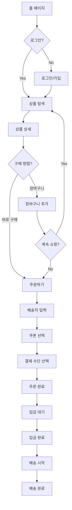
```mermaid
graph TD
    A[홈 페이지] --> B{로그인?}
    B -->|Yes| C[상품 탐색]
    B -->|No| D[로그인/가입]
    D --> C
    C --> E[상품 상세]
    E --> F{구매 방법?}
    F -->|장바구니| G[장바구니 추가]
    F -->|바로 구매| H[주문하기]
    G --> I{계속 쇼핑?}
    I -->|Yes| C
    I -->|No| H
    H --> J[배송지 입력]
    J --> K[쿠폰 선택]
    K --> L[결제 수단 선택]
    L --> M[주문 완료]
    M --> N[입금 대기]
    N --> O[입금 완료]
    O --> P[배송 시작]
    P --> Q[배송 완료]
```

### 3.2.2 관리자 주문 처리 플로우

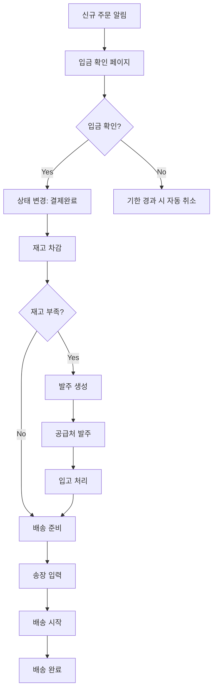
```mermaid
graph TD
    A[신규 주문 알림] --> B[입금 확인 페이지]
    B --> C{입금 확인?}
    C -->|Yes| D[상태 변경: 결제완료]
    C -->|No| E[기한 경과 시 자동 취소]
    D --> F[재고 차감]
    F --> G{재고 부족?}
    G -->|Yes| H[발주 생성]
    G -->|No| I[배송 준비]
    H --> J[공급처 발주]
    J --> K[입고 처리]
    K --> I
    I --> L[송장 입력]
    L --> M[배송 시작]
    M --> N[배송 완료]
```

---

## 3.3 페이지 연결 매트릭스

### 사용자 페이지 연결성

| From \ To | 홈 | 상품목록 | 상품상세 | 장바구니 | 주문하기 | 주문완료 | 주문내역 | 마이페이지 | 로그인 |
|-----------|-----|----------|----------|----------|----------|----------|----------|------------|--------|
| 홈 | - | ✅ | ✅ | ✅ | - | - | ✅ | ✅ | ✅ |
| 상품목록 | ✅ | - | ✅ | ✅ | - | - | - | - | - |
| 상품상세 | ✅ | ✅ | - | ✅ | ✅ | - | - | - | ✅ |
| 장바구니 | ✅ | ✅ | ✅ | - | ✅ | - | - | - | ✅ |
| 주문하기 | ✅ | - | - | ✅ | - | ✅ | - | - | - |
| 주문완료 | ✅ | ✅ | - | - | - | - | ✅ | - | - |
| 주문내역 | ✅ | - | ✅ | - | - | - | - | ✅ | - |
| 마이페이지 | ✅ | - | - | - | - | - | ✅ | - | - |
| 로그인 | ✅ | - | - | - | - | - | - | - | - |

### 관리자 페이지 연결성

| From \ To | 대시보드 | 상품관리 | 상품등록 | 주문관리 | 입금확인 | 배송관리 | 쿠폰관리 | 발주관리 |
|-----------|----------|----------|----------|----------|----------|----------|----------|----------|
| 대시보드 | - | ✅ | ✅ | ✅ | ✅ | ✅ | ✅ | ✅ |
| 상품관리 | ✅ | - | ✅ | - | - | - | - | ✅ |
| 상품등록 | ✅ | ✅ | - | - | - | - | - | - |
| 주문관리 | ✅ | - | - | - | ✅ | ✅ | - | - |
| 입금확인 | ✅ | - | - | ✅ | - | ✅ | - | - |
| 배송관리 | ✅ | - | - | ✅ | - | - | - | - |
| 쿠폰관리 | ✅ | - | - | - | - | - | - | - |
| 발주관리 | ✅ | ✅ | - | - | - | - | - | - |

---

# Part 4: 기술 설계

## 4.1 API 명세서

### 4.1.1 API 설계 원칙

1. **RESTful 설계**
   - 리소스 기반 URL 구조
   - HTTP 메서드 의미 준수 (GET, POST, PATCH, DELETE)
   - 상태 코드 명확한 사용

2. **응답 형식**
   ```json
   {
     "success": true,
     "data": {},
     "error": null,
     "meta": {
       "timestamp": "2025-11-04T12:00:00Z"
     }
   }
   ```

3. **에러 응답 형식**
   ```json
   {
     "success": false,
     "data": null,
     "error": {
       "code": "PRODUCT_NOT_FOUND",
       "message": "상품을 찾을 수 없습니다.",
       "details": {}
     }
   }
   ```

4. **인증**
   - JWT 토큰 (Supabase Auth)
   - Header: `Authorization: Bearer <token>`

5. **페이지네이션**
   ```json
   {
     "data": [],
     "meta": {
       "page": 1,
       "limit": 20,
       "total": 100,
       "totalPages": 5
     }
   }
   ```

---

### 4.1.2 인증 API

#### 1. 회원가입

```
POST /api/auth/signup
```

**Request**:
```json
{
  "email": "user@example.com",
  "password": "password123",
  "name": "홍길동",
  "phone": "010-1234-5678"
}
```

**Response** (201):
```json
{
  "success": true,
  "data": {
    "user": {
      "id": "uuid",
      "email": "user@example.com",
      "name": "홍길동"
    },
    "session": {
      "access_token": "jwt_token",
      "refresh_token": "refresh_token"
    }
  }
}
```

---

#### 2. 로그인

```
POST /api/auth/login
```

**Request**:
```json
{
  "email": "user@example.com",
  "password": "password123"
}
```

**Response** (200):
```json
{
  "success": true,
  "data": {
    "user": {
      "id": "uuid",
      "email": "user@example.com",
      "name": "홍길동",
      "is_admin": false
    },
    "session": {
      "access_token": "jwt_token",
      "refresh_token": "refresh_token"
    }
  }
}
```

**Error** (401):
```json
{
  "success": false,
  "error": {
    "code": "INVALID_CREDENTIALS",
    "message": "이메일 또는 비밀번호가 올바르지 않습니다."
  }
}
```

---

#### 3. Kakao 로그인

```
POST /api/auth/kakao
```

**Request**:
```json
{
  "code": "kakao_auth_code"
}
```

**Response** (200):
```json
{
  "success": true,
  "data": {
    "user": {
      "id": "uuid",
      "email": "user@kakao.com",
      "name": "홍길동",
      "kakao_id": "123456789"
    },
    "session": {
      "access_token": "jwt_token",
      "refresh_token": "refresh_token"
    },
    "isNewUser": true
  }
}
```

---

### 4.1.3 상품 API

#### 1. 상품 목록 조회

```
GET /api/products?page=1&limit=20&category=&search=&sort=latest
```

**Query Parameters**:
- `page`: 페이지 번호 (기본 1)
- `limit`: 페이지당 항목 수 (기본 20)
- `category`: 카테고리 ID (선택)
- `search`: 검색어 (선택)
- `sort`: 정렬 (latest, popular, price_asc, price_desc)

**Response** (200):
```json
{
  "success": true,
  "data": [
    {
      "id": "uuid",
      "product_number": "P20250001",
      "title": "상품명",
      "price": 50000,
      "sale_price": 45000,
      "discount_rate": 10,
      "thumbnail_url": "https://...",
      "is_soldout": false,
      "stock_quantity": 100
    }
  ],
  "meta": {
    "page": 1,
    "limit": 20,
    "total": 100,
    "totalPages": 5
  }
}
```

---

#### 2. 상품 상세 조회

```
GET /api/products/:id
```

**Response** (200):
```json
{
  "success": true,
  "data": {
    "id": "uuid",
    "product_number": "P20250001",
    "title": "상품명",
    "description": "상품 상세 설명 (HTML)",
    "price": 50000,
    "sale_price": 45000,
    "discount_rate": 10,
    "stock_quantity": 100,
    "is_visible": true,
    "is_soldout": false,
    "thumbnail_url": "https://...",
    "images": [
      {
        "id": "uuid",
        "url": "https://...",
        "order": 0
      }
    ],
    "variants": [
      {
        "id": "uuid",
        "option_name": "색상",
        "option_value": "빨강",
        "additional_price": 0,
        "stock_quantity": 50
      }
    ],
    "category": {
      "id": "uuid",
      "name": "의류"
    },
    "supplier": {
      "id": "uuid",
      "name": "공급처명"
    }
  }
}
```

**Error** (404):
```json
{
  "success": false,
  "error": {
    "code": "PRODUCT_NOT_FOUND",
    "message": "상품을 찾을 수 없습니다."
  }
}
```

---

### 4.1.4 장바구니 API

#### 1. 장바구니 상품 추가

```
POST /api/cart/items
```

**Request**:
```json
{
  "product_id": "uuid",
  "variant_id": "uuid",
  "quantity": 2
}
```

**Response** (201):
```json
{
  "success": true,
  "data": {
    "id": "uuid",
    "product": {
      "id": "uuid",
      "title": "상품명",
      "price": 50000,
      "thumbnail_url": "https://..."
    },
    "variant": {
      "id": "uuid",
      "option_name": "색상",
      "option_value": "빨강",
      "additional_price": 0
    },
    "quantity": 2,
    "subtotal": 100000
  }
}
```

---

#### 2. 장바구니 조회

```
GET /api/cart
```

**Response** (200):
```json
{
  "success": true,
  "data": {
    "items": [
      {
        "id": "uuid",
        "product": {
          "id": "uuid",
          "title": "상품명",
          "price": 50000,
          "thumbnail_url": "https://..."
        },
        "variant": {
          "id": "uuid",
          "option_name": "색상",
          "option_value": "빨강",
          "additional_price": 0
        },
        "quantity": 2,
        "subtotal": 100000,
        "is_available": true
      }
    ],
    "summary": {
      "total_items": 1,
      "total_quantity": 2,
      "subtotal": 100000,
      "shipping_fee": 3000,
      "total": 103000
    }
  }
}
```

---

#### 3. 장바구니 수량 변경

```
PATCH /api/cart/items/:id
```

**Request**:
```json
{
  "quantity": 3
}
```

**Response** (200):
```json
{
  "success": true,
  "data": {
    "id": "uuid",
    "quantity": 3,
    "subtotal": 150000
  }
}
```

---

#### 4. 장바구니 상품 삭제

```
DELETE /api/cart/items/:id
```

**Response** (200):
```json
{
  "success": true,
  "data": {
    "deleted_id": "uuid"
  }
}
```

---

### 4.1.5 주문 API

#### 1. 주문 생성

```
POST /api/orders
```

**Request**:
```json
{
  "items": [
    {
      "product_id": "uuid",
      "variant_id": "uuid",
      "quantity": 2
    }
  ],
  "shipping": {
    "recipient_name": "홍길동",
    "recipient_phone": "010-1234-5678",
    "postal_code": "12345",
    "address": "서울시 강남구",
    "address_detail": "101동 101호",
    "request": "문 앞에 놔주세요"
  },
  "coupon_id": "uuid",
  "payment_method": "bank_transfer"
}
```

**Response** (201):
```json
{
  "success": true,
  "data": {
    "id": "uuid",
    "order_number": "ORD20250001",
    "status": "pending_payment",
    "items": [...],
    "shipping": {...},
    "payment": {
      "method": "bank_transfer",
      "total_amount": 103000,
      "bank_name": "국민은행",
      "account_number": "123-456-789",
      "depositor_name": "홍길동",
      "deadline": "2025-11-05T12:00:00Z"
    },
    "created_at": "2025-11-04T12:00:00Z"
  }
}
```

---

#### 2. 주문 목록 조회

```
GET /api/orders?page=1&limit=10&status=
```

**Query Parameters**:
- `page`: 페이지 번호
- `limit`: 페이지당 항목 수
- `status`: 주문 상태 (선택)

**Response** (200):
```json
{
  "success": true,
  "data": [
    {
      "id": "uuid",
      "order_number": "ORD20250001",
      "status": "paid",
      "status_text": "결제완료",
      "total_amount": 103000,
      "created_at": "2025-11-04T12:00:00Z",
      "items_count": 2,
      "representative_product": {
        "title": "상품명",
        "thumbnail_url": "https://..."
      }
    }
  ],
  "meta": {
    "page": 1,
    "limit": 10,
    "total": 50,
    "totalPages": 5
  }
}
```

---

#### 3. 주문 상세 조회

```
GET /api/orders/:id
```

**Response** (200):
```json
{
  "success": true,
  "data": {
    "id": "uuid",
    "order_number": "ORD20250001",
    "status": "paid",
    "status_text": "결제완료",
    "items": [
      {
        "id": "uuid",
        "product_title": "상품명",
        "variant_option": "색상: 빨강",
        "quantity": 2,
        "unit_price": 50000,
        "subtotal": 100000
      }
    ],
    "shipping": {
      "recipient_name": "홍길동",
      "recipient_phone": "010-1234-5678",
      "postal_code": "12345",
      "address": "서울시 강남구",
      "address_detail": "101동 101호",
      "request": "문 앞에 놔주세요",
      "tracking_number": "123456789",
      "courier": "CJ대한통운"
    },
    "payment": {
      "method": "bank_transfer",
      "subtotal": 100000,
      "shipping_fee": 3000,
      "coupon_discount": 0,
      "total_amount": 103000,
      "paid_at": "2025-11-04T13:00:00Z"
    },
    "created_at": "2025-11-04T12:00:00Z"
  }
}
```

---

#### 4. 주문 취소

```
POST /api/orders/:id/cancel
```

**Request**:
```json
{
  "reason": "단순 변심"
}
```

**Response** (200):
```json
{
  "success": true,
  "data": {
    "id": "uuid",
    "status": "cancelled",
    "cancelled_at": "2025-11-04T14:00:00Z"
  }
}
```

---

### 4.1.6 쿠폰 API

#### 1. 사용 가능한 쿠폰 조회

```
GET /api/coupons/available?min_order_amount=100000
```

**Response** (200):
```json
{
  "success": true,
  "data": [
    {
      "id": "uuid",
      "name": "신규 가입 쿠폰",
      "code": "WELCOME2025",
      "discount_type": "fixed",
      "discount_value": 5000,
      "min_order_amount": 50000,
      "valid_from": "2025-01-01T00:00:00Z",
      "valid_until": "2025-12-31T23:59:59Z",
      "is_used": false
    }
  ]
}
```

---

#### 2. 쿠폰 검증

```
POST /api/coupons/validate
```

**Request**:
```json
{
  "coupon_id": "uuid",
  "order_amount": 100000
}
```

**Response** (200):
```json
{
  "success": true,
  "data": {
    "is_valid": true,
    "discount_amount": 5000,
    "final_amount": 95000
  }
}
```

---

### 4.1.7 관리자 API

#### 1. 관리자 로그인

```
POST /api/admin/auth/login
```

**Request**:
```json
{
  "email": "admin@example.com",
  "password": "admin123"
}
```

**Response** (200):
```json
{
  "success": true,
  "data": {
    "user": {
      "id": "uuid",
      "email": "admin@example.com",
      "name": "관리자",
      "is_admin": true
    },
    "session": {
      "access_token": "jwt_token",
      "refresh_token": "refresh_token"
    }
  }
}
```

---

#### 2. 대시보드 통계

```
GET /api/admin/stats/today
```

**Response** (200):
```json
{
  "success": true,
  "data": {
    "today_sales": 5000000,
    "today_orders": 120,
    "pending_payments": 15,
    "pending_shipments": 30,
    "low_stock_products": 5,
    "comparison": {
      "sales_change": 15.5,
      "orders_change": 10.2
    }
  }
}
```

---

#### 3. 주문 관리 - 목록

```
GET /api/admin/orders?page=1&status=&search=&date_from=&date_to=
```

**Response** (200):
```json
{
  "success": true,
  "data": [
    {
      "id": "uuid",
      "order_number": "ORD20250001",
      "customer_name": "홍길동",
      "customer_phone": "010-1234-5678",
      "status": "pending_payment",
      "total_amount": 103000,
      "depositor_name": "홍길동",
      "created_at": "2025-11-04T12:00:00Z"
    }
  ],
  "meta": {
    "page": 1,
    "limit": 20,
    "total": 1000,
    "totalPages": 50
  }
}
```

---

#### 4. 입금 확인

```
POST /api/admin/orders/:id/confirm-payment
```

**Response** (200):
```json
{
  "success": true,
  "data": {
    "id": "uuid",
    "status": "paid",
    "paid_at": "2025-11-04T14:00:00Z"
  }
}
```

---

#### 5. 배송 처리

```
POST /api/admin/orders/:id/ship
```

**Request**:
```json
{
  "courier": "CJ대한통운",
  "tracking_number": "123456789"
}
```

**Response** (200):
```json
{
  "success": true,
  "data": {
    "id": "uuid",
    "status": "shipped",
    "shipping": {
      "courier": "CJ대한통운",
      "tracking_number": "123456789",
      "shipped_at": "2025-11-05T10:00:00Z"
    }
  }
}
```

---

#### 6. 상품 생성

```
POST /api/admin/products
```

**Request**:
```json
{
  "product_number": "P20250001",
  "title": "상품명",
  "description": "<p>상세 설명</p>",
  "price": 50000,
  "sale_price": 45000,
  "category_id": "uuid",
  "supplier_id": "uuid",
  "is_visible": true,
  "images": [
    {
      "url": "https://...",
      "order": 0
    }
  ],
  "variants": [
    {
      "option_name": "색상",
      "option_value": "빨강",
      "additional_price": 0,
      "stock_quantity": 100
    }
  ]
}
```

**Response** (201):
```json
{
  "success": true,
  "data": {
    "id": "uuid",
    "product_number": "P20250001",
    "title": "상품명",
    "created_at": "2025-11-04T15:00:00Z"
  }
}
```

---

#### 7. 쿠폰 생성

```
POST /api/admin/coupons
```

**Request**:
```json
{
  "name": "신규 가입 쿠폰",
  "code": "WELCOME2025",
  "description": "신규 가입 고객 전용",
  "discount_type": "fixed",
  "discount_value": 5000,
  "min_order_amount": 50000,
  "max_discount_amount": null,
  "valid_from": "2025-01-01T00:00:00Z",
  "valid_until": "2025-12-31T23:59:59Z",
  "usage_limit": 1000,
  "usage_limit_per_user": 1
}
```

**Response** (201):
```json
{
  "success": true,
  "data": {
    "id": "uuid",
    "name": "신규 가입 쿠폰",
    "code": "WELCOME2025",
    "created_at": "2025-11-04T16:00:00Z"
  }
}
```

---

#### 8. 쿠폰 배포

```
POST /api/admin/coupons/:id/distribute
```

**Request**:
```json
{
  "user_ids": ["uuid1", "uuid2"],
  "distribute_all": false
}
```

**Response** (200):
```json
{
  "success": true,
  "data": {
    "distributed_count": 2,
    "failed_count": 0
  }
}
```

---

### 4.1.8 에러 코드 테이블

| 코드 | HTTP | 설명 |
|------|------|------|
| `INVALID_CREDENTIALS` | 401 | 이메일 또는 비밀번호 불일치 |
| `UNAUTHORIZED` | 401 | 인증 필요 |
| `FORBIDDEN` | 403 | 권한 없음 |
| `PRODUCT_NOT_FOUND` | 404 | 상품을 찾을 수 없음 |
| `ORDER_NOT_FOUND` | 404 | 주문을 찾을 수 없음 |
| `COUPON_NOT_FOUND` | 404 | 쿠폰을 찾을 수 없음 |
| `OUT_OF_STOCK` | 400 | 재고 부족 |
| `COUPON_EXPIRED` | 400 | 쿠폰 만료 |
| `COUPON_ALREADY_USED` | 400 | 쿠폰 이미 사용됨 |
| `INVALID_COUPON` | 400 | 쿠폰 사용 조건 불충족 |
| `ORDER_CANNOT_CANCEL` | 400 | 주문 취소 불가 상태 |
| `DUPLICATE_PRODUCT_NUMBER` | 409 | 중복된 상품번호 |
| `DUPLICATE_COUPON_CODE` | 409 | 중복된 쿠폰 코드 |
| `VALIDATION_ERROR` | 422 | 입력값 검증 실패 |
| `INTERNAL_ERROR` | 500 | 서버 오류 |

---

## 4.2 데이터베이스 스키마 상세 설계

### 4.2.1 ER 다이어그램

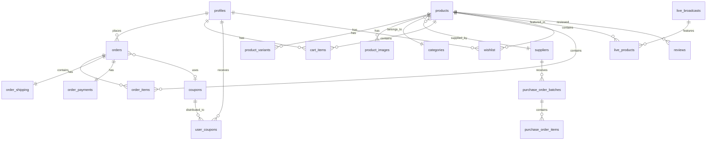
```mermaid
erDiagram
    profiles ||--o{ orders : places
    profiles ||--o{ cart_items : has
    profiles ||--o{ user_coupons : receives
    profiles ||--o{ wishlist : has

    products ||--o{ product_variants : has
    products ||--o{ product_images : has
    products }o--|| categories : belongs_to
    products }o--|| suppliers : supplied_by
    products ||--o{ cart_items : contains
    products ||--o{ order_items : contains
    products ||--o{ wishlist : contains
    products ||--o{ live_products : featured_in
    products ||--o{ reviews : reviewed

    orders ||--o{ order_items : contains
    orders ||--|| order_shipping : has
    orders ||--|| order_payments : has
    orders }o--o| coupons : uses

    coupons ||--o{ user_coupons : distributed_to

    live_broadcasts ||--o{ live_products : features

    suppliers ||--o{ purchase_order_batches : receives
    purchase_order_batches ||--o{ purchase_order_items : contains
```

---

### 4.2.2 테이블 DDL

#### 1. profiles (사용자 프로필)

```sql
CREATE TABLE profiles (
    id UUID PRIMARY KEY REFERENCES auth.users(id) ON DELETE CASCADE,
    email TEXT UNIQUE,
    name TEXT NOT NULL,
    phone TEXT,
    postal_code VARCHAR(10),
    address TEXT,
    address_detail TEXT,
    kakao_id TEXT UNIQUE,
    is_admin BOOLEAN DEFAULT false NOT NULL,
    created_at TIMESTAMPTZ DEFAULT NOW() NOT NULL,
    updated_at TIMESTAMPTZ DEFAULT NOW() NOT NULL,

    CONSTRAINT profiles_phone_format CHECK (phone ~ '^\d{3}-\d{4}-\d{4}$' OR phone IS NULL)
);

-- 인덱스
CREATE INDEX idx_profiles_email ON profiles(email);
CREATE INDEX idx_profiles_kakao_id ON profiles(kakao_id) WHERE kakao_id IS NOT NULL;
CREATE INDEX idx_profiles_is_admin ON profiles(is_admin) WHERE is_admin = true;

-- 트리거
CREATE TRIGGER update_profiles_updated_at
    BEFORE UPDATE ON profiles
    FOR EACH ROW
    EXECUTE FUNCTION update_updated_at_column();

-- RLS
ALTER TABLE profiles ENABLE ROW LEVEL SECURITY;

CREATE POLICY "Users can view own profile"
    ON profiles FOR SELECT
    USING (auth.uid() = id);

CREATE POLICY "Users can update own profile"
    ON profiles FOR UPDATE
    USING (auth.uid() = id);

CREATE POLICY "Admins can view all profiles"
    ON profiles FOR SELECT
    USING (
        EXISTS (
            SELECT 1 FROM profiles
            WHERE id = auth.uid() AND is_admin = true
        )
    );
```

---

#### 2. products (상품)

```sql
CREATE TABLE products (
    id UUID PRIMARY KEY DEFAULT gen_random_uuid(),
    product_number VARCHAR(20) UNIQUE NOT NULL,
    title VARCHAR(255) NOT NULL,
    description TEXT,
    price NUMERIC(10,2) NOT NULL CHECK (price >= 0),
    sale_price NUMERIC(10,2) CHECK (sale_price >= 0 AND sale_price <= price),
    discount_rate INTEGER GENERATED ALWAYS AS (
        CASE
            WHEN sale_price IS NOT NULL AND sale_price < price
            THEN ROUND(((price - sale_price) / price * 100)::numeric)
            ELSE 0
        END
    ) STORED,
    stock_quantity INTEGER DEFAULT 0 NOT NULL CHECK (stock_quantity >= 0),
    is_visible BOOLEAN DEFAULT true NOT NULL,
    is_soldout BOOLEAN GENERATED ALWAYS AS (stock_quantity = 0) STORED,
    thumbnail_url TEXT,
    category_id UUID REFERENCES categories(id) ON DELETE SET NULL,
    supplier_id UUID REFERENCES suppliers(id) ON DELETE SET NULL,
    created_at TIMESTAMPTZ DEFAULT NOW() NOT NULL,
    updated_at TIMESTAMPTZ DEFAULT NOW() NOT NULL,

    CONSTRAINT products_price_check CHECK (
        sale_price IS NULL OR sale_price <= price
    )
);

-- 인덱스
CREATE INDEX idx_products_product_number ON products(product_number);
CREATE INDEX idx_products_category_id ON products(category_id);
CREATE INDEX idx_products_supplier_id ON products(supplier_id);
CREATE INDEX idx_products_is_visible ON products(is_visible) WHERE is_visible = true;
CREATE INDEX idx_products_is_soldout ON products(is_soldout);
CREATE INDEX idx_products_created_at ON products(created_at DESC);

-- 전문 검색 인덱스
CREATE INDEX idx_products_title_search ON products USING gin(to_tsvector('korean', title));

-- 트리거
CREATE TRIGGER update_products_updated_at
    BEFORE UPDATE ON products
    FOR EACH ROW
    EXECUTE FUNCTION update_updated_at_column();

-- RLS
ALTER TABLE products ENABLE ROW LEVEL SECURITY;

CREATE POLICY "Anyone can view visible products"
    ON products FOR SELECT
    USING (is_visible = true);

CREATE POLICY "Admins can manage all products"
    ON products FOR ALL
    USING (
        EXISTS (
            SELECT 1 FROM profiles
            WHERE id = auth.uid() AND is_admin = true
        )
    );
```

---

#### 3. product_variants (상품 옵션)

```sql
CREATE TABLE product_variants (
    id UUID PRIMARY KEY DEFAULT gen_random_uuid(),
    product_id UUID NOT NULL REFERENCES products(id) ON DELETE CASCADE,
    option_name VARCHAR(100) NOT NULL,
    option_value VARCHAR(100) NOT NULL,
    additional_price NUMERIC(10,2) DEFAULT 0 NOT NULL,
    stock_quantity INTEGER DEFAULT 0 NOT NULL CHECK (stock_quantity >= 0),
    is_available BOOLEAN GENERATED ALWAYS AS (stock_quantity > 0) STORED,
    created_at TIMESTAMPTZ DEFAULT NOW() NOT NULL,
    updated_at TIMESTAMPTZ DEFAULT NOW() NOT NULL,

    UNIQUE(product_id, option_name, option_value)
);

-- 인덱스
CREATE INDEX idx_product_variants_product_id ON product_variants(product_id);
CREATE INDEX idx_product_variants_is_available ON product_variants(is_available);

-- 트리거: variant 재고 변경 시 product 재고 자동 업데이트
CREATE OR REPLACE FUNCTION update_product_inventory()
RETURNS TRIGGER AS $$
BEGIN
    UPDATE products
    SET stock_quantity = (
        SELECT COALESCE(SUM(stock_quantity), 0)
        FROM product_variants
        WHERE product_id = COALESCE(NEW.product_id, OLD.product_id)
    )
    WHERE id = COALESCE(NEW.product_id, OLD.product_id);

    RETURN COALESCE(NEW, OLD);
END;
$$ LANGUAGE plpgsql;

CREATE TRIGGER trigger_update_product_inventory
    AFTER INSERT OR UPDATE OR DELETE ON product_variants
    FOR EACH ROW
    EXECUTE FUNCTION update_product_inventory();

-- RLS
ALTER TABLE product_variants ENABLE ROW LEVEL SECURITY;

CREATE POLICY "Anyone can view variants of visible products"
    ON product_variants FOR SELECT
    USING (
        EXISTS (
            SELECT 1 FROM products
            WHERE id = product_id AND is_visible = true
        )
    );

CREATE POLICY "Admins can manage all variants"
    ON product_variants FOR ALL
    USING (
        EXISTS (
            SELECT 1 FROM profiles
            WHERE id = auth.uid() AND is_admin = true
        )
    );
```

---

#### 4. orders (주문)

```sql
CREATE TABLE orders (
    id UUID PRIMARY KEY DEFAULT gen_random_uuid(),
    order_number VARCHAR(20) UNIQUE NOT NULL,
    user_id UUID NOT NULL REFERENCES profiles(id) ON DELETE RESTRICT,
    status VARCHAR(20) DEFAULT 'pending_payment' NOT NULL,
    subtotal NUMERIC(10,2) NOT NULL CHECK (subtotal >= 0),
    shipping_fee NUMERIC(10,2) DEFAULT 3000 NOT NULL CHECK (shipping_fee >= 0),
    coupon_discount NUMERIC(10,2) DEFAULT 0 NOT NULL CHECK (coupon_discount >= 0),
    total_amount NUMERIC(10,2) GENERATED ALWAYS AS (
        subtotal + shipping_fee - coupon_discount
    ) STORED,
    coupon_id UUID REFERENCES coupons(id) ON DELETE SET NULL,
    payment_method VARCHAR(20) NOT NULL,
    depositor_name VARCHAR(100),
    cancelled_at TIMESTAMPTZ,
    cancel_reason TEXT,
    created_at TIMESTAMPTZ DEFAULT NOW() NOT NULL,
    updated_at TIMESTAMPTZ DEFAULT NOW() NOT NULL,

    CONSTRAINT orders_status_check CHECK (
        status IN (
            'pending_payment',
            'paid',
            'preparing',
            'shipped',
            'delivered',
            'cancelled'
        )
    ),
    CONSTRAINT orders_payment_method_check CHECK (
        payment_method IN ('bank_transfer', 'toss_payments')
    ),
    CONSTRAINT orders_depositor_required CHECK (
        payment_method != 'bank_transfer' OR depositor_name IS NOT NULL
    )
);

-- 인덱스
CREATE INDEX idx_orders_order_number ON orders(order_number);
CREATE INDEX idx_orders_user_id ON orders(user_id);
CREATE INDEX idx_orders_status ON orders(status);
CREATE INDEX idx_orders_created_at ON orders(created_at DESC);
CREATE INDEX idx_orders_payment_method ON orders(payment_method);

-- 복합 인덱스 (관리자 필터링용)
CREATE INDEX idx_orders_status_created_at ON orders(status, created_at DESC);

-- 트리거
CREATE TRIGGER update_orders_updated_at
    BEFORE UPDATE ON orders
    FOR EACH ROW
    EXECUTE FUNCTION update_updated_at_column();

-- RLS
ALTER TABLE orders ENABLE ROW LEVEL SECURITY;

CREATE POLICY "Users can view own orders"
    ON orders FOR SELECT
    USING (auth.uid() = user_id);

CREATE POLICY "Users can create own orders"
    ON orders FOR INSERT
    WITH CHECK (auth.uid() = user_id);

CREATE POLICY "Admins can view all orders"
    ON orders FOR SELECT
    USING (
        EXISTS (
            SELECT 1 FROM profiles
            WHERE id = auth.uid() AND is_admin = true
        )
    );

CREATE POLICY "Admins can update all orders"
    ON orders FOR UPDATE
    USING (
        EXISTS (
            SELECT 1 FROM profiles
            WHERE id = auth.uid() AND is_admin = true
        )
    );
```

---

#### 5. order_items (주문 상품)

```sql
CREATE TABLE order_items (
    id UUID PRIMARY KEY DEFAULT gen_random_uuid(),
    order_id UUID NOT NULL REFERENCES orders(id) ON DELETE CASCADE,
    product_id UUID NOT NULL REFERENCES products(id) ON DELETE RESTRICT,
    variant_id UUID REFERENCES product_variants(id) ON DELETE RESTRICT,

    -- Dual Storage: 주문 시점 스냅샷
    product_title VARCHAR(255) NOT NULL,
    variant_option_name VARCHAR(100),
    variant_option_value VARCHAR(100),
    unit_price NUMERIC(10,2) NOT NULL CHECK (unit_price >= 0),
    quantity INTEGER NOT NULL CHECK (quantity > 0),
    subtotal NUMERIC(10,2) GENERATED ALWAYS AS (unit_price * quantity) STORED,

    created_at TIMESTAMPTZ DEFAULT NOW() NOT NULL,

    CONSTRAINT order_items_variant_consistency CHECK (
        (variant_id IS NULL AND variant_option_name IS NULL AND variant_option_value IS NULL) OR
        (variant_id IS NOT NULL AND variant_option_name IS NOT NULL AND variant_option_value IS NOT NULL)
    )
);

-- 인덱스
CREATE INDEX idx_order_items_order_id ON order_items(order_id);
CREATE INDEX idx_order_items_product_id ON order_items(product_id);
CREATE INDEX idx_order_items_variant_id ON order_items(variant_id);

-- RLS
ALTER TABLE order_items ENABLE ROW LEVEL SECURITY;

CREATE POLICY "Users can view own order items"
    ON order_items FOR SELECT
    USING (
        EXISTS (
            SELECT 1 FROM orders
            WHERE id = order_id AND user_id = auth.uid()
        )
    );

CREATE POLICY "Admins can view all order items"
    ON order_items FOR SELECT
    USING (
        EXISTS (
            SELECT 1 FROM profiles
            WHERE id = auth.uid() AND is_admin = true
        )
    );
```

---

#### 6. order_shipping (주문 배송 정보)

```sql
CREATE TABLE order_shipping (
    id UUID PRIMARY KEY DEFAULT gen_random_uuid(),
    order_id UUID UNIQUE NOT NULL REFERENCES orders(id) ON DELETE CASCADE,
    recipient_name VARCHAR(100) NOT NULL,
    recipient_phone VARCHAR(20) NOT NULL,
    postal_code VARCHAR(10) NOT NULL,
    address TEXT NOT NULL,
    address_detail TEXT,
    request TEXT,
    courier VARCHAR(50),
    tracking_number VARCHAR(50),
    shipped_at TIMESTAMPTZ,
    delivered_at TIMESTAMPTZ,
    created_at TIMESTAMPTZ DEFAULT NOW() NOT NULL,
    updated_at TIMESTAMPTZ DEFAULT NOW() NOT NULL,

    CONSTRAINT order_shipping_phone_format CHECK (
        recipient_phone ~ '^\d{3}-\d{4}-\d{4}$'
    ),
    CONSTRAINT order_shipping_tracking_consistency CHECK (
        (courier IS NULL AND tracking_number IS NULL) OR
        (courier IS NOT NULL AND tracking_number IS NOT NULL)
    )
);

-- 인덱스
CREATE INDEX idx_order_shipping_order_id ON order_shipping(order_id);
CREATE INDEX idx_order_shipping_postal_code ON order_shipping(postal_code);
CREATE INDEX idx_order_shipping_tracking_number ON order_shipping(tracking_number)
    WHERE tracking_number IS NOT NULL;

-- 트리거
CREATE TRIGGER update_order_shipping_updated_at
    BEFORE UPDATE ON order_shipping
    FOR EACH ROW
    EXECUTE FUNCTION update_updated_at_column();

-- RLS
ALTER TABLE order_shipping ENABLE ROW LEVEL SECURITY;

CREATE POLICY "Users can view own shipping info"
    ON order_shipping FOR SELECT
    USING (
        EXISTS (
            SELECT 1 FROM orders
            WHERE id = order_id AND user_id = auth.uid()
        )
    );

CREATE POLICY "Admins can view all shipping info"
    ON order_shipping FOR SELECT
    USING (
        EXISTS (
            SELECT 1 FROM profiles
            WHERE id = auth.uid() AND is_admin = true
        )
    );

CREATE POLICY "Admins can update shipping info"
    ON order_shipping FOR UPDATE
    USING (
        EXISTS (
            SELECT 1 FROM profiles
            WHERE id = auth.uid() AND is_admin = true
        )
    );
```

---

#### 7. order_payments (주문 결제 정보)

```sql
CREATE TABLE order_payments (
    id UUID PRIMARY KEY DEFAULT gen_random_uuid(),
    order_id UUID UNIQUE NOT NULL REFERENCES orders(id) ON DELETE CASCADE,
    payment_method VARCHAR(20) NOT NULL,
    amount NUMERIC(10,2) NOT NULL CHECK (amount >= 0),

    -- 무통장 입금
    bank_name VARCHAR(50),
    account_number VARCHAR(50),
    depositor_name VARCHAR(100),
    payment_deadline TIMESTAMPTZ,

    -- Toss Payments (향후)
    payment_key VARCHAR(200),
    toss_order_id VARCHAR(200),

    paid_at TIMESTAMPTZ,
    created_at TIMESTAMPTZ DEFAULT NOW() NOT NULL,
    updated_at TIMESTAMPTZ DEFAULT NOW() NOT NULL,

    CONSTRAINT order_payments_method_check CHECK (
        payment_method IN ('bank_transfer', 'toss_payments')
    ),
    CONSTRAINT order_payments_bank_info_check CHECK (
        payment_method != 'bank_transfer' OR
        (bank_name IS NOT NULL AND account_number IS NOT NULL)
    )
);

-- 인덱스
CREATE INDEX idx_order_payments_order_id ON order_payments(order_id);
CREATE INDEX idx_order_payments_payment_key ON order_payments(payment_key)
    WHERE payment_key IS NOT NULL;
CREATE INDEX idx_order_payments_paid_at ON order_payments(paid_at);

-- 트리거
CREATE TRIGGER update_order_payments_updated_at
    BEFORE UPDATE ON order_payments
    FOR EACH ROW
    EXECUTE FUNCTION update_updated_at_column();

-- RLS
ALTER TABLE order_payments ENABLE ROW LEVEL SECURITY;

CREATE POLICY "Users can view own payment info"
    ON order_payments FOR SELECT
    USING (
        EXISTS (
            SELECT 1 FROM orders
            WHERE id = order_id AND user_id = auth.uid()
        )
    );

CREATE POLICY "Admins can view all payment info"
    ON order_payments FOR SELECT
    USING (
        EXISTS (
            SELECT 1 FROM profiles
            WHERE id = auth.uid() AND is_admin = true
        )
    );

CREATE POLICY "Admins can update payment info"
    ON order_payments FOR UPDATE
    USING (
        EXISTS (
            SELECT 1 FROM profiles
            WHERE id = auth.uid() AND is_admin = true
        )
    );
```

---

#### 8. coupons (쿠폰)

```sql
CREATE TABLE coupons (
    id UUID PRIMARY KEY DEFAULT gen_random_uuid(),
    name VARCHAR(100) NOT NULL,
    code VARCHAR(50) UNIQUE NOT NULL,
    description TEXT,
    discount_type VARCHAR(20) NOT NULL,
    discount_value NUMERIC(10,2) NOT NULL CHECK (discount_value > 0),
    max_discount_amount NUMERIC(10,2) CHECK (max_discount_amount > 0),
    min_order_amount NUMERIC(10,2) DEFAULT 0 NOT NULL CHECK (min_order_amount >= 0),
    usage_limit INTEGER,
    usage_count INTEGER DEFAULT 0 NOT NULL CHECK (usage_count >= 0),
    usage_limit_per_user INTEGER DEFAULT 1 NOT NULL CHECK (usage_limit_per_user > 0),
    valid_from TIMESTAMPTZ NOT NULL,
    valid_until TIMESTAMPTZ NOT NULL,
    is_active BOOLEAN DEFAULT true NOT NULL,
    created_at TIMESTAMPTZ DEFAULT NOW() NOT NULL,
    updated_at TIMESTAMPTZ DEFAULT NOW() NOT NULL,

    CONSTRAINT coupons_discount_type_check CHECK (
        discount_type IN ('fixed', 'percentage')
    ),
    CONSTRAINT coupons_percentage_check CHECK (
        discount_type != 'percentage' OR discount_value <= 100
    ),
    CONSTRAINT coupons_valid_period_check CHECK (
        valid_until > valid_from
    ),
    CONSTRAINT coupons_usage_limit_check CHECK (
        usage_limit IS NULL OR usage_count <= usage_limit
    )
);

-- 인덱스
CREATE INDEX idx_coupons_code ON coupons(code);
CREATE INDEX idx_coupons_is_active ON coupons(is_active) WHERE is_active = true;
CREATE INDEX idx_coupons_valid_period ON coupons(valid_from, valid_until);

-- 트리거
CREATE TRIGGER update_coupons_updated_at
    BEFORE UPDATE ON coupons
    FOR EACH ROW
    EXECUTE FUNCTION update_updated_at_column();

-- RLS
ALTER TABLE coupons ENABLE ROW LEVEL SECURITY;

CREATE POLICY "Anyone can view active coupons"
    ON coupons FOR SELECT
    USING (is_active = true);

CREATE POLICY "Admins can manage all coupons"
    ON coupons FOR ALL
    USING (
        EXISTS (
            SELECT 1 FROM profiles
            WHERE id = auth.uid() AND is_admin = true
        )
    );
```

---

#### 9. user_coupons (사용자별 쿠폰 발급)

```sql
CREATE TABLE user_coupons (
    id UUID PRIMARY KEY DEFAULT gen_random_uuid(),
    user_id UUID NOT NULL REFERENCES profiles(id) ON DELETE CASCADE,
    coupon_id UUID NOT NULL REFERENCES coupons(id) ON DELETE CASCADE,
    is_used BOOLEAN DEFAULT false NOT NULL,
    used_at TIMESTAMPTZ,
    order_id UUID REFERENCES orders(id) ON DELETE SET NULL,
    issued_at TIMESTAMPTZ DEFAULT NOW() NOT NULL,

    UNIQUE(user_id, coupon_id),

    CONSTRAINT user_coupons_used_consistency CHECK (
        (is_used = false AND used_at IS NULL AND order_id IS NULL) OR
        (is_used = true AND used_at IS NOT NULL AND order_id IS NOT NULL)
    )
);

-- 인덱스
CREATE INDEX idx_user_coupons_user_id ON user_coupons(user_id);
CREATE INDEX idx_user_coupons_coupon_id ON user_coupons(coupon_id);
CREATE INDEX idx_user_coupons_is_used ON user_coupons(is_used);
CREATE INDEX idx_user_coupons_order_id ON user_coupons(order_id)
    WHERE order_id IS NOT NULL;

-- RLS
ALTER TABLE user_coupons ENABLE ROW LEVEL SECURITY;

CREATE POLICY "Users can view own coupons"
    ON user_coupons FOR SELECT
    USING (auth.uid() = user_id);

CREATE POLICY "Admins can view all user coupons"
    ON user_coupons FOR SELECT
    USING (
        EXISTS (
            SELECT 1 FROM profiles
            WHERE id = auth.uid() AND is_admin = true
        )
    );

CREATE POLICY "Admins can distribute coupons"
    ON user_coupons FOR INSERT
    WITH CHECK (
        EXISTS (
            SELECT 1 FROM profiles
            WHERE id = auth.uid() AND is_admin = true
        )
    );
```

---

#### 10. categories (카테고리)

```sql
CREATE TABLE categories (
    id UUID PRIMARY KEY DEFAULT gen_random_uuid(),
    name VARCHAR(100) UNIQUE NOT NULL,
    slug VARCHAR(100) UNIQUE NOT NULL,
    description TEXT,
    parent_id UUID REFERENCES categories(id) ON DELETE CASCADE,
    display_order INTEGER DEFAULT 0 NOT NULL,
    is_active BOOLEAN DEFAULT true NOT NULL,
    created_at TIMESTAMPTZ DEFAULT NOW() NOT NULL,
    updated_at TIMESTAMPTZ DEFAULT NOW() NOT NULL,

    CONSTRAINT categories_no_self_reference CHECK (id != parent_id)
);

-- 인덱스
CREATE INDEX idx_categories_slug ON categories(slug);
CREATE INDEX idx_categories_parent_id ON categories(parent_id);
CREATE INDEX idx_categories_is_active ON categories(is_active) WHERE is_active = true;
CREATE INDEX idx_categories_display_order ON categories(display_order);

-- 트리거
CREATE TRIGGER update_categories_updated_at
    BEFORE UPDATE ON categories
    FOR EACH ROW
    EXECUTE FUNCTION update_updated_at_column();

-- RLS
ALTER TABLE categories ENABLE ROW LEVEL SECURITY;

CREATE POLICY "Anyone can view active categories"
    ON categories FOR SELECT
    USING (is_active = true);

CREATE POLICY "Admins can manage all categories"
    ON categories FOR ALL
    USING (
        EXISTS (
            SELECT 1 FROM profiles
            WHERE id = auth.uid() AND is_admin = true
        )
    );
```

---

#### 11. suppliers (공급처)

```sql
CREATE TABLE suppliers (
    id UUID PRIMARY KEY DEFAULT gen_random_uuid(),
    name VARCHAR(200) UNIQUE NOT NULL,
    code VARCHAR(50) UNIQUE NOT NULL,
    contact_person VARCHAR(100),
    phone VARCHAR(20),
    email TEXT,
    address TEXT,
    notes TEXT,
    is_active BOOLEAN DEFAULT true NOT NULL,
    created_at TIMESTAMPTZ DEFAULT NOW() NOT NULL,
    updated_at TIMESTAMPTZ DEFAULT NOW() NOT NULL,

    CONSTRAINT suppliers_phone_format CHECK (
        phone ~ '^\d{2,3}-\d{3,4}-\d{4}$' OR phone IS NULL
    )
);

-- 인덱스
CREATE INDEX idx_suppliers_code ON suppliers(code);
CREATE INDEX idx_suppliers_is_active ON suppliers(is_active) WHERE is_active = true;

-- 트리거
CREATE TRIGGER update_suppliers_updated_at
    BEFORE UPDATE ON suppliers
    FOR EACH ROW
    EXECUTE FUNCTION update_updated_at_column();

-- RLS
ALTER TABLE suppliers ENABLE ROW LEVEL SECURITY;

CREATE POLICY "Admins can view all suppliers"
    ON suppliers FOR SELECT
    USING (
        EXISTS (
            SELECT 1 FROM profiles
            WHERE id = auth.uid() AND is_admin = true
        )
    );

CREATE POLICY "Admins can manage suppliers"
    ON suppliers FOR ALL
    USING (
        EXISTS (
            SELECT 1 FROM profiles
            WHERE id = auth.uid() AND is_admin = true
        )
    );
```

---

#### 12. purchase_order_batches (발주 배치)

```sql
CREATE TABLE purchase_order_batches (
    id UUID PRIMARY KEY DEFAULT gen_random_uuid(),
    batch_number VARCHAR(20) UNIQUE NOT NULL,
    supplier_id UUID NOT NULL REFERENCES suppliers(id) ON DELETE RESTRICT,
    status VARCHAR(20) DEFAULT 'pending' NOT NULL,
    total_amount NUMERIC(10,2) DEFAULT 0 NOT NULL CHECK (total_amount >= 0),
    notes TEXT,
    ordered_at TIMESTAMPTZ DEFAULT NOW() NOT NULL,
    received_at TIMESTAMPTZ,

    -- 중복 발주 방지
    duplicate_check_array UUID[] DEFAULT '{}' NOT NULL,

    created_at TIMESTAMPTZ DEFAULT NOW() NOT NULL,
    updated_at TIMESTAMPTZ DEFAULT NOW() NOT NULL,

    CONSTRAINT purchase_order_batches_status_check CHECK (
        status IN ('pending', 'received', 'cancelled')
    )
);

-- 인덱스
CREATE INDEX idx_purchase_order_batches_batch_number
    ON purchase_order_batches(batch_number);
CREATE INDEX idx_purchase_order_batches_supplier_id
    ON purchase_order_batches(supplier_id);
CREATE INDEX idx_purchase_order_batches_status
    ON purchase_order_batches(status);
CREATE INDEX idx_purchase_order_batches_ordered_at
    ON purchase_order_batches(ordered_at DESC);

-- GIN 인덱스 (중복 체크용)
CREATE INDEX idx_purchase_order_batches_duplicate_check
    ON purchase_order_batches USING gin(duplicate_check_array);

-- 트리거
CREATE TRIGGER update_purchase_order_batches_updated_at
    BEFORE UPDATE ON purchase_order_batches
    FOR EACH ROW
    EXECUTE FUNCTION update_updated_at_column();

-- RLS
ALTER TABLE purchase_order_batches ENABLE ROW LEVEL SECURITY;

CREATE POLICY "Admins can manage purchase orders"
    ON purchase_order_batches FOR ALL
    USING (
        EXISTS (
            SELECT 1 FROM profiles
            WHERE id = auth.uid() AND is_admin = true
        )
    );
```

---

#### 13. purchase_order_items (발주 상품)

```sql
CREATE TABLE purchase_order_items (
    id UUID PRIMARY KEY DEFAULT gen_random_uuid(),
    batch_id UUID NOT NULL REFERENCES purchase_order_batches(id) ON DELETE CASCADE,
    product_id UUID NOT NULL REFERENCES products(id) ON DELETE RESTRICT,
    variant_id UUID REFERENCES product_variants(id) ON DELETE RESTRICT,
    quantity INTEGER NOT NULL CHECK (quantity > 0),
    unit_cost NUMERIC(10,2) NOT NULL CHECK (unit_cost >= 0),
    subtotal NUMERIC(10,2) GENERATED ALWAYS AS (unit_cost * quantity) STORED,
    created_at TIMESTAMPTZ DEFAULT NOW() NOT NULL
);

-- 인덱스
CREATE INDEX idx_purchase_order_items_batch_id
    ON purchase_order_items(batch_id);
CREATE INDEX idx_purchase_order_items_product_id
    ON purchase_order_items(product_id);

-- RLS
ALTER TABLE purchase_order_items ENABLE ROW LEVEL SECURITY;

CREATE POLICY "Admins can manage purchase order items"
    ON purchase_order_items FOR ALL
    USING (
        EXISTS (
            SELECT 1 FROM profiles
            WHERE id = auth.uid() AND is_admin = true
        )
    );
```

---

#### 14. cart_items (장바구니)

```sql
CREATE TABLE cart_items (
    id UUID PRIMARY KEY DEFAULT gen_random_uuid(),
    user_id UUID NOT NULL REFERENCES profiles(id) ON DELETE CASCADE,
    product_id UUID NOT NULL REFERENCES products(id) ON DELETE CASCADE,
    variant_id UUID REFERENCES product_variants(id) ON DELETE CASCADE,
    quantity INTEGER NOT NULL CHECK (quantity > 0),
    created_at TIMESTAMPTZ DEFAULT NOW() NOT NULL,
    updated_at TIMESTAMPTZ DEFAULT NOW() NOT NULL,

    UNIQUE(user_id, product_id, variant_id)
);

-- 인덱스
CREATE INDEX idx_cart_items_user_id ON cart_items(user_id);
CREATE INDEX idx_cart_items_product_id ON cart_items(product_id);

-- 트리거
CREATE TRIGGER update_cart_items_updated_at
    BEFORE UPDATE ON cart_items
    FOR EACH ROW
    EXECUTE FUNCTION update_updated_at_column();

-- RLS
ALTER TABLE cart_items ENABLE ROW LEVEL SECURITY;

CREATE POLICY "Users can manage own cart"
    ON cart_items FOR ALL
    USING (auth.uid() = user_id);
```

---

#### 15. wishlist (찜하기)

```sql
CREATE TABLE wishlist (
    id UUID PRIMARY KEY DEFAULT gen_random_uuid(),
    user_id UUID NOT NULL REFERENCES profiles(id) ON DELETE CASCADE,
    product_id UUID NOT NULL REFERENCES products(id) ON DELETE CASCADE,
    created_at TIMESTAMPTZ DEFAULT NOW() NOT NULL,

    UNIQUE(user_id, product_id)
);

-- 인덱스
CREATE INDEX idx_wishlist_user_id ON wishlist(user_id);
CREATE INDEX idx_wishlist_product_id ON wishlist(product_id);

-- RLS
ALTER TABLE wishlist ENABLE ROW LEVEL SECURITY;

CREATE POLICY "Users can manage own wishlist"
    ON wishlist FOR ALL
    USING (auth.uid() = user_id);
```

---

#### 16. product_images (상품 이미지)

```sql
CREATE TABLE product_images (
    id UUID PRIMARY KEY DEFAULT gen_random_uuid(),
    product_id UUID NOT NULL REFERENCES products(id) ON DELETE CASCADE,
    url TEXT NOT NULL,
    display_order INTEGER DEFAULT 0 NOT NULL,
    created_at TIMESTAMPTZ DEFAULT NOW() NOT NULL
);

-- 인덱스
CREATE INDEX idx_product_images_product_id ON product_images(product_id);
CREATE INDEX idx_product_images_display_order ON product_images(product_id, display_order);

-- RLS
ALTER TABLE product_images ENABLE ROW LEVEL SECURITY;

CREATE POLICY "Anyone can view product images"
    ON product_images FOR SELECT
    USING (
        EXISTS (
            SELECT 1 FROM products
            WHERE id = product_id AND is_visible = true
        )
    );

CREATE POLICY "Admins can manage product images"
    ON product_images FOR ALL
    USING (
        EXISTS (
            SELECT 1 FROM profiles
            WHERE id = auth.uid() AND is_admin = true
        )
    );
```

---

#### 17. live_broadcasts (라이브 방송)

```sql
CREATE TABLE live_broadcasts (
    id UUID PRIMARY KEY DEFAULT gen_random_uuid(),
    title VARCHAR(255) NOT NULL,
    description TEXT,
    thumbnail_url TEXT,
    stream_key VARCHAR(255) UNIQUE,
    status VARCHAR(20) DEFAULT 'scheduled' NOT NULL,
    viewer_count INTEGER DEFAULT 0 NOT NULL CHECK (viewer_count >= 0),
    scheduled_at TIMESTAMPTZ NOT NULL,
    started_at TIMESTAMPTZ,
    ended_at TIMESTAMPTZ,
    created_at TIMESTAMPTZ DEFAULT NOW() NOT NULL,
    updated_at TIMESTAMPTZ DEFAULT NOW() NOT NULL,

    CONSTRAINT live_broadcasts_status_check CHECK (
        status IN ('scheduled', 'live', 'ended', 'cancelled')
    )
);

-- 인덱스
CREATE INDEX idx_live_broadcasts_status ON live_broadcasts(status);
CREATE INDEX idx_live_broadcasts_scheduled_at ON live_broadcasts(scheduled_at);

-- 트리거
CREATE TRIGGER update_live_broadcasts_updated_at
    BEFORE UPDATE ON live_broadcasts
    FOR EACH ROW
    EXECUTE FUNCTION update_updated_at_column();

-- RLS
ALTER TABLE live_broadcasts ENABLE ROW LEVEL SECURITY;

CREATE POLICY "Anyone can view broadcasts"
    ON live_broadcasts FOR SELECT
    USING (true);

CREATE POLICY "Admins can manage broadcasts"
    ON live_broadcasts FOR ALL
    USING (
        EXISTS (
            SELECT 1 FROM profiles
            WHERE id = auth.uid() AND is_admin = true
        )
    );
```

---

#### 18. live_products (라이브 방송 상품)

```sql
CREATE TABLE live_products (
    id UUID PRIMARY KEY DEFAULT gen_random_uuid(),
    broadcast_id UUID NOT NULL REFERENCES live_broadcasts(id) ON DELETE CASCADE,
    product_id UUID NOT NULL REFERENCES products(id) ON DELETE CASCADE,
    display_order INTEGER DEFAULT 0 NOT NULL,
    special_price NUMERIC(10,2),
    limited_quantity INTEGER CHECK (limited_quantity > 0),
    sold_quantity INTEGER DEFAULT 0 NOT NULL CHECK (sold_quantity >= 0),
    is_featured BOOLEAN DEFAULT false NOT NULL,
    created_at TIMESTAMPTZ DEFAULT NOW() NOT NULL,

    UNIQUE(broadcast_id, product_id),

    CONSTRAINT live_products_quantity_check CHECK (
        limited_quantity IS NULL OR sold_quantity <= limited_quantity
    )
);

-- 인덱스
CREATE INDEX idx_live_products_broadcast_id ON live_products(broadcast_id);
CREATE INDEX idx_live_products_product_id ON live_products(product_id);
CREATE INDEX idx_live_products_display_order
    ON live_products(broadcast_id, display_order);

-- RLS
ALTER TABLE live_products ENABLE ROW LEVEL SECURITY;

CREATE POLICY "Anyone can view live products"
    ON live_products FOR SELECT
    USING (true);

CREATE POLICY "Admins can manage live products"
    ON live_products FOR ALL
    USING (
        EXISTS (
            SELECT 1 FROM profiles
            WHERE id = auth.uid() AND is_admin = true
        )
    );
```

---

#### 19. reviews (상품 후기) - 향후 구현

```sql
CREATE TABLE reviews (
    id UUID PRIMARY KEY DEFAULT gen_random_uuid(),
    product_id UUID NOT NULL REFERENCES products(id) ON DELETE CASCADE,
    order_item_id UUID UNIQUE NOT NULL REFERENCES order_items(id) ON DELETE RESTRICT,
    user_id UUID NOT NULL REFERENCES profiles(id) ON DELETE CASCADE,
    rating INTEGER NOT NULL CHECK (rating BETWEEN 1 AND 5),
    content TEXT NOT NULL,
    images TEXT[] DEFAULT '{}',
    is_visible BOOLEAN DEFAULT true NOT NULL,
    admin_reply TEXT,
    created_at TIMESTAMPTZ DEFAULT NOW() NOT NULL,
    updated_at TIMESTAMPTZ DEFAULT NOW() NOT NULL,

    CONSTRAINT reviews_one_per_order_item UNIQUE(order_item_id)
);

-- 인덱스
CREATE INDEX idx_reviews_product_id ON reviews(product_id);
CREATE INDEX idx_reviews_user_id ON reviews(user_id);
CREATE INDEX idx_reviews_rating ON reviews(rating);
CREATE INDEX idx_reviews_is_visible ON reviews(is_visible) WHERE is_visible = true;

-- 트리거
CREATE TRIGGER update_reviews_updated_at
    BEFORE UPDATE ON reviews
    FOR EACH ROW
    EXECUTE FUNCTION update_updated_at_column();

-- RLS
ALTER TABLE reviews ENABLE ROW LEVEL SECURITY;

CREATE POLICY "Anyone can view visible reviews"
    ON reviews FOR SELECT
    USING (is_visible = true);

CREATE POLICY "Users can create reviews for own orders"
    ON reviews FOR INSERT
    WITH CHECK (
        auth.uid() = user_id AND
        EXISTS (
            SELECT 1 FROM order_items oi
            JOIN orders o ON o.id = oi.order_id
            WHERE oi.id = order_item_id AND o.user_id = auth.uid()
        )
    );

CREATE POLICY "Admins can manage all reviews"
    ON reviews FOR ALL
    USING (
        EXISTS (
            SELECT 1 FROM profiles
            WHERE id = auth.uid() AND is_admin = true
        )
    );
```

---

#### 20. notifications (알림) - 향후 구현

```sql
CREATE TABLE notifications (
    id UUID PRIMARY KEY DEFAULT gen_random_uuid(),
    user_id UUID NOT NULL REFERENCES profiles(id) ON DELETE CASCADE,
    type VARCHAR(50) NOT NULL,
    title VARCHAR(255) NOT NULL,
    message TEXT NOT NULL,
    link TEXT,
    is_read BOOLEAN DEFAULT false NOT NULL,
    read_at TIMESTAMPTZ,
    created_at TIMESTAMPTZ DEFAULT NOW() NOT NULL,

    CONSTRAINT notifications_type_check CHECK (
        type IN (
            'order_confirmed',
            'payment_confirmed',
            'shipped',
            'delivered',
            'coupon_issued',
            'live_starting',
            'system'
        )
    )
);

-- 인덱스
CREATE INDEX idx_notifications_user_id ON notifications(user_id);
CREATE INDEX idx_notifications_is_read ON notifications(user_id, is_read);
CREATE INDEX idx_notifications_created_at ON notifications(created_at DESC);

-- RLS
ALTER TABLE notifications ENABLE ROW LEVEL SECURITY;

CREATE POLICY "Users can view own notifications"
    ON notifications FOR SELECT
    USING (auth.uid() = user_id);

CREATE POLICY "Users can update own notifications"
    ON notifications FOR UPDATE
    USING (auth.uid() = user_id);
```

---

### 4.2.3 공통 함수

#### updated_at 자동 업데이트 함수

```sql
CREATE OR REPLACE FUNCTION update_updated_at_column()
RETURNS TRIGGER AS $$
BEGIN
    NEW.updated_at = NOW();
    RETURN NEW;
END;
$$ LANGUAGE plpgsql;
```

---

### 4.2.4 초기 데이터

#### 기본 카테고리

```sql
INSERT INTO categories (name, slug, display_order) VALUES
('의류', 'clothing', 1),
('액세서리', 'accessories', 2),
('뷰티', 'beauty', 3),
('생활용품', 'lifestyle', 4),
('식품', 'food', 5);
```

#### 기본 공급처

```sql
INSERT INTO suppliers (name, code, is_active) VALUES
('기본 공급처', 'DEFAULT', true);
```

#### 관리자 계정 (수동 생성 후)

```sql
UPDATE profiles
SET is_admin = true
WHERE email = 'admin@example.com';
```

---

## 4.3 데이터베이스 관계도 요약

### 핵심 관계

1. **사용자 → 주문**: 1:N (한 사용자가 여러 주문)
2. **주문 → 주문 상품**: 1:N (한 주문에 여러 상품)
3. **주문 ↔ 배송 정보**: 1:1
4. **주문 ↔ 결제 정보**: 1:1
5. **상품 → 옵션**: 1:N (한 상품에 여러 옵션)
6. **상품 → 이미지**: 1:N
7. **쿠폰 → 사용자 쿠폰**: 1:N (한 쿠폰이 여러 사용자에게 발급)
8. **라이브 방송 → 라이브 상품**: 1:N

### Dual Storage 패턴

- **order_items**: 주문 시점의 상품 정보 스냅샷 저장
  - `product_title`, `variant_option_name`, `variant_option_value`, `unit_price`
  - 이유: 주문 후 상품 정보 변경되어도 주문 내역은 불변

### 중요 제약조건

1. **재고 일관성**: variant 재고 변경 시 product 재고 자동 업데이트 (트리거)
2. **쿠폰 사용 제한**: `usage_limit_per_user` 체크
3. **주문 취소**: `status = 'pending_payment'`일 때만 가능
4. **RLS**: 사용자는 자신의 데이터만, 관리자는 모든 데이터 접근

# Part 5: 시퀀스 다이어그램

## 5.1 주요 플로우 시퀀스

### 5.1.1 회원가입 및 로그인 플로우

#### Kakao 로그인 시퀀스

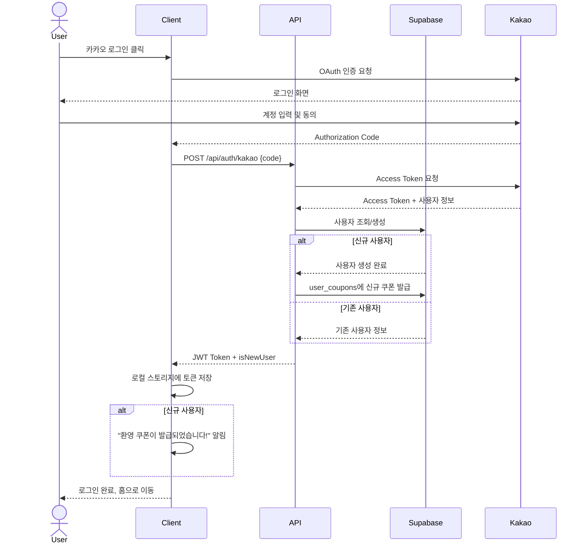
```mermaid
sequenceDiagram
    actor User
    participant Client
    participant API
    participant Supabase
    participant Kakao

    User->>Client: 카카오 로그인 클릭
    Client->>Kakao: OAuth 인증 요청
    Kakao-->>User: 로그인 화면
    User->>Kakao: 계정 입력 및 동의
    Kakao-->>Client: Authorization Code
    Client->>API: POST /api/auth/kakao {code}
    API->>Kakao: Access Token 요청
    Kakao-->>API: Access Token + 사용자 정보
    API->>Supabase: 사용자 조회/생성

    alt 신규 사용자
        Supabase-->>API: 사용자 생성 완료
        API->>Supabase: user_coupons에 신규 쿠폰 발급
    else 기존 사용자
        Supabase-->>API: 기존 사용자 정보
    end

    API-->>Client: JWT Token + isNewUser
    Client->>Client: 로컬 스토리지에 토큰 저장

    alt 신규 사용자
        Client->>Client: "환영 쿠폰이 발급되었습니다!" 알림
    end

    Client-->>User: 로그인 완료, 홈으로 이동
```

---

### 5.1.2 상품 조회 플로우

#### 상품 상세 페이지 로딩 시퀀스

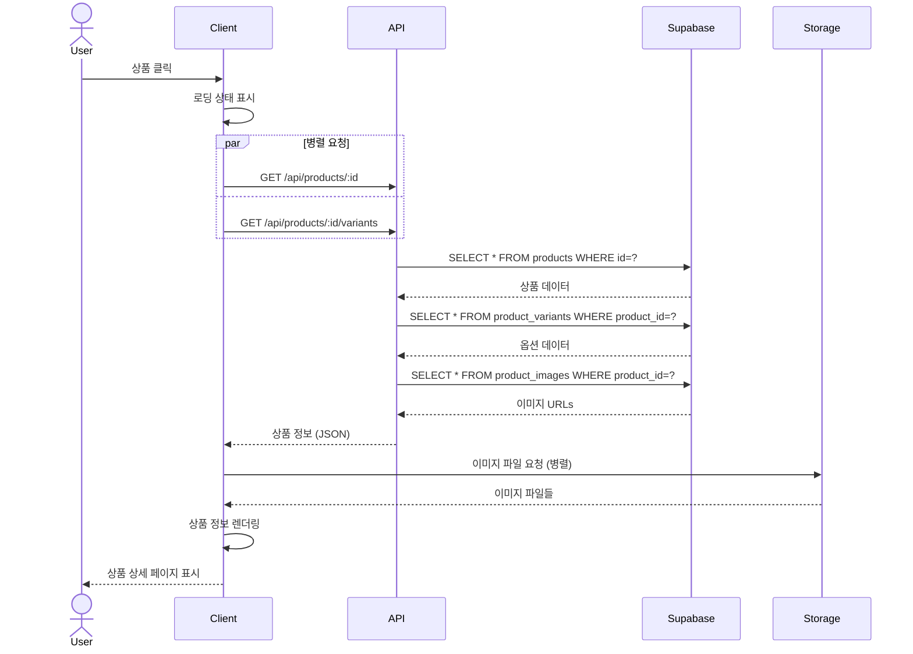
```mermaid
sequenceDiagram
    actor User
    participant Client
    participant API
    participant Supabase
    participant Storage

    User->>Client: 상품 클릭
    Client->>Client: 로딩 상태 표시

    par 병렬 요청
        Client->>API: GET /api/products/:id
        and
        Client->>API: GET /api/products/:id/variants
    end

    API->>Supabase: SELECT * FROM products WHERE id=?
    Supabase-->>API: 상품 데이터

    API->>Supabase: SELECT * FROM product_variants WHERE product_id=?
    Supabase-->>API: 옵션 데이터

    API->>Supabase: SELECT * FROM product_images WHERE product_id=?
    Supabase-->>API: 이미지 URLs

    API-->>Client: 상품 정보 (JSON)

    Client->>Storage: 이미지 파일 요청 (병렬)
    Storage-->>Client: 이미지 파일들

    Client->>Client: 상품 정보 렌더링
    Client-->>User: 상품 상세 페이지 표시
```

---

### 5.1.3 장바구니 플로우

#### 장바구니 추가 시퀀스

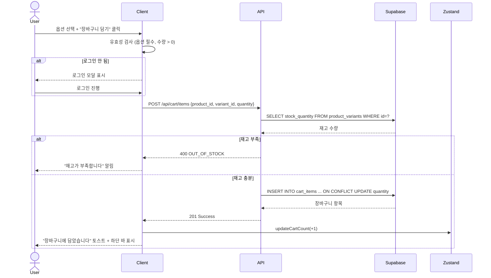
```mermaid
sequenceDiagram
    actor User
    participant Client
    participant API
    participant Supabase
    participant Zustand

    User->>Client: 옵션 선택 + "장바구니 담기" 클릭

    Client->>Client: 유효성 검사 (옵션 필수, 수량 > 0)

    alt 로그인 안 됨
        Client-->>User: 로그인 모달 표시
        User->>Client: 로그인 진행
    end

    Client->>API: POST /api/cart/items {product_id, variant_id, quantity}

    API->>Supabase: SELECT stock_quantity FROM product_variants WHERE id=?
    Supabase-->>API: 재고 수량

    alt 재고 부족
        API-->>Client: 400 OUT_OF_STOCK
        Client-->>User: "재고가 부족합니다" 알림
    else 재고 충분
        API->>Supabase: INSERT INTO cart_items ... ON CONFLICT UPDATE quantity
        Supabase-->>API: 장바구니 항목
        API-->>Client: 201 Success

        Client->>Zustand: updateCartCount(+1)
        Client-->>User: "장바구니에 담았습니다" 토스트 + 하단 바 표시
    end
```

---

### 5.1.4 주문 생성 플로우

#### 주문하기 전체 시퀀스

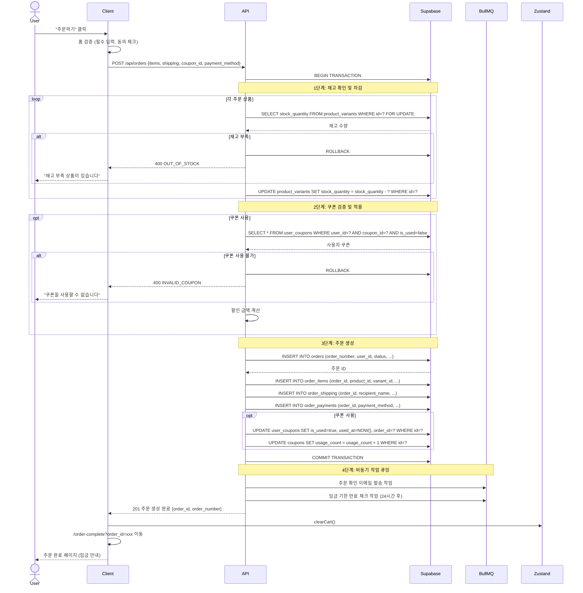
```mermaid
sequenceDiagram
    actor User
    participant Client
    participant API
    participant Supabase
    participant BullMQ

    User->>Client: "주문하기" 클릭
    Client->>Client: 폼 검증 (필수 입력, 동의 체크)

    Client->>API: POST /api/orders {items, shipping, coupon_id, payment_method}

    API->>Supabase: BEGIN TRANSACTION

    Note over API,Supabase: 1단계: 재고 확인 및 차감

    loop 각 주문 상품
        API->>Supabase: SELECT stock_quantity FROM product_variants WHERE id=? FOR UPDATE
        Supabase-->>API: 재고 수량

        alt 재고 부족
            API->>Supabase: ROLLBACK
            API-->>Client: 400 OUT_OF_STOCK
            Client-->>User: "재고 부족 상품이 있습니다"
        end

        API->>Supabase: UPDATE product_variants SET stock_quantity = stock_quantity - ? WHERE id=?
    end

    Note over API,Supabase: 2단계: 쿠폰 검증 및 적용

    opt 쿠폰 사용
        API->>Supabase: SELECT * FROM user_coupons WHERE user_id=? AND coupon_id=? AND is_used=false
        Supabase-->>API: 사용자 쿠폰

        alt 쿠폰 사용 불가
            API->>Supabase: ROLLBACK
            API-->>Client: 400 INVALID_COUPON
            Client-->>User: "쿠폰을 사용할 수 없습니다"
        end

        API->>API: 할인 금액 계산
    end

    Note over API,Supabase: 3단계: 주문 생성

    API->>Supabase: INSERT INTO orders (order_number, user_id, status, ...)
    Supabase-->>API: 주문 ID

    API->>Supabase: INSERT INTO order_items (order_id, product_id, variant_id, ...)
    API->>Supabase: INSERT INTO order_shipping (order_id, recipient_name, ...)
    API->>Supabase: INSERT INTO order_payments (order_id, payment_method, ...)

    opt 쿠폰 사용
        API->>Supabase: UPDATE user_coupons SET is_used=true, used_at=NOW(), order_id=? WHERE id=?
        API->>Supabase: UPDATE coupons SET usage_count = usage_count + 1 WHERE id=?
    end

    API->>Supabase: COMMIT TRANSACTION

    Note over API,BullMQ: 4단계: 비동기 작업 큐잉

    API->>BullMQ: 주문 확인 이메일 발송 작업
    API->>BullMQ: 입금 기한 만료 체크 작업 (24시간 후)

    API-->>Client: 201 주문 생성 완료 {order_id, order_number}

    Client->>Zustand: clearCart()
    Client->>Client: /order-complete?order_id=xxx 이동
    Client-->>User: 주문 완료 페이지 (입금 안내)
```

---

### 5.1.5 관리자 입금 확인 플로우

#### 입금 확인 및 재고 관리 시퀀스

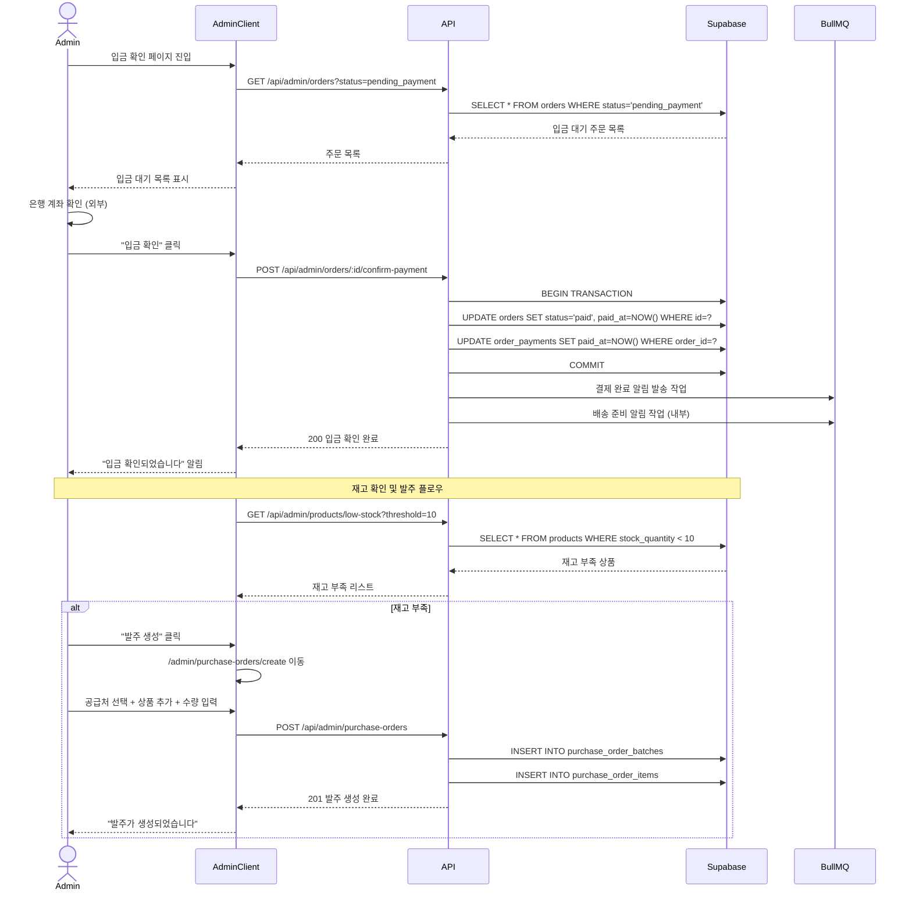
```mermaid
sequenceDiagram
    actor Admin
    participant AdminClient
    participant API
    participant Supabase
    participant BullMQ

    Admin->>AdminClient: 입금 확인 페이지 진입
    AdminClient->>API: GET /api/admin/orders?status=pending_payment
    API->>Supabase: SELECT * FROM orders WHERE status='pending_payment'
    Supabase-->>API: 입금 대기 주문 목록
    API-->>AdminClient: 주문 목록
    AdminClient-->>Admin: 입금 대기 목록 표시

    Admin->>Admin: 은행 계좌 확인 (외부)
    Admin->>AdminClient: "입금 확인" 클릭

    AdminClient->>API: POST /api/admin/orders/:id/confirm-payment

    API->>Supabase: BEGIN TRANSACTION
    API->>Supabase: UPDATE orders SET status='paid', paid_at=NOW() WHERE id=?
    API->>Supabase: UPDATE order_payments SET paid_at=NOW() WHERE order_id=?
    API->>Supabase: COMMIT

    API->>BullMQ: 결제 완료 알림 발송 작업
    API->>BullMQ: 배송 준비 알림 작업 (내부)

    API-->>AdminClient: 200 입금 확인 완료
    AdminClient-->>Admin: "입금 확인되었습니다" 알림

    Note over Admin,Supabase: 재고 확인 및 발주 플로우

    AdminClient->>API: GET /api/admin/products/low-stock?threshold=10
    API->>Supabase: SELECT * FROM products WHERE stock_quantity < 10
    Supabase-->>API: 재고 부족 상품
    API-->>AdminClient: 재고 부족 리스트

    alt 재고 부족
        Admin->>AdminClient: "발주 생성" 클릭
        AdminClient->>AdminClient: /admin/purchase-orders/create 이동
        Admin->>AdminClient: 공급처 선택 + 상품 추가 + 수량 입력
        AdminClient->>API: POST /api/admin/purchase-orders
        API->>Supabase: INSERT INTO purchase_order_batches
        API->>Supabase: INSERT INTO purchase_order_items
        API-->>AdminClient: 201 발주 생성 완료
        AdminClient-->>Admin: "발주가 생성되었습니다"
    end
```

---

### 5.1.6 배송 처리 플로우

#### 배송 시작 시퀀스

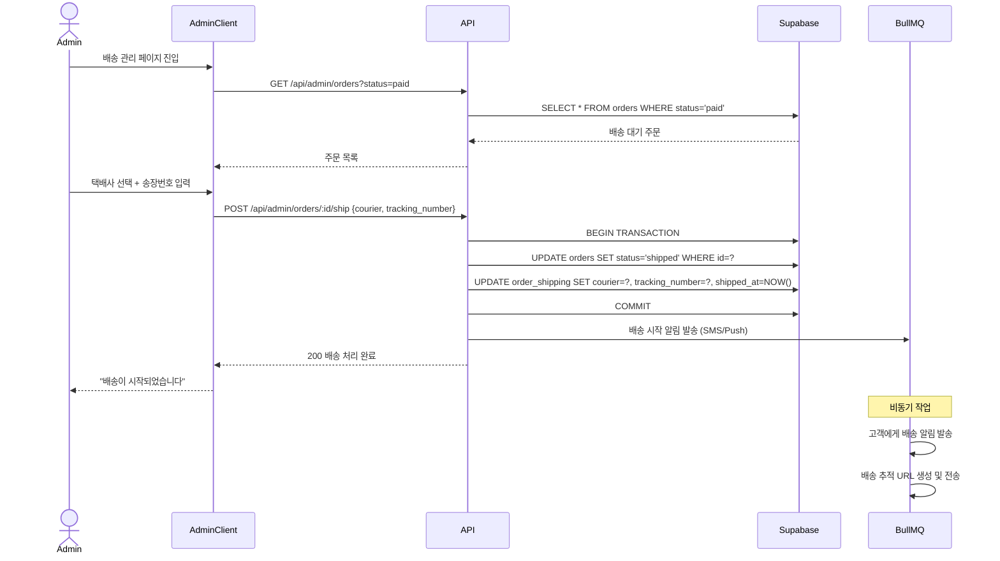
```mermaid
sequenceDiagram
    actor Admin
    participant AdminClient
    participant API
    participant Supabase
    participant BullMQ

    Admin->>AdminClient: 배송 관리 페이지 진입
    AdminClient->>API: GET /api/admin/orders?status=paid
    API->>Supabase: SELECT * FROM orders WHERE status='paid'
    Supabase-->>API: 배송 대기 주문
    API-->>AdminClient: 주문 목록

    Admin->>AdminClient: 택배사 선택 + 송장번호 입력
    AdminClient->>API: POST /api/admin/orders/:id/ship {courier, tracking_number}

    API->>Supabase: BEGIN TRANSACTION
    API->>Supabase: UPDATE orders SET status='shipped' WHERE id=?
    API->>Supabase: UPDATE order_shipping SET courier=?, tracking_number=?, shipped_at=NOW()
    API->>Supabase: COMMIT

    API->>BullMQ: 배송 시작 알림 발송 (SMS/Push)

    API-->>AdminClient: 200 배송 처리 완료
    AdminClient-->>Admin: "배송이 시작되었습니다"

    Note over BullMQ: 비동기 작업
    BullMQ->>BullMQ: 고객에게 배송 알림 발송
    BullMQ->>BullMQ: 배송 추적 URL 생성 및 전송
```

---

### 5.1.7 쿠폰 시스템 플로우

#### 쿠폰 생성 및 배포 시퀀스

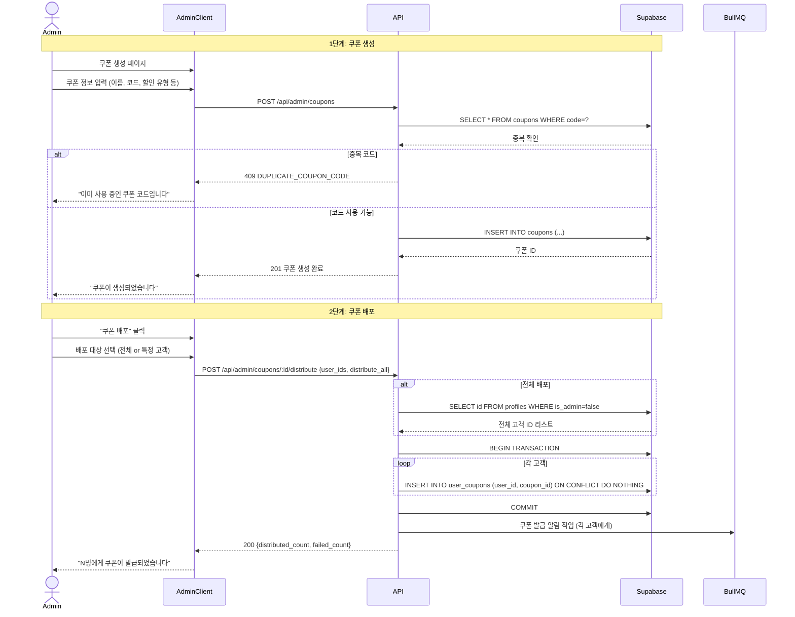
```mermaid
sequenceDiagram
    actor Admin
    participant AdminClient
    participant API
    participant Supabase
    participant BullMQ

    Note over Admin,Supabase: 1단계: 쿠폰 생성

    Admin->>AdminClient: 쿠폰 생성 페이지
    Admin->>AdminClient: 쿠폰 정보 입력 (이름, 코드, 할인 유형 등)
    AdminClient->>API: POST /api/admin/coupons

    API->>Supabase: SELECT * FROM coupons WHERE code=?
    Supabase-->>API: 중복 확인

    alt 중복 코드
        API-->>AdminClient: 409 DUPLICATE_COUPON_CODE
        AdminClient-->>Admin: "이미 사용 중인 쿠폰 코드입니다"
    else 코드 사용 가능
        API->>Supabase: INSERT INTO coupons (...)
        Supabase-->>API: 쿠폰 ID
        API-->>AdminClient: 201 쿠폰 생성 완료
        AdminClient-->>Admin: "쿠폰이 생성되었습니다"
    end

    Note over Admin,Supabase: 2단계: 쿠폰 배포

    Admin->>AdminClient: "쿠폰 배포" 클릭
    Admin->>AdminClient: 배포 대상 선택 (전체 or 특정 고객)

    AdminClient->>API: POST /api/admin/coupons/:id/distribute {user_ids, distribute_all}

    alt 전체 배포
        API->>Supabase: SELECT id FROM profiles WHERE is_admin=false
        Supabase-->>API: 전체 고객 ID 리스트
    end

    API->>Supabase: BEGIN TRANSACTION

    loop 각 고객
        API->>Supabase: INSERT INTO user_coupons (user_id, coupon_id) ON CONFLICT DO NOTHING
    end

    API->>Supabase: COMMIT

    API->>BullMQ: 쿠폰 발급 알림 작업 (각 고객에게)

    API-->>AdminClient: 200 {distributed_count, failed_count}
    AdminClient-->>Admin: "N명에게 쿠폰이 발급되었습니다"
```

---

### 5.1.8 라이브 방송 상품 구매 플로우

#### 라이브 중 빠른 구매 시퀀스

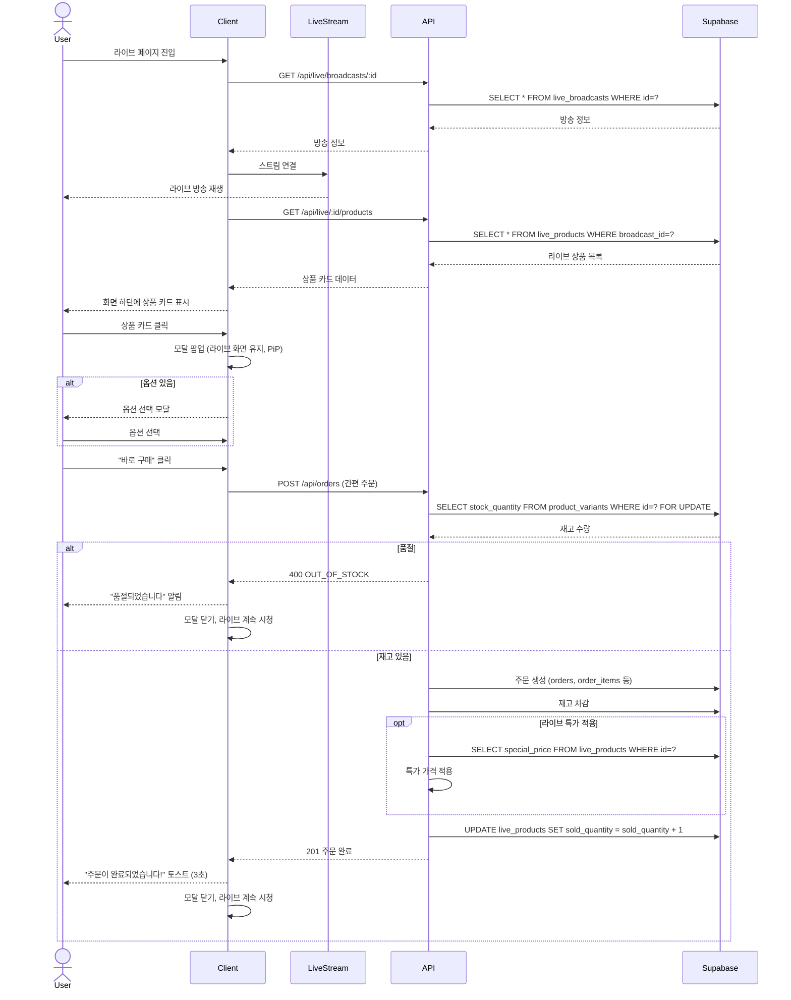
```mermaid
sequenceDiagram
    actor User
    participant Client
    participant LiveStream
    participant API
    participant Supabase

    User->>Client: 라이브 페이지 진입
    Client->>API: GET /api/live/broadcasts/:id
    API->>Supabase: SELECT * FROM live_broadcasts WHERE id=?
    Supabase-->>API: 방송 정보
    API-->>Client: 방송 정보

    Client->>LiveStream: 스트림 연결
    LiveStream-->>User: 라이브 방송 재생

    Client->>API: GET /api/live/:id/products
    API->>Supabase: SELECT * FROM live_products WHERE broadcast_id=?
    Supabase-->>API: 라이브 상품 목록
    API-->>Client: 상품 카드 데이터

    Client-->>User: 화면 하단에 상품 카드 표시

    User->>Client: 상품 카드 클릭
    Client->>Client: 모달 팝업 (라이브 화면 유지, PiP)

    alt 옵션 있음
        Client-->>User: 옵션 선택 모달
        User->>Client: 옵션 선택
    end

    User->>Client: "바로 구매" 클릭

    Client->>API: POST /api/orders (간편 주문)

    API->>Supabase: SELECT stock_quantity FROM product_variants WHERE id=? FOR UPDATE
    Supabase-->>API: 재고 수량

    alt 품절
        API-->>Client: 400 OUT_OF_STOCK
        Client-->>User: "품절되었습니다" 알림
        Client->>Client: 모달 닫기, 라이브 계속 시청
    else 재고 있음
        API->>Supabase: 주문 생성 (orders, order_items 등)
        API->>Supabase: 재고 차감

        opt 라이브 특가 적용
            API->>Supabase: SELECT special_price FROM live_products WHERE id=?
            API->>API: 특가 가격 적용
        end

        API->>Supabase: UPDATE live_products SET sold_quantity = sold_quantity + 1

        API-->>Client: 201 주문 완료
        Client-->>User: "주문이 완료되었습니다!" 토스트 (3초)
        Client->>Client: 모달 닫기, 라이브 계속 시청
    end
```

---

## 5.2 에러 처리 시퀀스

### 5.2.1 재고 부족 시나리오

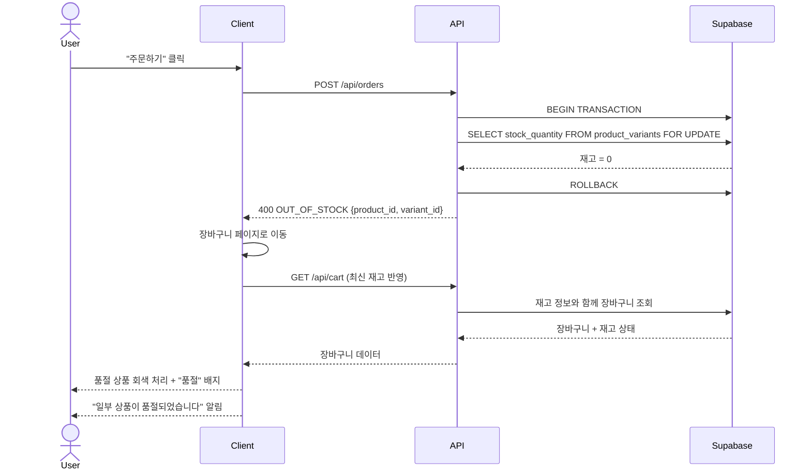
```mermaid
sequenceDiagram
    actor User
    participant Client
    participant API
    participant Supabase

    User->>Client: "주문하기" 클릭
    Client->>API: POST /api/orders

    API->>Supabase: BEGIN TRANSACTION
    API->>Supabase: SELECT stock_quantity FROM product_variants FOR UPDATE
    Supabase-->>API: 재고 = 0

    API->>Supabase: ROLLBACK
    API-->>Client: 400 OUT_OF_STOCK {product_id, variant_id}

    Client->>Client: 장바구니 페이지로 이동
    Client->>API: GET /api/cart (최신 재고 반영)
    API->>Supabase: 재고 정보와 함께 장바구니 조회
    Supabase-->>API: 장바구니 + 재고 상태
    API-->>Client: 장바구니 데이터

    Client-->>User: 품절 상품 회색 처리 + "품절" 배지
    Client-->>User: "일부 상품이 품절되었습니다" 알림
```

---

### 5.2.2 쿠폰 만료/사용 불가 시나리오

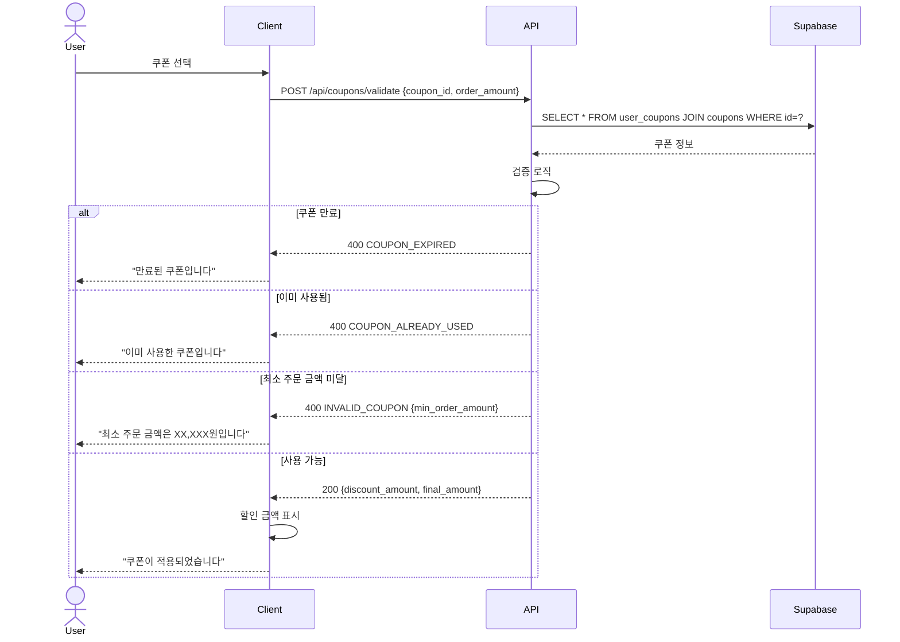
```mermaid
sequenceDiagram
    actor User
    participant Client
    participant API
    participant Supabase

    User->>Client: 쿠폰 선택
    Client->>API: POST /api/coupons/validate {coupon_id, order_amount}

    API->>Supabase: SELECT * FROM user_coupons JOIN coupons WHERE id=?
    Supabase-->>API: 쿠폰 정보

    API->>API: 검증 로직

    alt 쿠폰 만료
        API-->>Client: 400 COUPON_EXPIRED
        Client-->>User: "만료된 쿠폰입니다"
    else 이미 사용됨
        API-->>Client: 400 COUPON_ALREADY_USED
        Client-->>User: "이미 사용한 쿠폰입니다"
    else 최소 주문 금액 미달
        API-->>Client: 400 INVALID_COUPON {min_order_amount}
        Client-->>User: "최소 주문 금액은 XX,XXX원입니다"
    else 사용 가능
        API-->>Client: 200 {discount_amount, final_amount}
        Client->>Client: 할인 금액 표시
        Client-->>User: "쿠폰이 적용되었습니다"
    end
```

---

### 5.2.3 결제 기한 초과 자동 취소

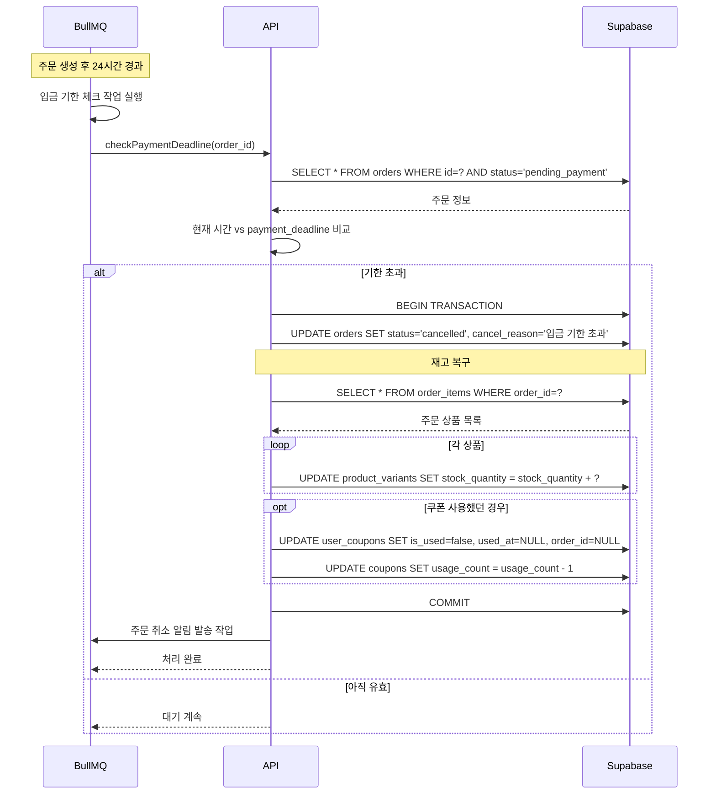
```mermaid
sequenceDiagram
    participant BullMQ
    participant API
    participant Supabase

    Note over BullMQ: 주문 생성 후 24시간 경과

    BullMQ->>BullMQ: 입금 기한 체크 작업 실행
    BullMQ->>API: checkPaymentDeadline(order_id)

    API->>Supabase: SELECT * FROM orders WHERE id=? AND status='pending_payment'
    Supabase-->>API: 주문 정보

    API->>API: 현재 시간 vs payment_deadline 비교

    alt 기한 초과
        API->>Supabase: BEGIN TRANSACTION
        API->>Supabase: UPDATE orders SET status='cancelled', cancel_reason='입금 기한 초과'

        Note over API,Supabase: 재고 복구
        API->>Supabase: SELECT * FROM order_items WHERE order_id=?
        Supabase-->>API: 주문 상품 목록

        loop 각 상품
            API->>Supabase: UPDATE product_variants SET stock_quantity = stock_quantity + ?
        end

        opt 쿠폰 사용했던 경우
            API->>Supabase: UPDATE user_coupons SET is_used=false, used_at=NULL, order_id=NULL
            API->>Supabase: UPDATE coupons SET usage_count = usage_count - 1
        end

        API->>Supabase: COMMIT

        API->>BullMQ: 주문 취소 알림 발송 작업
        API-->>BullMQ: 처리 완료
    else 아직 유효
        API-->>BullMQ: 대기 계속
    end
```

---

## 5.3 동시성 제어 시퀀스

### 5.3.1 동시 주문 시 재고 경쟁 처리

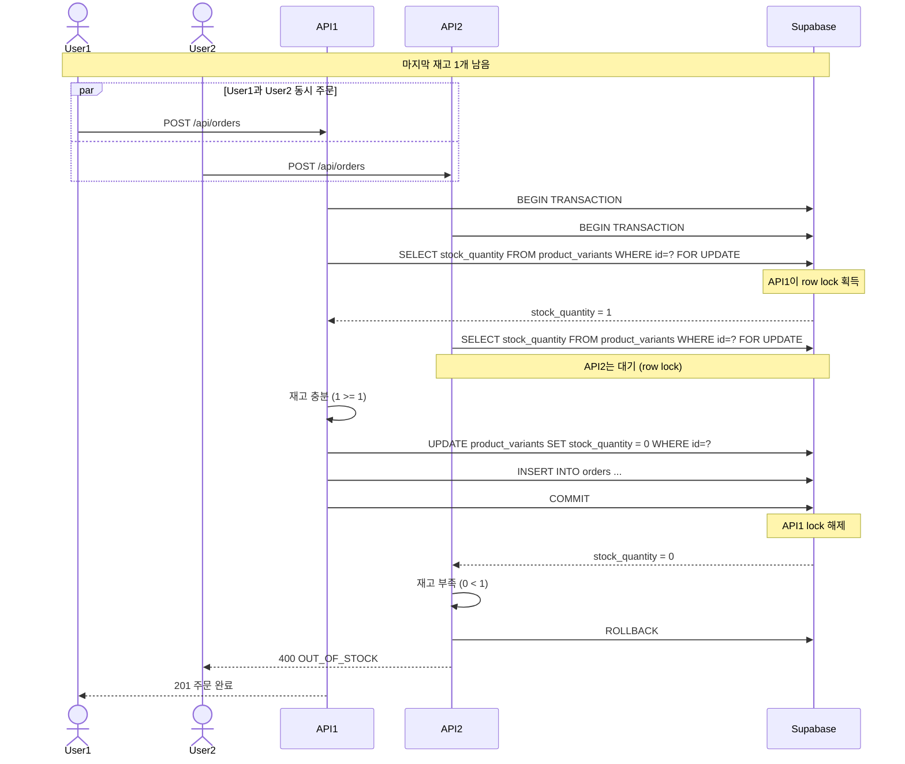
```mermaid
sequenceDiagram
    actor User1
    actor User2
    participant API1
    participant API2
    participant Supabase

    Note over User1,Supabase: 마지막 재고 1개 남음

    par User1과 User2 동시 주문
        User1->>API1: POST /api/orders
        and
        User2->>API2: POST /api/orders
    end

    API1->>Supabase: BEGIN TRANSACTION
    API2->>Supabase: BEGIN TRANSACTION

    API1->>Supabase: SELECT stock_quantity FROM product_variants WHERE id=? FOR UPDATE

    Note over Supabase: API1이 row lock 획득

    Supabase-->>API1: stock_quantity = 1

    API2->>Supabase: SELECT stock_quantity FROM product_variants WHERE id=? FOR UPDATE

    Note over API2,Supabase: API2는 대기 (row lock)

    API1->>API1: 재고 충분 (1 >= 1)
    API1->>Supabase: UPDATE product_variants SET stock_quantity = 0 WHERE id=?
    API1->>Supabase: INSERT INTO orders ...
    API1->>Supabase: COMMIT

    Note over Supabase: API1 lock 해제

    Supabase-->>API2: stock_quantity = 0

    API2->>API2: 재고 부족 (0 < 1)
    API2->>Supabase: ROLLBACK
    API2-->>User2: 400 OUT_OF_STOCK

    API1-->>User1: 201 주문 완료
```

---

## 5.4 캐싱 전략 시퀀스

### 5.4.1 상품 목록 캐시 활용

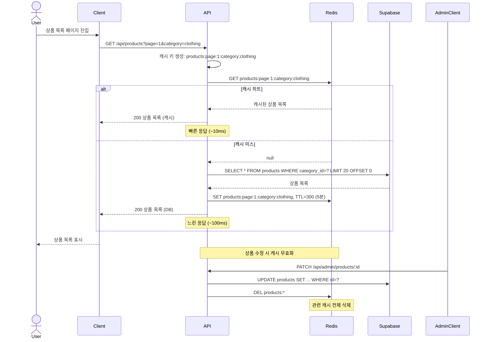
```mermaid
sequenceDiagram
    actor User
    participant Client
    participant API
    participant Redis
    participant Supabase

    User->>Client: 상품 목록 페이지 진입
    Client->>API: GET /api/products?page=1&category=clothing

    API->>API: 캐시 키 생성: products:page:1:category:clothing
    API->>Redis: GET products:page:1:category:clothing

    alt 캐시 히트
        Redis-->>API: 캐시된 상품 목록
        API-->>Client: 200 상품 목록 (캐시)
        Note over API: 빠른 응답 (~10ms)
    else 캐시 미스
        Redis-->>API: null
        API->>Supabase: SELECT * FROM products WHERE category_id=? LIMIT 20 OFFSET 0
        Supabase-->>API: 상품 목록
        API->>Redis: SET products:page:1:category:clothing, TTL=300 (5분)
        API-->>Client: 200 상품 목록 (DB)
        Note over API: 느린 응답 (~100ms)
    end

    Client-->>User: 상품 목록 표시

    Note over API,Redis: 상품 수정 시 캐시 무효화

    participant AdminClient
    AdminClient->>API: PATCH /api/admin/products/:id
    API->>Supabase: UPDATE products SET ... WHERE id=?
    API->>Redis: DEL products:*
    Note over Redis: 관련 캐시 전체 삭제
```

# Part 6: 와이어프레임 가이드

## 6.1 디자인 시스템 정의

### 6.1.1 컬러 팔레트

```css
/* Primary Colors */
--primary-50: #f0f9ff;
--primary-100: #e0f2fe;
--primary-500: #0ea5e9;  /* 메인 브랜드 컬러 */
--primary-600: #0284c7;
--primary-700: #0369a1;

/* Secondary Colors */
--secondary-500: #8b5cf6;  /* 액센트 컬러 */

/* Neutral Colors */
--gray-50: #f9fafb;
--gray-100: #f3f4f6;
--gray-200: #e5e7eb;
--gray-300: #d1d5db;
--gray-500: #6b7280;
--gray-700: #374151;
--gray-900: #111827;

/* Semantic Colors */
--success: #10b981;
--warning: #f59e0b;
--error: #ef4444;
--info: #3b82f6;
```

### 6.1.2 타이포그래피

```css
/* Font Sizes */
--text-xs: 0.75rem;    /* 12px */
--text-sm: 0.875rem;   /* 14px */
--text-base: 1rem;     /* 16px */
--text-lg: 1.125rem;   /* 18px */
--text-xl: 1.25rem;    /* 20px */
--text-2xl: 1.5rem;    /* 24px */
--text-3xl: 1.875rem;  /* 30px */
--text-4xl: 2.25rem;   /* 36px */

/* Font Weights */
--font-normal: 400;
--font-medium: 500;
--font-semibold: 600;
--font-bold: 700;
```

### 6.1.3 간격(Spacing)

```css
--space-1: 0.25rem;   /* 4px */
--space-2: 0.5rem;    /* 8px */
--space-3: 0.75rem;   /* 12px */
--space-4: 1rem;      /* 16px */
--space-5: 1.25rem;   /* 20px */
--space-6: 1.5rem;    /* 24px */
--space-8: 2rem;      /* 32px */
--space-10: 2.5rem;   /* 40px */
--space-12: 3rem;     /* 48px */
```

### 6.1.4 그리드 시스템

- **Container Max Width**: 1280px
- **Gutter**: 24px (desktop), 16px (mobile)
- **Columns**: 12 (desktop), 4 (mobile)

---

## 6.2 페이지별 와이어프레임 가이드

### 6.2.1 홈 페이지

```
┌─────────────────────────────────────────┐
│ Header: Logo | 카테고리 | 검색 | 장바구니 │
├─────────────────────────────────────────┤
│                                         │
│  [Hero Banner - 라이브 방송 or 메인 배너]  │
│              1200 x 400                 │
│  [ ← ]  [Image]  [ → ]                  │
│           • • •                         │
│                                         │
├─────────────────────────────────────────┤
│  [카테고리 퀵 링크]                        │
│  [👗] [👜] [💄] [🏠] [🍴]                │
│   의류  가방  뷰티  생활  식품             │
├─────────────────────────────────────────┤
│  신상품                         [더보기 >] │
│  ┌───┐ ┌───┐ ┌───┐ ┌───┐              │
│  │img│ │img│ │img│ │img│              │
│  ├───┤ ├───┤ ├───┤ ├───┤              │
│  │상품명│ │상품명│ │상품명│ │상품명│            │
│  │50,000│ │45,000│ │30,000│ │25,000│       │
│  └───┘ └───┘ └───┘ └───┘              │
├─────────────────────────────────────────┤
│  베스트 상품                     [더보기 >] │
│  (동일 그리드)                            │
├─────────────────────────────────────────┤
│  Footer: 회사 정보 | 이용약관 | 개인정보    │
└─────────────────────────────────────────┘
```

**주요 요소**:
- Hero Banner: 자동 슬라이더 (5초), 수동 화살표
- 카테고리: 아이콘 + 텍스트, 5개 고정
- 상품 카드: 이미지(정사각형), 상품명(2줄 ellipsis), 가격(할인가 빨강)

---

### 6.2.2 상품 상세 페이지

```
┌─────────────────────────────────────────┐
│ Header                                  │
├─────────────────────────────────────────┤
│  ┌──────────┐  상품명                    │
│  │          │  ─────────────────         │
│  │  Main    │  상품번호: P20250001       │
│  │  Image   │                            │
│  │  600x600 │  정가: ₩50,000             │
│  │          │  판매가: ₩45,000 (10% ↓)   │
│  └──────────┘                            │
│  [📷][📷][📷][📷]  배송비: 3,000원 (30,000원 이상 무료)│
│                                         │
│                  옵션 선택               │
│                  ┌──────────────┐       │
│                  │ 색상 ▼       │       │
│                  └──────────────┘       │
│                  ┌──────────────┐       │
│                  │ 사이즈 ▼     │       │
│                  └──────────────┘       │
│                                         │
│                  선택된 옵션             │
│                  ┌──────────────────┐   │
│                  │ 빨강 / L         │   │
│                  │ [-] 1 [+]  50,000│   │
│                  └──────────────────┘   │
│                                         │
│                  총 금액: ₩50,000       │
│                                         │
│                  [장바구니 담기] [바로 구매]│
│                  [  ♡ 찜하기  ]         │
├─────────────────────────────────────────┤
│  [상세 설명] [배송/교환] [후기]           │
│  ─────────────────────────             │
│  상세 이미지 및 HTML 콘텐츠              │
│  ...                                    │
└─────────────────────────────────────────┘
```

**주요 요소**:
- 이미지 갤러리: 메인 이미지 + 썸네일(4개), 클릭 시 확대
- 옵션 선택: 드롭다운, 필수 표시(*)
- 선택된 옵션 리스트: 여러 옵션 동시 선택 가능
- 하단 탭: 상세 설명, 배송/교환, 후기

---

### 6.2.3 장바구니 페이지

```
┌─────────────────────────────────────────┐
│ Header                                  │
├─────────────────────────────────────────┤
│  장바구니                                │
│  ─────────────────────────             │
│                                         │
│  [✓] 전체 선택  [선택 삭제]              │
│  ───────────────────────────────       │
│  [✓] [IMG] 상품명                       │
│          옵션: 빨강 / L                 │
│          단가: 50,000원                 │
│          수량: [-] 1 [+]                │
│          소계: 50,000원   [X]           │
│  ───────────────────────────────       │
│  [✓] [IMG] 상품명 2                     │
│          ...                            │
│  ───────────────────────────────       │
│                                         │
│  ┌───────────────────────────────┐     │
│  │ 주문 요약                      │     │
│  │                               │     │
│  │ 총 상품 금액:      100,000원  │     │
│  │ 총 배송비:           3,000원  │     │
│  │ ─────────────────────────    │     │
│  │ 총 결제 금액:      103,000원  │     │
│  │                               │     │
│  │ [     주문하기     ]          │     │
│  └───────────────────────────────┘     │
│                                         │
│  ───────────────────────────────       │
│  이런 상품은 어때요?                     │
│  [IMG] [IMG] [IMG] [IMG]                │
└─────────────────────────────────────────┘
```

**주요 요소**:
- 체크박스: 전체 선택, 개별 선택
- 수량 조절: +/- 버튼, 최소 1
- 주문 요약: 우측 고정(desktop), 하단 고정(mobile)
- 추천 상품: 하단에 4개

---

### 6.2.4 주문하기 페이지

```
┌─────────────────────────────────────────┐
│ Header                                  │
├─────────────────────────────────────────┤
│  주문하기                                │
│  ─────────────────────────             │
│                                         │
│  주문 상품                               │
│  ┌─────────────────────────────┐       │
│  │ [IMG] 상품명                │       │
│  │       옵션: 빨강 / L         │       │
│  │       수량: 1   50,000원     │       │
│  └─────────────────────────────┘       │
│                                         │
│  주문자 정보                             │
│  ┌─────────────────────────────┐       │
│  │ 이름: [홍길동            ]   │       │
│  │ 전화번호: [010-1234-5678 ]   │       │
│  │ 이메일: [user@example.com]   │       │
│  └─────────────────────────────┘       │
│                                         │
│  배송지 정보                             │
│  ┌─────────────────────────────┐       │
│  │ [✓] 주문자 정보와 동일       │       │
│  │ 수령인: [홍길동            ] │       │
│  │ 전화번호: [010-1234-5678   ] │       │
│  │ 우편번호: [12345] [검색]     │       │
│  │ 주소: [서울시 강남구...    ] │       │
│  │ 상세주소: [101동 101호     ] │       │
│  │ 요청사항: [문 앞에 놔주세요] │       │
│  └─────────────────────────────┘       │
│                                         │
│  쿠폰 선택                               │
│  ┌─────────────────────────────┐       │
│  │ [쿠폰 선택하기 >]            │       │
│  │ 사용 가능: 2장               │       │
│  └─────────────────────────────┘       │
│                                         │
│  결제 수단                               │
│  ┌─────────────────────────────┐       │
│  │ (•) 무통장 입금              │       │
│  │ ( ) Toss 간편결제 (준비중)   │       │
│  └─────────────────────────────┘       │
│                                         │
│  ┌───────────────────────────────┐     │
│  │ 최종 결제 금액                │     │
│  │                               │     │
│  │ 총 상품 금액:      100,000원  │     │
│  │ 배송비:              3,000원  │     │
│  │ 쿠폰 할인:          -5,000원  │     │
│  │ ─────────────────────────    │     │
│  │ 최종 결제 금액:     98,000원  │     │
│  └───────────────────────────────┘     │
│                                         │
│  [✓] 개인정보 수집 및 이용 동의 (필수)    │
│  [✓] 결제 대행 서비스 약관 동의 (필수)    │
│                                         │
│  [       주문하기       ]               │
└─────────────────────────────────────────┘
```

**주요 요소**:
- 주문자/배송지: 자동 입력, "동일" 체크박스
- 우편번호: 다음 우편번호 API 연동
- 쿠폰: 모달로 선택
- 결제 수단: 라디오 버튼
- 동의: 필수 체크박스

---

### 6.2.5 관리자 대시보드

```
┌─────────────────────────────────────────┐
│ Admin Header: Logo | 알림 | 관리자명     │
├──────┬──────────────────────────────────┤
│ 메뉴 │  대시보드                         │
│      │  ─────────────────────           │
│상품관리│                                  │
│주문관리│  [오늘 매출]  [오늘 주문]  [입금대기] [배송대기]│
│쿠폰관리│  5,000,000원    120건     15건     30건    │
│발주관리│  +15.5% ↑      +10.2% ↑   📌       📌      │
│고객관리│                                  │
│통계분석│  ┌────────────────────────┐      │
│시스템  │  │ 매출 추이 (최근 7일)   │      │
│        │  │                        │      │
│        │  │  [라인 차트]           │      │
│        │  │                        │      │
│        │  └────────────────────────┘      │
│        │                                  │
│        │  ┌───────────┐  ┌──────────┐    │
│        │  │ 주문 현황  │  │ 인기 상품 │    │
│        │  │           │  │          │    │
│        │  │[파이 차트]│  │ 1. 상품A │    │
│        │  │           │  │ 2. 상품B │    │
│        │  │           │  │ 3. 상품C │    │
│        │  └───────────┘  └──────────┘    │
│        │                                  │
│        │  재고 알림 ⚠️                     │
│        │  ┌─────────────────────────┐    │
│        │  │ 상품A - 재고: 5개       │    │
│        │  │ 상품B - 재고: 3개       │    │
│        │  │ 상품C - 품절            │    │
│        │  └─────────────────────────┘    │
│        │                                  │
│        │  최근 주문                        │
│        │  ┌─────────────────────────────┐│
│        │  │ORD001 홍길동 50,000원 입금대기││
│        │  │ORD002 김철수 30,000원 결제완료││
│        │  │...                          ││
│        │  └─────────────────────────────┘│
└──────┴──────────────────────────────────┘
```

**주요 요소**:
- 좌측 사이드바: 고정 메뉴
- 핵심 지표: 카드 형태, 증감률 표시
- 차트: Chart.js or Recharts
- 알림: 빨간 배지, 클릭 시 해당 페이지 이동

---

### 6.2.6 관리자 상품 등록

```
┌─────────────────────────────────────────┐
│ Admin Header                            │
├──────┬──────────────────────────────────┤
│ 메뉴 │  상품 등록                        │
│      │  ─────────────────────           │
│      │                                  │
│      │  기본 정보                        │
│      │  ┌─────────────────────────┐    │
│      │  │ 상품명*: [             ]│    │
│      │  │ 상품번호: [자동생성    ]│    │
│      │  │ 카테고리*: [선택 ▼    ]│    │
│      │  │ 공급처: [선택 ▼       ]│    │
│      │  │ 판매가*: [         ]원 │    │
│      │  │ 할인가: [          ]원 │    │
│      │  │ [✓] 노출               │    │
│      │  └─────────────────────────┘    │
│      │                                  │
│      │  상품 이미지*                     │
│      │  ┌─────────────────────────┐    │
│      │  │ 메인 이미지               │    │
│      │  │ [드래그 앤 드롭 영역]     │    │
│      │  │ or [파일 선택]           │    │
│      │  │                          │    │
│      │  │ 추가 이미지 (최대 9개)    │    │
│      │  │ [+] [IMG] [IMG] ...      │    │
│      │  └─────────────────────────┘    │
│      │                                  │
│      │  옵션 설정                        │
│      │  [✓] 옵션 사용                    │
│      │  ┌─────────────────────────┐    │
│      │  │ 옵션명: [색상      ]     │    │
│      │  │ 옵션값: [빨강,파랑,검정] │    │
│      │  │ [+ 옵션 추가]            │    │
│      │  │                          │    │
│      │  │ 옵션 조합 (자동 생성)     │    │
│      │  │ ┌──────────────────┐   │    │
│      │  │ │빨강│추가금액│재고  │   │    │
│      │  │ │    │ 0     │ 100 │   │    │
│      │  │ │파랑│ 0     │ 50  │   │    │
│      │  │ └──────────────────┘   │    │
│      │  └─────────────────────────┘    │
│      │                                  │
│      │  상세 설명*                       │
│      │  ┌─────────────────────────┐    │
│      │  │ [B][I][U] [이미지 삽입]  │    │
│      │  │                          │    │
│      │  │ [에디터 영역]            │    │
│      │  │                          │    │
│      │  └─────────────────────────┘    │
│      │                                  │
│      │  [임시 저장] [저장 및 노출]       │
└──────┴──────────────────────────────────┘
```

**주요 요소**:
- 필수 입력(*): 빨간 별표
- 이미지 업로드: 드래그 앤 드롭, 프리뷰
- 옵션: 동적 추가/삭제, 조합 자동 생성
- 에디터: Tiptap, 이미지 업로드 지원

---

## 6.3 반응형 브레이크포인트

```css
/* Mobile First */
@media (min-width: 640px)  { /* sm */ }
@media (min-width: 768px)  { /* md */ }
@media (min-width: 1024px) { /* lg */ }
@media (min-width: 1280px) { /* xl */ }
```

### 주요 레이아웃 변화

- **상품 그리드**:
  - Mobile: 2열
  - Tablet: 3열
  - Desktop: 4열

- **사이드바**:
  - Mobile: 하단 탭 바
  - Tablet: 고정 사이드바
  - Desktop: 확장 사이드바

---

## 6.4 UI 컴포넌트 라이브러리

### 추천 라이브러리

1. **shadcn/ui**: Tailwind 기반, 커스터마이징 용이
2. **Radix UI**: 접근성 우수, Headless 컴포넌트
3. **Heroicons**: 아이콘 세트

### 주요 컴포넌트

- Button (primary, secondary, outline, ghost)
- Input / Textarea
- Select / Combobox
- Modal / Dialog
- Toast / Alert
- Tabs
- Card
- Badge
- Skeleton Loader

---

# Part 7: 컴포넌트 설계

## 7.1 컴포넌트 계층 구조

```
app/
├── layout.tsx (Root Layout)
│   ├── Header
│   │   ├── Logo
│   │   ├── Navigation
│   │   ├── SearchBar
│   │   ├── CartIcon (w/ badge)
│   │   └── UserMenu
│   ├── [children]
│   └── Footer
│
└── pages/
    ├── (home)/
    │   ├── HeroBanner
    │   ├── CategoryQuickLinks
    │   ├── ProductGrid
    │   │   └── ProductCard (재사용)
    │   └── LiveBroadcastPreview
    │
    ├── products/
    │   ├── [id]/
    │   │   ├── ProductImageGallery
    │   │   ├── ProductInfo
    │   │   ├── OptionSelector
    │   │   ├── SelectedOptionsCart
    │   │   ├── PriceCalculator
    │   │   └── ProductTabs
    │   │       ├── DescriptionTab
    │   │       ├── ShippingInfoTab
    │   │       └── ReviewsTab
    │   │
    │   └── (list)/
    │       ├── FilterSidebar
    │       ├── ProductGrid
    │       └── Pagination
    │
    ├── cart/
    │   ├── CartItemList
    │   │   └── CartItem (재사용)
    │   ├── OrderSummary (재사용)
    │   └── RecommendedProducts
    │
    ├── checkout/
    │   ├── OrderProductList
    │   ├── OrdererForm
    │   ├── ShippingForm
    │   │   └── PostalCodeSearch
    │   ├── CouponSelector
    │   ├── PaymentMethodSelector
    │   ├── OrderSummary (재사용)
    │   └── AgreementCheckboxes
    │
    └── admin/
        ├── Sidebar
        ├── dashboard/
        │   ├── StatsCards
        │   ├── SalesChart
        │   ├── OrderStatusPie
        │   ├── BestSellersList
        │   └── LowStockAlert
        │
        ├── products/
        │   ├── create/
        │   │   ├── BasicInfoForm
        │   │   ├── ImageUploader
        │   │   ├── OptionBuilder
        │   │   └── RichTextEditor
        │   └── (list)/
        │       ├── ProductTable
        │       └── BulkActions
        │
        └── orders/
            ├── OrderTable
            ├── OrderDetailModal
            └── StatusBadge (재사용)
```

---

## 7.2 재사용 가능한 공통 컴포넌트

### 7.2.1 ProductCard

**위치**: `components/products/ProductCard.tsx`

**Props**:
```typescript
interface ProductCardProps {
  id: string;
  title: string;
  price: number;
  salePrice?: number;
  discountRate?: number;
  thumbnailUrl: string;
  isSoldout: boolean;
  badge?: 'new' | 'best' | 'sale';
  onClick?: () => void;
}
```

**기능**:
- 상품 이미지, 제목, 가격 표시
- 할인율 배지 (10% 이상 시)
- 품절 오버레이
- 찜하기 버튼 (아이콘)

**사용 위치**:
- 홈 페이지 (신상품, 베스트)
- 상품 목록 페이지
- 장바구니 추천 상품
- 관리자 상품 선택 모달

---

### 7.2.2 OrderSummary

**위치**: `components/orders/OrderSummary.tsx`

**Props**:
```typescript
interface OrderSummaryProps {
  subtotal: number;
  shippingFee: number;
  couponDiscount: number;
  totalAmount: number;
  onCheckout?: () => void;
  checkoutButtonText?: string;
}
```

**기능**:
- 주문 금액 계산 표시
- 항목별 금액 (상품, 배송, 할인)
- 최종 금액 강조
- 주문하기 버튼 (옵션)

**사용 위치**:
- 장바구니 페이지
- 주문하기 페이지
- 주문 완료 페이지
- 주문 상세 페이지

---

### 7.2.3 StatusBadge

**위치**: `components/common/StatusBadge.tsx`

**Props**:
```typescript
type OrderStatus =
  | 'pending_payment'
  | 'paid'
  | 'preparing'
  | 'shipped'
  | 'delivered'
  | 'cancelled';

interface StatusBadgeProps {
  status: OrderStatus;
  size?: 'sm' | 'md' | 'lg';
}
```

**기능**:
- 주문 상태별 색상 배지
- 한글 텍스트 매핑
- 크기 변경 가능

**상태 색상**:
- pending_payment: gray
- paid: blue
- preparing: yellow
- shipped: purple
- delivered: green
- cancelled: red

**사용 위치**:
- 주문 목록
- 주문 상세
- 관리자 주문 테이블

---

### 7.2.4 ImageUploader

**위치**: `components/common/ImageUploader.tsx`

**Props**:
```typescript
interface ImageUploaderProps {
  maxFiles?: number;
  maxSizeInMB?: number;
  onUpload: (files: File[]) => Promise<void>;
  onRemove: (index: number) => void;
  existingImages?: string[];
}
```

**기능**:
- 드래그 앤 드롭
- 파일 선택 (input)
- 미리보기 (썸네일)
- 순서 변경 (드래그)
- 삭제 버튼
- 파일 크기/형식 검증

**사용 위치**:
- 관리자 상품 등록
- 관리자 상품 수정
- 리뷰 이미지 업로드 (향후)

---

### 7.2.5 PostalCodeSearch

**위치**: `components/common/PostalCodeSearch.tsx`

**Props**:
```typescript
interface PostalCodeSearchProps {
  onComplete: (data: {
    postalCode: string;
    address: string;
  }) => void;
}
```

**기능**:
- 다음 우편번호 API 연동
- 모달 또는 팝업
- 주소 자동 입력

**사용 위치**:
- 주문하기 페이지 (배송지)
- 마이페이지 (주소 수정)

---

## 7.3 상태 관리 전략

### 7.3.1 Zustand 스토어 구조

```typescript
// stores/cartStore.ts
interface CartState {
  items: CartItem[];
  itemCount: number;
  fetchCart: () => Promise<void>;
  addItem: (productId: string, variantId: string, quantity: number) => Promise<void>;
  updateQuantity: (itemId: string, quantity: number) => Promise<void>;
  removeItem: (itemId: string) => Promise<void>;
  clearCart: () => void;
}

// stores/authStore.ts
interface AuthState {
  user: User | null;
  isAdmin: boolean;
  isLoading: boolean;
  login: (email: string, password: string) => Promise<void>;
  loginWithKakao: (code: string) => Promise<void>;
  logout: () => Promise<void>;
  fetchUser: () => Promise<void>;
}

// stores/uiStore.ts
interface UIState {
  isLoginModalOpen: boolean;
  isCouponModalOpen: boolean;
  toast: { message: string; type: 'success' | 'error' | 'info' } | null;
  openLoginModal: () => void;
  closeLoginModal: () => void;
  showToast: (message: string, type: 'success' | 'error' | 'info') => void;
}
```

### 7.3.2 서버 상태 관리 (React Query)

```typescript
// hooks/useProducts.ts
export const useProducts = (params: ProductListParams) => {
  return useQuery({
    queryKey: ['products', params],
    queryFn: () => fetchProducts(params),
    staleTime: 5 * 60 * 1000, // 5분
  });
};

// hooks/useProduct.ts
export const useProduct = (productId: string) => {
  return useQuery({
    queryKey: ['product', productId],
    queryFn: () => fetchProduct(productId),
    enabled: !!productId,
  });
};

// hooks/useOrders.ts
export const useOrders = () => {
  return useQuery({
    queryKey: ['orders'],
    queryFn: fetchOrders,
  });
};

// hooks/useCreateOrder.ts
export const useCreateOrder = () => {
  const queryClient = useQueryClient();

  return useMutation({
    mutationFn: createOrder,
    onSuccess: () => {
      queryClient.invalidateQueries({ queryKey: ['cart'] });
      queryClient.invalidateQueries({ queryKey: ['orders'] });
    },
  });
};
```

---

## 7.4 성능 최적화 전략

### 7.4.1 코드 스플리팅

```typescript
// app/admin/layout.tsx
const AdminLayout = dynamic(() => import('./AdminLayout'), {
  ssr: false,
  loading: () => <LoadingSpinner />,
});

// 관리자 페이지는 동적 임포트
const ProductCreatePage = dynamic(() => import('./products/create/page'), {
  ssr: false,
});
```

### 7.4.2 이미지 최적화

```typescript
// Next.js Image 컴포넌트 사용
import Image from 'next/image';

<Image
  src={thumbnailUrl}
  alt={title}
  width={300}
  height={300}
  placeholder="blur"
  blurDataURL="data:image/..."
  loading="lazy"
/>
```

### 7.4.3 Memoization

```typescript
// 비용이 큰 계산
const totalAmount = useMemo(() => {
  return items.reduce((sum, item) => sum + item.subtotal, 0);
}, [items]);

// 콜백 메모화
const handleAddToCart = useCallback((productId: string) => {
  addItem(productId, selectedVariantId, quantity);
}, [selectedVariantId, quantity]);
```

### 7.4.4 Virtual Scrolling

```typescript
// 긴 목록은 react-window 사용
import { FixedSizeList } from 'react-window';

<FixedSizeList
  height={600}
  itemCount={products.length}
  itemSize={120}
  width="100%"
>
  {ProductRow}
</FixedSizeList>
```

---

# Part 8: 에러 처리

## 8.1 에러 처리 전략

### 8.1.1 클라이언트 에러 처리

#### 1. API 에러 처리 (Axios Interceptor)

```typescript
// lib/axios.ts
import axios from 'axios';

const apiClient = axios.create({
  baseURL: '/api',
});

apiClient.interceptors.response.use(
  (response) => response,
  async (error) => {
    const status = error.response?.status;
    const code = error.response?.data?.error?.code;

    // 인증 에러
    if (status === 401) {
      // 토큰 갱신 시도
      try {
        await refreshToken();
        return apiClient.request(error.config);
      } catch {
        // 로그아웃 처리
        window.location.href = '/login';
      }
    }

    // 권한 에러
    if (status === 403) {
      toast.error('접근 권한이 없습니다.');
      return Promise.reject(error);
    }

    // 비즈니스 로직 에러
    if (status === 400) {
      const message = getErrorMessage(code);
      toast.error(message);
      return Promise.reject(error);
    }

    // 서버 에러
    if (status >= 500) {
      toast.error('서버 오류가 발생했습니다. 잠시 후 다시 시도해주세요.');
      return Promise.reject(error);
    }

    return Promise.reject(error);
  }
);
```

#### 2. 에러 메시지 매핑

```typescript
// lib/errorMessages.ts
export const ERROR_MESSAGES: Record<string, string> = {
  // 인증
  INVALID_CREDENTIALS: '이메일 또는 비밀번호가 올바르지 않습니다.',
  UNAUTHORIZED: '로그인이 필요합니다.',
  FORBIDDEN: '접근 권한이 없습니다.',

  // 상품
  PRODUCT_NOT_FOUND: '상품을 찾을 수 없습니다.',
  OUT_OF_STOCK: '재고가 부족합니다.',

  // 주문
  ORDER_NOT_FOUND: '주문을 찾을 수 없습니다.',
  ORDER_CANNOT_CANCEL: '주문을 취소할 수 없는 상태입니다.',

  // 쿠폰
  COUPON_NOT_FOUND: '쿠폰을 찾을 수 없습니다.',
  COUPON_EXPIRED: '만료된 쿠폰입니다.',
  COUPON_ALREADY_USED: '이미 사용한 쿠폰입니다.',
  INVALID_COUPON: '쿠폰 사용 조건을 충족하지 않습니다.',

  // 기타
  VALIDATION_ERROR: '입력 정보를 확인해주세요.',
  INTERNAL_ERROR: '서버 오류가 발생했습니다.',
};

export const getErrorMessage = (code?: string): string => {
  if (!code) return '알 수 없는 오류가 발생했습니다.';
  return ERROR_MESSAGES[code] || ERROR_MESSAGES.INTERNAL_ERROR;
};
```

#### 3. React Error Boundary

```typescript
// components/ErrorBoundary.tsx
import { Component, ReactNode } from 'react';

interface Props {
  children: ReactNode;
  fallback?: ReactNode;
}

interface State {
  hasError: boolean;
  error?: Error;
}

export class ErrorBoundary extends Component<Props, State> {
  constructor(props: Props) {
    super(props);
    this.state = { hasError: false };
  }

  static getDerivedStateFromError(error: Error): State {
    return { hasError: true, error };
  }

  componentDidCatch(error: Error, errorInfo: any) {
    console.error('Error caught by boundary:', error, errorInfo);
    // 에러 로깅 서비스 전송 (Sentry 등)
  }

  render() {
    if (this.state.hasError) {
      return (
        this.props.fallback || (
          <div className="error-fallback">
            <h2>문제가 발생했습니다</h2>
            <p>페이지를 새로고침하거나 잠시 후 다시 시도해주세요.</p>
            <button onClick={() => window.location.reload()}>
              새로고침
            </button>
          </div>
        )
      );
    }

    return this.props.children;
  }
}
```

---

### 8.1.2 서버 에러 처리

#### 1. API Route 에러 핸들러

```typescript
// app/api/utils/errorHandler.ts
import { NextResponse } from 'next/server';

export class ApiError extends Error {
  constructor(
    public code: string,
    message: string,
    public statusCode: number = 400
  ) {
    super(message);
  }
}

export const errorHandler = (error: any) => {
  console.error('API Error:', error);

  if (error instanceof ApiError) {
    return NextResponse.json(
      {
        success: false,
        error: {
          code: error.code,
          message: error.message,
        },
      },
      { status: error.statusCode }
    );
  }

  // Supabase 에러
  if (error.code?.startsWith('PGRST')) {
    return NextResponse.json(
      {
        success: false,
        error: {
          code: 'DATABASE_ERROR',
          message: '데이터베이스 오류가 발생했습니다.',
        },
      },
      { status: 500 }
    );
  }

  // 알 수 없는 에러
  return NextResponse.json(
    {
      success: false,
      error: {
        code: 'INTERNAL_ERROR',
        message: '서버 오류가 발생했습니다.',
      },
    },
    { status: 500 }
  );
};
```

#### 2. 사용 예시

```typescript
// app/api/orders/route.ts
import { errorHandler, ApiError } from '../utils/errorHandler';

export async function POST(request: Request) {
  try {
    const body = await request.json();

    // 재고 확인
    const { data: variant } = await supabase
      .from('product_variants')
      .select('stock_quantity')
      .eq('id', variantId)
      .single();

    if (variant.stock_quantity < quantity) {
      throw new ApiError('OUT_OF_STOCK', '재고가 부족합니다.', 400);
    }

    // 주문 생성 로직...

    return NextResponse.json({
      success: true,
      data: order,
    });
  } catch (error) {
    return errorHandler(error);
  }
}
```

---

## 8.2 주요 에러 케이스별 처리

### 8.2.1 재고 부족

**발생 시점**: 주문 생성 시

**처리 방법**:
1. 트랜잭션 롤백
2. 400 에러 반환 (OUT_OF_STOCK)
3. 클라이언트에서 장바구니로 리다이렉트
4. 품절 상품 회색 처리

---

### 8.2.2 쿠폰 사용 불가

**발생 시점**: 쿠폰 검증 시

**처리 방법**:
1. 쿠폰 검증 실패 이유 반환 (만료, 이미 사용, 조건 미달)
2. 클라이언트에서 상세 메시지 표시
3. 쿠폰 선택 해제

---

### 8.2.3 결제 기한 초과

**발생 시점**: 주문 생성 후 24시간

**처리 방법**:
1. BullMQ 작업으로 자동 체크
2. 주문 상태 'cancelled' 변경
3. 재고 복구
4. 쿠폰 복구 (사용했던 경우)
5. 고객에게 알림 발송

---

### 8.2.4 동시 주문 충돌

**발생 시점**: 마지막 재고 동시 주문

**처리 방법**:
1. `FOR UPDATE` 락 사용
2. 먼저 락 획득한 요청만 성공
3. 늦게 도착한 요청은 OUT_OF_STOCK 에러

---

### 8.2.5 이미지 업로드 실패

**발생 시점**: 상품 등록/수정 시

**처리 방법**:
1. Supabase Storage 에러 catch
2. 재시도 버튼 표시
3. 이미 업로드된 이미지는 보존
4. 실패한 이미지만 다시 업로드

---

## 8.3 유효성 검사

### 8.3.1 클라이언트 검증 (Zod)

```typescript
// lib/validations/orderSchema.ts
import { z } from 'zod';

export const orderSchema = z.object({
  items: z.array(
    z.object({
      product_id: z.string().uuid(),
      variant_id: z.string().uuid().optional(),
      quantity: z.number().int().min(1),
    })
  ).min(1, '주문 상품이 없습니다.'),

  shipping: z.object({
    recipient_name: z.string().min(1, '수령인 이름을 입력해주세요.'),
    recipient_phone: z.string().regex(
      /^\d{3}-\d{4}-\d{4}$/,
      '전화번호 형식이 올바르지 않습니다.'
    ),
    postal_code: z.string().min(5, '우편번호를 입력해주세요.'),
    address: z.string().min(1, '주소를 입력해주세요.'),
    address_detail: z.string().optional(),
    request: z.string().optional(),
  }),

  coupon_id: z.string().uuid().optional(),
  payment_method: z.enum(['bank_transfer', 'toss_payments']),
});

export type OrderInput = z.infer<typeof orderSchema>;
```

**사용 예시**:

```typescript
// components/checkout/CheckoutForm.tsx
import { useForm } from 'react-hook-form';
import { zodResolver } from '@hookform/resolvers/zod';

const { register, handleSubmit, formState: { errors } } = useForm<OrderInput>({
  resolver: zodResolver(orderSchema),
});

const onSubmit = async (data: OrderInput) => {
  try {
    await createOrder(data);
    router.push(`/order-complete?order_id=${order.id}`);
  } catch (error) {
    // 에러 처리
  }
};
```

---

### 8.3.2 서버 검증

```typescript
// app/api/orders/route.ts
import { orderSchema } from '@/lib/validations/orderSchema';

export async function POST(request: Request) {
  try {
    const body = await request.json();

    // Zod 검증
    const result = orderSchema.safeParse(body);
    if (!result.success) {
      return NextResponse.json(
        {
          success: false,
          error: {
            code: 'VALIDATION_ERROR',
            message: '입력 정보를 확인해주세요.',
            details: result.error.flatten(),
          },
        },
        { status: 422 }
      );
    }

    // 주문 생성 로직...

  } catch (error) {
    return errorHandler(error);
  }
}
```

---

# Part 9: 최종 체크리스트

## 9.1 개발 착수 전 검증

### ✅ 문서 완성도

- [ ] 페이지별 상세 기능 명세서 작성 완료
- [ ] API 명세서 작성 완료 (95+ endpoints)
- [ ] 데이터베이스 스키마 DDL 작성 완료 (20개 테이블)
- [ ] 시퀀스 다이어그램 작성 완료 (8개 주요 플로우)
- [ ] 와이어프레임 가이드 작성 완료
- [ ] 컴포넌트 설계 완료
- [ ] 에러 처리 전략 정의 완료

---

### ✅ 기술 스택 확정

**Frontend**:
- [ ] Next.js 15 (App Router)
- [ ] React 19
- [ ] TypeScript
- [ ] Tailwind CSS
- [ ] shadcn/ui (컴포넌트)
- [ ] Zustand (클라이언트 상태)
- [ ] React Query (서버 상태)
- [ ] Zod (검증)
- [ ] React Hook Form (폼)

**Backend**:
- [ ] Next.js API Routes
- [ ] Supabase (Database + Auth + Storage)
- [ ] BullMQ (작업 큐)
- [ ] Upstash Redis (캐시)

**Testing**:
- [ ] Jest (단위 테스트)
- [ ] Playwright (E2E 테스트)

**Deployment**:
- [ ] Vercel

---

### ✅ 데이터베이스 준비

- [ ] Supabase 프로젝트 생성
- [ ] 환경 변수 설정 (`.env.local`)
- [ ] DDL 실행 (20개 테이블)
- [ ] RLS 정책 적용
- [ ] 인덱스 생성
- [ ] 트리거 생성
- [ ] 초기 데이터 삽입 (카테고리, 기본 공급처)
- [ ] 관리자 계정 생성

---

### ✅ 개발 환경 설정

- [ ] Node.js 설치 (v20+)
- [ ] 프로젝트 생성 (`create-next-app`)
- [ ] 패키지 설치
- [ ] ESLint / Prettier 설정
- [ ] Git 저장소 초기화
- [ ] `.gitignore` 설정
- [ ] 환경 변수 템플릿 작성 (`.env.example`)

---

### ✅ 외부 서비스 준비

- [ ] Kakao 개발자 계정 생성
- [ ] Kakao OAuth 앱 등록
- [ ] 다음 우편번호 API 키 발급 (무료)
- [ ] Supabase Storage 버킷 생성 (product-images)
- [ ] Upstash Redis 계정 생성
- [ ] Toss Payments 테스트 계정 (선택)

---

## 9.2 개발 단계별 체크리스트

### Phase 1: 기반 구축 (1주)

- [ ] Next.js 프로젝트 구조 설정
- [ ] Supabase 클라이언트 설정
- [ ] 공통 컴포넌트 라이브러리 설치 (shadcn/ui)
- [ ] Layout 컴포넌트 (Header, Footer)
- [ ] 인증 시스템 (Supabase Auth)
- [ ] Zustand 스토어 설정
- [ ] React Query 설정
- [ ] 에러 핸들링 유틸리티

---

### Phase 2: 사용자 페이지 (2주)

**Week 1**:
- [ ] 홈 페이지
- [ ] 상품 목록 페이지
- [ ] 상품 상세 페이지
- [ ] 장바구니 페이지

**Week 2**:
- [ ] 주문하기 페이지
- [ ] 주문 완료 페이지
- [ ] 주문 내역 페이지
- [ ] 마이페이지

---

### Phase 3: 관리자 페이지 (2주)

**Week 1**:
- [ ] 관리자 대시보드
- [ ] 상품 목록
- [ ] 상품 등록
- [ ] 상품 수정

**Week 2**:
- [ ] 주문 관리
- [ ] 입금 확인
- [ ] 배송 관리
- [ ] 쿠폰 관리

---

### Phase 4: 고급 기능 (1주)

- [ ] 라이브 방송 시스템 (80% 완성)
- [ ] 발주 관리
- [ ] 통계 대시보드
- [ ] 고객 관리

---

### Phase 5: 테스트 및 최적화 (1주)

- [ ] 단위 테스트 작성
- [ ] E2E 테스트 작성
- [ ] 성능 최적화 (이미지, 캐싱)
- [ ] 접근성 검사
- [ ] 크로스 브라우저 테스트
- [ ] 모바일 반응형 테스트

---

### Phase 6: 배포 준비 (1주)

- [ ] Vercel 배포 설정
- [ ] 환경 변수 설정 (Production)
- [ ] 도메인 연결
- [ ] SSL 인증서 설정
- [ ] 에러 모니터링 (Sentry 등)
- [ ] 분석 도구 (Google Analytics)
- [ ] SEO 최적화 (메타 태그, sitemap)
- [ ] 운영 문서 작성

---

## 9.3 개발 규칙 및 컨벤션

### 9.3.1 코딩 컨벤션

**파일명**:
- 컴포넌트: PascalCase (`ProductCard.tsx`)
- 유틸리티: camelCase (`formatPrice.ts`)
- 타입: PascalCase (`types/Product.ts`)
- 페이지: kebab-case (`app/product-detail/page.tsx`)

**변수명**:
- 컴포넌트: PascalCase
- 함수/변수: camelCase
- 상수: UPPER_SNAKE_CASE
- 타입/인터페이스: PascalCase

**함수**:
- 이벤트 핸들러: `handleXxx`
- API 호출: `fetchXxx`, `createXxx`, `updateXxx`, `deleteXxx`
- Boolean 반환: `isXxx`, `hasXxx`, `canXxx`

---

### 9.3.2 Git 컨벤션

**브랜치 전략**:
- `main`: 프로덕션
- `develop`: 개발
- `feature/xxx`: 기능 개발
- `fix/xxx`: 버그 수정
- `refactor/xxx`: 리팩토링

**커밋 메시지**:
```
feat: 상품 목록 페이지 구현
fix: 장바구니 수량 버그 수정
refactor: API 클라이언트 코드 정리
docs: README 업데이트
test: 주문 생성 E2E 테스트 추가
```

---

### 9.3.3 코드 리뷰 체크리스트

- [ ] 기능 요구사항 충족
- [ ] 에러 처리 적절
- [ ] 유효성 검사 추가
- [ ] 타입 안정성 (TypeScript)
- [ ] 성능 최적화 (불필요한 렌더링 없음)
- [ ] 접근성 (ARIA 속성, 키보드 네비게이션)
- [ ] 반응형 디자인
- [ ] 테스트 코드 작성
- [ ] 주석 및 문서화

---

## 9.4 최종 확인 사항

### 기능 완성도

- [ ] 모든 사용자 페이지 동작 확인 (11페이지)
- [ ] 모든 관리자 페이지 동작 확인 (25페이지)
- [ ] 주요 플로우 테스트 (회원가입, 주문, 입금 확인, 배송)
- [ ] 에러 케이스 검증 (재고 부족, 쿠폰 만료 등)
- [ ] 모바일 반응형 확인
- [ ] 크로스 브라우저 테스트 (Chrome, Safari, Firefox)

---

### 성능

- [ ] Lighthouse 스코어 90+ (Performance, Accessibility)
- [ ] First Contentful Paint < 1.5s
- [ ] 이미지 최적화 (WebP, lazy loading)
- [ ] API 응답 시간 < 500ms (캐시 활용)

---

### 보안

- [ ] RLS 정책 적용 및 테스트
- [ ] JWT 토큰 검증
- [ ] SQL Injection 방어
- [ ] XSS 방어 (입력값 sanitize)
- [ ] CSRF 토큰 (필요 시)
- [ ] 환경 변수 보안 (API 키 등)

---

### 문서

- [ ] README.md 작성
- [ ] API 문서 (Swagger or Postman)
- [ ] 배포 가이드
- [ ] 운영 가이드 (관리자용)
- [ ] 트러블슈팅 가이드

---

## 9.5 향후 개선 사항

### 단기 (3개월)

- [ ] 리뷰 시스템 구현
- [ ] 알림 시스템 (Push, SMS)
- [ ] 위시리스트 기능
- [ ] 상품 검색 개선 (전문 검색)
- [ ] 관리자 통계 고도화

---

### 중기 (6개월)

- [ ] Toss Payments 연동
- [ ] 라이브 방송 완성 (100%)
- [ ] 모바일 앱 (React Native)
- [ ] 고객 등급 시스템
- [ ] 포인트/적립금 시스템

---

### 장기 (1년)

- [ ] AI 추천 시스템
- [ ] 구독 서비스
- [ ] 다국어 지원
- [ ] B2B 도매 기능
- [ ] 오픈 API 제공

---

# 📌 최종 요약

## 본 기획서 활용 방법

1. **개발 착수 전**:
   - 9.1 체크리스트 모두 완료
   - 팀원들과 문서 공유 및 리뷰
   - 질문 사항 정리 및 해결

2. **개발 중**:
   - Part 2 (페이지별 기능)을 참조하여 구현
   - Part 4 (API 명세)를 참조하여 API 개발
   - Part 5 (시퀀스)를 참조하여 플로우 구현
   - Part 7 (컴포넌트)를 참조하여 재사용 컴포넌트 설계

3. **테스트 시**:
   - Part 3 (사용자 시나리오)를 참조하여 E2E 테스트
   - Part 8 (에러 처리)를 참조하여 에러 케이스 검증

4. **배포 전**:
   - 9.4 최종 확인 사항 체크
   - 성능, 보안, 접근성 검증

---

## 문서 유지보수

- 기능 변경 시 해당 섹션 업데이트
- API 추가 시 4.1 API 명세서 업데이트
- DB 스키마 변경 시 4.2 업데이트
- 버전 관리: `v1.0` (2025-11-04)

---

**문서 작성 완료일**: 2025-11-04
**다음 업데이트**: 개발 착수 후 변경 사항 발생 시

---

## 📞 문의 및 피드백

본 기획서에 대한 질문이나 피드백이 있으시면 팀 회의 또는 이슈 트래커를 통해 공유해주세요.

**Happy Coding! 🚀**
