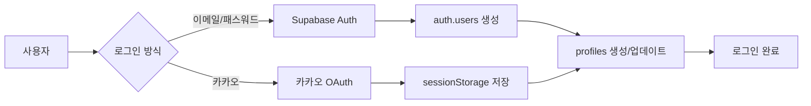

# 📊 Live Commerce 데이터 아키텍처 문서

## 🎯 개요
이 문서는 Live Commerce 프로젝트의 전체 데이터 구조와 흐름을 정리한 문서입니다. 데이터베이스 스키마, API 엔드포인트, 데이터 흐름을 포함합니다.

---

## 🗄️ 데이터베이스 구조

### 📌 현재 사용 중인 주요 테이블

#### 1. **사용자 관련 테이블**

##### `auth.users` (Supabase Auth 내장)
- Supabase Auth 시스템의 기본 사용자 테이블
- 이메일/패스워드 기반 인증 처리

##### `profiles` (사용자 프로필)
```sql
- id (UUID, PK) - auth.users 참조
- email (VARCHAR)
- name (VARCHAR)
- nickname (VARCHAR)
- phone (VARCHAR)
- address (TEXT) - 기본 주소
- detail_address (TEXT) - 상세 주소
- addresses (JSONB) - 다중 주소 배열 [{id, label, address, detail_address, is_default}]
- password_hash (VARCHAR) - bcrypt 해싱된 패스워드
- is_admin (BOOLEAN)
- points (INTEGER)
- created_at (TIMESTAMPTZ)
- updated_at (TIMESTAMPTZ)
```

##### `addresses` (별도 주소 테이블 - 구현 예정)
```sql
- id (BIGSERIAL, PK)
- user_id (UUID) - auth.users 참조
- label (TEXT) - 배송지 라벨 (집, 회사 등)
- address (TEXT)
- detail_address (TEXT)
- is_default (BOOLEAN)
- created_at (TIMESTAMPTZ)
- updated_at (TIMESTAMPTZ)
```
**참고**: 현재 profiles.addresses JSONB 컬럼 사용 중, addresses 테이블 마이그레이션 필요

#### 2. **상품 관련 테이블**

##### `products` (상품)
```sql
- id (UUID, PK)
- title (VARCHAR) - 상품명
- description (TEXT) - 상품 설명
- price (DECIMAL) - 가격
- compare_price (DECIMAL) - 할인 전 가격
- discount_rate (INTEGER) - 할인율
- thumbnail_url (TEXT) - 썸네일 이미지
- images (JSONB) - 이미지 배열
- category (VARCHAR) - 카테고리
- sub_category (VARCHAR) - 서브 카테고리
- tags (TEXT[]) - 태그 배열
- inventory (INTEGER) - 재고 수량
- is_visible (BOOLEAN) - 노출 여부
- is_featured (BOOLEAN) - 추천 상품 여부
- view_count (INTEGER) - 조회수
- like_count (INTEGER) - 좋아요 수
- sales_count (INTEGER) - 판매 수
- created_at (TIMESTAMPTZ)
- updated_at (TIMESTAMPTZ)
```

##### `product_options` (상품 옵션)
```sql
- id (UUID, PK)
- product_id (UUID) - products 참조
- name (VARCHAR) - 옵션명
- values (JSONB) - 옵션 값 배열
- required (BOOLEAN) - 필수 여부
- created_at (TIMESTAMPTZ)
```

#### 3. **주문 관련 테이블**

##### `orders` (주문)
```sql
- id (UUID, PK)
- customer_order_number (VARCHAR, UNIQUE) - 주문번호 (S241231-XXXX 형식)
- user_id (UUID, NULL 가능) - auth.users 참조 (카카오 사용자는 NULL)
- status (VARCHAR) - pending, verifying, paid, delivered, cancelled
- order_type (VARCHAR) - direct, cart, direct:KAKAO:{kakao_id}
- total_amount (DECIMAL) - 총 주문 금액
- created_at (TIMESTAMPTZ)
- updated_at (TIMESTAMPTZ)
```

##### `order_items` (주문 아이템)
```sql
- id (UUID, PK)
- order_id (UUID) - orders 참조
- product_id (UUID) - products 참조
- quantity (INTEGER) - 수량
- unit_price (DECIMAL) - 단가
- total_price (DECIMAL) - 합계
- selected_options (JSONB) - 선택된 옵션
- created_at (TIMESTAMPTZ)
```

##### `order_shipping` (배송 정보)
```sql
- id (UUID, PK)
- order_id (UUID) - orders 참조
- name (VARCHAR) - 수령인 이름
- phone (VARCHAR) - 연락처
- address (TEXT) - 배송 주소
- detail_address (TEXT) - 상세 주소
- postal_code (VARCHAR) - 우편번호
- memo (TEXT) - 배송 메모
- shipping_fee (DECIMAL) - 배송비 (기본 4000원)
- shipping_method (VARCHAR) - 배송 방법
- tracking_number (VARCHAR) - 운송장 번호
- shipped_at (TIMESTAMPTZ) - 발송일
- delivered_at (TIMESTAMPTZ) - 배송완료일
- created_at (TIMESTAMPTZ)
```

##### `order_payments` (결제 정보)
```sql
- id (UUID, PK)
- order_id (UUID) - orders 참조
- method (VARCHAR) - bank_transfer, card 등
- amount (DECIMAL) - 결제 금액
- status (VARCHAR) - pending, completed, failed, cancelled
- transaction_id (VARCHAR) - 트랜잭션 ID
- paid_at (TIMESTAMPTZ) - 결제일
- bank_name (VARCHAR) - 은행명
- account_number (VARCHAR) - 계좌번호
- depositor_name (VARCHAR) - 입금자명
- created_at (TIMESTAMPTZ)
```

#### 4. **기타 테이블**

##### `cart_items` (장바구니)
```sql
- id (UUID, PK)
- user_id (UUID) - auth.users 참조
- product_id (UUID) - products 참조
- quantity (INTEGER)
- selected_options (JSONB)
- created_at (TIMESTAMPTZ)
- updated_at (TIMESTAMPTZ)
```

##### `wishlist` (찜 목록)
```sql
- id (UUID, PK)
- user_id (UUID) - auth.users 참조
- product_id (UUID) - products 참조
- created_at (TIMESTAMPTZ)
```

##### `reviews` (리뷰)
```sql
- id (UUID, PK)
- product_id (UUID) - products 참조
- user_id (UUID) - auth.users 참조
- order_item_id (UUID) - order_items 참조
- rating (INTEGER, 1-5)
- title (VARCHAR)
- content (TEXT)
- images (JSONB)
- is_verified_purchase (BOOLEAN)
- helpful_count (INTEGER)
- created_at (TIMESTAMPTZ)
- updated_at (TIMESTAMPTZ)
```

##### `coupons` (쿠폰)
```sql
- id (UUID, PK)
- code (VARCHAR, UNIQUE) - 쿠폰 코드
- name (VARCHAR) - 쿠폰명
- description (TEXT)
- discount_type (VARCHAR) - percentage, fixed
- discount_value (DECIMAL)
- min_purchase_amount (DECIMAL)
- max_discount_amount (DECIMAL)
- valid_from (TIMESTAMPTZ)
- valid_until (TIMESTAMPTZ)
- usage_limit (INTEGER)
- used_count (INTEGER)
- is_active (BOOLEAN)
- created_at (TIMESTAMPTZ)
```

---

## 🔗 API 엔드포인트 매핑

### 📍 주요 API 엔드포인트와 데이터 작업

#### **인증/사용자 관련**
| 엔드포인트 | 메소드 | 테이블 작업 | 설명 |
|-----------|--------|------------|------|
| `/api/auth/kakao-user` | POST | profiles (READ/WRITE) | 카카오 사용자 정보 처리 |
| `/api/auth/create-kakao-user` | POST | profiles (INSERT) | 카카오 사용자 생성 |
| `/api/auth/check-kakao-user` | GET | profiles (READ) | 카카오 사용자 확인 |

#### **주소 관리**
| 엔드포인트 | 메소드 | 테이블 작업 | 설명 |
|-----------|--------|------------|------|
| `/api/addresses` | GET | profiles.addresses (READ) | 주소 목록 조회 |
| `/api/addresses` | POST | profiles.addresses (UPDATE) | 새 주소 추가 |
| `/api/addresses` | PUT | profiles.addresses (UPDATE) | 주소 수정 |
| `/api/addresses` | DELETE | profiles.addresses (UPDATE) | 주소 삭제 |
| `/api/addresses/set-default` | POST | profiles.addresses (UPDATE) | 기본 주소 설정 |

#### **주문 관련**
| 엔드포인트 | 메소드 | 테이블 작업 | 설명 |
|-----------|--------|------------|------|
| `/api/create-order-card` | POST | orders, order_items, order_shipping, order_payments (INSERT), products.inventory (UPDATE) | 카드 결제 주문 생성 |
| `/lib/supabaseApi.createOrder` | - | orders, order_items, order_shipping, order_payments (INSERT) | 무통장입금 주문 생성 |

#### **상품 관련**
| 엔드포인트 | 메소드 | 테이블 작업 | 설명 |
|-----------|--------|------------|------|
| `/api/get-products` | GET | products (READ) | 상품 목록 조회 |
| `/api/setup-products` | POST | products (INSERT) | 상품 초기 설정 |

---

## 🔄 주요 데이터 흐름

### 1. **사용자 인증 플로우**



**핵심 포인트:**
- Supabase Auth 사용자: auth.users → profiles 연동
- 카카오 사용자: sessionStorage 기반 관리, profiles에만 저장
- 패스워드: bcrypt 해싱 후 profiles.password_hash에 저장

### 2. **주문 생성 플로우**

```mermaid
graph TD
    A[체크아웃] --> B[사용자 프로필 확인]
    B --> C[배송지 선택]
    C --> D{결제 방식}

    D -->|무통장입금| E[supabaseApi.createOrder]
    D -->|카드결제| F[/api/create-order-card]

    E --> G[orders 생성]
    F --> G

    G --> H[order_items 생성]
    H --> I[order_shipping 생성]
    I --> J[order_payments 생성]
    J --> K[products.inventory 차감]

    K --> L[주문 완료]
```

**핵심 포인트:**
- 주문번호 형식: S{YYMMDD}-{XXXX} (예: S241231-AB12)
- 카카오 사용자: order_type에 'direct:KAKAO:{kakao_id}' 형식으로 저장
- 재고 차감: 주문 생성 시 자동 처리

### 3. **주소 관리 플로우**

```mermaid
graph LR
    A[마이페이지] --> B[AddressManager 컴포넌트]
    B --> C[/api/addresses GET]
    C --> D[profiles.addresses 조회]

    B --> E[주소 추가/수정/삭제]
    E --> F[/api/addresses POST/PUT/DELETE]
    F --> G[profiles.addresses 업데이트]

    H[체크아웃] --> I[주소 선택]
    I --> J[selectedAddress 상태]
    J --> K[주문 생성 시 사용]
```

**핵심 포인트:**
- 현재: profiles.addresses JSONB 컬럼 사용
- 계획: addresses 테이블로 마이그레이션 필요
- 최대 5개 주소 관리 가능

---

## ✅ 시스템 통합 현황 (2025-09-30 업데이트)

### 완료된 주요 개선사항

1. **UserProfileManager 통합 시스템 구축 ✅**
   - 카카오/일반 사용자 통합 관리
   - getUserOrderQuery() 메소드로 적절한 조회 조건 자동 생성
   - 모든 페이지에서 일관된 사용자 인식

2. **주문 조회 시스템 완전 개편 ✅**
   - getOrders(): UserProfileManager 기반 사용자별 조회
   - getAllOrders(): 관리자용, 카카오 주문 타입 인식
   - 카카오: order_type = 'direct:KAKAO:{kakao_id}' 조회
   - 일반: user_id 기반 조회

3. **계산 로직 수정 완료 ✅**
   - 주문 상세 페이지: items.reduce()로 정확한 총 상품금액 계산
   - 주문 목록 모달: 동일한 계산 로직 적용
   - 입금 안내: 상품금액 + 배송비로 정확한 입금금액 표시

4. **더미 데이터 문제 해결 ✅**
   - 기본값으로 하드코딩된 더미 데이터 제거 완료

### 해결된 이슈

1. **사용자 주문 조회 불일치 문제 ✅**
   - 원인: sessionStorage 사용자 ID와 DB 주문의 user_id 불일치
   - 해결: UserProfileManager 기반 통합 조회 시스템

2. **카카오 사용자 처리 ✅**
   - 해결: order_type 기반 카카오 사용자 인식
   - sessionStorage 기반 세션 관리 유지
   - orders.user_id가 NULL인 카카오 주문 정상 처리

3. **관리자-사용자 페이지 데이터 불일치 ✅**
   - 해결: 모든 페이지에서 UserProfileManager 기반 동일한 로직 사용

### 보안 개선사항 (완료)

- ✅ bcrypt 패스워드 해싱 구현
- ✅ API 키 환경변수 분리
- ✅ 입력 검증 시스템 구축 (lib/validation.js)
- ✅ SQL 인젝션 방지
- ✅ XSS 공격 방지

---

## 📈 성능 최적화

### 인덱스
- profiles: email, created_at
- products: category, is_visible, created_at
- orders: user_id, status, customer_order_number, created_at
- order_items: order_id, product_id

### 캐싱 전략
- 상품 정보: 변경이 적으므로 캐싱 고려
- 사용자 프로필: sessionStorage 활용
- 주문 정보: 주문 완료 후 단기 캐싱

---

## 🔮 향후 계획

### 단기 (1주일 내)
- [ ] addresses 테이블 생성 및 마이그레이션
- [ ] SMS 인증 시스템 구현 (네이버 SENS)

### 중기 (1개월 내)
- [ ] 쿠폰 시스템 구현
- [ ] 도서산간 배송비 차등 적용
- [ ] 재고 관리 시스템 고도화

### 장기 (3개월 내)
- [ ] 실시간 라이브 방송 기능
- [ ] 배송 추적 시스템
- [ ] 고급 통계 및 분석 대시보드

---

## 📝 개발 참고사항

### 명령어
```bash
# 개발 서버 실행
npm run dev

# 빌드
npm run build

# 린트
npm run lint

# 타입 체크
npm run typecheck
```

### 환경변수
```env
NEXT_PUBLIC_SUPABASE_URL=
NEXT_PUBLIC_SUPABASE_ANON_KEY=
SUPABASE_SERVICE_ROLE_KEY=
NEXT_PUBLIC_KAKAO_CLIENT_ID=
```

### 주요 디렉토리 구조
```
/app
  /api           # API 엔드포인트
  /components    # React 컴포넌트
  /hooks         # Custom React Hooks
  /stores        # Zustand 상태 관리
/lib
  /supabase.js   # Supabase 클라이언트
  /supabaseApi.js # Supabase API 함수
  /validation.js  # 입력 검증 유틸리티
/supabase
  *.sql          # 데이터베이스 스키마 및 마이그레이션
```

---

*최종 업데이트: 2025-09-30*