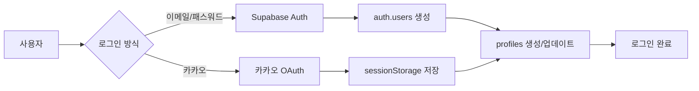
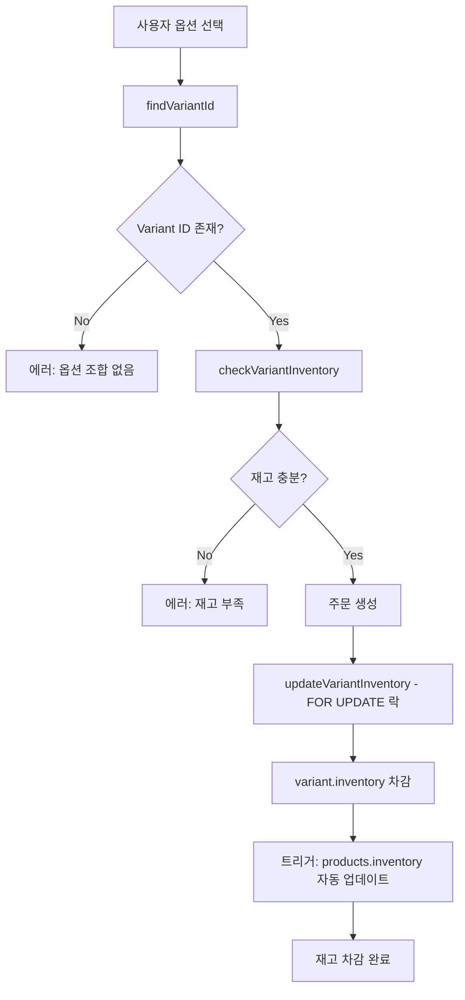
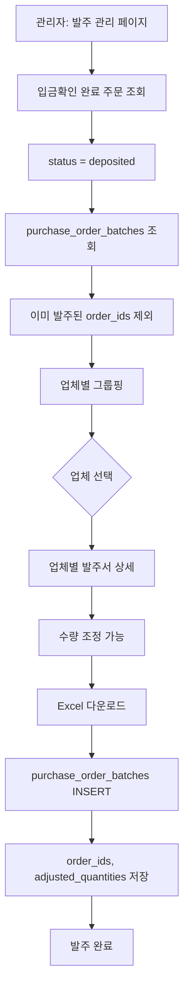
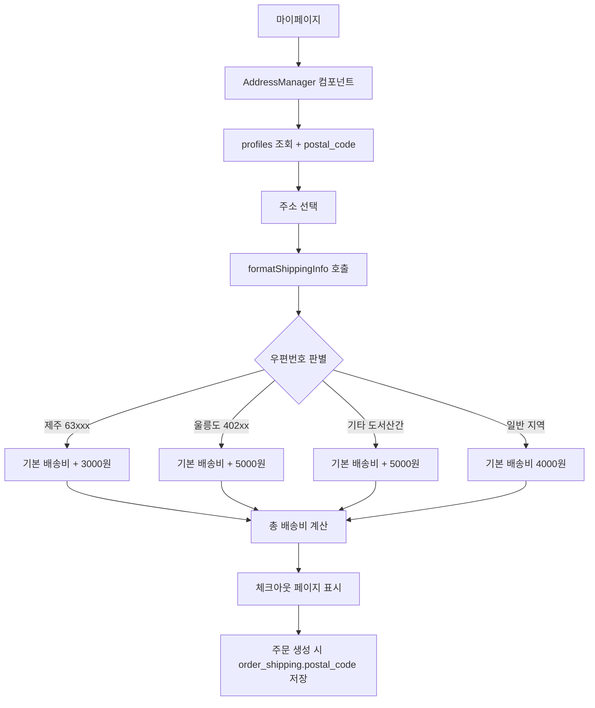

# 📊 Live Commerce 데이터 아키텍처 문서

## 🎯 개요
이 문서는 Live Commerce 프로젝트의 전체 데이터 구조와 흐름을 정리한 문서입니다. 데이터베이스 스키마, API 엔드포인트, 데이터 흐름을 포함합니다.

---

## 🗄️ 데이터베이스 구조

### 📌 현재 사용 중인 주요 테이블 (23개)

#### 1. **사용자 관련 테이블**

##### `auth.users` (Supabase Auth 내장)
- Supabase Auth 시스템의 기본 사용자 테이블
- 이메일/패스워드 기반 인증 처리

##### `profiles` (사용자 프로필) ⭐ 업데이트
```sql
- id (UUID, PK) - auth.users 참조
- email (VARCHAR)
- name (VARCHAR)
- nickname (VARCHAR)
- phone (VARCHAR)
- address (TEXT) - 기본 주소
- detail_address (TEXT) - 상세 주소
- postal_code (VARCHAR) - ⭐ 신규 (2025-10-03) - 도서산간 배송비 계산용
- addresses (JSONB) - 다중 주소 배열 [{id, label, address, detail_address, is_default}]
- kakao_id (TEXT) - ⭐ 신규 - 카카오 로그인 사용자 식별
- provider (TEXT) - ⭐ 신규 - 'email', 'kakao' 등 로그인 방식
- password_hash (VARCHAR) - bcrypt 해싱된 패스워드
- is_admin (BOOLEAN)
- points (INTEGER)
- created_at (TIMESTAMPTZ)
- updated_at (TIMESTAMPTZ)
```

##### `addresses` (별도 주소 테이블 - 구현 예정)
```sql
- id (BIGSERIAL, PK)
- user_id (UUID) - auth.users 참조
- label (TEXT) - 배송지 라벨 (집, 회사 등)
- address (TEXT)
- detail_address (TEXT)
- is_default (BOOLEAN)
- created_at (TIMESTAMPTZ)
- updated_at (TIMESTAMPTZ)
```
**참고**: 현재 profiles.addresses JSONB 컬럼 사용 중, addresses 테이블 마이그레이션 필요

#### 2. **상품 관련 테이블 (Variant 시스템)**

##### `categories` (카테고리) ⭐ 신규 (2025-10-01)
```sql
- id (UUID, PK)
- name (VARCHAR) - 카테고리명
- slug (VARCHAR) - URL 친화적 식별자
- parent_id (UUID) - 상위 카테고리 (계층 구조)
- level (INTEGER) - 카테고리 레벨 (1: 대분류, 2: 중분류, 3: 소분류)
- display_order (INTEGER) - 정렬 순서
- is_active (BOOLEAN) - 활성화 여부
- created_at (TIMESTAMPTZ)
```

**카테고리 계층 구조**:
```
여성의류 (대분류)
  ├─ 상의 (중분류)
  │   ├─ 티셔츠 (소분류)
  │   └─ 블라우스 (소분류)
  └─ 하의 (중분류)
      ├─ 바지 (소분류)
      └─ 스커트 (소분류)
```

##### `suppliers` (공급업체) ⭐ 신규 (2025-10-01)
```sql
- id (UUID, PK)
- code (VARCHAR) - 업체 코드 (고유)
- name (VARCHAR) - 업체명
- contact_person (VARCHAR) - 담당자명
- phone (VARCHAR) - 연락처
- bank_name (VARCHAR) - 은행명
- account_number (VARCHAR) - 계좌번호
- is_active (BOOLEAN) - 활성화 여부
- created_at (TIMESTAMPTZ)
```

**용도**: 발주 시스템에서 업체별 발주서 생성 및 관리

##### `products` (상품) ⭐ 업데이트
```sql
- id (UUID, PK)
- title (VARCHAR) - 상품명
- description (TEXT) - 상품 설명
- product_number (VARCHAR) - 상품 번호 (0001~9999)
- price (DECIMAL) - 가격
- compare_price (DECIMAL) - 할인 전 가격
- discount_rate (INTEGER) - 할인율
- purchase_price (DECIMAL) - ⭐ 신규 - 매입가 (발주서용)
- thumbnail_url (TEXT) - 썸네일 이미지
- images (JSONB) - 이미지 배열
- category (VARCHAR) - 카테고리명 (레거시)
- sub_category (VARCHAR) - 서브 카테고리 (레거시)
- category_id (UUID) - ⭐ 신규 - categories 참조
- supplier_id (UUID) - ⭐ 신규 - suppliers 참조
- model_number (TEXT) - ⭐ 신규 - 모델번호
- tags (TEXT[]) - 태그 배열
- inventory (INTEGER) - 총 재고 수량 (Variant 합산 자동 계산)
- option_count (INTEGER) - ⭐ 신규 - 옵션 개수
- variant_count (INTEGER) - ⭐ 신규 - Variant 개수
- is_visible (BOOLEAN) - 노출 여부
- is_featured (BOOLEAN) - 추천 상품 여부
- is_live (BOOLEAN) - ⭐ 신규 - 라이브 방송 상품 여부
- is_live_active (BOOLEAN) - ⭐ 신규 - 라이브 방송 활성화
- view_count (INTEGER) - 조회수
- like_count (INTEGER) - 좋아요 수
- sales_count (INTEGER) - 판매 수
- created_at (TIMESTAMPTZ)
- updated_at (TIMESTAMPTZ)
```

**중요 포인트**:
- `inventory`: Variant가 있으면 자동 합산 (트리거), 없으면 직접 관리
- `category_id`, `supplier_id`: FK로 정규화된 관계

##### `product_options` (옵션 정의) ⭐ Variant 시스템
```sql
- id (UUID, PK)
- product_id (UUID) - products 참조
- name (VARCHAR) - 옵션명 (예: "색상", "사이즈")
- display_order (INTEGER) - 표시 순서
- created_at (TIMESTAMPTZ)
```

##### `product_option_values` (옵션 값) ⭐ Variant 시스템
```sql
- id (UUID, PK)
- option_id (UUID) - product_options 참조
- value (VARCHAR) - 옵션 값 (예: "블랙", "L", "66")
- color_code (VARCHAR) - 색상 코드 (선택)
- image_url (TEXT) - 옵션 이미지 (선택)
- display_order (INTEGER) - 표시 순서
- created_at (TIMESTAMPTZ)
```

##### `product_variants` (변형 상품/SKU) ⭐ Variant 시스템 핵심
```sql
- id (UUID, PK)
- product_id (UUID) - products 참조
- sku (VARCHAR, UNIQUE) - SKU 코드 (예: "JACKET-66-PINK")
- inventory (INTEGER) - ⭐ 실제 재고 관리 (각 조합별 독립 재고)
- price_adjustment (DECIMAL) - 가격 조정 (+/-)
- supplier_sku (TEXT) - 업체 상품코드
- barcode (VARCHAR) - 바코드
- is_active (BOOLEAN) - 활성화 여부
- created_at (TIMESTAMPTZ)
- updated_at (TIMESTAMPTZ)
```

**핵심**: Variant가 있는 상품은 여기서 재고 관리!

##### `variant_option_values` (Variant-옵션 매핑) ⭐ Variant 시스템
```sql
- variant_id (UUID) - product_variants 참조
- option_value_id (UUID) - product_option_values 참조
- created_at (TIMESTAMPTZ)
- UNIQUE(variant_id, option_value_id)
```

**Variant 시스템 구조**:
```
상품: 자켓 (price: 46,000원)
├─ product_options: 색상, 사이즈
│   └─ product_option_values: 핑크/블랙/그레이, 66/77/88
└─ product_variants (SKU별 재고 관리):
    ├─ JACKET-66-PINK (재고: 10개)
    ├─ JACKET-77-PINK (재고: 5개, 가격조정: +5,000원)
    └─ ... (총 9개 조합)
```

##### `live_broadcasts` (라이브 방송) ⭐ 신규
```sql
- id (UUID, PK)
- title (VARCHAR) - 방송 제목
- status (VARCHAR) - 'scheduled', 'live', 'ended'
- viewer_count (INTEGER) - 시청자 수
- scheduled_at (TIMESTAMPTZ) - 예정 시간
- started_at (TIMESTAMPTZ) - 시작 시간
- ended_at (TIMESTAMPTZ) - 종료 시간
- created_at (TIMESTAMPTZ)
```

##### `live_products` (방송-상품 연결) ⭐ 신규
```sql
- id (UUID, PK)
- broadcast_id (UUID) - live_broadcasts 참조
- product_id (UUID) - products 참조
- display_order (INTEGER) - 방송 내 표시 순서
- special_price (DECIMAL) - 라이브 특가
- created_at (TIMESTAMPTZ)
```

#### 3. **주문 관련 테이블**

##### `orders` (주문) ⭐ 업데이트
```sql
- id (UUID, PK)
- customer_order_number (VARCHAR, UNIQUE) - 주문번호 (ORD-20251003-ABC123 형식)
- user_id (UUID, NULL 가능) - auth.users 참조 (카카오 사용자는 NULL)
- status (VARCHAR) - pending, verifying, deposited, paid, shipped, delivered, cancelled
- order_type (VARCHAR) - direct, cart, direct:KAKAO:{kakao_id}, cart:KAKAO:{kakao_id}
- payment_group_id (VARCHAR) - ⭐ 신규 - 일괄결제 그룹 ID
- total_amount (DECIMAL) - 총 주문 금액
- pending_at (TIMESTAMPTZ) - ⭐ 신규 - 결제대기 시간
- paid_at (TIMESTAMPTZ) - ⭐ 신규 - 결제완료 시간
- shipped_at (TIMESTAMPTZ) - ⭐ 신규 - 발송완료 시간
- delivered_at (TIMESTAMPTZ) - ⭐ 신규 - 배송완료 시간
- created_at (TIMESTAMPTZ)
- updated_at (TIMESTAMPTZ)
```

**주문 상태 흐름**:
```
pending → verifying → deposited (입금확인 - 발주 대상) → paid → shipped → delivered
```

**타임스탬프 자동 기록**: 상태 변경 시 트리거로 자동 저장

##### `order_items` (주문 아이템) ⭐ 업데이트
```sql
- id (UUID, PK)
- order_id (UUID) - orders 참조
- product_id (UUID) - products 참조
- variant_id (UUID) - ⭐ 신규 - product_variants 참조 (Variant 시스템 연동)
- title (TEXT) - ⭐ 신규 - 주문 시점 상품명 (스냅샷)
- quantity (INTEGER) - 수량
- price (DECIMAL) - ⭐ 신규 - 단가 (신규 컬럼)
- unit_price (DECIMAL) - 단가 (기존 컬럼)
- total (DECIMAL) - ⭐ 신규 - 합계 (신규 컬럼)
- total_price (DECIMAL) - 합계 (기존 컬럼)
- sku (TEXT) - ⭐ 신규 - SKU 코드
- selected_options (JSONB) - 선택된 옵션 (스냅샷)
- created_at (TIMESTAMPTZ)
```

**⚠️ 중복 컬럼 패턴 (호환성 유지)**:
- `price` / `unit_price` → 양쪽 모두 저장 필수
- `total` / `total_price` → 양쪽 모두 저장 필수
- 이유: 개발/프로덕션 환경 스키마 차이

**⭐ 이중 저장 전략**:
- `variant_id` (FK): 실시간 Variant 정보 조회용
- `selected_options` (JSONB): 주문 시점 스냅샷 (변경 불가 보존)

##### `order_shipping` (배송 정보) ⭐ 업데이트
```sql
- id (UUID, PK)
- order_id (UUID) - orders 참조
- name (VARCHAR) - 수령인 이름
- phone (VARCHAR) - 연락처
- address (TEXT) - 배송 주소
- detail_address (TEXT) - 상세 주소
- postal_code (VARCHAR) - ⭐ 신규 (2025-10-03) - 우편번호 (주문 시점 저장)
- memo (TEXT) - 배송 메모
- shipping_fee (DECIMAL) - 배송비 (도서산간 포함 총 배송비)
- shipping_method (VARCHAR) - 배송 방법
- tracking_number (VARCHAR) - 운송장 번호
- shipped_at (TIMESTAMPTZ) - 발송일
- delivered_at (TIMESTAMPTZ) - 배송완료일
- created_at (TIMESTAMPTZ)
```

**도서산간 배송비 계산** (2025-10-03 추가):
- 제주 (63000-63644): 기본 배송비 + 3,000원
- 울릉도 (40200-40240): 기본 배송비 + 5,000원
- 기타 도서산간: 기본 배송비 + 5,000원

##### `order_payments` (결제 정보)
```sql
- id (UUID, PK)
- order_id (UUID) - orders 참조
- method (VARCHAR) - bank_transfer, card 등
- amount (DECIMAL) - 결제 금액
- status (VARCHAR) - pending, completed, failed, cancelled
- transaction_id (VARCHAR) - 트랜잭션 ID
- paid_at (TIMESTAMPTZ) - 결제일
- bank_name (VARCHAR) - 은행명
- account_number (VARCHAR) - 계좌번호
- depositor_name (VARCHAR) - 입금자명 (무통장입금 시 필수)
- created_at (TIMESTAMPTZ)
```

#### 3.5 **발주 시스템 테이블**

##### `purchase_order_batches` (발주 이력) ⭐ 신규 (2025-10-01)
```sql
- id (UUID, PK)
- supplier_id (UUID) - suppliers 참조
- download_date (TIMESTAMPTZ) - 발주서 다운로드 시간
- order_ids (UUID[]) - 포함된 주문 ID 배열 (GIN 인덱스)
- adjusted_quantities (JSONB) - 수량 조정 내역 {order_item_id: adjusted_qty}
- total_items (INTEGER) - 총 아이템 수
- total_amount (INTEGER) - 총 발주 금액
- status (VARCHAR) - 'completed', 'cancelled'
- created_by (VARCHAR) - 다운로드한 관리자 이메일
- created_at (TIMESTAMPTZ)
```

**용도**:
- 업체별 발주서 다운로드 이력 추적
- 중복 발주 방지 (이미 발주된 order_ids 자동 제외)
- 발주 데이터 감사 및 추적

**사용 패턴**:
```javascript
// 1. 입금확인 완료(deposited) 주문 조회
// 2. purchase_order_batches에서 완료된 order_ids 조회
// 3. 발주 안 된 주문만 필터링
// 4. Excel 다운로드 시 batch 생성
```

#### 4. **기타 테이블**

##### `cart_items` (장바구니)
```sql
- id (UUID, PK)
- user_id (UUID) - auth.users 참조
- product_id (UUID) - products 참조
- quantity (INTEGER)
- selected_options (JSONB)
- created_at (TIMESTAMPTZ)
- updated_at (TIMESTAMPTZ)
```

##### `wishlist` (찜 목록)
```sql
- id (UUID, PK)
- user_id (UUID) - auth.users 참조
- product_id (UUID) - products 참조
- created_at (TIMESTAMPTZ)
```

##### `reviews` (리뷰)
```sql
- id (UUID, PK)
- product_id (UUID) - products 참조
- user_id (UUID) - auth.users 참조
- order_item_id (UUID) - order_items 참조
- rating (INTEGER, 1-5)
- title (VARCHAR)
- content (TEXT)
- images (JSONB)
- is_verified_purchase (BOOLEAN)
- helpful_count (INTEGER)
- created_at (TIMESTAMPTZ)
- updated_at (TIMESTAMPTZ)
```

##### `coupons` (쿠폰)
```sql
- id (UUID, PK)
- code (VARCHAR, UNIQUE) - 쿠폰 코드
- name (VARCHAR) - 쿠폰명
- description (TEXT)
- discount_type (VARCHAR) - percentage, fixed
- discount_value (DECIMAL)
- min_purchase_amount (DECIMAL)
- max_discount_amount (DECIMAL)
- valid_from (TIMESTAMPTZ)
- valid_until (TIMESTAMPTZ)
- usage_limit (INTEGER)
- used_count (INTEGER)
- is_active (BOOLEAN)
- created_at (TIMESTAMPTZ)
```

---

## 🔗 API 엔드포인트 매핑

### 📍 주요 API 엔드포인트와 데이터 작업

#### **인증/사용자 관련**
| 엔드포인트 | 메소드 | 테이블 작업 | 설명 |
|-----------|--------|------------|------|
| `/api/auth/kakao-user` | POST | profiles (READ/WRITE) | 카카오 사용자 정보 처리 |
| `/api/auth/create-kakao-user` | POST | profiles (INSERT) | 카카오 사용자 생성 |
| `/api/auth/check-kakao-user` | GET | profiles (READ) | 카카오 사용자 확인 |

#### **주소 관리**
| 엔드포인트 | 메소드 | 테이블 작업 | 설명 |
|-----------|--------|------------|------|
| `/api/addresses` | GET | profiles.addresses (READ) | 주소 목록 조회 |
| `/api/addresses` | POST | profiles.addresses (UPDATE) | 새 주소 추가 |
| `/api/addresses` | PUT | profiles.addresses (UPDATE) | 주소 수정 |
| `/api/addresses` | DELETE | profiles.addresses (UPDATE) | 주소 삭제 |
| `/api/addresses/set-default` | POST | profiles.addresses (UPDATE) | 기본 주소 설정 |

#### **주문 관련**
| 엔드포인트 | 메소드 | 테이블 작업 | 설명 |
|-----------|--------|------------|------|
| `/api/create-order-card` | POST | orders, order_items, order_shipping, order_payments (INSERT), products.inventory (UPDATE) | 카드 결제 주문 생성 |
| `/lib/supabaseApi.createOrder` | - | orders, order_items, order_shipping, order_payments (INSERT) | 무통장입금 주문 생성 |
| `updateOrderStatus` | - | orders (UPDATE), order_payments (UPDATE) | 주문 상태 변경 (타임스탬프 자동 기록) |
| `updateMultipleOrderStatus` | - | orders (UPDATE) | 여러 주문 일괄 상태 변경 |
| `cancelOrder` | - | orders (UPDATE), product_variants.inventory (UPDATE) | 주문 취소 (재고 복구) |

#### **상품 관련**
| 엔드포인트 | 메소드 | 테이블 작업 | 설명 |
|-----------|--------|------------|------|
| `/api/get-products` | GET | products (READ) | 상품 목록 조회 (라이브 노출 상품만) |
| `/api/setup-products` | POST | products (INSERT) | 상품 초기 설정 |
| `getProductById` | - | products, product_variants, product_options (READ) | 상품 상세 조회 (Variant 포함) |
| `getAllProducts` | - | products, categories, suppliers (READ) | 관리자용 전체 상품 조회 |

#### **Variant 시스템 관련** ⭐ 신규 (2025-10-01)
| 엔드포인트 | 메소드 | 테이블 작업 | 설명 |
|-----------|--------|------------|------|
| `getProductVariants` | - | product_variants, variant_option_values, product_option_values, product_options (READ) | Variant 목록 조회 (옵션 정보 포함) |
| `createVariant` | - | product_variants, variant_option_values (INSERT) | Variant 생성 |
| `updateVariant` | - | product_variants (UPDATE) | Variant 수정 |
| `updateVariantInventory` | - | product_variants (UPDATE with FOR UPDATE) | Variant 재고 업데이트 (동시성 제어) |
| `checkVariantInventory` | - | product_variants (READ) | 옵션 조합의 재고 확인 |

#### **발주 시스템 관련** ⭐ 신규 (2025-10-01)
| 엔드포인트 | 메소드 | 테이블 작업 | 설명 |
|-----------|--------|------------|------|
| `getPurchaseOrdersBySupplier` | - | orders, order_items, products, suppliers, purchase_order_batches (READ) | 모든 업체의 발주 데이터 조회 |
| `getPurchaseOrderBySupplier` | - | orders, order_items, products, suppliers, product_variants, purchase_order_batches (READ) | 특정 업체 발주서 조회 |

#### **카테고리/업체 관리** ⭐ 신규 (2025-10-01)
| 엔드포인트 | 메소드 | 테이블 작업 | 설명 |
|-----------|--------|------------|------|
| `getCategories` | - | categories (READ) | 카테고리 목록 조회 (계층 구조) |
| `getSuppliers` | - | suppliers (READ) | 업체 목록 조회 |
| `createSupplier` | - | suppliers (INSERT) | 업체 생성 |
| `updateSupplier` | - | suppliers (UPDATE) | 업체 수정 |

---

## 🔄 주요 데이터 흐름

### 1. **사용자 인증 플로우**



**핵심 포인트:**
- Supabase Auth 사용자: auth.users → profiles 연동
- 카카오 사용자: sessionStorage 기반 관리, profiles에만 저장
- 패스워드: bcrypt 해싱 후 profiles.password_hash에 저장

### 2. **주문 생성 플로우 (Variant 시스템 포함)**

```mermaid
graph TD
    A[체크아웃] --> B[사용자 프로필 확인]
    B --> C[배송지 선택 + 우편번호]
    C --> D{결제 방식}

    D -->|무통장입금| E[supabaseApi.createOrder]
    D -->|카드결제| F[/api/create-order-card]

    E --> G[orders 생성 + 타임스탬프]
    F --> G

    G --> H[order_items 생성]
    H --> I{Variant 상품?}

    I -->|Yes| J[variant_id + selected_options 저장]
    I -->|No| K[selected_options만 저장]

    J --> L[Variant 재고 차감 FOR UPDATE]
    K --> M[Product 재고 차감]

    L --> N[order_shipping 생성 + postal_code]
    M --> N

    N --> O[배송비 계산 도서산간 추가]
    O --> P[order_payments 생성]
    P --> Q[주문 완료]
```

**핵심 포인트:**
- 주문번호 형식: ORD-{YYMMDD}-{RANDOM6} (예: ORD-20251003-ABC123)
- 카카오 사용자: order_type에 'direct:KAKAO:{kakao_id}' 형식으로 저장
- Variant 재고 차감: FOR UPDATE 락으로 동시성 제어
- 배송비: postal_code 기반 도서산간 추가 배송비 자동 계산
- 타임스탬프: pending_at, paid_at, shipped_at, delivered_at 자동 기록

### 3. **Variant 재고 관리 플로우** ⭐ 신규 (2025-10-01)



**동시성 제어**:
```sql
-- FOR UPDATE 락 사용
SELECT * FROM product_variants
WHERE id = ?
FOR UPDATE;

UPDATE product_variants
SET inventory = inventory - ?
WHERE id = ?;
```

### 4. **발주서 생성 플로우** ⭐ 신규 (2025-10-01)



**발주서 데이터 구조**:
```javascript
{
  supplier: {
    code: "SUP001",
    name: "동대문 의류",
    phone: "010-1234-5678"
  },
  orders: [
    {
      order_number: "ORD-20251003-ABC123",
      customer_name: "홍길동",
      items: [
        {
          sku: "JACKET-66-PINK",
          supplier_sku: "DM-JK-001",
          title: "자켓",
          variant: "사이즈: 66 / 색상: 핑크",
          quantity: 1,
          purchase_price: 30000
        }
      ]
    }
  ],
  total_items: 15,
  total_amount: 690000
}
```

### 5. **주소 및 배송비 계산 플로우** ⭐ 업데이트 (2025-10-03)



**도서산간 배송비 규칙**:
- 제주 (63000-63644): +3,000원
- 울릉도 (40200-40240): +5,000원
- 기타 도서산간: +5,000원

**사용 함수**:
```javascript
import { formatShippingInfo } from '@/lib/shippingUtils'

const shippingInfo = formatShippingInfo(4000, postalCode)
// 반환: { baseShipping, surcharge, totalShipping, region, isRemote }
```

**핵심 포인트:**
- 현재: profiles.addresses JSONB 컬럼 사용
- `postal_code`: profiles와 order_shipping 양쪽에 저장
- 주문 시점 우편번호 보존 (order_shipping.postal_code)

---

## ✅ 시스템 통합 현황 (2025-10-03 업데이트)

### 완료된 주요 개선사항

1. **Variant 시스템 구축 ✅** (2025-10-01)
   - 옵션 조합별 독립 재고 관리 (product_variants)
   - SKU별 재고 추적 및 FOR UPDATE 락으로 동시성 제어
   - 트리거로 products.inventory 자동 합산
   - 8개 테이블 추가: categories, suppliers, product_options, product_option_values, product_variants, variant_option_values, live_broadcasts, live_products

2. **발주 시스템 구축 ✅** (2025-10-01)
   - 업체별 발주서 자동 생성 및 Excel 다운로드
   - purchase_order_batches 테이블로 발주 이력 추적
   - 중복 발주 방지 (order_ids 배열 검색)
   - 수량 조정 기능 (adjusted_quantities JSONB)

3. **우편번호 시스템 통합 ✅** (2025-10-03)
   - profiles.postal_code 컬럼 추가
   - order_shipping.postal_code 컬럼 추가
   - 도서산간 배송비 자동 계산 (formatShippingInfo)
   - 모든 페이지 적용: 체크아웃, 주문 상세, 관리자 주문 관리

4. **UserProfileManager 통합 시스템 구축 ✅**
   - 카카오/일반 사용자 통합 관리
   - getUserOrderQuery() 메소드로 적절한 조회 조건 자동 생성
   - 모든 페이지에서 일관된 사용자 인식

5. **주문 조회 시스템 완전 개편 ✅**
   - getOrders(): UserProfileManager 기반 사용자별 조회
   - getAllOrders(): 관리자용, 카카오 주문 타입 인식
   - 카카오: order_type = 'direct:KAKAO:{kakao_id}' 조회
   - 일반: user_id 기반 조회

6. **주문 상태 타임스탬프 자동 기록 ✅** (2025-10-01)
   - pending_at, paid_at, shipped_at, delivered_at 컬럼 추가
   - 트리거로 상태 변경 시 자동 기록

### 해결된 이슈

1. **Variant 재고 관리 ✅**
   - 해결: product_variants.inventory로 옵션 조합별 재고 관리
   - FOR UPDATE 락으로 동시성 제어
   - 트리거로 products.inventory 자동 합산

2. **발주 중복 방지 ✅**
   - 해결: purchase_order_batches.order_ids 배열로 완료된 주문 추적
   - GIN 인덱스로 배열 검색 최적화

3. **도서산간 배송비 자동 계산 ✅**
   - 해결: postal_code 기반 지역 판별 및 추가 배송비 계산
   - 제주/울릉도/기타 도서산간 규칙 적용

4. **사용자 주문 조회 불일치 문제 ✅**
   - 원인: sessionStorage 사용자 ID와 DB 주문의 user_id 불일치
   - 해결: UserProfileManager 기반 통합 조회 시스템

5. **카카오 사용자 처리 ✅**
   - 해결: order_type 기반 카카오 사용자 인식
   - sessionStorage 기반 세션 관리 유지
   - orders.user_id가 NULL인 카카오 주문 정상 처리

### 보안 개선사항 (완료)

- ✅ bcrypt 패스워드 해싱 구현
- ✅ API 키 환경변수 분리
- ✅ 입력 검증 시스템 구축 (lib/validation.js)
- ✅ SQL 인젝션 방지
- ✅ XSS 공격 방지
- ✅ FOR UPDATE 락으로 재고 동시성 제어

---

## 📈 성능 최적화

### 인덱스 (최적화 완료)
- **profiles**: email, created_at, postal_code
- **products**: category, is_visible, created_at, category_id, supplier_id
- **product_variants**: product_id, sku (UNIQUE)
- **variant_option_values**: variant_id, option_value_id (UNIQUE)
- **orders**: user_id, status, customer_order_number (UNIQUE), created_at, payment_group_id
- **order_items**: order_id, product_id, variant_id
- **order_shipping**: order_id, postal_code
- **purchase_order_batches**: supplier_id, download_date, order_ids (GIN 인덱스)

### 동시성 제어
- **FOR UPDATE 락**: Variant 재고 업데이트 시 사용
- **트랜잭션 격리**: 주문 생성 시 재고 차감 원자성 보장

### 캐싱 전략
- 상품 정보: 변경이 적으므로 캐싱 고려
- 사용자 프로필: sessionStorage 활용
- 주문 정보: 주문 완료 후 단기 캐싱
- 카테고리/업체: 정적 데이터 장기 캐싱

---

## 🔮 향후 계획 (ROADMAP_2025-10-04.md 참조)

### 단기 (1주일 내)
- [x] Variant 시스템 구축 ✅ (2025-10-01 완료)
- [x] 발주 시스템 구축 ✅ (2025-10-01 완료)
- [x] 도서산간 배송비 차등 적용 ✅ (2025-10-03 완료)
- [ ] 쿠폰 시스템 구현
- [ ] 송장 번호 자동 입력 시스템

### 중기 (1개월 내)
- [ ] 재고 관리 고도화 (재고 알림, 안전재고)
- [ ] 통계 대시보드 개선 (매출, 재고, 발주 분석)
- [ ] addresses 테이블 마이그레이션
- [ ] SMS 인증 시스템 (네이버 SENS)

### 장기 (3개월 내)
- [ ] 실시간 라이브 방송 기능
- [ ] 배송 추적 시스템
- [ ] 고급 통계 및 분석 대시보드
- [ ] 모바일 앱 개발

---

## 📝 개발 참고사항

### 명령어
```bash
# 개발 서버 실행
npm run dev

# 빌드
npm run build

# 린트
npm run lint

# 타입 체크
npm run typecheck
```

### 환경변수
```env
NEXT_PUBLIC_SUPABASE_URL=
NEXT_PUBLIC_SUPABASE_ANON_KEY=
SUPABASE_SERVICE_ROLE_KEY=
NEXT_PUBLIC_KAKAO_CLIENT_ID=
```

### 주요 디렉토리 구조
```
/app
  /api           # API 엔드포인트
  /components    # React 컴포넌트
  /hooks         # Custom React Hooks
  /stores        # Zustand 상태 관리
/lib
  /supabase.js   # Supabase 클라이언트
  /supabaseApi.js # Supabase API 함수
  /validation.js  # 입력 검증 유틸리티
/supabase
  *.sql          # 데이터베이스 스키마 및 마이그레이션
```

---

## 📋 핵심 테이블 요약 (23개)

### 사용자 (2개)
- `auth.users` - Supabase 인증
- `profiles` - 사용자 프로필 (postal_code, kakao_id 추가)

### 상품/Variant (8개)
- `categories` - 카테고리 계층
- `suppliers` - 공급업체
- `products` - 상품 (category_id, supplier_id 추가)
- `product_options` - 옵션 정의
- `product_option_values` - 옵션 값
- `product_variants` - SKU별 재고 관리 ⭐ 핵심
- `variant_option_values` - Variant-옵션 매핑
- `live_broadcasts`, `live_products` - 라이브 방송

### 주문 (5개)
- `orders` - 주문 (타임스탬프 4개 추가)
- `order_items` - 주문 상품 (variant_id, title 추가)
- `order_shipping` - 배송 정보 (postal_code 추가)
- `order_payments` - 결제 정보
- `purchase_order_batches` - 발주 이력 ⭐ 신규

### 기타 (8개)
- `cart_items` - 장바구니
- `reviews` - 리뷰
- `wishlist` - 찜
- `coupons` - 쿠폰
- `user_coupons` - 사용자별 쿠폰
- `notifications` - 알림
- `addresses` - 주소 관리 (사용 중단?)

---

## 🔑 핵심 포인트

### Variant 시스템
- **재고 관리**: product_variants.inventory (FOR UPDATE 락)
- **자동 합산**: 트리거로 products.inventory 자동 계산
- **이중 저장**: order_items에 variant_id + selected_options 양쪽 저장

### 발주 시스템
- **중복 방지**: purchase_order_batches.order_ids 배열로 완료 주문 추적
- **발주 대상**: status = 'deposited' (입금확인 완료)
- **업체별 그룹핑**: suppliers.id 기준

### 배송비 계산
- **우편번호 기반**: formatShippingInfo(4000, postalCode)
- **도서산간 규칙**: 제주 +3000원, 울릉도 +5000원
- **이중 저장**: profiles.postal_code + order_shipping.postal_code

### 중복 컬럼 패턴
- **order_items**: price/unit_price, total/total_price → 양쪽 모두 저장
- **이유**: 개발/프로덕션 환경 스키마 차이 호환성

---

*최종 업데이트: 2025-10-03*
*주요 변경사항: Variant 시스템, 발주 시스템, 우편번호 시스템 통합*