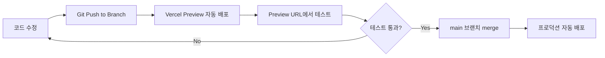

# 🚀 프로덕션 안전 배포 전략

**작성일**: 2025-10-01
**목적**: 개발서버에서는 되는데 프로덕션에서 안 되는 문제 근본적 해결

---

## 🎯 핵심 문제

**"개발서버에서는 되는데 프로덕션에서 안 되는 문제"의 근본 원인**
1. 환경변수 불일치
2. DB 스키마 불일치 (개발 DB ≠ 프로덕션 DB)
3. 빌드 타임 오류 미탐지
4. 캐시 문제

---

## ✅ 근본적 해결 방안

### 1️⃣ **Vercel Preview Deployment 활용** (가장 중요!)



**설정 방법**:
```bash
# 1. 새 브랜치에서 작업
git checkout -b feature/coupon-system

# 2. 작업 완료 후 커밋
git add .
git commit -m "feat: 쿠폰 시스템 구현"

# 3. 푸시하면 자동으로 Preview 배포
git push origin feature/coupon-system

# 4. Vercel이 자동으로 Preview URL 생성
# 예: https://live-commerce-abc123.vercel.app

# 5. Preview에서 테스트 완료 후 main에 merge
git checkout main
git merge feature/coupon-system
git push origin main  # 프로덕션 배포
```

---

### 2️⃣ **환경변수 완전 분리**

**현재 문제점**: 개발/프로덕션 환경변수 혼용

**근본 해결**:
```bash
# .env.local (개발용 - Git에 올리지 않음)
NEXT_PUBLIC_SUPABASE_URL=https://dev-project.supabase.co
NEXT_PUBLIC_SUPABASE_ANON_KEY=dev_key_here
NEXT_PUBLIC_KAKAO_CLIENT_ID=dev_kakao_id

# Vercel 프로덕션 환경변수 (Vercel 대시보드에서 설정)
NEXT_PUBLIC_SUPABASE_URL=https://prod-project.supabase.co
NEXT_PUBLIC_SUPABASE_ANON_KEY=prod_key_here
NEXT_PUBLIC_KAKAO_CLIENT_ID=prod_kakao_id
```

**Vercel 환경변수 설정**:
1. Vercel 대시보드 → 프로젝트 선택
2. Settings → Environment Variables
3. Production / Preview / Development 별도 설정

---

### 3️⃣ **DB 스키마 동기화 시스템** (매우 중요!)

**현재 문제**: 개발 DB와 프로덕션 DB 스키마 불일치

**근본 해결 - Migration 시스템 구축**:

```sql
-- /supabase/migrations/001_add_shipping_zones.sql
-- 파일명에 순서 번호 포함

CREATE TABLE IF NOT EXISTS shipping_zones (
  id UUID PRIMARY KEY DEFAULT gen_random_uuid(),
  zone_name TEXT NOT NULL,
  shipping_fee INTEGER NOT NULL,
  created_at TIMESTAMPTZ DEFAULT NOW()
);

-- Rollback 스크립트도 함께 작성
-- DROP TABLE IF EXISTS shipping_zones;
```

**Migration 적용 프로세스**:
```bash
# 1. 개발 DB에 먼저 적용 (Supabase 대시보드)
# SQL Editor에서 실행 → 테스트

# 2. 개발서버에서 충분히 테스트

# 3. Preview 배포로 실제 환경 테스트

# 4. 프로덕션 DB에 적용 (배포 직전)
# 프로덕션 Supabase SQL Editor에서 동일한 SQL 실행

# 5. 코드 배포 (main 브랜치 merge)
```

**Migration 체크리스트**:
```markdown
## 배포 전 체크리스트
- [ ] 개발 DB에 Migration 적용 완료
- [ ] 개발서버에서 테스트 통과
- [ ] Preview 배포로 실제 환경 테스트 통과
- [ ] 프로덕션 DB에 Migration 적용 완료
- [ ] Rollback 스크립트 준비 완료
- [ ] main 브랜치에 merge 및 배포
```

---

### 4️⃣ **빌드 타임 체크 강화**

**현재**: 빌드 경고를 무시하고 배포

**근본 해결**:
```json
// package.json
{
  "scripts": {
    "dev": "next dev",
    "build": "next build",
    "start": "next start",
    "lint": "next lint --max-warnings 0",
    "typecheck": "tsc --noEmit",
    "test": "npm run lint && npm run typecheck && npm run build"
  }
}
```

**배포 전 로컬 검사**:
```bash
# 배포 전 반드시 실행
npm run test

# 통과해야만 배포
git push origin main
```

---

### 5️⃣ **Vercel 배포 설정 강화**

**Vercel 대시보드 설정**:
```
Settings → Git → Ignored Build Step

# 빌드 실패 시 배포 중단
Build Command: npm run build
Output Directory: .next

# 환경변수 누락 시 빌드 실패하도록
Settings → Environment Variables
✅ NEXT_PUBLIC_SUPABASE_URL (Required)
✅ NEXT_PUBLIC_SUPABASE_ANON_KEY (Required)
```

---

### 6️⃣ **캐시 무효화 전략**

**프로덕션 배포 후 캐시 문제 해결**:

```javascript
// next.config.js
module.exports = {
  // 빌드마다 고유 ID 생성
  generateBuildId: async () => {
    return `build-${Date.now()}`
  },

  // 캐시 헤더 설정
  async headers() {
    return [
      {
        source: '/:path*',
        headers: [
          {
            key: 'Cache-Control',
            value: 'public, max-age=0, must-revalidate',
          },
        ],
      },
    ]
  },
}
```

---

## 📋 실제 배포 워크플로우 (권장)

### **시나리오: 쿠폰 시스템 추가**

```bash
# 1. 새 브랜치 생성
git checkout -b feature/coupon-system

# 2. DB Migration 작성
# /supabase/migrations/005_add_coupons.sql 생성

# 3. 개발 DB에 Migration 적용
# Supabase Dev Dashboard → SQL Editor → Migration 실행

# 4. 코드 작업
# 쿠폰 관리 페이지, API 등 구현

# 5. 로컬 테스트
npm run dev
# 개발서버에서 충분히 테스트

# 6. 빌드 테스트
npm run build
npm run start
# 프로덕션 모드로 로컬 테스트

# 7. 커밋 & 푸시
git add .
git commit -m "feat: 쿠폰 시스템 구현"
git push origin feature/coupon-system

# 8. Vercel Preview 배포 (자동)
# Vercel이 자동으로 Preview URL 생성
# https://live-commerce-pr-123.vercel.app

# 9. Preview에서 실제 환경 테스트
# - 실제 프로덕션 환경변수 사용
# - 실제와 동일한 조건에서 테스트

# 10. 프로덕션 DB Migration 적용
# Supabase Production Dashboard → SQL Editor → Migration 실행

# 11. main 브랜치에 merge
git checkout main
git merge feature/coupon-system
git push origin main

# 12. 프로덕션 자동 배포 (Vercel)

# 13. 배포 후 확인
# - 프로덕션 사이트 접속
# - 주요 기능 동작 확인
# - 에러 로그 확인 (Vercel Dashboard)
```

---

## 🛡️ 안전장치 추가 (선택사항)

### **Vercel Protection 설정**
```
Settings → Deployment Protection

✅ Password Protection for Preview Deployments
✅ Vercel Authentication for Production
```

### **에러 모니터링**
```bash
# Vercel 자체 로그 + Sentry 연동 (선택)
npm install @sentry/nextjs

# 프로덕션 에러 실시간 알림
```

---

## 📊 요약: 개발→프로덕션 안전 배포

| 단계 | 도구 | 목적 |
|------|------|------|
| 1. 브랜치 작업 | Git Branch | 격리된 환경 |
| 2. DB Migration | Supabase SQL | 스키마 동기화 |
| 3. 로컬 테스트 | npm run dev | 기능 검증 |
| 4. 빌드 테스트 | npm run build | 빌드 에러 탐지 |
| 5. Preview 배포 | Vercel Preview | 실제 환경 테스트 |
| 6. 프로덕션 Migration | Supabase Prod | DB 준비 |
| 7. 프로덕션 배포 | main merge | 자동 배포 |

---

## 🎯 구축 필요 작업 (나중에)

1. **Vercel Preview Deployment 활성화 확인**
2. **환경변수 Production/Preview 분리**
3. **Migration 파일 정리** (`/supabase/migrations/` 폴더)
4. **배포 체크리스트 문서화**
5. **package.json 스크립트 강화**
6. **next.config.js 캐시 설정**

---

*최종 업데이트: 2025-10-01*
*상태: 구현 대기 (나중에 필요 시)*
