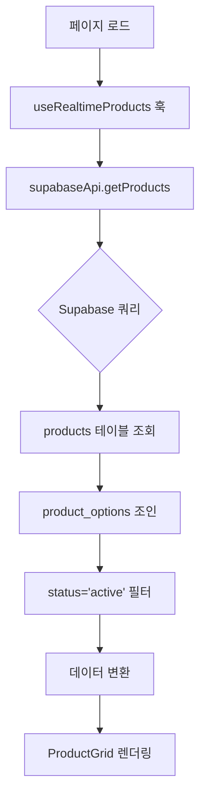
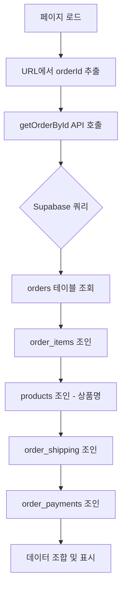
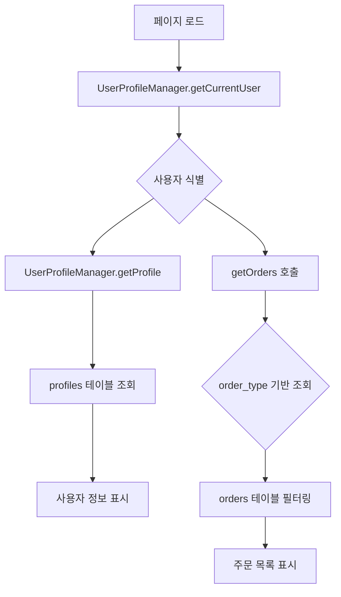
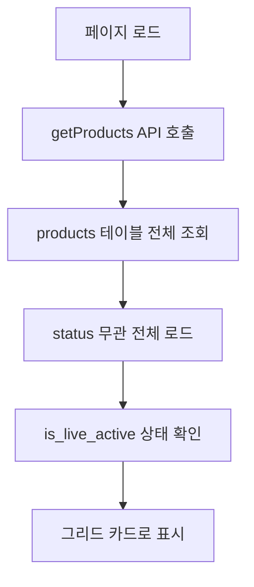
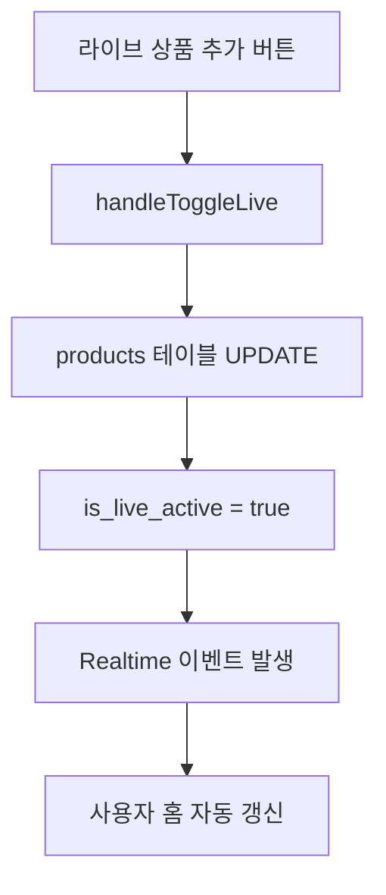
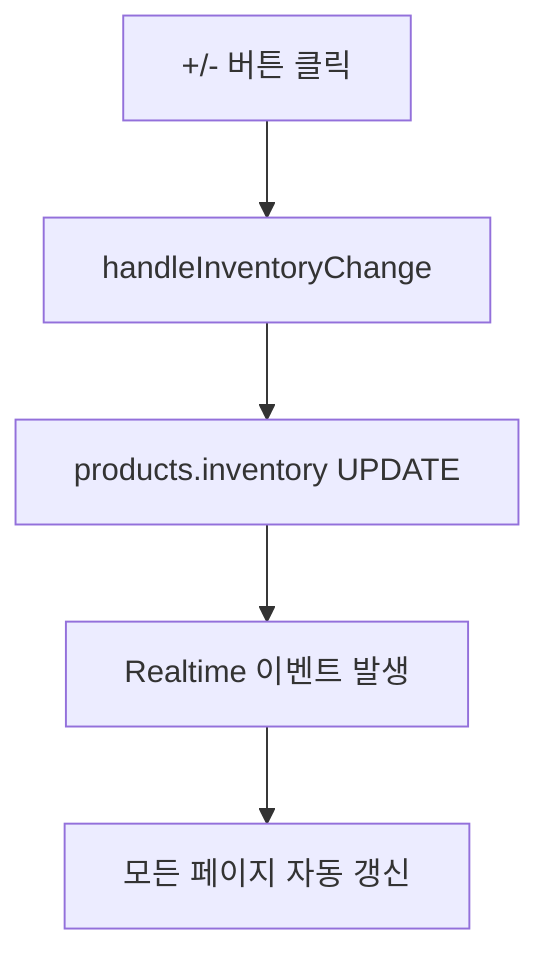
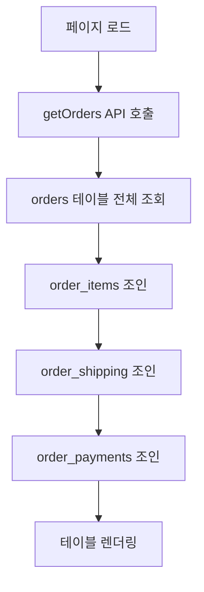
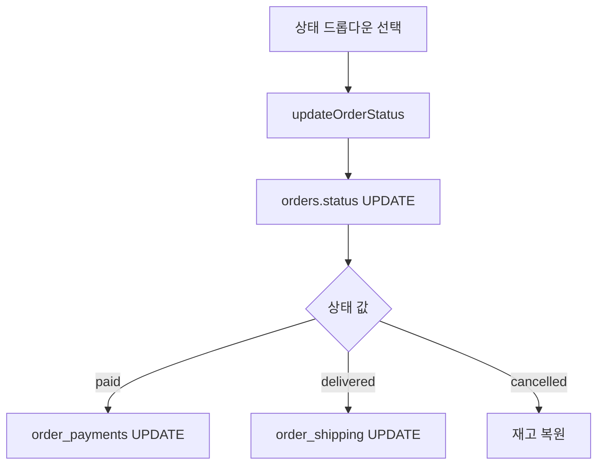
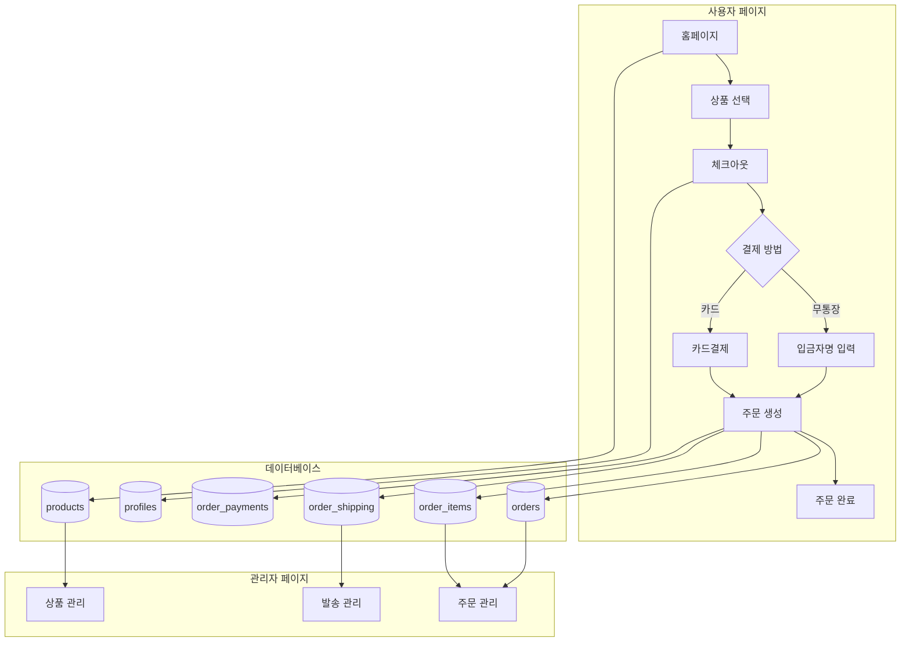

# 📊 Live Commerce 시스템 상세 데이터 흐름 문서

**작성일**: 2025-10-01
**최종 검증**: 실제 프로덕션 코드 기반
**목적**: 각 페이지/기능별 정확한 데이터 흐름 및 DB 매핑 문서화

---

## 🎯 문서 개요

이 문서는 **실제 프로덕션 코드를 기반**으로 작성되었습니다.
- 실제 Supabase DB 스키마 (`supabase_schema.sql`) 기준
- 실제 페이지/컴포넌트 코드 분석
- 실제 API 엔드포인트 동작 검증

---

## 🗄️ 실제 프로덕션 DB 스키마 요약

### 핵심 테이블 구조

#### 1. profiles (사용자 프로필)
```sql
CREATE TABLE profiles (
    id UUID REFERENCES auth.users(id) PRIMARY KEY,
    email VARCHAR(255),
    name VARCHAR(255),
    nickname VARCHAR(100),
    phone VARCHAR(20),
    address TEXT,
    detail_address TEXT,
    is_admin BOOLEAN DEFAULT false,
    points INTEGER DEFAULT 0,
    created_at TIMESTAMPTZ,
    updated_at TIMESTAMPTZ
)
```

#### 2. products (상품)
```sql
CREATE TABLE products (
    id UUID PRIMARY KEY,
    title VARCHAR(255) NOT NULL,
    description TEXT,
    price DECIMAL(10, 2) NOT NULL,
    compare_price DECIMAL(10, 2),
    discount_rate INTEGER DEFAULT 0,
    thumbnail_url TEXT,
    images JSONB DEFAULT '[]',
    category VARCHAR(100),
    sub_category VARCHAR(100),
    tags TEXT[],
    inventory INTEGER DEFAULT 0,
    is_visible BOOLEAN DEFAULT true,
    is_featured BOOLEAN DEFAULT false,
    -- 라이브 방송 관련 (최근 추가됨)
    is_live_active BOOLEAN DEFAULT FALSE,
    live_priority INTEGER DEFAULT 0,
    live_start_time TIMESTAMPTZ,
    live_end_time TIMESTAMPTZ,
    category_id UUID REFERENCES categories(id),
    status TEXT DEFAULT 'active', -- active/draft/archived
    created_at TIMESTAMPTZ,
    updated_at TIMESTAMPTZ
)
```

#### 3. orders (주문)
```sql
CREATE TABLE orders (
    id UUID PRIMARY KEY,
    customer_order_number VARCHAR(50) UNIQUE, -- S241231-XXXX 형식
    user_id UUID REFERENCES auth.users(id),   -- NULL 가능 (카카오 사용자)
    status VARCHAR(20) DEFAULT 'pending',     -- pending/verifying/paid/delivered/cancelled
    order_type VARCHAR(20) DEFAULT 'direct',  -- direct, cart, direct:KAKAO:{kakao_id}
    total_amount DECIMAL(10, 2),
    created_at TIMESTAMPTZ,
    updated_at TIMESTAMPTZ
)
```

#### 4. order_items (주문 상품)
```sql
CREATE TABLE order_items (
    id UUID PRIMARY KEY,
    order_id UUID REFERENCES orders(id) ON DELETE CASCADE,
    product_id UUID REFERENCES products(id),
    quantity INTEGER NOT NULL DEFAULT 1,
    unit_price DECIMAL(10, 2),           -- ⚠️ 중요: price가 아닌 unit_price
    total_price DECIMAL(10, 2) NOT NULL,
    selected_options JSONB DEFAULT '{}',
    created_at TIMESTAMPTZ
    -- ⚠️ 중요: title 컬럼 없음 (products 테이블 조인 필요)
)
```

#### 5. order_shipping (배송 정보)
```sql
CREATE TABLE order_shipping (
    id UUID PRIMARY KEY,
    order_id UUID REFERENCES orders(id) ON DELETE CASCADE,
    name VARCHAR(100) NOT NULL,
    phone VARCHAR(20) NOT NULL,
    address TEXT NOT NULL,
    detail_address TEXT,
    postal_code VARCHAR(10),
    memo TEXT,
    shipping_fee DECIMAL(10, 2) DEFAULT 4000,
    shipping_method VARCHAR(50) DEFAULT 'standard',
    tracking_number VARCHAR(100),
    shipped_at TIMESTAMPTZ,
    delivered_at TIMESTAMPTZ,
    created_at TIMESTAMPTZ
)
```

#### 6. order_payments (결제 정보)
```sql
CREATE TABLE order_payments (
    id UUID PRIMARY KEY,
    order_id UUID REFERENCES orders(id) ON DELETE CASCADE,
    method VARCHAR(50) NOT NULL,         -- bank_transfer, card, kakao
    amount DECIMAL(10, 2) NOT NULL,
    status VARCHAR(20) DEFAULT 'pending', -- pending/completed/failed/cancelled
    transaction_id VARCHAR(100),
    paid_at TIMESTAMPTZ,
    bank_name VARCHAR(50),
    account_number VARCHAR(50),
    depositor_name VARCHAR(100),         -- ⚠️ 무통장 입금자명 (매우 중요)
    created_at TIMESTAMPTZ
)
```

---

## 🔄 페이지별 상세 데이터 흐름

### 1. 🏠 홈페이지 (`/app/page.js`)

#### 📥 데이터 로드 흐름


#### 실제 코드 흐름
```javascript
// 1. 훅 호출
const { products, loading, error } = useRealtimeProducts()

// 2. supabaseApi.getProducts() 실행
const { data, error } = await supabase
  .from('products')
  .select(`
    *,
    product_options (id, name, values)
  `)
  .eq('status', 'active')
  .order('created_at', { ascending: false })

// 3. 데이터 변환
const productsWithOptions = data.map(product => ({
  ...product,
  options: product.product_options || [],
  isLive: product.is_live_active || false
}))
```

#### 사용되는 DB 컬럼
- `products.*` (모든 컬럼)
- `product_options.id, name, values`
- 필터: `status = 'active'`
- 정렬: `created_at DESC`

#### 실시간 업데이트
```javascript
// useRealtimeProducts 훅에서 Realtime 구독
const subscription = supabase
  .channel('products-channel')
  .on('postgres_changes', {
    event: '*',
    schema: 'public',
    table: 'products'
  }, payload => {
    // 재고 변경 시 자동 갱신
    refreshProducts()
  })
  .subscribe()
```

---

### 2. 💳 체크아웃 페이지 (`/app/checkout/page.js`)

#### 📥 데이터 로드 흐름
```mermaid
graph TD
    A[페이지 로드] --> B[세션 데이터 확인]
    B --> C{카카오 세션?}
    C -->|Yes| D[sessionStorage.getItem('user')]
    C -->|No| E[useAuth 훅으로 Supabase Auth]
    D --> F[UserProfileManager.getProfile]
    E --> F
    F --> G[사용자 프로필 로드]
    G --> H[주문 상품 정보 복원]
    H --> I[폼 초기화 완료]
```

#### 실제 코드 흐름
```javascript
// 1. 세션 데이터 로드
const storedUser = sessionStorage.getItem('user')
let sessionUser = null
if (storedUser) {
  sessionUser = JSON.parse(storedUser)
  setUserSession(sessionUser)
}

// 2. 사용자 프로필 로드 (병렬 처리)
const currentUser = await UserProfileManager.getCurrentUser()
if (!currentUser) {
  throw new Error('사용자 정보를 찾을 수 없습니다')
}

// 3. 프로필 데이터 로드
const profileData = await UserProfileManager.getProfile(currentUser)
setUserProfile(profileData)

// 4. 주문 상품 정보 복원
const storedOrderItem = sessionStorage.getItem('orderItem')
if (storedOrderItem) {
  const item = JSON.parse(storedOrderItem)
  setOrderItem(item)
}
```

#### 📤 주문 생성 흐름 (무통장 입금)
```mermaid
graph TD
    A[입금자명 + 배송지 입력] --> B[handleDepositOrder]
    B --> C[입력값 검증]
    C --> D{검증 통과?}
    D -->|No| E[에러 메시지 표시]
    D -->|Yes| F[createOrder API 호출]
    F --> G[/lib/supabaseApi.js]
    G --> H[orders 테이블 INSERT]
    H --> I[order_items 테이블 INSERT]
    I --> J[order_shipping 테이블 INSERT]
    J --> K[order_payments 테이블 INSERT]
    K --> L{모두 성공?}
    L -->|Yes| M[주문 완료 페이지 이동]
    L -->|No| N[트랜잭션 롤백]
```

#### 실제 createOrder 코드 흐름
```javascript
// /lib/supabaseApi.js - createOrder 함수

// 1. 사용자 식별 (UserProfileManager 사용)
const user = await UserProfileManager.getCurrentUser()
const userProfile = await UserProfileManager.getProfile(user)

// 2. order_type 결정
let order_type = orderData.orderType || 'direct'
if (user.kakao_id) {
  order_type = `${orderData.orderType || 'direct'}:KAKAO:${user.kakao_id}`
}

// 3. orders 테이블 INSERT
const { data: order, error: orderError } = await supabase
  .from('orders')
  .insert({
    id: orderId,
    customer_order_number: customerOrderNumber,
    user_id: user.id || null,
    status: 'pending', // 무통장 입금은 pending
    order_type: order_type,
    total_amount: totalAmount
  })
  .select()
  .single()

// 4. order_items 테이블 INSERT
const { error: itemsError } = await supabase
  .from('order_items')
  .insert(orderData.items.map(item => ({
    order_id: orderId,
    product_id: item.id,
    quantity: item.quantity,
    unit_price: item.price,              // ⚠️ unit_price 사용
    total_price: item.price * item.quantity,
    selected_options: item.options || {}
  })))

// 5. order_shipping 테이블 INSERT
const { error: shippingError } = await supabase
  .from('order_shipping')
  .insert({
    order_id: orderId,
    name: userProfile.name,
    phone: userProfile.phone,
    address: userProfile.address,
    detail_address: userProfile.detail_address,
    shipping_fee: 4000
  })

// 6. order_payments 테이블 INSERT
const { error: paymentError } = await supabase
  .from('order_payments')
  .insert({
    order_id: orderId,
    method: 'bank_transfer',
    amount: totalAmount,
    status: 'pending',
    depositor_name: orderData.depositName  // ⚠️ 입금자명 저장
  })

// 7. 재고 차감
const { error: inventoryError } = await supabase.rpc('decrease_inventory', {
  product_id: item.id,
  quantity: item.quantity
})
```

#### 사용되는 DB 컬럼 (INSERT)
**orders:**
- `id, customer_order_number, user_id, status, order_type, total_amount`

**order_items:**
- `order_id, product_id, quantity, unit_price, total_price, selected_options`

**order_shipping:**
- `order_id, name, phone, address, detail_address, shipping_fee`

**order_payments:**
- `order_id, method, amount, status, depositor_name`

---

### 3. 📋 주문 완료 페이지 (`/app/orders/[id]/complete/page.js`)

#### 📥 데이터 로드 흐름


#### 실제 코드 흐름
```javascript
// /lib/supabaseApi.js - getOrderById

const { data, error } = await supabase
  .from('orders')
  .select(`
    *,
    order_items (
      *,
      products (
        id,
        title,
        thumbnail_url
      )
    ),
    order_shipping (*),
    order_payments (*)
  `)
  .eq('id', orderId)
  .single()

// 데이터 변환
return {
  ...data,
  items: data.order_items.map(item => ({
    ...item,
    title: item.products?.title,          // ⚠️ 조인으로 상품명 가져옴
    thumbnail_url: item.products?.thumbnail_url,
    price: item.unit_price,               // ⚠️ unit_price 사용
    totalPrice: item.total_price
  })),
  shipping: data.order_shipping?.[0],
  payment: getBestPayment(data.order_payments)  // ⚠️ 최적 결제 정보 선택
}
```

#### getBestPayment 로직 (중요!)
```javascript
// 입금자명이 있는 결제 우선 선택
const getBestPayment = (payments) => {
  // 1. depositor_name이 있는 결제 우선
  const paymentWithDepositor = payments.find(p => p.depositor_name)
  if (paymentWithDepositor) return paymentWithDepositor

  // 2. 카드 결제 우선
  const cardPayment = payments.find(p => p.method === 'card')
  if (cardPayment) return cardPayment

  // 3. 가장 최근 결제
  return payments.sort((a, b) =>
    new Date(b.created_at) - new Date(a.created_at)
  )[0]
}
```

#### 화면 표시 계산 로직
```javascript
// 총 상품금액 계산 (모든 상품 합계)
const correctTotalProductAmount = orderData.items.reduce((sum, item) => {
  const itemTotal = item.totalPrice || (item.price * item.quantity)
  return sum + itemTotal
}, 0)

// 입금금액 = 상품금액 + 배송비
const shippingFee = 4000
const correctTotalAmount = correctTotalProductAmount + shippingFee

// 입금자명 우선순위
const depositorName =
  orderData.payment?.depositor_name ||  // 1순위: payment 테이블
  orderData.depositName ||              // 2순위: 주문 시 입력값
  orderData.shipping?.name ||           // 3순위: 수령인명
  '입금자명 확인 필요'
```

---

### 4. 👤 마이페이지 (`/app/mypage/page.js`)

#### 📥 데이터 로드 흐름


#### 실제 사용자 식별 로직 (UserProfileManager)
```javascript
// /lib/userProfileManager.js

// 1. 현재 사용자 식별
static async getCurrentUser() {
  // 카카오 사용자 확인
  const storedUser = sessionStorage.getItem('user')
  if (storedUser) {
    const userData = JSON.parse(storedUser)
    if (userData.kakao_id) {
      return {
        id: userData.id,
        kakao_id: userData.kakao_id,
        provider: 'kakao'
      }
    }
  }

  // Supabase Auth 사용자 확인
  const { data: { session } } = await supabase.auth.getSession()
  if (session?.user) {
    return {
      id: session.user.id,
      email: session.user.email,
      provider: 'supabase'
    }
  }

  return null
}

// 2. 프로필 조회
static async getProfile(currentUser) {
  if (currentUser.kakao_id) {
    // 카카오 사용자: kakao_users 테이블에서 조회
    const { data } = await supabase
      .from('kakao_users')
      .select('*')
      .eq('kakao_id', currentUser.kakao_id)
      .single()
    return data
  } else {
    // Supabase 사용자: profiles 테이블에서 조회
    const { data } = await supabase
      .from('profiles')
      .select('*')
      .eq('id', currentUser.id)
      .single()
    return data
  }
}
```

#### 주문 조회 로직 (order_type 기반)
```javascript
// /lib/supabaseApi.js - getOrders

const userQuery = UserProfileManager.getUserQuery(currentUser)

// 기본 쿼리
let query = supabase
  .from('orders')
  .select(`
    *,
    order_items (*),
    order_shipping (*),
    order_payments (*)
  `)

// order_type 기반 필터링
if (userQuery.column === 'order_type') {
  query = query.eq('order_type', userQuery.value)

  // ⚠️ 하위 호환성: 기존 주문도 조회 가능하도록
  if (data.length === 0 && userQuery.alternativeQueries) {
    for (const altQuery of userQuery.alternativeQueries) {
      const { data: altData } = await supabase
        .from('orders')
        .select('*')
        .eq(altQuery.column, altQuery.value)

      if (altData && altData.length > 0) {
        data = altData
        break
      }
    }
  }
} else {
  query = query.eq(userQuery.column, userQuery.value)
}

const { data, error } = await query.order('created_at', { ascending: false })
```

---

### 5. 🛠️ 관리자 - 실시간 방송 컨트롤 (`/app/admin/products/page.js`)

#### 📥 데이터 로드 흐름


#### 실제 코드 흐름
```javascript
// 관리자는 모든 상품 조회 (status 필터 없음)
const { data, error } = await supabase
  .from('products')
  .select(`
    *,
    product_options (id, name, values)
  `)
  .order('created_at', { ascending: false })

// 라이브 활성 상태 표시
{product.is_live_active ? (
  <span className="text-red-500">LIVE 중</span>
) : (
  <button>라이브 상품 추가</button>
)}
```

#### 📤 라이브 상태 변경 흐름


#### 재고 관리 흐름


---

### 6. 📦 관리자 - 주문 관리 (`/app/admin/orders/page.js`)

#### 📥 데이터 로드 흐름


#### 실제 코드 흐름
```javascript
// 관리자는 모든 주문 조회 (user_id 필터 없음)
const { data, error } = await supabase
  .from('orders')
  .select(`
    *,
    order_items (
      *,
      products (title, thumbnail_url)
    ),
    order_shipping (*),
    order_payments (*)
  `)
  .order('created_at', { ascending: false })

// 데이터 변환
const orders = data.map(order => ({
  ...order,
  items: order.order_items,
  shipping: order.order_shipping?.[0],
  payment: getBestPayment(order.order_payments),
  depositorName: getBestPayment(order.order_payments)?.depositor_name
}))
```

#### 📤 주문 상태 변경 흐름


---

## 🔌 주요 API 엔드포인트 상세

### 1. POST `/api/create-order-card` (카드 결제 주문)

#### 요청 데이터
```javascript
{
  userId: "uuid",
  userProfile: {
    name: "홍길동",
    phone: "010-1234-5678",
    address: "서울시 강남구...",
    detail_address: "101동 101호"
  },
  orderData: {
    id: "product_uuid",
    title: "상품명",
    price: 10000,
    quantity: 2,
    totalPrice: 24000, // 상품금액 + 배송비
    orderType: "direct"
  }
}
```

#### 처리 흐름
```javascript
// 1. 사용자 존재 확인 및 생성
const { data: existingUser } = await supabase
  .from('users')
  .select('id')
  .eq('id', userId)
  .single()

if (!existingUser) {
  await supabase.from('users').insert([{
    id: userId,
    name: userProfile.name,
    phone: userProfile.phone
  }])
}

// 2. 주문 생성 (REST API 직접 호출 - RLS 우회)
const orderResponse = await fetch(`${supabaseUrl}/rest/v1/orders`, {
  method: 'POST',
  headers: {
    'apikey': supabaseKey,
    'Authorization': `Bearer ${supabaseKey}`,
    'Content-Type': 'application/json'
  },
  body: JSON.stringify({
    id: orderId,
    customer_order_number: customerOrderNumber,
    user_id: validUserId,
    status: 'verifying', // ⚠️ 카드결제는 바로 확인중
    order_type: orderData.orderType,
    total_amount: orderData.totalPrice
  })
})

// 3. order_items INSERT
await fetch(`${supabaseUrl}/rest/v1/order_items`, {
  method: 'POST',
  body: JSON.stringify({
    order_id: orderId,
    product_id: orderData.id,
    quantity: orderData.quantity,
    unit_price: orderData.price,
    total_price: orderData.price * orderData.quantity
  })
})

// 4. order_shipping INSERT
await fetch(`${supabaseUrl}/rest/v1/order_shipping`, {
  method: 'POST',
  body: JSON.stringify({
    order_id: orderId,
    name: userProfile.name,
    phone: userProfile.phone,
    address: userProfile.address,
    detail_address: userProfile.detail_address,
    shipping_fee: 4000
  })
})

// 5. order_payments INSERT
await fetch(`${supabaseUrl}/rest/v1/order_payments`, {
  method: 'POST',
  body: JSON.stringify({
    order_id: orderId,
    method: 'card',
    amount: orderData.totalPrice,
    status: 'completed', // ⚠️ 카드는 바로 완료
    transaction_id: `card_${Date.now()}`
  })
})

// 6. 재고 차감
await fetch(`${supabaseUrl}/rest/v1/rpc/decrease_inventory`, {
  method: 'POST',
  body: JSON.stringify({
    product_id: orderData.id,
    quantity: orderData.quantity
  })
})
```

#### 응답 데이터
```javascript
{
  success: true,
  orderId: "uuid",
  customerOrderNumber: "S250101-ABCD"
}
```

---

### 2. POST `/lib/supabaseApi.js - createOrder` (무통장 입금 주문)

#### 처리 흐름
```javascript
// UserProfileManager 기반 사용자 식별
const user = await UserProfileManager.getCurrentUser()
const userProfile = await UserProfileManager.getProfile(user)

// order_type 결정
let order_type = orderData.orderType || 'direct'
if (user.kakao_id) {
  order_type = `${orderData.orderType || 'direct'}:KAKAO:${user.kakao_id}`
}

// orders INSERT
const { data: order } = await supabase
  .from('orders')
  .insert({
    id: orderId,
    customer_order_number: customerOrderNumber,
    user_id: user.id || null,
    status: 'pending', // ⚠️ 무통장은 pending
    order_type: order_type,
    total_amount: totalAmount
  })
  .select()
  .single()

// order_payments INSERT (입금자명 포함)
await supabase
  .from('order_payments')
  .insert({
    order_id: orderId,
    method: 'bank_transfer',
    amount: totalAmount,
    status: 'pending',
    depositor_name: orderData.depositName // ⚠️ 입금자명
  })
```

---

## 🔄 데이터 흐름 다이어그램 (전체 시스템)



---

## ⚠️ 중요 주의사항 (트러블슈팅 가이드)

### 1. order_items 테이블 컬럼 이름
```javascript
// ❌ 잘못된 코드
const price = item.price

// ✅ 올바른 코드
const price = item.unit_price
```

### 2. 상품명은 조인 필요
```javascript
// ❌ 잘못된 코드
const title = orderItem.title

// ✅ 올바른 코드
const { data } = await supabase
  .from('order_items')
  .select(`
    *,
    products (title, thumbnail_url)
  `)
```

### 3. 입금자명 우선순위
```javascript
// ✅ 올바른 우선순위
const depositorName =
  payment?.depositor_name ||    // 1순위: order_payments 테이블
  order.depositName ||          // 2순위: 주문 생성 시 입력
  shipping?.name ||             // 3순위: 수령인명
  '입금자명 확인 필요'
```

### 4. order_type 기반 사용자 주문 조회
```javascript
// ✅ 카카오 사용자
const order_type = `direct:KAKAO:${kakao_id}`

// ✅ Supabase 사용자
const order_type = 'direct' // user_id 기반 조회 가능
```

### 5. 하위 호환성 유지
```javascript
// 기존 데이터: order_type = "direct:KAKAO:{uuid}"
// 새로운 데이터: order_type = "direct:KAKAO:{kakao_id}"
// ⚠️ 둘 다 조회 가능하도록 alternativeQueries 사용
```

---

## 📝 문서 버전 정보

**버전**: 1.0
**최종 업데이트**: 2025-10-01
**검증 상태**: ✅ 실제 프로덕션 코드 기반 검증 완료
**작성자**: Claude Code

---

## 🔗 관련 문서

- `WORK_LOG_2025-10-01.md` - 오늘의 작업 내역
- `SYSTEM_ARCHITECTURE_PRODUCTION.md` - 시스템 아키텍처
- `DATA_ARCHITECTURE.md` - 데이터 아키텍처
- `CLAUDE.md` - 개발 가이드라인
- `supabase_schema.sql` - 실제 DB 스키마
