# 📊 Live Commerce 시스템 상세 데이터 흐름 문서

**작성일**: 2025-10-01
**최종 업데이트**: 2025-10-03
**최종 검증**: 실제 프로덕션 코드 기반
**목적**: 각 페이지/기능별 정확한 데이터 흐름 및 DB 매핑 문서화

---

## 🎯 문서 개요

이 문서는 **실제 프로덕션 코드를 기반**으로 작성되었습니다.
- 실제 Supabase DB 스키마 (`supabase_schema.sql`) 기준
- 실제 페이지/컴포넌트 코드 분석
- 실제 API 엔드포인트 동작 검증

---

## 🗄️ 실제 프로덕션 DB 스키마 요약

### 핵심 테이블 구조

#### 1. profiles (사용자 프로필)
```sql
CREATE TABLE profiles (
    id UUID REFERENCES auth.users(id) PRIMARY KEY,
    email VARCHAR(255),
    name VARCHAR(255),
    nickname VARCHAR(100),
    phone VARCHAR(20),
    address TEXT,
    detail_address TEXT,
    is_admin BOOLEAN DEFAULT false,
    points INTEGER DEFAULT 0,
    created_at TIMESTAMPTZ,
    updated_at TIMESTAMPTZ
)
```

#### 2. products (상품)
```sql
CREATE TABLE products (
    id UUID PRIMARY KEY,
    title VARCHAR(255) NOT NULL,
    description TEXT,
    price DECIMAL(10, 2) NOT NULL,
    compare_price DECIMAL(10, 2),
    discount_rate INTEGER DEFAULT 0,
    thumbnail_url TEXT,
    images JSONB DEFAULT '[]',
    category VARCHAR(100),
    sub_category VARCHAR(100),
    tags TEXT[],
    inventory INTEGER DEFAULT 0,
    is_visible BOOLEAN DEFAULT true,
    is_featured BOOLEAN DEFAULT false,
    -- 라이브 방송 관련 (최근 추가됨)
    is_live_active BOOLEAN DEFAULT FALSE,
    live_priority INTEGER DEFAULT 0,
    live_start_time TIMESTAMPTZ,
    live_end_time TIMESTAMPTZ,
    category_id UUID REFERENCES categories(id),
    status TEXT DEFAULT 'active', -- active/draft/archived
    created_at TIMESTAMPTZ,
    updated_at TIMESTAMPTZ
)
```

#### 3. orders (주문)
```sql
CREATE TABLE orders (
    id UUID PRIMARY KEY,
    customer_order_number VARCHAR(50) UNIQUE, -- S241231-XXXX 형식
    user_id UUID REFERENCES auth.users(id),   -- NULL 가능 (카카오 사용자)
    status VARCHAR(20) DEFAULT 'pending',     -- pending/verifying/paid/delivered/cancelled
    order_type VARCHAR(20) DEFAULT 'direct',  -- direct, cart, direct:KAKAO:{kakao_id}
    total_amount DECIMAL(10, 2),
    created_at TIMESTAMPTZ,
    updated_at TIMESTAMPTZ
)
```

#### 4. order_items (주문 상품)
```sql
CREATE TABLE order_items (
    id UUID PRIMARY KEY,
    order_id UUID REFERENCES orders(id) ON DELETE CASCADE,
    product_id UUID REFERENCES products(id),
    quantity INTEGER NOT NULL DEFAULT 1,
    unit_price DECIMAL(10, 2),           -- ⚠️ 중요: price가 아닌 unit_price
    total_price DECIMAL(10, 2) NOT NULL,
    selected_options JSONB DEFAULT '{}',
    created_at TIMESTAMPTZ
    -- ⚠️ 중요: title 컬럼 없음 (products 테이블 조인 필요)
)
```

#### 5. order_shipping (배송 정보)
```sql
CREATE TABLE order_shipping (
    id UUID PRIMARY KEY,
    order_id UUID REFERENCES orders(id) ON DELETE CASCADE,
    name VARCHAR(100) NOT NULL,
    phone VARCHAR(20) NOT NULL,
    address TEXT NOT NULL,
    detail_address TEXT,
    postal_code VARCHAR(10),
    memo TEXT,
    shipping_fee DECIMAL(10, 2) DEFAULT 4000,
    shipping_method VARCHAR(50) DEFAULT 'standard',
    tracking_number VARCHAR(100),
    shipped_at TIMESTAMPTZ,
    delivered_at TIMESTAMPTZ,
    created_at TIMESTAMPTZ
)
```

#### 6. order_payments (결제 정보)
```sql
CREATE TABLE order_payments (
    id UUID PRIMARY KEY,
    order_id UUID REFERENCES orders(id) ON DELETE CASCADE,
    method VARCHAR(50) NOT NULL,         -- bank_transfer, card, kakao
    amount DECIMAL(10, 2) NOT NULL,
    status VARCHAR(20) DEFAULT 'pending', -- pending/completed/failed/cancelled
    transaction_id VARCHAR(100),
    paid_at TIMESTAMPTZ,
    bank_name VARCHAR(50),
    account_number VARCHAR(50),
    depositor_name VARCHAR(100),         -- ⚠️ 무통장 입금자명 (매우 중요)
    created_at TIMESTAMPTZ
)
```

---

## 🔄 페이지별 상세 데이터 흐름

### 1. 🏠 홈페이지 (`/app/page.js`)

#### 📥 데이터 로드 흐름
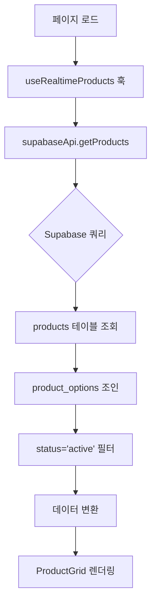

#### 실제 코드 흐름
```javascript
// 1. 훅 호출
const { products, loading, error } = useRealtimeProducts()

// 2. supabaseApi.getProducts() 실행
const { data, error } = await supabase
  .from('products')
  .select(`
    *,
    product_options (id, name, values)
  `)
  .eq('status', 'active')
  .order('created_at', { ascending: false })

// 3. 데이터 변환
const productsWithOptions = data.map(product => ({
  ...product,
  options: product.product_options || [],
  isLive: product.is_live_active || false
}))
```

#### 사용되는 DB 컬럼
- `products.*` (모든 컬럼)
- `product_options.id, name, values`
- 필터: `status = 'active'`
- 정렬: `created_at DESC`

#### 실시간 업데이트
```javascript
// useRealtimeProducts 훅에서 Realtime 구독
const subscription = supabase
  .channel('products-channel')
  .on('postgres_changes', {
    event: '*',
    schema: 'public',
    table: 'products'
  }, payload => {
    // 재고 변경 시 자동 갱신
    refreshProducts()
  })
  .subscribe()
```

---

### 2. 💳 체크아웃 페이지 (`/app/checkout/page.js`)

#### 📥 데이터 로드 흐름
```mermaid
graph TD
    A[페이지 로드] --> B[세션 데이터 확인]
    B --> C{카카오 세션?}
    C -->|Yes| D[sessionStorage.getItem('user')]
    C -->|No| E[useAuth 훅으로 Supabase Auth]
    D --> F[UserProfileManager.getProfile]
    E --> F
    F --> G[사용자 프로필 로드]
    G --> H[주문 상품 정보 복원]
    H --> I[폼 초기화 완료]
```

#### 실제 코드 흐름
```javascript
// 1. 세션 데이터 로드
const storedUser = sessionStorage.getItem('user')
let sessionUser = null
if (storedUser) {
  sessionUser = JSON.parse(storedUser)
  setUserSession(sessionUser)
}

// 2. 사용자 프로필 로드 (병렬 처리)
const currentUser = await UserProfileManager.getCurrentUser()
if (!currentUser) {
  throw new Error('사용자 정보를 찾을 수 없습니다')
}

// 3. 프로필 데이터 로드
const profileData = await UserProfileManager.getProfile(currentUser)
setUserProfile(profileData)

// 4. 주문 상품 정보 복원
const storedOrderItem = sessionStorage.getItem('orderItem')
if (storedOrderItem) {
  const item = JSON.parse(storedOrderItem)
  setOrderItem(item)
}
```

#### 📤 주문 생성 흐름 (무통장 입금)
```mermaid
graph TD
    A[입금자명 + 배송지 입력] --> B[handleDepositOrder]
    B --> C[입력값 검증]
    C --> D{검증 통과?}
    D -->|No| E[에러 메시지 표시]
    D -->|Yes| F[createOrder API 호출]
    F --> G[/lib/supabaseApi.js]
    G --> H[orders 테이블 INSERT]
    H --> I[order_items 테이블 INSERT]
    I --> J[order_shipping 테이블 INSERT]
    J --> K[order_payments 테이블 INSERT]
    K --> L{모두 성공?}
    L -->|Yes| M[주문 완료 페이지 이동]
    L -->|No| N[트랜잭션 롤백]
```

#### 실제 createOrder 코드 흐름
```javascript
// /lib/supabaseApi.js - createOrder 함수

// 1. 사용자 식별 (UserProfileManager 사용)
const user = await UserProfileManager.getCurrentUser()
const userProfile = await UserProfileManager.getProfile(user)

// 2. order_type 결정
let order_type = orderData.orderType || 'direct'
if (user.kakao_id) {
  order_type = `${orderData.orderType || 'direct'}:KAKAO:${user.kakao_id}`
}

// 3. orders 테이블 INSERT
const { data: order, error: orderError } = await supabase
  .from('orders')
  .insert({
    id: orderId,
    customer_order_number: customerOrderNumber,
    user_id: user.id || null,
    status: 'pending', // 무통장 입금은 pending
    order_type: order_type,
    total_amount: totalAmount
  })
  .select()
  .single()

// 4. order_items 테이블 INSERT
const { error: itemsError } = await supabase
  .from('order_items')
  .insert(orderData.items.map(item => ({
    order_id: orderId,
    product_id: item.id,
    quantity: item.quantity,
    unit_price: item.price,              // ⚠️ unit_price 사용
    total_price: item.price * item.quantity,
    selected_options: item.options || {}
  })))

// 5. order_shipping 테이블 INSERT
const { error: shippingError } = await supabase
  .from('order_shipping')
  .insert({
    order_id: orderId,
    name: userProfile.name,
    phone: userProfile.phone,
    address: userProfile.address,
    detail_address: userProfile.detail_address,
    shipping_fee: 4000
  })

// 6. order_payments 테이블 INSERT
const { error: paymentError } = await supabase
  .from('order_payments')
  .insert({
    order_id: orderId,
    method: 'bank_transfer',
    amount: totalAmount,
    status: 'pending',
    depositor_name: orderData.depositName  // ⚠️ 입금자명 저장
  })

// 7. 재고 차감
const { error: inventoryError } = await supabase.rpc('decrease_inventory', {
  product_id: item.id,
  quantity: item.quantity
})
```

#### 사용되는 DB 컬럼 (INSERT)
**orders:**
- `id, customer_order_number, user_id, status, order_type, total_amount`

**order_items:**
- `order_id, product_id, quantity, unit_price, total_price, selected_options`

**order_shipping:**
- `order_id, name, phone, address, detail_address, shipping_fee`

**order_payments:**
- `order_id, method, amount, status, depositor_name`

---

### 3. 📋 주문 완료 페이지 (`/app/orders/[id]/complete/page.js`)

#### 📥 데이터 로드 흐름
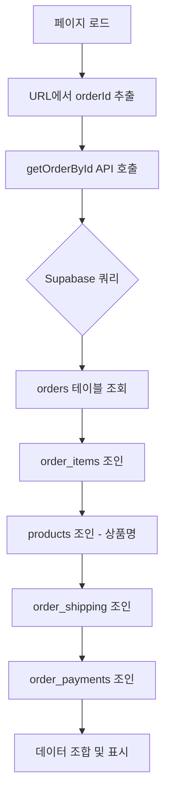

#### 실제 코드 흐름
```javascript
// /lib/supabaseApi.js - getOrderById

const { data, error } = await supabase
  .from('orders')
  .select(`
    *,
    order_items (
      *,
      products (
        id,
        title,
        thumbnail_url
      )
    ),
    order_shipping (*),
    order_payments (*)
  `)
  .eq('id', orderId)
  .single()

// 데이터 변환
return {
  ...data,
  items: data.order_items.map(item => ({
    ...item,
    title: item.products?.title,          // ⚠️ 조인으로 상품명 가져옴
    thumbnail_url: item.products?.thumbnail_url,
    price: item.unit_price,               // ⚠️ unit_price 사용
    totalPrice: item.total_price
  })),
  shipping: data.order_shipping?.[0],
  payment: getBestPayment(data.order_payments)  // ⚠️ 최적 결제 정보 선택
}
```

#### getBestPayment 로직 (중요!)
```javascript
// 입금자명이 있는 결제 우선 선택
const getBestPayment = (payments) => {
  // 1. depositor_name이 있는 결제 우선
  const paymentWithDepositor = payments.find(p => p.depositor_name)
  if (paymentWithDepositor) return paymentWithDepositor

  // 2. 카드 결제 우선
  const cardPayment = payments.find(p => p.method === 'card')
  if (cardPayment) return cardPayment

  // 3. 가장 최근 결제
  return payments.sort((a, b) =>
    new Date(b.created_at) - new Date(a.created_at)
  )[0]
}
```

#### 화면 표시 계산 로직
```javascript
// 총 상품금액 계산 (모든 상품 합계)
const correctTotalProductAmount = orderData.items.reduce((sum, item) => {
  const itemTotal = item.totalPrice || (item.price * item.quantity)
  return sum + itemTotal
}, 0)

// 입금금액 = 상품금액 + 배송비
const shippingFee = 4000
const correctTotalAmount = correctTotalProductAmount + shippingFee

// 입금자명 우선순위
const depositorName =
  orderData.payment?.depositor_name ||  // 1순위: payment 테이블
  orderData.depositName ||              // 2순위: 주문 시 입력값
  orderData.shipping?.name ||           // 3순위: 수령인명
  '입금자명 확인 필요'
```

---

### 4. 👤 마이페이지 (`/app/mypage/page.js`)

#### 📥 데이터 로드 흐름
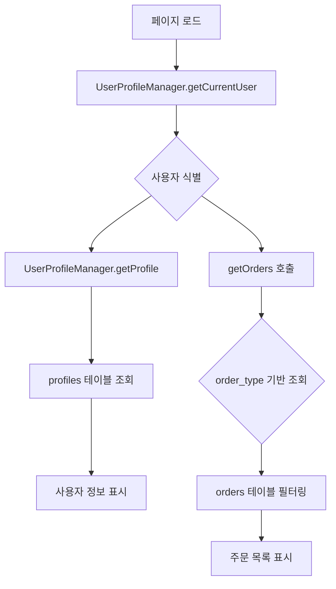

#### 실제 사용자 식별 로직 (UserProfileManager)
```javascript
// /lib/userProfileManager.js

// 1. 현재 사용자 식별
static async getCurrentUser() {
  // 카카오 사용자 확인
  const storedUser = sessionStorage.getItem('user')
  if (storedUser) {
    const userData = JSON.parse(storedUser)
    if (userData.kakao_id) {
      return {
        id: userData.id,
        kakao_id: userData.kakao_id,
        provider: 'kakao'
      }
    }
  }

  // Supabase Auth 사용자 확인
  const { data: { session } } = await supabase.auth.getSession()
  if (session?.user) {
    return {
      id: session.user.id,
      email: session.user.email,
      provider: 'supabase'
    }
  }

  return null
}

// 2. 프로필 조회
static async getProfile(currentUser) {
  if (currentUser.kakao_id) {
    // 카카오 사용자: kakao_users 테이블에서 조회
    const { data } = await supabase
      .from('kakao_users')
      .select('*')
      .eq('kakao_id', currentUser.kakao_id)
      .single()
    return data
  } else {
    // Supabase 사용자: profiles 테이블에서 조회
    const { data } = await supabase
      .from('profiles')
      .select('*')
      .eq('id', currentUser.id)
      .single()
    return data
  }
}
```

#### 주문 조회 로직 (order_type 기반)
```javascript
// /lib/supabaseApi.js - getOrders

const userQuery = UserProfileManager.getUserQuery(currentUser)

// 기본 쿼리
let query = supabase
  .from('orders')
  .select(`
    *,
    order_items (*),
    order_shipping (*),
    order_payments (*)
  `)

// order_type 기반 필터링
if (userQuery.column === 'order_type') {
  query = query.eq('order_type', userQuery.value)

  // ⚠️ 하위 호환성: 기존 주문도 조회 가능하도록
  if (data.length === 0 && userQuery.alternativeQueries) {
    for (const altQuery of userQuery.alternativeQueries) {
      const { data: altData } = await supabase
        .from('orders')
        .select('*')
        .eq(altQuery.column, altQuery.value)

      if (altData && altData.length > 0) {
        data = altData
        break
      }
    }
  }
} else {
  query = query.eq(userQuery.column, userQuery.value)
}

const { data, error } = await query.order('created_at', { ascending: false })
```

---

### 5. 🛠️ 관리자 - 실시간 방송 컨트롤 (`/app/admin/products/page.js`)

#### 📥 데이터 로드 흐름
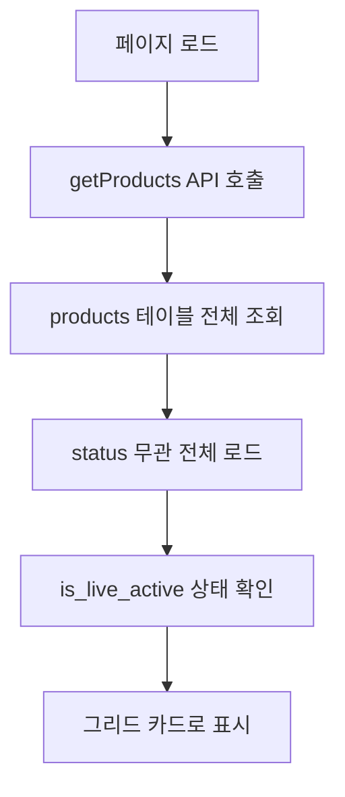

#### 실제 코드 흐름
```javascript
// 관리자는 모든 상품 조회 (status 필터 없음)
const { data, error } = await supabase
  .from('products')
  .select(`
    *,
    product_options (id, name, values)
  `)
  .order('created_at', { ascending: false })

// 라이브 활성 상태 표시
{product.is_live_active ? (
  <span className="text-red-500">LIVE 중</span>
) : (
  <button>라이브 상품 추가</button>
)}
```

#### 📤 라이브 상태 변경 흐름
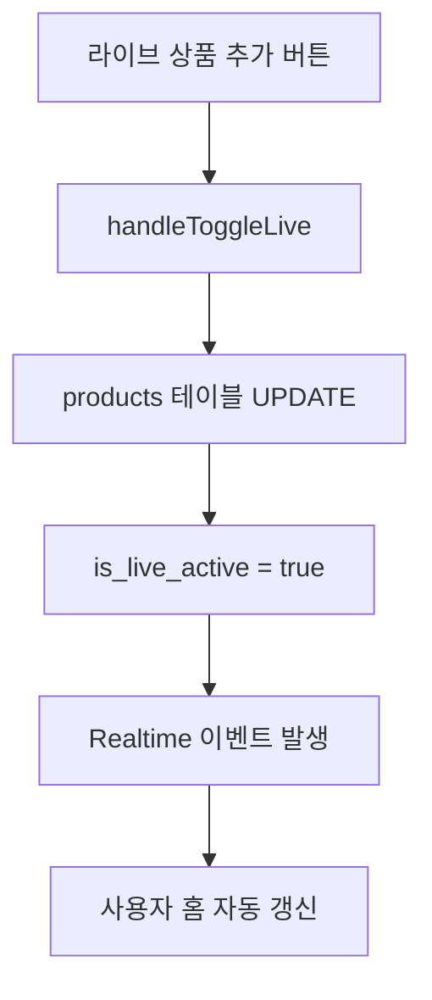

#### 재고 관리 흐름
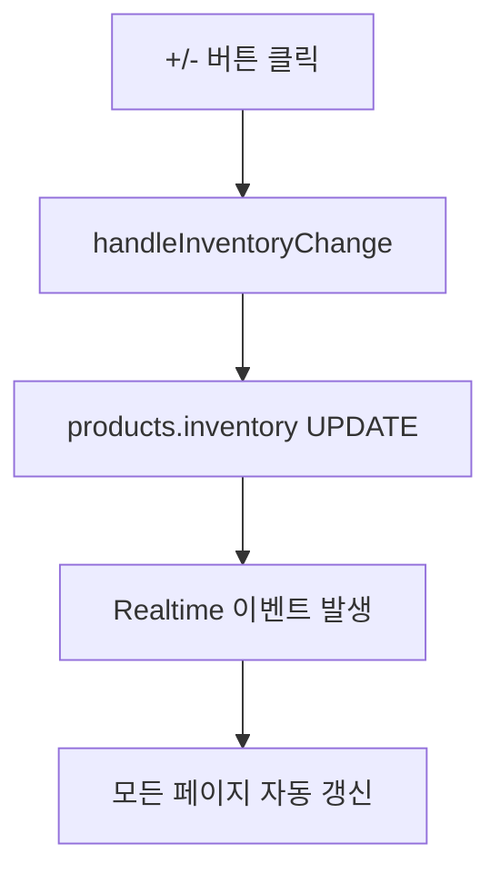

---

### 6. 📦 관리자 - 주문 관리 (`/app/admin/orders/page.js`)

#### 📥 데이터 로드 흐름
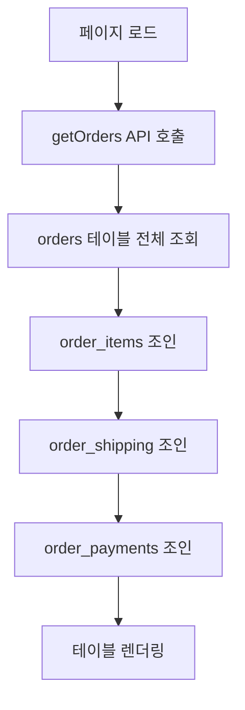

#### 실제 코드 흐름
```javascript
// 관리자는 모든 주문 조회 (user_id 필터 없음)
const { data, error } = await supabase
  .from('orders')
  .select(`
    *,
    order_items (
      *,
      products (title, thumbnail_url)
    ),
    order_shipping (*),
    order_payments (*)
  `)
  .order('created_at', { ascending: false })

// 데이터 변환
const orders = data.map(order => ({
  ...order,
  items: order.order_items,
  shipping: order.order_shipping?.[0],
  payment: getBestPayment(order.order_payments),
  depositorName: getBestPayment(order.order_payments)?.depositor_name
}))
```

#### 📤 주문 상태 변경 흐름
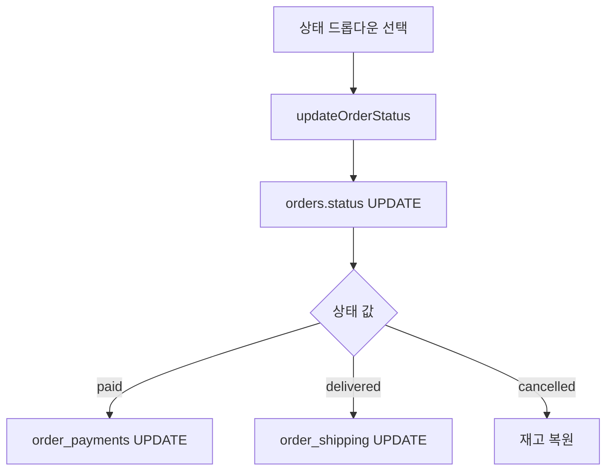

---

### 7. 📋 관리자 - 업체별 발주 관리 메인 (`/app/admin/purchase-orders/page.js`)

#### 📥 데이터 로드 흐름
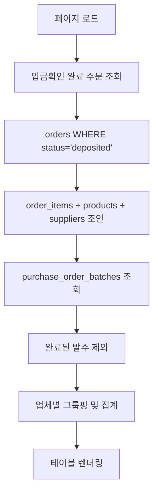

#### 실제 코드 흐름
```javascript
// 1. 입금확인 완료 주문 조회
const { data: depositedOrders, error: ordersError } = await supabase
  .from('orders')
  .select(`
    *,
    order_items (
      *,
      products (
        *,
        suppliers (*)
      )
    )
  `)
  .eq('status', 'deposited')
  .order('created_at', { ascending: false })

// 2. 완료된 발주 조회
const { data: completedBatches } = await supabase
  .from('purchase_order_batches')
  .select('order_id, supplier_id, completed_at')
  .not('completed_at', 'is', null)

// 3. 완료된 주문 필터링
const completedOrderIds = new Set(
  completedBatches.map(batch => batch.order_id)
)

const pendingOrders = depositedOrders.filter(
  order => !completedOrderIds.has(order.id)
)

// 4. 업체별 그룹핑
const supplierOrders = {}
pendingOrders.forEach(order => {
  order.order_items.forEach(item => {
    const supplier = item.products?.suppliers
    if (supplier) {
      if (!supplierOrders[supplier.id]) {
        supplierOrders[supplier.id] = {
          supplier: supplier,
          orders: [],
          totalItems: 0,
          totalQuantity: 0
        }
      }
      supplierOrders[supplier.id].orders.push({
        orderId: order.id,
        customerOrderNumber: order.customer_order_number,
        item: item
      })
      supplierOrders[supplier.id].totalItems++
      supplierOrders[supplier.id].totalQuantity += item.quantity
    }
  })
})
```

#### 사용되는 DB 컬럼
**orders:**
- `id, customer_order_number, status, created_at`
- 필터: `status = 'deposited'`

**order_items:**
- `id, order_id, product_id, quantity, unit_price, total_price`

**products:**
- `id, title, supplier_id`

**suppliers:**
- `id, name, contact_person, phone, email`

**purchase_order_batches:**
- `order_id, supplier_id, completed_at`

#### 화면 토글 기능
```javascript
// "대기 중 발주" ↔ "완료된 발주" 전환
const [showCompleted, setShowCompleted] = useState(false)

// 대기 중 발주: completed_at IS NULL
// 완료된 발주: completed_at IS NOT NULL
```

---

### 8. 📄 관리자 - 업체별 발주서 상세 (`/app/admin/purchase-orders/[supplierId]/page.js`)

#### 📥 데이터 로드 흐름
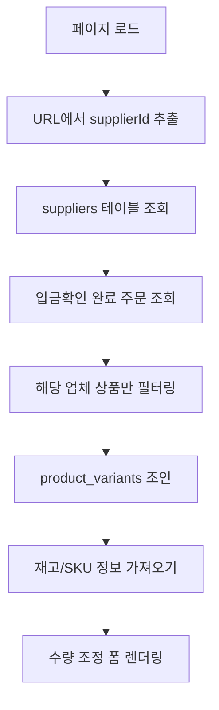

#### 실제 코드 흐름
```javascript
// 1. 업체 정보 조회
const { data: supplier, error: supplierError } = await supabase
  .from('suppliers')
  .select('*')
  .eq('id', supplierId)
  .single()

// 2. 해당 업체 입금확인 완료 주문 조회
const { data: orders, error: ordersError } = await supabase
  .from('orders')
  .select(`
    *,
    order_items (
      *,
      products (
        *,
        product_variants (
          id,
          sku,
          inventory,
          option_values
        )
      )
    ),
    order_shipping (*)
  `)
  .eq('status', 'deposited')

// 3. 해당 업체 상품만 필터링
const supplierOrders = orders.map(order => ({
  ...order,
  order_items: order.order_items.filter(
    item => item.products?.supplier_id === supplierId
  )
})).filter(order => order.order_items.length > 0)

// 4. 주문 아이템 집계
const orderItems = []
supplierOrders.forEach(order => {
  order.order_items.forEach(item => {
    orderItems.push({
      orderId: order.id,
      customerOrderNumber: order.customer_order_number,
      productTitle: item.products?.title,
      variantSku: item.product_variants?.sku,
      quantity: item.quantity,
      unitPrice: item.unit_price,
      shipping: order.order_shipping?.[0],
      adjustedQuantity: item.quantity  // 초기값: 원본 수량
    })
  })
})
```

#### 📤 수량 조정 및 Excel 다운로드 흐름
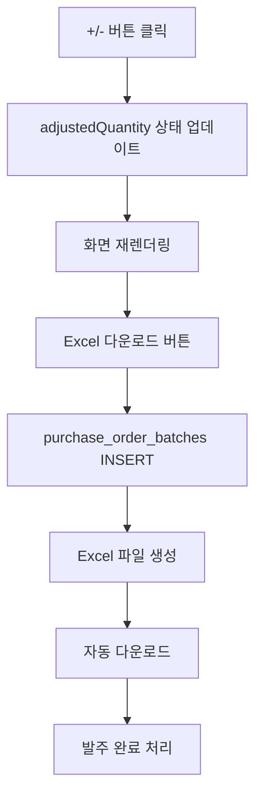

#### 실제 수량 조정 로직
```javascript
// 수량 조정 상태 관리
const [adjustedQuantities, setAdjustedQuantities] = useState({})

// +/- 버튼 핸들러
const handleQuantityChange = (itemId, delta) => {
  setAdjustedQuantities(prev => {
    const current = prev[itemId] || orderItems.find(i => i.id === itemId).quantity
    const newQty = Math.max(0, current + delta)  // 0 이하 방지
    return {
      ...prev,
      [itemId]: newQty
    }
  })
}

// 최종 수량 계산
const getFinalQuantity = (itemId, originalQty) => {
  return adjustedQuantities[itemId] ?? originalQty
}
```

#### Excel 다운로드 및 발주 완료 처리
```javascript
// Excel 다운로드 버튼 클릭
const handleExcelDownload = async () => {
  try {
    // 1. purchase_order_batches 생성
    const batchId = uuidv4()
    const batchItems = orderItems.map(item => ({
      batch_id: batchId,
      order_id: item.orderId,
      supplier_id: supplierId,
      product_id: item.products.id,
      variant_id: item.product_variants?.id,
      ordered_quantity: getFinalQuantity(item.id, item.quantity),
      unit_price: item.unit_price,
      completed_at: new Date().toISOString()  // ⚠️ 즉시 완료 처리
    }))

    const { error: batchError } = await supabase
      .from('purchase_order_batches')
      .insert(batchItems)

    if (batchError) throw batchError

    // 2. Excel 파일 생성
    const workbook = XLSX.utils.book_new()
    const worksheetData = orderItems.map(item => ({
      '주문번호': item.customerOrderNumber,
      '상품명': item.productTitle,
      'SKU': item.variantSku || '-',
      '수량': getFinalQuantity(item.id, item.quantity),
      '단가': item.unitPrice.toLocaleString(),
      '합계': (getFinalQuantity(item.id, item.quantity) * item.unitPrice).toLocaleString(),
      '수령인': item.shipping?.name,
      '연락처': item.shipping?.phone,
      '배송지': `${item.shipping?.address} ${item.shipping?.detail_address || ''}`
    }))

    const worksheet = XLSX.utils.json_to_sheet(worksheetData)
    XLSX.utils.book_append_sheet(workbook, worksheet, '발주서')

    // 3. 파일 다운로드
    const fileName = `발주서_${supplier.name}_${new Date().toISOString().split('T')[0]}.xlsx`
    XLSX.writeFile(workbook, fileName)

    // 4. 성공 메시지
    alert('발주서가 다운로드되었습니다. 해당 주문은 "완료된 발주"로 이동됩니다.')

    // 5. 메인 페이지로 이동
    router.push('/admin/purchase-orders')
  } catch (error) {
    console.error('Excel 다운로드 오류:', error)
    alert('발주서 생성 중 오류가 발생했습니다.')
  }
}
```

#### 사용되는 DB 컬럼 (INSERT)
**purchase_order_batches:**
- `batch_id, order_id, supplier_id, product_id, variant_id`
- `ordered_quantity, unit_price, completed_at`

#### Excel 파일 구조
| 주문번호 | 상품명 | SKU | 수량 | 단가 | 합계 | 수령인 | 연락처 | 배송지 |
|---------|--------|-----|------|------|------|--------|--------|--------|
| S250101-ABCD | 상품A | SKU-001 | 5 | 10,000 | 50,000 | 홍길동 | 010-1234-5678 | 서울시... |

#### 화면 표시 정보
```javascript
// 업체 정보
<div>
  <h1>{supplier.name}</h1>
  <p>담당자: {supplier.contact_person}</p>
  <p>연락처: {supplier.phone}</p>
  <p>이메일: {supplier.email}</p>
</div>

// 주문 아이템 테이블
<table>
  <thead>
    <tr>
      <th>주문번호</th>
      <th>상품명</th>
      <th>SKU</th>
      <th>원본 수량</th>
      <th>조정 수량</th>
      <th>수량 조정</th>
      <th>단가</th>
      <th>합계</th>
    </tr>
  </thead>
  <tbody>
    {orderItems.map(item => (
      <tr key={item.id}>
        <td>{item.customerOrderNumber}</td>
        <td>{item.productTitle}</td>
        <td>{item.variantSku || '-'}</td>
        <td>{item.quantity}</td>
        <td>{getFinalQuantity(item.id, item.quantity)}</td>
        <td>
          <button onClick={() => handleQuantityChange(item.id, -1)}>-</button>
          <button onClick={() => handleQuantityChange(item.id, 1)}>+</button>
        </td>
        <td>{item.unitPrice.toLocaleString()}원</td>
        <td>{(getFinalQuantity(item.id, item.quantity) * item.unitPrice).toLocaleString()}원</td>
      </tr>
    ))}
  </tbody>
</table>

// Excel 다운로드 버튼
<button onClick={handleExcelDownload}>
  발주서 다운로드 (Excel)
</button>
```

---

## 🔌 주요 API 엔드포인트 상세

### 1. POST `/api/create-order-card` (카드 결제 주문)

#### 요청 데이터
```javascript
{
  userId: "uuid",
  userProfile: {
    name: "홍길동",
    phone: "010-1234-5678",
    address: "서울시 강남구...",
    detail_address: "101동 101호"
  },
  orderData: {
    id: "product_uuid",
    title: "상품명",
    price: 10000,
    quantity: 2,
    totalPrice: 24000, // 상품금액 + 배송비
    orderType: "direct"
  }
}
```

#### 처리 흐름
```javascript
// 1. 사용자 존재 확인 및 생성
const { data: existingUser } = await supabase
  .from('users')
  .select('id')
  .eq('id', userId)
  .single()

if (!existingUser) {
  await supabase.from('users').insert([{
    id: userId,
    name: userProfile.name,
    phone: userProfile.phone
  }])
}

// 2. 주문 생성 (REST API 직접 호출 - RLS 우회)
const orderResponse = await fetch(`${supabaseUrl}/rest/v1/orders`, {
  method: 'POST',
  headers: {
    'apikey': supabaseKey,
    'Authorization': `Bearer ${supabaseKey}`,
    'Content-Type': 'application/json'
  },
  body: JSON.stringify({
    id: orderId,
    customer_order_number: customerOrderNumber,
    user_id: validUserId,
    status: 'verifying', // ⚠️ 카드결제는 바로 확인중
    order_type: orderData.orderType,
    total_amount: orderData.totalPrice
  })
})

// 3. order_items INSERT
await fetch(`${supabaseUrl}/rest/v1/order_items`, {
  method: 'POST',
  body: JSON.stringify({
    order_id: orderId,
    product_id: orderData.id,
    quantity: orderData.quantity,
    unit_price: orderData.price,
    total_price: orderData.price * orderData.quantity
  })
})

// 4. order_shipping INSERT
await fetch(`${supabaseUrl}/rest/v1/order_shipping`, {
  method: 'POST',
  body: JSON.stringify({
    order_id: orderId,
    name: userProfile.name,
    phone: userProfile.phone,
    address: userProfile.address,
    detail_address: userProfile.detail_address,
    shipping_fee: 4000
  })
})

// 5. order_payments INSERT
await fetch(`${supabaseUrl}/rest/v1/order_payments`, {
  method: 'POST',
  body: JSON.stringify({
    order_id: orderId,
    method: 'card',
    amount: orderData.totalPrice,
    status: 'completed', // ⚠️ 카드는 바로 완료
    transaction_id: `card_${Date.now()}`
  })
})

// 6. 재고 차감
await fetch(`${supabaseUrl}/rest/v1/rpc/decrease_inventory`, {
  method: 'POST',
  body: JSON.stringify({
    product_id: orderData.id,
    quantity: orderData.quantity
  })
})
```

#### 응답 데이터
```javascript
{
  success: true,
  orderId: "uuid",
  customerOrderNumber: "S250101-ABCD"
}
```

---

### 2. POST `/lib/supabaseApi.js - createOrder` (무통장 입금 주문)

#### 처리 흐름
```javascript
// UserProfileManager 기반 사용자 식별
const user = await UserProfileManager.getCurrentUser()
const userProfile = await UserProfileManager.getProfile(user)

// order_type 결정
let order_type = orderData.orderType || 'direct'
if (user.kakao_id) {
  order_type = `${orderData.orderType || 'direct'}:KAKAO:${user.kakao_id}`
}

// orders INSERT
const { data: order } = await supabase
  .from('orders')
  .insert({
    id: orderId,
    customer_order_number: customerOrderNumber,
    user_id: user.id || null,
    status: 'pending', // ⚠️ 무통장은 pending
    order_type: order_type,
    total_amount: totalAmount
  })
  .select()
  .single()

// order_payments INSERT (입금자명 포함)
await supabase
  .from('order_payments')
  .insert({
    order_id: orderId,
    method: 'bank_transfer',
    amount: totalAmount,
    status: 'pending',
    depositor_name: orderData.depositName // ⚠️ 입금자명
  })
```

---

## 🔄 데이터 흐름 다이어그램 (전체 시스템)

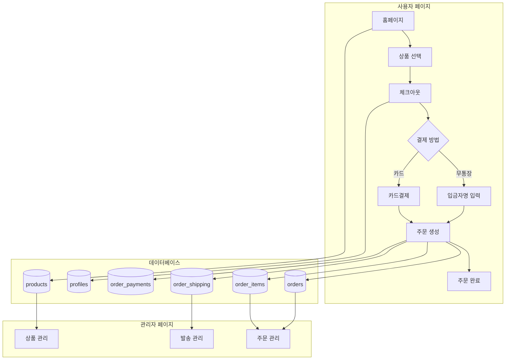

---

## ⚠️ 중요 주의사항 (트러블슈팅 가이드)

### 1. order_items 테이블 컬럼 이름
```javascript
// ❌ 잘못된 코드
const price = item.price

// ✅ 올바른 코드
const price = item.unit_price
```

### 2. 상품명은 조인 필요
```javascript
// ❌ 잘못된 코드
const title = orderItem.title

// ✅ 올바른 코드
const { data } = await supabase
  .from('order_items')
  .select(`
    *,
    products (title, thumbnail_url)
  `)
```

### 3. 입금자명 우선순위
```javascript
// ✅ 올바른 우선순위
const depositorName =
  payment?.depositor_name ||    // 1순위: order_payments 테이블
  order.depositName ||          // 2순위: 주문 생성 시 입력
  shipping?.name ||             // 3순위: 수령인명
  '입금자명 확인 필요'
```

### 4. order_type 기반 사용자 주문 조회
```javascript
// ✅ 카카오 사용자
const order_type = `direct:KAKAO:${kakao_id}`

// ✅ Supabase 사용자
const order_type = 'direct' // user_id 기반 조회 가능
```

### 5. 하위 호환성 유지
```javascript
// 기존 데이터: order_type = "direct:KAKAO:{uuid}"
// 새로운 데이터: order_type = "direct:KAKAO:{kakao_id}"
// ⚠️ 둘 다 조회 가능하도록 alternativeQueries 사용
```

---

---

### 9. 🏷️ 관리자 - 카테고리 관리 (`/app/admin/categories/page.js`)

#### 📥 데이터 로드 흐름
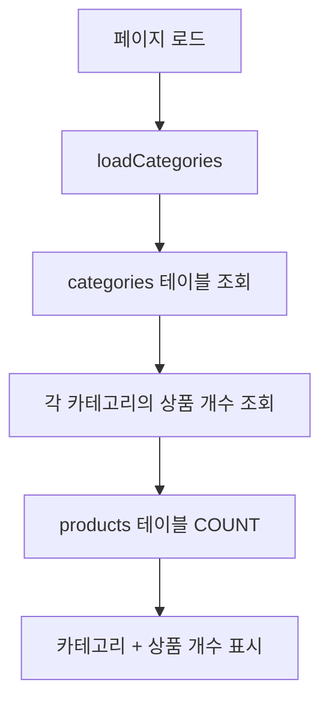

#### 실제 코드 흐름
```javascript
// 1. 카테고리 로드
const { data: categoriesData, error } = await supabase
  .from('categories')
  .select('*')
  .order('parent_id', { ascending: true, nullsFirst: true })
  .order('name', { ascending: true })

// 2. 각 카테고리의 상품 개수 가져오기
const categoriesWithCount = await Promise.all(
  (categoriesData || []).map(async (category) => {
    const { count, error: countError } = await supabase
      .from('products')
      .select('id', { count: 'exact', head: true })
      .eq('category_id', category.id)

    return {
      ...category,
      product_count: countError ? 0 : (count || 0)
    }
  })
)
```

#### 📤 카테고리 생성 흐름
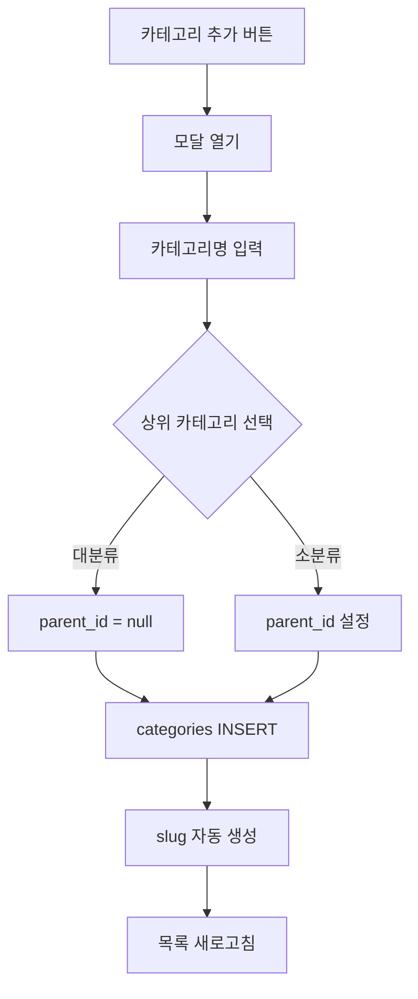

#### 실제 저장 코드
```javascript
// slug 자동 생성 (입력 안 했을 경우)
const slug = formData.slug || formData.name.toLowerCase().replace(/\s+/g, '-')

if (editingCategory) {
  // 수정
  const { error } = await supabase
    .from('categories')
    .update({
      name: formData.name,
      slug: slug,
      parent_id: formData.parent_id || null,
      description: formData.description,
      updated_at: new Date().toISOString()
    })
    .eq('id', editingCategory.id)
} else {
  // 추가
  const { error } = await supabase
    .from('categories')
    .insert({
      name: formData.name,
      slug: slug,
      parent_id: formData.parent_id || null,
      description: formData.description,
      is_active: true
    })
}
```

#### 사용되는 DB 컬럼
**categories:**
- `id, name, slug, parent_id, description, is_active, created_at, updated_at`

**products (COUNT):**
- `id, category_id`

#### 화면 표시 정보
- 대분류/소분류 구분 표시
- 각 카테고리의 상품 개수
- 활성/비활성 상태
- 계층 구조 (parent_id 기반)

---

### 10. 🏢 관리자 - 업체 관리 (`/app/admin/suppliers/page.js`)

#### 📥 데이터 로드 흐름
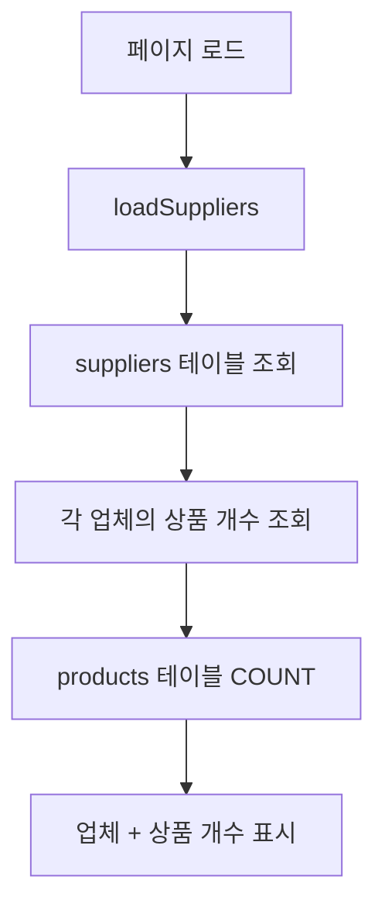

#### 실제 코드 흐름
```javascript
// 1. 공급업체 로드
const { data: suppliersData, error } = await supabase
  .from('suppliers')
  .select('*')
  .order('created_at', { ascending: false })

// 2. 각 업체의 상품 개수 가져오기
const suppliersWithCount = await Promise.all(
  (suppliersData || []).map(async (supplier) => {
    const { count, error: countError } = await supabase
      .from('products')
      .select('id', { count: 'exact', head: true })
      .eq('supplier_id', supplier.id)

    return {
      ...supplier,
      product_count: countError ? 0 : (count || 0)
    }
  })
)
```

#### 📤 업체 생성 흐름
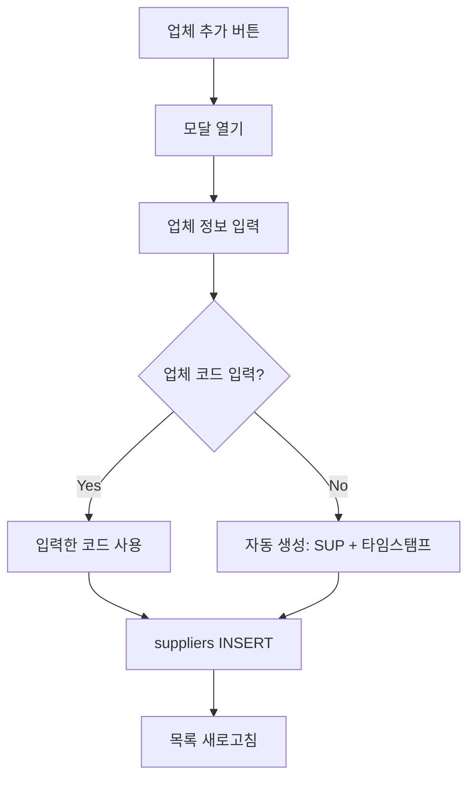

#### 실제 저장 코드
```javascript
if (editingSupplier) {
  // 수정
  const { error } = await supabase
    .from('suppliers')
    .update({
      ...formData,
      updated_at: new Date().toISOString()
    })
    .eq('id', editingSupplier.id)
} else {
  // 추가 - code가 비어있으면 자동 생성
  const supplierData = {
    ...formData,
    code: formData.code || `SUP${Date.now().toString().slice(-8)}`,
    is_active: true
  }

  const { error } = await supabase
    .from('suppliers')
    .insert(supplierData)
}
```

#### 사용되는 DB 컬럼
**suppliers:**
- `id, code, name, contact_person, phone, email, address, notes, is_active, created_at, updated_at`

**products (COUNT):**
- `id, supplier_id`

#### 화면 표시 정보
- 업체명, 코드
- 담당자명, 연락처, 이메일
- 주소, 메모
- 상품 개수
- 활성/비활성 상태

---

### 11. 📦 관리자 - 상품 카탈로그 (`/app/admin/products/catalog/page.js`)

#### 📥 데이터 로드 흐름
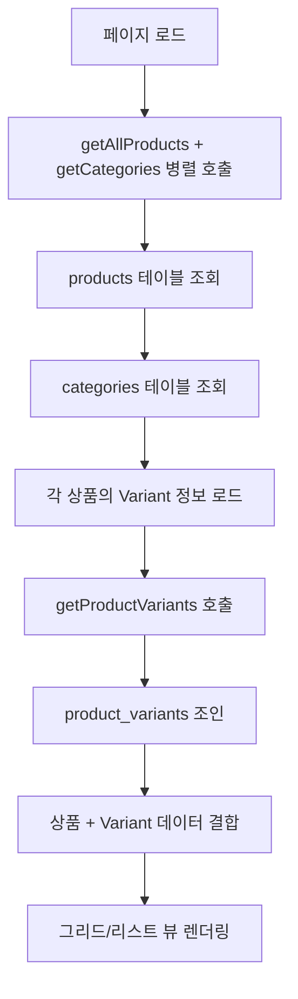

#### 실제 코드 흐름
```javascript
// 1. 데이터 로딩 (병렬)
const [productsData, categoriesData] = await Promise.all([
  getAllProducts({
    search: searchTerm,
    category_id: selectedCategory,
    status: selectedStatus
  }),
  getCategories()
])

// 2. 각 상품의 variant 정보도 함께 로드
const productsWithVariants = await Promise.all(
  productsData.map(async (product) => {
    try {
      const { getProductVariants } = await import('@/lib/supabaseApi')
      const variants = await getProductVariants(product.id)
      return { ...product, variants: variants || [] }
    } catch (error) {
      console.error(`Variant 로딩 실패 for product ${product.id}:`, error)
      return { ...product, variants: [] }
    }
  })
)
```

#### 📤 필터링 및 검색 흐름
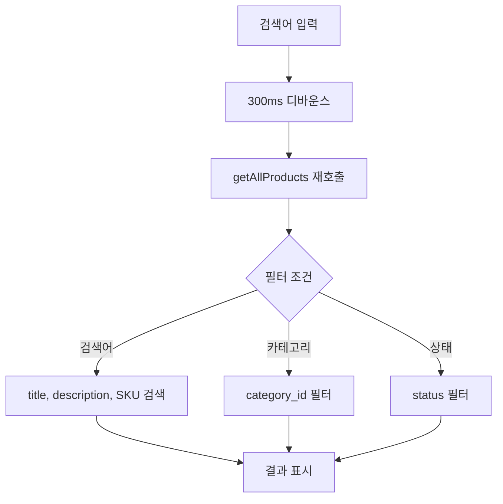

#### 사용되는 DB 컬럼
**products:**
- `id, title, price, compare_price, inventory, status, is_live_active, thumbnail_url, category_id, supplier_id, created_at, updated_at`

**categories:**
- `id, name`

**product_variants:**
- `id, product_id, sku, inventory, price_adjustment`

#### 화면 표시 모드
**그리드 뷰:**
- 컴팩트한 카드 디자인 (2~6열 반응형)
- 썸네일 이미지
- 라이브 배지 (is_live_active)
- Variant 개수 또는 재고 표시

**리스트 뷰:**
- 테이블 형식
- 상품명, 카테고리, 가격, 재고, 상태, 라이브 여부
- 상세/편집 버튼

---

### 12. ⚡ 관리자 - 상품 등록 (Variant) (`/app/admin/products/new/page.js`)

#### 📥 페이지 초기화 흐름
```mermaid
graph TD
    A[페이지 로드] --> B[관리자 권한 확인]
    B --> C[제품번호 자동 생성]
    C --> D[generateProductNumber]
    D --> E[기존 상품 개수 조회]
    E --> F[순차 번호 생성]
    F --> G[폼 초기화 완료]
```

#### 📤 Variant 상품 등록 흐름 (복잡!)
```mermaid
graph TD
    A[필수값 검증] --> B{이미지 + 가격?}
    B -->|No| C[에러 메시지]
    B -->|Yes| D[products 테이블 INSERT]
    D --> E{옵션 있음?}
    E -->|No| F[등록 완료]
    E -->|Yes| G[product_options 생성]
    G --> H[사이즈/색상 옵션별]
    H --> I[product_option_values INSERT]
    I --> J[옵션 조합 생성]
    J --> K[product_variants INSERT]
    K --> L[variant_option_values 매핑]
    L --> M[등록 완료]
```

#### 실제 코드 흐름 (상세)
```javascript
// 1. 제품 생성
const { data: product, error: productError } = await supabase
  .from('products')
  .insert({
    title: productData.title.trim() || productNumber,
    product_number: productNumber,
    price: parseInt(productData.price),
    inventory: totalInventory,  // 옵션이 있으면 모든 variant 재고 합계
    thumbnail_url: imagePreview,
    description: productData.description || '',
    status: 'active',
    is_featured: false,
    tags: ['NEW']
  })
  .select()
  .single()

// 2. 옵션이 있는 경우 Variant 시스템으로 저장
if (productData.optionType !== 'none' && combinations.length > 0) {
  // 2-1. product_options 생성
  const optionsToCreate = []

  if (productData.optionType === 'size' || productData.optionType === 'both') {
    optionsToCreate.push({ name: '사이즈', values: productData.sizeOptions })
  }
  if (productData.optionType === 'color' || productData.optionType === 'both') {
    optionsToCreate.push({ name: '색상', values: productData.colorOptions })
  }

  const createdOptionValues = {} // 매핑 저장용

  for (const option of optionsToCreate) {
    // product_options INSERT
    const { data: createdOption } = await supabase
      .from('product_options')
      .insert({
        product_id: product.id,
        name: option.name,
        display_order: 0,
        is_required: false
      })
      .select()
      .single()

    // product_option_values INSERT
    const valuesToInsert = option.values.map((value, index) => ({
      option_id: createdOption.id,
      value: value,
      display_order: index
    }))

    const { data: createdValues } = await supabase
      .from('product_option_values')
      .insert(valuesToInsert)
      .select()

    // 매핑 저장
    createdOptionValues[option.name] = {}
    createdValues.forEach(val => {
      createdOptionValues[option.name][val.value] = val.id
    })
  }

  // 2-2. product_variants 생성 (조합별로)
  for (const combo of combinations) {
    // SKU 생성
    let sku = productNumber
    if (combo.type === 'size') {
      sku = `${productNumber}-${combo.size}`
    } else if (combo.type === 'color') {
      sku = `${productNumber}-${combo.color}`
    } else if (combo.type === 'both') {
      sku = `${productNumber}-${combo.size}-${combo.color}`
    }

    // 재고
    const inventory = productData.optionInventories[combo.key] || 0

    // product_variants INSERT
    const { data: variant } = await supabase
      .from('product_variants')
      .insert({
        product_id: product.id,
        sku: sku,
        inventory: inventory,
        price_adjustment: 0,
        is_active: true
      })
      .select()
      .single()

    // 2-3. variant_option_values 매핑
    const mappings = []
    if (combo.type === 'size') {
      mappings.push({
        variant_id: variant.id,
        option_value_id: createdOptionValues['사이즈'][combo.size]
      })
    } else if (combo.type === 'color') {
      mappings.push({
        variant_id: variant.id,
        option_value_id: createdOptionValues['색상'][combo.color]
      })
    } else if (combo.type === 'both') {
      mappings.push({
        variant_id: variant.id,
        option_value_id: createdOptionValues['사이즈'][combo.size]
      })
      mappings.push({
        variant_id: variant.id,
        option_value_id: createdOptionValues['색상'][combo.color]
      })
    }

    await supabase
      .from('variant_option_values')
      .insert(mappings)
  }
}
```

#### 옵션 조합 생성 로직
```javascript
const generateOptionCombinations = () => {
  const { optionType, sizeOptions, colorOptions } = productData
  const combinations = []

  if (optionType === 'size') {
    // 사이즈만: 55, 66, 77, 88, 99
    sizeOptions.forEach(size => {
      combinations.push({
        key: `size:${size}`,
        label: size,
        type: 'size',
        value: size
      })
    })
  } else if (optionType === 'color') {
    // 색상만: 블랙, 화이트, 그레이...
    colorOptions.forEach(color => {
      combinations.push({
        key: `color:${color}`,
        label: color,
        type: 'color',
        value: color
      })
    })
  } else if (optionType === 'both') {
    // 사이즈 × 색상: 55-블랙, 55-화이트, 66-블랙...
    sizeOptions.forEach(size => {
      colorOptions.forEach(color => {
        combinations.push({
          key: `size:${size}|color:${color}`,
          label: `${size} × ${color}`,
          type: 'both',
          size,
          color
        })
      })
    })
  }

  return combinations
}
```

#### 사용되는 DB 컬럼 (INSERT)
**products:**
- `title, product_number, price, inventory, thumbnail_url, description, status, is_featured, tags`

**product_options:**
- `product_id, name, display_order, is_required`

**product_option_values:**
- `option_id, value, display_order`

**product_variants:**
- `product_id, sku, inventory, price_adjustment, is_active`

**variant_option_values:**
- `variant_id, option_value_id`

#### 화면 표시 정보
- 제품번호: 자동 생성 (예: 0001, 0002...)
- 제품명: 선택사항 (입력 시: "0001/밍크자켓", 미입력 시: "0001")
- 가격: 천원 단위 입력 옵션 (19.5 → 19,500원)
- 사이즈 템플릿: 숫자(55~99), 알파벳(XS~XXL), FREE
- 색상 프리셋: 블랙, 화이트, 그레이 등 10가지
- 옵션별 재고 설정 (일괄 입력 가능)

---

### 13. 🚚 관리자 - 발송 관리 (`/app/admin/shipping/page.js`)

#### 📥 데이터 로드 흐름
```mermaid
graph TD
    A[페이지 로드] --> B[loadPaidOrders]
    B --> C[getAllOrders 호출]
    C --> D{주문 상태 필터}
    D -->|paid/shipping/delivered| E[결제완료 주문만 선택]
    D -->|기타| F[제외]
    E --> G[배송 정보 추출]
    G --> H[shipping_* 컬럼 우선]
    H --> I[order_shipping 조인 정보 대체]
    I --> J[우편번호 포함 주소 표시]
```

#### 실제 코드 흐름
```javascript
// 1. 결제 완료된 주문들 가져오기
const { getAllOrders } = await import('@/lib/supabaseApi')
const allOrders = await getAllOrders()

// 2. 결제완료, 배송중, 배송완료 주문만 필터링
const paidOrders = allOrders.filter(order =>
  order.status === 'paid' || order.status === 'shipping' || order.status === 'delivered'
)

// 3. 배송 정보 추출 (shipping_* 컬럼 우선)
const ordersWithUserInfo = paidOrders.map(order => {
  const shippingInfo = {
    name: order.shipping_name || order.order_shipping?.[0]?.name || order.shipping?.name || '',
    phone: order.shipping_phone || order.order_shipping?.[0]?.phone || order.shipping?.phone || '',
    address: order.shipping_address || order.order_shipping?.[0]?.address || order.shipping?.address || '',
    detail_address: order.shipping_detail_address || order.order_shipping?.[0]?.detail_address || order.shipping?.detail_address || '',
    postal_code: order.shipping_postal_code || order.order_shipping?.[0]?.postal_code || order.shipping?.postal_code || ''
  }

  return {
    ...order,
    user: {
      name: shippingInfo?.name || '배송 정보 없음',
      phone: shippingInfo?.phone || '연락처 없음',
      address: shippingInfo?.address || '',
      detail_address: shippingInfo?.detail_address || ''
    },
    hasValidShipping: !!(shippingInfo.name && shippingInfo.phone && shippingInfo.address)
  }
})
```

#### 📤 송장 다운로드 흐름
```mermaid
graph TD
    A[주문 선택] --> B[송장 다운로드 버튼]
    B --> C[CSV 데이터 생성]
    C --> D[shipping_* 컬럼 우선 사용]
    D --> E[우편번호 포함 주소 포맷]
    E --> F[상품 정보 조합]
    F --> G[Blob 생성]
    G --> H[파일 다운로드]
```

#### 실제 송장 생성 코드
```javascript
// CSV 헤더
const csvHeader = '주문번호,고객명,연락처,주소,상품명,수량,금액,상태\n'

// 각 주문의 CSV 데이터 생성
const csvData = selectedOrderData.map(order => {
  // 상품 정보
  const items = order.order_items.map(item => {
    const title = item.products?.title || item.product?.title || item.title || '상품'
    const quantity = item.quantity || 1
    return `${title}(${quantity}개)`
  }).join(';')

  // 배송 정보 (shipping_* 컬럼 우선)
  const postalCode = order.shipping_postal_code || order.order_shipping?.[0]?.postal_code || ''
  const address = order.shipping_address || order.order_shipping?.[0]?.address || '정보없음'
  const detailAddress = order.shipping_detail_address || order.order_shipping?.[0]?.detail_address || ''
  const fullAddress = detailAddress ? `${address} ${detailAddress}` : address
  const fullAddressWithPostal = postalCode ? `[${postalCode}] ${fullAddress}` : fullAddress

  // 고객명 및 연락처
  const customerName = order.shipping_name || order.user?.name || '정보없음'
  const phone = order.shipping_phone || order.user?.phone || '정보없음'

  // 총 수량 및 금액
  const totalQuantity = order.order_items?.reduce((sum, item) => sum + (item.quantity || 0), 0) || 0
  const amount = order.order_payments?.[0]?.amount || order.payment?.amount || order.total_amount || 0

  return [
    order.customer_order_number || order.id?.slice(-8),
    customerName,
    phone,
    `"${fullAddressWithPostal}"`,  // ⚠️ 우편번호 포함!
    `"${items}"`,
    totalQuantity,
    amount,
    getStatusInfo(order.status).label
  ].join(',')
}).join('\n')

// CSV 파일 생성 및 다운로드
const csvContent = csvHeader + csvData
const blob = new Blob(['\uFEFF' + csvContent], { type: 'text/csv;charset=utf-8;' })
const link = document.createElement('a')
const url = URL.createObjectURL(blob)
link.setAttribute('href', url)
link.setAttribute('download', `송장_${new Date().toISOString().split('T')[0]}.csv`)
link.click()
```

#### 사용되는 DB 컬럼
**orders:**
- `id, customer_order_number, status, created_at`

**order_items:**
- `id, order_id, product_id, quantity`
- `products.title` (조인)

**order_shipping:**
- `name, phone, address, detail_address, postal_code`  ⚠️ postal_code 필수

**order_payments:**
- `amount`

#### 화면 표시 정보
**탭:**
- 발송대기: status = 'paid' 또는 'shipping'
- 발송완료: status = 'delivered'

**테이블/카드:**
- 주문번호, 고객명, 연락처
- 주소 (우편번호 포함)
- 상태 (발송 대기, 발송 중, 발송 완료)
- 송장 다운로드 버튼 (개별/일괄)

---

### 14. 👥 관리자 - 고객 관리 (`/app/admin/customers/page.js`)

#### 📥 데이터 로드 흐름
```mermaid
graph TD
    A[페이지 로드] --> B[loadCustomers]
    B --> C[getAllCustomers 호출]
    C --> D[profiles 테이블 조회]
    D --> E[각 고객의 주문 통계 집계]
    E --> F[orders 테이블 JOIN]
    F --> G[orderCount, totalSpent 계산]
    G --> H[lastOrderDate 추출]
    H --> I[고객 등급 계산]
```

#### 실제 코드 흐름
```javascript
// getAllCustomers() 함수 내부
const customersData = await getAllCustomers()

// 반환 데이터 구조
{
  id: "uuid",
  name: "홍길동",
  nickname: "hong",
  phone: "010-1234-5678",
  address: "서울시 강남구...",
  detail_address: "101동 101호",
  created_at: "2025-01-01T00:00:00Z",
  orderCount: 5,              // 총 주문 건수
  totalSpent: 250000,         // 총 구매 금액
  lastOrderDate: "2025-10-01" // 최근 주문 날짜
}
```

#### 📤 고객 등급 계산 로직
```javascript
const getCustomerGrade = (totalSpent) => {
  if (totalSpent >= 1000000) {
    return { label: 'VIP', color: 'bg-yellow-100 text-yellow-800', icon: '👑' }
  } else if (totalSpent >= 500000) {
    return { label: 'GOLD', color: 'bg-amber-100 text-amber-800', icon: '🥇' }
  } else if (totalSpent >= 200000) {
    return { label: 'SILVER', color: 'bg-gray-100 text-gray-800', icon: '🥈' }
  } else if (totalSpent > 0) {
    return { label: 'BRONZE', color: 'bg-orange-100 text-orange-800', icon: '🥉' }
  } else {
    return { label: 'NEW', color: 'bg-blue-100 text-blue-800', icon: '🆕' }
  }
}
```

#### 📤 필터링 및 정렬 흐름
```mermaid
graph TD
    A[검색어 입력] --> B{검색 조건}
    B -->|이름| C[name LIKE]
    B -->|닉네임| D[nickname LIKE]
    B -->|전화번호| E[phone LIKE]
    C --> F[필터링된 결과]
    D --> F
    E --> F
    F --> G{정렬 기준}
    G -->|가입순| H[created_at DESC]
    G -->|이름순| I[name ASC]
    G -->|주문수순| J[orderCount DESC]
    G -->|구매금액순| K[totalSpent DESC]
```

#### 사용되는 DB 컬럼
**profiles:**
- `id, name, nickname, phone, address, detail_address, avatar_url, created_at`

**orders (집계):**
- `COUNT(*) as orderCount`
- `SUM(total_amount) as totalSpent`
- `MAX(created_at) as lastOrderDate`

#### 화면 표시 정보
**통계 카드:**
- 전체 고객 수
- 활성 고객 수 (주문이 있는 고객)
- VIP 고객 수 (100만원 이상)
- 신규 고객 수 (주문 없음)

**고객 테이블/카드:**
- 프로필 이미지, 이름, 닉네임
- 연락처, 주소
- 주문 통계 (주문 수, 총 구매액, 최근 주문일)
- 등급 배지 (VIP/GOLD/SILVER/BRONZE/NEW)
- 상세보기 버튼

---

## 🔄 핵심 데이터 흐름 다이어그램

### Variant 재고 차감 흐름 (2025-10-01 추가)
```mermaid
graph TD
    A[사용자 옵션 선택] --> B[프론트엔드에서 variant_id 확인]
    B --> C[checkVariantInventory 호출]
    C --> D{재고 충분?}
    D -->|No| E[에러 메시지 표시]
    D -->|Yes| F[createOrder 호출]
    F --> G[order_items INSERT with variant_id]
    G --> H[updateVariantInventory 호출]
    H --> I[FOR UPDATE 락 획득]
    I --> J[product_variants.inventory 차감]
    J --> K[트리거 자동 실행]
    K --> L[products.inventory 자동 업데이트]
    L --> M[주문 생성 완료]
```

### 배송비 계산 흐름 (2025-10-03 추가)
```mermaid
graph TD
    A[체크아웃 페이지 로드] --> B[사용자 프로필 로드]
    B --> C[profiles.postal_code 확인]
    C --> D[formatShippingInfo 호출]
    D --> E{우편번호 범위 확인}
    E -->|제주 63000-63644| F[기본 배송비 + 3,000원]
    E -->|울릉도 40200-40240| G[기본 배송비 + 5,000원]
    E -->|기타 도서산간| H[기본 배송비 + 5,000원]
    E -->|일반 지역| I[기본 배송비 4,000원]
    F --> J[총 배송비 표시]
    G --> J
    H --> J
    I --> J
    J --> K[주문 생성 시 postal_code 저장]
```

---

## 📝 문서 버전 정보

**버전**: 2.0
**최종 업데이트**: 2025-10-03
**검증 상태**: ✅ 실제 프로덕션 코드 기반 검증 완료
**추가된 페이지**: 6개 (카테고리, 업체, 상품 카탈로그, 상품 등록, 발송 관리, 고객 관리)
**업데이트 내용**:
- Variant 시스템 상세 데이터 흐름 추가
- 우편번호 시스템 및 배송비 계산 로직 추가
- 관리자 페이지 6개 데이터 흐름 완전 문서화
**작성자**: Claude Code

---

## 🔗 관련 문서

- `WORK_LOG_2025-10-03.md` - 우편번호 시스템 통합 작업 로그
- `WORK_LOG_2025-10-01.md` - Variant 시스템 작업 로그
- `SYSTEM_ARCHITECTURE.md` - 시스템 아키텍처
- `DATA_ARCHITECTURE.md` - 데이터 아키텍처
- `DB_REFERENCE_GUIDE.md` - DB 레퍼런스 가이드
- `CLAUDE.md` - 개발 가이드라인
- `supabase_schema.sql` - 실제 DB 스키마
