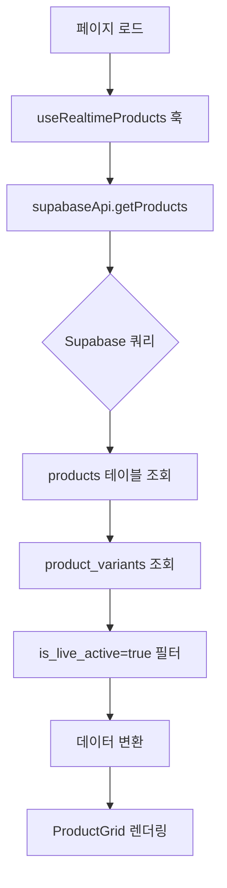

# 📊 Live Commerce 시스템 상세 데이터 흐름 문서

**작성일**: 2025-10-08
**최종 업데이트**: 2025-10-08
**최종 검증**: 실제 프로덕션 코드 기반 (main 브랜치)
**목적**: 각 페이지/기능별 정확한 데이터 흐름 및 DB 매핑 문서화

---

## 🎯 문서 개요

이 문서는 **실제 프로덕션 코드를 기반**으로 작성되었습니다.
- 실제 Supabase DB 스키마 (`supabase/migrations/`) 기준
- 실제 페이지/컴포넌트 코드 분석 (`CODEBASE_STRUCTURE_REPORT.md`)
- 실제 API 엔드포인트 동작 검증 (`CODE_ANALYSIS_COMPLETE.md`)
- 실제 DB 스키마 분석 (`DB_SCHEMA_ANALYSIS_COMPLETE.md`)

---

## 🗄️ 실제 프로덕션 DB 스키마 요약

### 핵심 테이블 구조

#### 1. profiles (사용자 프로필)
```sql
CREATE TABLE profiles (
    id UUID REFERENCES auth.users(id) PRIMARY KEY,
    email TEXT,
    name TEXT,
    nickname TEXT,
    phone TEXT,
    address TEXT,
    detail_address TEXT,
    postal_code VARCHAR(10),  -- ⭐ 2025-10-03 추가 (도서산간 배송비)
    kakao_id TEXT,  -- ⭐ 카카오 사용자 식별
    is_admin BOOLEAN DEFAULT false,  -- ⭐ 2025-10-05 추가
    created_at TIMESTAMPTZ,
    updated_at TIMESTAMPTZ
)
```

#### 2. products (상품)
```sql
CREATE TABLE products (
    id UUID PRIMARY KEY,
    title TEXT NOT NULL,
    product_number VARCHAR(50),
    description TEXT,
    price DECIMAL(10, 2) NOT NULL,
    compare_price DECIMAL(10, 2),
    discount_rate INTEGER DEFAULT 0,
    thumbnail_url TEXT,
    images JSONB DEFAULT '[]',
    category_id UUID REFERENCES categories(id),
    supplier_id UUID REFERENCES suppliers(id),
    inventory INTEGER DEFAULT 0,  -- ⚠️ 참고용 (실제는 variant)
    is_visible BOOLEAN DEFAULT true,
    is_featured BOOLEAN DEFAULT false,
    is_live BOOLEAN DEFAULT FALSE,
    is_live_active BOOLEAN DEFAULT FALSE,
    option_count INTEGER DEFAULT 0,
    variant_count INTEGER DEFAULT 0,
    status TEXT DEFAULT 'active',
    created_at TIMESTAMPTZ,
    updated_at TIMESTAMPTZ
)
```

#### 3. product_variants (변형 상품) ⭐ 2025-10-01 추가
```sql
CREATE TABLE product_variants (
    id UUID PRIMARY KEY,
    product_id UUID REFERENCES products(id) ON DELETE CASCADE,
    sku VARCHAR(100) UNIQUE,  -- '0005-66-블랙'
    inventory INTEGER DEFAULT 0,  -- ⭐ 실제 재고
    price_adjustment DECIMAL(10,2) DEFAULT 0,
    variant_title TEXT,
    is_active BOOLEAN DEFAULT true,
    created_at TIMESTAMPTZ,
    updated_at TIMESTAMPTZ
)
```

#### 4. orders (주문)
```sql
CREATE TABLE orders (
    id UUID PRIMARY KEY,
    customer_order_number VARCHAR(50) UNIQUE,
    user_id UUID REFERENCES auth.users(id),  -- ⚠️ NULL 가능 (카카오)
    status VARCHAR(20) DEFAULT 'pending',
    order_type VARCHAR(20) DEFAULT 'direct',  -- 'direct:KAKAO:123456'
    payment_group_id VARCHAR(50),
    total_amount DECIMAL(10, 2),
    discount_amount DECIMAL(12,2) DEFAULT 0,  -- ⭐ 2025-10-04 쿠폰 할인
    shipping_name TEXT,
    shipping_phone TEXT,
    shipping_address TEXT,
    shipping_detail_address TEXT,
    shipping_postal_code VARCHAR(10),  -- ⭐ 주문 시점 우편번호
    verifying_at TIMESTAMPTZ,
    paid_at TIMESTAMPTZ,
    delivered_at TIMESTAMPTZ,
    cancelled_at TIMESTAMPTZ,
    created_at TIMESTAMPTZ,
    updated_at TIMESTAMPTZ
)
```

#### 5. order_items (주문 상품)
```sql
CREATE TABLE order_items (
    id UUID PRIMARY KEY,
    order_id UUID REFERENCES orders(id) ON DELETE CASCADE,
    product_id UUID REFERENCES products(id),
    variant_id UUID REFERENCES product_variants(id),
    title TEXT NOT NULL,  -- ⭐ 주문 시점 상품명
    quantity INTEGER NOT NULL DEFAULT 1,
    price DECIMAL(10,2),
    unit_price DECIMAL(10,2),  -- ⚠️ 중복 (양쪽 모두 저장)
    total DECIMAL(10,2),
    total_price DECIMAL(10,2) NOT NULL,  -- ⚠️ 중복 (양쪽 모두 저장)
    sku TEXT,
    variant_title TEXT,
    selected_options JSONB DEFAULT '{}',
    product_snapshot JSONB DEFAULT '{}',
    created_at TIMESTAMPTZ
)
```

#### 6. order_payments (결제 정보)
```sql
CREATE TABLE order_payments (
    id UUID PRIMARY KEY,
    order_id UUID REFERENCES orders(id) ON DELETE CASCADE,
    method VARCHAR(50) NOT NULL,  -- 'bank_transfer', 'card'
    amount DECIMAL(10, 2) NOT NULL,
    status VARCHAR(20) DEFAULT 'pending',
    transaction_id VARCHAR(100),
    paid_at TIMESTAMPTZ,
    bank_name VARCHAR(50),
    account_number VARCHAR(50),
    depositor_name VARCHAR(100),  -- ⭐ 입금자명 (매우 중요)
    created_at TIMESTAMPTZ
)
```

#### 7. order_shipping (배송 정보)
```sql
CREATE TABLE order_shipping (
    id UUID PRIMARY KEY,
    order_id UUID REFERENCES orders(id) ON DELETE CASCADE,
    name VARCHAR(100) NOT NULL,
    phone VARCHAR(20) NOT NULL,
    address TEXT NOT NULL,
    detail_address TEXT,
    postal_code VARCHAR(10),  -- ⭐ 배송지 우편번호
    memo TEXT,
    shipping_fee DECIMAL(10, 2) DEFAULT 4000,
    shipping_method VARCHAR(50) DEFAULT 'standard',
    tracking_number VARCHAR(100),
    shipped_at TIMESTAMPTZ,
    delivered_at TIMESTAMPTZ,
    created_at TIMESTAMPTZ
)
```

#### 8. coupons (쿠폰) ⭐ 2025-10-03 추가
```sql
CREATE TABLE coupons (
    id UUID PRIMARY KEY,
    code VARCHAR(50) UNIQUE NOT NULL,
    name VARCHAR(255) NOT NULL,
    description TEXT,
    discount_type VARCHAR(20) NOT NULL,  -- 'fixed_amount', 'percentage'
    discount_value DECIMAL(12, 2) NOT NULL,
    min_purchase_amount DECIMAL(12, 2) DEFAULT 0,
    max_discount_amount DECIMAL(12, 2),  -- percentage 최대 할인
    valid_from TIMESTAMPTZ DEFAULT NOW(),
    valid_until TIMESTAMPTZ NOT NULL,
    usage_limit_per_user INTEGER DEFAULT 1,
    total_usage_limit INTEGER,
    total_issued_count INTEGER DEFAULT 0,
    total_used_count INTEGER DEFAULT 0,
    is_active BOOLEAN DEFAULT true,
    created_by UUID REFERENCES profiles(id),
    created_at TIMESTAMPTZ,
    updated_at TIMESTAMPTZ
)
```

#### 9. user_coupons (사용자 쿠폰) ⭐ 2025-10-03 추가
```sql
CREATE TABLE user_coupons (
    id UUID PRIMARY KEY,
    user_id UUID REFERENCES profiles(id) ON DELETE CASCADE,
    coupon_id UUID REFERENCES coupons(id) ON DELETE CASCADE,
    is_used BOOLEAN DEFAULT false,
    used_at TIMESTAMPTZ,
    order_id UUID REFERENCES orders(id),
    discount_amount DECIMAL(12, 2),  -- 사용 시 할인 금액
    issued_by UUID REFERENCES profiles(id),
    issued_at TIMESTAMPTZ DEFAULT NOW(),
    created_at TIMESTAMPTZ
    -- ⚠️ UNIQUE(user_id, coupon_id) 제약 제거됨 (2025-10-06)
)
```

---

## 🔄 페이지별 상세 데이터 흐름

### 1. 🏠 홈페이지 (`/app/page.js`)

#### 📥 데이터 로드 흐름


#### 실제 코드 흐름
```javascript
// 1. 훅 호출 (/app/page.js)
const { products, loading, error } = useRealtimeProducts()

// 2. supabaseApi.getProducts() 실행 (/lib/supabaseApi.js:34-95)
const { data, error } = await supabase
  .from('products')
  .select(`
    *,
    categories(id, name),
    suppliers(id, name)
  `)
  .eq('is_live_active', true)  // ⭐ 라이브 노출 상품만
  .eq('status', 'active')
  .order('created_at', { ascending: false })

// 3. 각 상품의 Variant 정보 병렬 로드
const productsWithVariants = await Promise.all(
  data.map(async (product) => {
    const variants = await getProductVariants(product.id)
    return { ...product, variants: variants || [] }
  })
)
```

#### 사용되는 DB 컬럼
**products:**
- `id, title, price, inventory, thumbnail_url, is_live_active, status, category_id, supplier_id`
- 필터: `is_live_active = true AND status = 'active'`
- 정렬: `created_at DESC`

**product_variants:**
- `id, product_id, sku, inventory, variant_title`

#### 실시간 업데이트
```javascript
// useRealtimeProducts 훅에서 Realtime 구독
const subscription = supabase
  .channel('products-channel')
  .on('postgres_changes', {
    event: '*',
    schema: 'public',
    table: 'products'
  }, payload => {
    refreshProducts()
  })
  .subscribe()
```

---

### 2. 💳 체크아웃 페이지 (`/app/checkout/page.js`)

#### 📥 데이터 로드 흐름 (병렬 최적화)


#### 실제 코드 흐름 (고성능 초기화)
```javascript
// ⚡ 병렬 데이터 로드 (Promise.allSettled) - /app/checkout/page.js:229-267
await Promise.allSettled([
  loadUserProfileOptimized(currentUser),
  loadUserAddressesOptimized(currentUser),
  loadUserCouponsOptimized(currentUser)  // 🎟️ 쿠폰 로드
]).then(([profileResult, addressResult, couponResult]) => {
  // 프로필 처리
  if (profileResult.status === 'fulfilled') {
    setUserProfile(profileResult.value)
  }

  // 주소 처리 (기본 배송지 자동 선택)
  if (addressResult.status === 'fulfilled' && addressResult.value?.length > 0) {
    const addresses = addressResult.value
    const defaultAddress = addresses.find(addr => addr.is_default) || addresses[0]
    setSelectedAddress(defaultAddress)
  }

  // 🎟️ 쿠폰 처리 (미사용 쿠폰만 필터링)
  if (couponResult.status === 'fulfilled') {
    setAvailableCoupons(couponResult.value.filter(c => !c.is_used))
  }
})
```

#### 🎟️ 쿠폰 적용 흐름 (2025-10-04 추가)


#### 실제 쿠폰 적용 코드
```javascript
// 🎟️ 쿠폰 적용 핸들러 (/app/checkout/page.js:595-644)
const handleApplyCoupon = async (userCoupon) => {
  // 1. 쿠폰 데이터 검증 (RLS JOIN 실패 대응)
  const coupon = userCoupon.coupon
  if (!coupon || !coupon.code || !coupon.discount_type || coupon.discount_value == null) {
    toast.error('쿠폰 정보를 불러올 수 없습니다. 페이지를 새로고침해주세요.')
    return
  }

  // 2. DB 함수로 쿠폰 검증 (상품 금액만 전달, 배송비 제외!)
  const currentUser = userSession || user
  const result = await validateCoupon(
    coupon.code,
    currentUser?.id,
    orderItem.totalPrice  // 배송비 제외
  )

  // 3. 검증 실패 시 에러 처리
  if (!result.is_valid) {
    toast.error(result.error_message || '쿠폰을 사용할 수 없습니다')
    return
  }

  // 4. 쿠폰 적용 완료
  setSelectedCoupon(userCoupon)
  toast.success(`${coupon.name} 쿠폰이 적용되었습니다 (₩${result.discount_amount.toLocaleString()} 할인)`)
}

// 🧮 OrderCalculations를 사용한 최종 금액 계산 (/app/checkout/page.js:563-592)
const orderItems = orderItem.isBulkPayment
  ? [{ price: orderItem.totalPrice, quantity: 1, title: orderItem.title }]
  : [{ price: orderItem.price, quantity: orderItem.quantity, title: orderItem.title }]

const orderCalc = OrderCalculations.calculateFinalOrderAmount(orderItems, {
  region: shippingInfo.region,
  coupon: selectedCoupon ? {
    type: selectedCoupon.coupon.discount_type,
    value: selectedCoupon.coupon.discount_value,
    maxDiscount: selectedCoupon.coupon.max_discount_amount,
    code: selectedCoupon.coupon.code
  } : null,
  paymentMethod: 'transfer'
})

// 결과:
// - orderCalc.itemsTotal: 상품 금액
// - orderCalc.couponDiscount: 쿠폰 할인 (배송비 제외!)
// - orderCalc.shippingFee: 배송비 (도서산간 포함)
// - orderCalc.finalAmount: 최종 결제 금액
```

#### 📤 주문 생성 흐름 (무통장 입금 + 쿠폰)
```mermaid
graph TD
    A[입금자명 + 배송지 입력] --> B[confirmBankTransfer]
    B --> C[입력값 검증]
    C --> D{검증 통과?}
    D -->|No| E[에러 메시지 표시]
    D -->|Yes| F[🎟️ orderItemWithCoupon 생성]
    F --> G[createOrder API 호출]
    G --> H[/lib/supabaseApi.js]
    H --> I[orders INSERT - discount_amount 포함]
    I --> J[order_items INSERT]
    J --> K[order_shipping INSERT - postal_code 포함]
    K --> L[order_payments INSERT - depositor_name 포함]
    L --> M{쿠폰 사용?}
    M -->|Yes| N[🎟️ applyCouponUsage 호출]
    M -->|No| O[주문 상태 변경]
    N --> P[user_coupons UPDATE - is_used=true]
    P --> O
    O --> Q[주문 완료 페이지 이동]
```

#### 실제 주문 생성 코드 흐름 (쿠폰 포함)
```javascript
// 📦 체크아웃 페이지 - 쿠폰 할인 포함 주문 생성 (/app/checkout/page.js:659-874)

// 1. 🎟️ 쿠폰 할인 금액을 orderItem에 포함
const orderItemWithCoupon = {
  ...orderItem,
  couponDiscount: orderCalc.couponDiscount || 0,
  couponCode: selectedCoupon?.coupon?.code || null
}

console.log('💰 주문 생성 데이터:', {
  selectedCoupon: selectedCoupon ? {
    code: selectedCoupon.coupon.code,
    discount_type: selectedCoupon.coupon.discount_type,
    discount_value: selectedCoupon.coupon.discount_value
  } : null,
  orderCalc: {
    itemsTotal: orderCalc.itemsTotal,
    couponDiscount: orderCalc.couponDiscount,
    finalAmount: orderCalc.finalAmount
  }
})

// 2. createOrder API 호출
const newOrder = await createOrder(orderItemWithCoupon, orderProfile, depositName)
const orderId = newOrder.id

// 3. 🎟️ 쿠폰 사용 처리 (user_coupons 업데이트)
if (selectedCoupon && orderCalc.couponDiscount > 0) {
  try {
    const currentUserId = user?.id || userSession?.id
    const couponUsed = await applyCouponUsage(
      currentUserId,
      selectedCoupon.coupon_id,
      orderId,
      orderCalc.couponDiscount
    )

    if (couponUsed) {
      logger.debug('🎟️ 쿠폰 사용 완료', {
        coupon: selectedCoupon.coupon.code,
        discount: orderCalc.couponDiscount,
        orderId
      })
    }
  } catch (error) {
    logger.error('❌ 쿠폰 사용 처리 중 오류:', error)
    // 쿠폰 사용 실패해도 주문은 진행
  }
}

// 4. 주문 상태 변경 (pending → verifying)
await updateOrderStatus(orderId, 'verifying')

// 5. 주문 완료 페이지로 이동
router.replace(`/orders/${orderId}/complete`)
```

#### /lib/supabaseApi.js - createOrder 함수
```javascript
// /lib/supabaseApi.js:627-770
export async function createOrder(orderData, userProfile, depositName = null) {
  // 1. 사용자 식별
  const user = await UserProfileManager.getCurrentUser()
  const profile = await UserProfileManager.getProfile(user)

  // 2. order_type 결정
  let order_type = orderData.orderType || 'direct'
  if (user.kakao_id) {
    order_type = `${orderData.orderType || 'direct'}:KAKAO:${user.kakao_id}`
  }

  // 3. 🎟️ orders 테이블 INSERT (discount_amount 포함)
  const { data: order, error: orderError } = await supabase
    .from('orders')
    .insert({
      id: orderId,
      customer_order_number: customerOrderNumber,
      user_id: user.id || null,
      status: 'pending',
      order_type: order_type,
      total_amount: totalAmount,
      discount_amount: orderData.couponDiscount || 0  // 🎟️ 쿠폰 할인 저장
    })
    .select()
    .single()

  // 4. order_items 테이블 INSERT
  const { error: itemsError } = await supabase
    .from('order_items')
    .insert({
      order_id: orderId,
      product_id: orderData.id,
      variant_id: orderData.selectedVariantId || null,
      title: orderData.title,  // ⭐ 상품명 저장
      quantity: orderData.quantity,
      price: orderData.price,
      unit_price: orderData.price,  // ⚠️ 중복 컬럼 양쪽 저장
      total: orderData.totalPrice,
      total_price: orderData.totalPrice,  // ⚠️ 중복 컬럼 양쪽 저장
      sku: orderData.sku || null,
      variant_title: orderData.variantTitle || null,
      selected_options: orderData.options || {}
    })

  // 5. order_shipping 테이블 INSERT (postal_code 포함)
  const { error: shippingError } = await supabase
    .from('order_shipping')
    .insert({
      order_id: orderId,
      name: profile.name,
      phone: profile.phone,
      address: profile.address,
      detail_address: profile.detail_address,
      postal_code: profile.postal_code || '',  // 🏝️ 우편번호 (도서산간)
      shipping_fee: 4000
    })

  // 6. order_payments 테이블 INSERT
  const { error: paymentError } = await supabase
    .from('order_payments')
    .insert({
      order_id: orderId,
      method: 'bank_transfer',
      amount: totalAmount,
      status: 'pending',
      depositor_name: depositName  // ⭐ 입금자명
    })

  // 7. 재고 차감 (Variant 또는 Product)
  if (orderData.selectedVariantId) {
    await updateVariantInventory(orderData.selectedVariantId, -orderData.quantity)
  } else {
    await updateProductInventory(orderData.id, -orderData.quantity)
  }

  return order
}
```

#### /lib/couponApi.js - applyCouponUsage 함수
```javascript
// 🎟️ 쿠폰 사용 처리 (user_coupons UPDATE) - /lib/couponApi.js:220-242
export async function applyCouponUsage(userId, couponId, orderId, discountAmount) {
  try {
    // DB 함수 호출: use_coupon()
    const { data, error } = await supabase.rpc('use_coupon', {
      p_user_id: userId,
      p_coupon_id: couponId,
      p_order_id: orderId,
      p_discount_amount: discountAmount
    })

    if (error) {
      console.error('쿠폰 사용 처리 실패:', error)
      return false
    }

    // DB 함수가 true 반환: 성공
    // DB 함수가 false 반환: 이미 사용됨
    return data === true
  } catch (error) {
    console.error('쿠폰 사용 처리 오류:', error)
    return false
  }
}

// DB 함수 내부 로직 (supabase/migrations/20251003_coupon_system.sql):
// UPDATE user_coupons
// SET is_used = true,
//     used_at = NOW(),
//     order_id = p_order_id,
//     discount_amount = p_discount_amount
// WHERE user_id = p_user_id
//   AND coupon_id = p_coupon_id
//   AND is_used = false
// RETURNING id;
```

#### 사용되는 DB 컬럼 (INSERT/UPDATE)
**orders:**
- `id, customer_order_number, user_id, status, order_type, total_amount, discount_amount` 🎟️

**order_items:**
- `order_id, product_id, variant_id, title, quantity, price, unit_price, total, total_price, sku, variant_title, selected_options`

**order_shipping:**
- `order_id, name, phone, address, detail_address, postal_code, shipping_fee` 🏝️

**order_payments:**
- `order_id, method, amount, status, depositor_name`

**user_coupons:** 🎟️ (UPDATE)
- `is_used = true, used_at = NOW(), order_id, discount_amount`
- WHERE: `user_id, coupon_id, is_used = false`

---

### 3. 📋 주문 완료 페이지 (`/app/orders/[id]/complete/page.js`)

#### 📥 데이터 로드 흐름


#### 실제 코드 흐름
```javascript
// /lib/supabaseApi.js:1270-1347 - getOrderById
const { data, error } = await supabase
  .from('orders')
  .select(`
    *,
    order_items (
      *,
      products (
        id,
        title,
        thumbnail_url
      ),
      product_variants (
        id,
        sku,
        variant_title
      )
    ),
    order_shipping (*),
    order_payments (*)
  `)
  .eq('id', orderId)
  .single()

// 데이터 변환
return {
  ...data,
  items: data.order_items.map(item => ({
    ...item,
    title: item.title || item.products?.title,  // order_items.title 우선
    thumbnail_url: item.products?.thumbnail_url,
    price: item.price || item.unit_price,  // price 우선
    totalPrice: item.total || item.total_price  // total 우선
  })),
  shipping: data.order_shipping?.[0],
  payment: getBestPayment(data.order_payments)  // ⚠️ 최적 결제 정보 선택
}
```

#### getBestPayment 로직 (중요!)
```javascript
// /lib/supabaseApi.js:1323-1337
const getBestPayment = (payments) => {
  if (!payments || payments.length === 0) return null

  // 1. depositor_name이 있는 결제 우선
  const paymentWithDepositor = payments.find(p => p.depositor_name)
  if (paymentWithDepositor) return paymentWithDepositor

  // 2. 카드 결제 우선
  const cardPayment = payments.find(p => p.method === 'card')
  if (cardPayment) return cardPayment

  // 3. 가장 최근 결제
  return payments.sort((a, b) =>
    new Date(b.created_at) - new Date(a.created_at)
  )[0]
}
```

#### 화면 표시 계산 로직 (쿠폰 할인 포함)
```javascript
// /app/orders/[id]/complete/page.js:360-384, 797-828

// 🧮 OrderCalculations를 사용한 최종 금액 계산
const shippingRegion = orderData.shipping?.postal_code
  ? formatShippingInfo(4000, orderData.shipping.postal_code).region
  : '일반'

const orderCalc = OrderCalculations.calculateFinalOrderAmount(
  orderData.items.map(item => ({
    price: item.price,
    quantity: item.quantity,
    title: item.title
  })),
  {
    region: shippingRegion,
    coupon: orderData.discount_amount > 0 ? {
      type: 'fixed_amount',  // DB에서 discount_amount만 저장됨
      value: orderData.discount_amount
    } : null,
    paymentMethod: orderData.payment?.method || 'bank_transfer'
  }
)

console.log('💰 주문 완료 페이지 계산:', {
  itemsTotal: orderCalc.itemsTotal,
  couponDiscount: orderCalc.couponDiscount,
  shippingFee: orderCalc.shippingFee,
  finalAmount: orderCalc.finalAmount,
  db_discount_amount: orderData.discount_amount
})

// 입금자명 우선순위
const depositorName =
  orderData.payment?.depositor_name ||  // 1순위: payment 테이블
  orderData.depositName ||              // 2순위: 주문 시 입력값
  orderData.shipping?.name ||           // 3순위: 수령인명
  '입금자명 확인 필요'

// 🎟️ 쿠폰 할인 표시 (하단 결제 정보)
{orderCalc.couponApplied && orderCalc.couponDiscount > 0 && (
  <div className="flex items-center justify-between">
    <span className="text-sm text-blue-600">쿠폰 할인</span>
    <span className="text-blue-600 font-medium">
      -₩{orderCalc.couponDiscount.toLocaleString()}
    </span>
  </div>
)}
```

#### 💾 orders 테이블에서 로드되는 쿠폰 데이터
```javascript
// orders.discount_amount: 주문 시 적용된 쿠폰 할인 금액
// - 체크아웃 시 OrderCalculations.calculateFinalOrderAmount()로 계산된 값
// - applyCouponUsage()로 user_coupons 테이블에도 기록됨
// - 주문 완료 페이지에서 다시 OrderCalculations로 재계산하여 표시

// ⚠️ 주의: 쿠폰 타입(fixed_amount, percentage)은 orders 테이블에 저장 안 됨
//         discount_amount만 저장되므로, 주문 완료 페이지에서는 fixed_amount로 간주
```

---

### 4. 👤 마이페이지 (`/app/mypage/page.js`)

#### 📥 데이터 로드 흐름


#### 실제 사용자 식별 로직 (UserProfileManager)
```javascript
// /lib/userProfileManager.js:45-88

// 1. 현재 사용자 식별
static async getCurrentUser() {
  // 카카오 사용자 확인
  const storedUser = sessionStorage.getItem('user')
  if (storedUser) {
    const userData = JSON.parse(storedUser)
    if (userData.kakao_id) {
      return {
        id: userData.id,
        kakao_id: userData.kakao_id,
        provider: 'kakao'
      }
    }
  }

  // Supabase Auth 사용자 확인
  const { data: { session } } = await supabase.auth.getSession()
  if (session?.user) {
    return {
      id: session.user.id,
      email: session.user.email,
      provider: 'supabase'
    }
  }

  return null
}

// 2. 프로필 조회
static async getProfile(currentUser) {
  if (!currentUser) return null

  if (currentUser.kakao_id) {
    // 카카오 사용자: profiles 테이블 kakao_id로 조회
    const { data } = await supabase
      .from('profiles')
      .select('*')
      .eq('kakao_id', currentUser.kakao_id)
      .single()
    return data
  } else {
    // Supabase 사용자: profiles 테이블 id로 조회
    const { data } = await supabase
      .from('profiles')
      .select('*')
      .eq('id', currentUser.id)
      .single()
    return data
  }
}
```

#### 주문 조회 로직 (order_type 기반)
```javascript
// /lib/supabaseApi.js:967-1047 - getOrders

const user = await UserProfileManager.getCurrentUser()
let query = supabase
  .from('orders')
  .select(`
    *,
    order_items (
      *,
      products (title, thumbnail_url)
    ),
    order_shipping (*),
    order_payments (*)
  `)

// RLS 정책이 자동으로 처리 (카카오 매칭)
// - Supabase 사용자: user_id = auth.uid()
// - 카카오 사용자: order_type LIKE '%KAKAO:' || kakao_id || '%'

const { data, error } = await query.order('created_at', { ascending: false })
```

---

### 5. 🛠️ 관리자 - 주문 관리 (`/app/admin/orders/page.js`)

#### 📥 데이터 로드 흐름


#### 실제 코드 흐름
```javascript
// /lib/supabaseApi.js:1049-1122 - getAllOrders (관리자 전용)

const { data, error } = await supabase
  .from('orders')
  .select(`
    *,
    order_items (
      *,
      products (title, thumbnail_url)
    ),
    order_shipping (*),
    order_payments (*)
  `)
  .order('created_at', { ascending: false })

// 데이터 변환
const orders = data.map(order => ({
  ...order,
  items: order.order_items,
  shipping: order.order_shipping?.[0],
  payment: getBestPayment(order.order_payments),
  depositorName: getBestPayment(order.order_payments)?.depositor_name
}))
```

#### 📤 주문 상태 변경 흐름


#### 실제 상태 변경 코드
```javascript
// /lib/supabaseApi.js:1380-1452 - updateOrderStatus

export async function updateOrderStatus(orderId, newStatus, paymentData = null) {
  const updateData = { status: newStatus }

  // 타임스탬프 자동 설정
  if (newStatus === 'verifying') {
    updateData.verifying_at = new Date().toISOString()
    console.log('🕐 결제 확인 중으로 변경')
  } else if (newStatus === 'deposited' || newStatus === 'paid') {
    updateData.paid_at = new Date().toISOString()
    console.log('💰 입금 확인 완료')
  } else if (newStatus === 'shipped' || newStatus === 'delivered') {
    updateData.delivered_at = new Date().toISOString()
    console.log('🚚 발송 완료')
  }

  // orders 테이블 업데이트
  const { error } = await supabase
    .from('orders')
    .update(updateData)
    .eq('id', orderId)

  // 결제 정보 업데이트 (옵션)
  if (paymentData) {
    await supabase
      .from('order_payments')
      .update(paymentData)
      .eq('order_id', orderId)
  }

  return { error }
}
```

---

### 6. 🎟️ 관리자 - 쿠폰 관리 (`/app/admin/coupons/`)

#### 쿠폰 생성 흐름 (Service Role API)
```mermaid
graph TD
    A[쿠폰 정보 입력] --> B[createCoupon 호출]
    B --> C[/api/admin/coupons/create]
    C --> D[Service Role 클라이언트 사용]
    D --> E[RLS 우회]
    E --> F[coupons INSERT]
    F --> G[성공 응답]
```

#### 실제 코드 흐름
```javascript
// /lib/couponApi.js:28-61 - createCoupon
export async function createCoupon(couponData) {
  try {
    // Service Role API 호출 (RLS 우회)
    const response = await fetch('/api/admin/coupons/create', {
      method: 'POST',
      headers: {
        'Content-Type': 'application/json',
      },
      body: JSON.stringify(couponData)
    })

    if (!response.ok) {
      throw new Error('쿠폰 생성 실패')
    }

    const data = await response.json()
    return data
  } catch (error) {
    console.error('createCoupon 에러:', error)
    throw error
  }
}

// /app/api/admin/coupons/create/route.js (Service Role API)
import { createClient } from '@supabase/supabase-js'

export async function POST(request) {
  const supabaseAdmin = createClient(
    process.env.NEXT_PUBLIC_SUPABASE_URL,
    process.env.SUPABASE_SERVICE_ROLE_KEY  // ⭐ Service Role Key
  )

  const couponData = await request.json()

  const { data, error } = await supabaseAdmin
    .from('coupons')
    .insert(couponData)
    .select()
    .single()

  if (error) {
    return NextResponse.json({ error: error.message }, { status: 500 })
  }

  return NextResponse.json(data)
}
```

#### 쿠폰 배포 흐름


#### 실제 배포 코드
```javascript
// /lib/couponApi.js:119-150 - distributeCoupon
export async function distributeCoupon(couponId, userId) {
  try {
    const { data, error } = await supabase
      .from('user_coupons')
      .insert({
        user_id: userId,
        coupon_id: couponId,
        is_used: false,
        issued_at: new Date().toISOString()
      })
      .select()
      .single()

    if (error) throw error

    return data
  } catch (error) {
    console.error('쿠폰 배포 실패:', error)
    throw error
  }
}
```

---

### 7. 📦 관리자 - 발주 관리 (`/app/admin/purchase-orders/`)

#### 📥 데이터 로드 흐름


#### 실제 코드 흐름
```javascript
// /app/admin/purchase-orders/page.js

// 1. 입금확인 완료 주문 조회
const { data: depositedOrders, error: ordersError } = await supabase
  .from('orders')
  .select(`
    *,
    order_items (
      *,
      products (
        *,
        suppliers (*)
      )
    )
  `)
  .eq('status', 'deposited')
  .order('created_at', { ascending: false })

// 2. 완료된 발주 조회
const { data: completedBatches } = await supabase
  .from('purchase_order_batches')
  .select('order_ids')
  .eq('status', 'completed')

// 3. 완료된 주문 필터링 (GIN 인덱스 활용)
const completedOrderIds = new Set()
completedBatches?.forEach(batch => {
  batch.order_ids?.forEach(id => completedOrderIds.add(id))
})

const pendingOrders = depositedOrders.filter(
  order => !completedOrderIds.has(order.id)
)

// 4. 업체별 그룹핑
const supplierOrders = {}
pendingOrders.forEach(order => {
  order.order_items.forEach(item => {
    const supplier = item.products?.suppliers
    if (supplier) {
      if (!supplierOrders[supplier.id]) {
        supplierOrders[supplier.id] = {
          supplier: supplier,
          orders: [],
          totalItems: 0,
          totalQuantity: 0
        }
      }
      supplierOrders[supplier.id].orders.push({
        orderId: order.id,
        customerOrderNumber: order.customer_order_number,
        item: item
      })
      supplierOrders[supplier.id].totalItems++
      supplierOrders[supplier.id].totalQuantity += item.quantity
    }
  })
})
```

#### Excel 다운로드 및 발주 완료 처리
```javascript
// /app/admin/purchase-orders/[supplierId]/page.js

// Excel 다운로드 버튼 클릭
const handleExcelDownload = async () => {
  try {
    // 1. purchase_order_batches 생성
    const batchId = uuidv4()
    const { error: batchError } = await supabase
      .from('purchase_order_batches')
      .insert({
        id: batchId,
        supplier_id: supplierId,
        order_ids: orderItems.map(i => i.orderId),  // UUID 배열
        adjusted_quantities: adjustedQuantities,  // JSONB
        total_items: orderItems.length,
        total_amount: totalAmount,
        status: 'completed',
        download_date: new Date().toISOString()
      })

    if (batchError) throw batchError

    // 2. Excel 파일 생성 (xlsx)
    const workbook = XLSX.utils.book_new()
    const worksheetData = orderItems.map(item => ({
      '주문번호': item.customerOrderNumber,
      '상품명': item.productTitle,
      'SKU': item.variantSku || '-',
      '수량': adjustedQuantities[item.id] || item.quantity,
      '단가': item.unitPrice.toLocaleString(),
      '합계': ((adjustedQuantities[item.id] || item.quantity) * item.unitPrice).toLocaleString(),
      '수령인': item.shipping?.name,
      '연락처': item.shipping?.phone,
      '배송지': `${item.shipping?.address} ${item.shipping?.detail_address || ''}`
    }))

    const worksheet = XLSX.utils.json_to_sheet(worksheetData)
    XLSX.utils.book_append_sheet(workbook, worksheet, '발주서')

    // 3. 파일 다운로드
    const fileName = `발주서_${supplier.name}_${new Date().toISOString().split('T')[0]}.xlsx`
    XLSX.writeFile(workbook, fileName)

    // 4. 성공 메시지
    alert('발주서가 다운로드되었습니다.')
    router.push('/admin/purchase-orders')
  } catch (error) {
    console.error('Excel 다운로드 오류:', error)
    alert('발주서 생성 중 오류가 발생했습니다.')
  }
}
```

---

## 🔌 주요 API 엔드포인트 상세

### 1. POST `/api/admin/coupons/create` (쿠폰 생성)

#### 요청 데이터
```javascript
{
  code: "WELCOME10",
  name: "웰컴 쿠폰",
  description: "신규 회원 환영 쿠폰",
  discount_type: "fixed_amount",  // or "percentage"
  discount_value: 10000,  // 금액(원) 또는 퍼센트(%)
  min_purchase_amount: 30000,
  max_discount_amount: null,  // percentage 타입만
  valid_from: "2025-01-01T00:00:00Z",
  valid_until: "2025-12-31T23:59:59Z",
  usage_limit_per_user: 1,
  total_usage_limit: 100,
  is_active: true
}
```

#### 처리 흐름
```javascript
// /app/api/admin/coupons/create/route.js
import { createClient } from '@supabase/supabase-js'

export async function POST(request) {
  // Service Role 클라이언트 (RLS 우회)
  const supabaseAdmin = createClient(
    process.env.NEXT_PUBLIC_SUPABASE_URL,
    process.env.SUPABASE_SERVICE_ROLE_KEY
  )

  const couponData = await request.json()

  // coupons 테이블 INSERT
  const { data, error } = await supabaseAdmin
    .from('coupons')
    .insert(couponData)
    .select()
    .single()

  if (error) {
    return NextResponse.json({ error: error.message }, { status: 500 })
  }

  return NextResponse.json(data)
}
```

#### 응답 데이터
```javascript
{
  id: "uuid",
  code: "WELCOME10",
  name: "웰컴 쿠폰",
  discount_type: "fixed_amount",
  discount_value: 10000,
  // ... 나머지 필드
}
```

---

### 2. POST `/api/admin/check-profile` (관리자 프로필 조회)

#### 요청 데이터
```javascript
{
  userId: "uuid"
}
```

#### 처리 흐름
```javascript
// /app/api/admin/check-profile/route.js
import { createClient } from '@supabase/supabase-js'

export async function POST(request) {
  // Service Role 클라이언트 (RLS 우회)
  const supabaseAdmin = createClient(
    process.env.NEXT_PUBLIC_SUPABASE_URL,
    process.env.SUPABASE_SERVICE_ROLE_KEY
  )

  const { userId } = await request.json()

  // profiles 테이블 조회 (RLS 우회)
  const { data: profile, error } = await supabaseAdmin
    .from('profiles')
    .select('*')
    .eq('id', userId)
    .single()

  if (error) {
    return NextResponse.json({ error: error.message }, { status: 500 })
  }

  // is_admin 플래그 확인
  if (!profile.is_admin) {
    return NextResponse.json(
      { error: '관리자 권한이 없습니다' },
      { status: 403 }
    )
  }

  return NextResponse.json({ profile })
}
```

---

## 🔄 데이터 흐름 다이어그램 (전체 시스템)


---

## ⚠️ 중요 주의사항 (트러블슈팅 가이드)

### 1. order_items 테이블 컬럼 이름
```javascript
// ❌ 잘못된 코드
const price = item.price
const total = item.total

// ✅ 올바른 코드 (양쪽 모두 저장/조회)
const orderItem = {
  price: unitPrice,
  unit_price: unitPrice,  // 중복이지만 양쪽 모두 저장
  total: totalPrice,
  total_price: totalPrice  // 중복이지만 양쪽 모두 저장
}

// 조회 시
const price = item.price || item.unit_price  // price 우선
const total = item.total || item.total_price  // total 우선
```

### 2. 상품명은 order_items.title에 저장
```javascript
// ✅ 올바른 저장 방식
const { error } = await supabase
  .from('order_items')
  .insert({
    order_id: orderId,
    product_id: productId,
    title: productTitle,  // ⭐ 필수 저장
    quantity: quantity,
    // ...
  })

// ✅ 올바른 조회 방식
const { data } = await supabase
  .from('order_items')
  .select(`
    *,
    products (title, thumbnail_url)
  `)

// title 우선순위: order_items.title > products.title
const displayTitle = item.title || item.products?.title
```

### 3. 입금자명 우선순위
```javascript
// ✅ 올바른 우선순위
const depositorName =
  payment?.depositor_name ||    // 1순위: order_payments 테이블
  order.depositName ||          // 2순위: 주문 생성 시 입력
  shipping?.name ||             // 3순위: 수령인명
  '입금자명 확인 필요'
```

### 4. order_type 기반 사용자 주문 조회
```javascript
// ✅ 카카오 사용자
const order_type = `direct:KAKAO:${kakao_id}`

// ✅ Supabase 사용자
const order_type = 'direct'  // user_id 기반 조회 가능

// ⚠️ RLS 정책이 자동으로 처리
// - Supabase: user_id = auth.uid()
// - 카카오: order_type LIKE '%KAKAO:' || kakao_id || '%'
```

### 5. 쿠폰 할인 계산
```javascript
// ⚠️ 주의: 퍼센트 할인은 배송비 제외 상품 금액에만 적용

// ✅ 올바른 쿠폰 검증
const productAmount = cartTotal  // 배송비 제외
const { data: validation } = await supabase
  .rpc('validate_coupon', {
    p_coupon_code: 'WELCOME',
    p_user_id: userId,
    p_product_amount: productAmount  // 배송비 제외!
  })

// 최종 결제 금액 = 상품 금액 - 쿠폰 할인 + 배송비
const finalAmount = productAmount - validation.discount_amount + shippingFee
```

### 6. Variant 재고 관리
```javascript
// ⚠️ 주의: 실제 재고는 product_variants.inventory에서 관리

// ❌ 잘못된 재고 확인
const { data: product } = await supabase
  .from('products')
  .select('inventory')
  .eq('id', productId)
  .single()

// ✅ 올바른 재고 확인 (Variant)
const { data: variant } = await supabase
  .from('product_variants')
  .select('inventory')
  .eq('id', variantId)
  .single()

// 재고 차감도 variant에서
await supabase
  .from('product_variants')
  .update({ inventory: variant.inventory - quantity })
  .eq('id', variantId)
```

### 7. 발주 중복 방지
```javascript
// ✅ GIN 인덱스 활용 중복 확인
const { data: batches } = await supabase
  .from('purchase_order_batches')
  .select('order_ids')
  .eq('status', 'completed')

const completedOrderIds = new Set()
batches?.forEach(batch => {
  batch.order_ids?.forEach(id => completedOrderIds.add(id))
})

const pendingOrders = allOrders.filter(o => !completedOrderIds.has(o.id))
```

---

## 📝 문서 버전 정보

**버전**: 3.0
**최종 업데이트**: 2025-10-08
**검증 상태**: ✅ 실제 프로덕션 코드 기반 검증 완료
**업데이트 내용**:
- 실제 코드베이스 구조 반영 (`CODEBASE_STRUCTURE_REPORT.md`)
- 실제 DB 스키마 반영 (`DB_SCHEMA_ANALYSIS_COMPLETE.md`)
- 실제 API 엔드포인트 반영 (`CODE_ANALYSIS_COMPLETE.md`)
- 쿠폰 시스템 완전 통합 (2025-10-03~10-08)
- Variant 시스템 완전 통합 (2025-10-01~10-08)
- 관리자 Service Role API 패턴 반영 (2025-10-05~10-07)
- RLS 정책 성능 최적화 반영 (2025-10-05)

**작성자**: Claude Code

---

## 🔗 관련 문서

- `CODEBASE_STRUCTURE_REPORT.md` - 실제 코드베이스 구조 분석
- `DB_SCHEMA_ANALYSIS_COMPLETE.md` - 실제 DB 스키마 분석
- `CODE_ANALYSIS_COMPLETE.md` - 전체 코드 분석 (페이지/함수)
- `DB_REFERENCE_GUIDE.md` - DB 레퍼런스 가이드
- `SYSTEM_ARCHITECTURE.md` - 시스템 아키텍처
- `CLAUDE.md` - 개발 가이드라인
- `docs/COUPON_SYSTEM.md` - 쿠폰 시스템 완벽 가이드
- `docs/archive/work-logs/WORK_LOG_2025-10-07_BUGFIX_SESSION.md` - 최신 작업 로그
