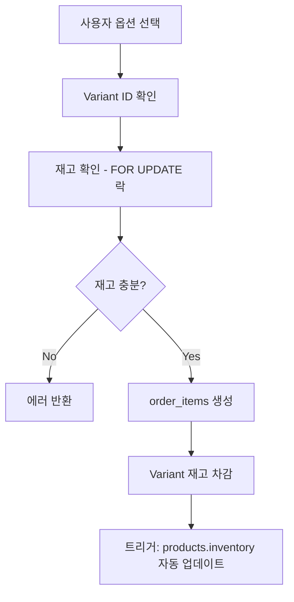
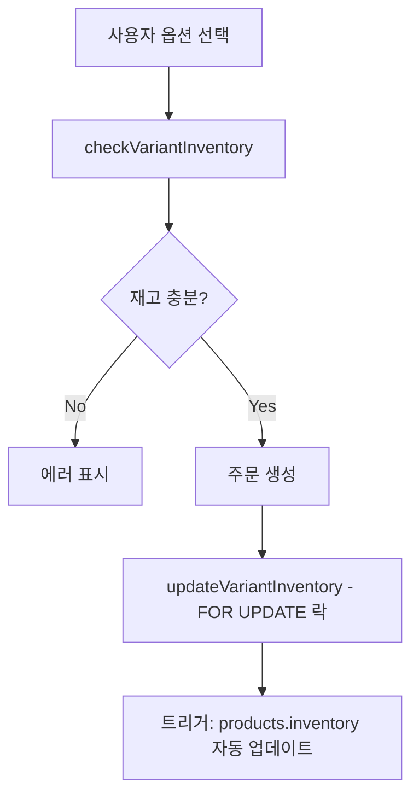

# 📋 문서 불일치 사항 보고서

**작성일**: 2025-10-03
**목적**: 실제 서버 구조와 기존 문서 간 불일치 사항 정리 및 업데이트 가이드

---

## 🎯 요약

실제 프로덕션 서버(`SERVER_STRUCTURE_ANALYSIS_REPORT.md`)와 기존 문서들을 비교한 결과:

| 문서 | 상태 | 업데이트 필요도 | 주요 누락 사항 |
|-----|------|----------------|--------------|
| **DB_REFERENCE_GUIDE.md** | 🟢 최신 (95%) | 낮음 | purchase_order_batches 상세 설명 부족 |
| **DETAILED_DATA_FLOW.md** | 🟡 부분 최신 (70%) | 중간 | 신규 페이지 6개 누락 |
| **SYSTEM_ARCHITECTURE.md** | 🟡 부분 최신 (75%) | 중간 | 신규 시스템 3개 누락 |
| **DATA_ARCHITECTURE.md** | 🟠 오래됨 (60%) | 높음 | Variant 시스템, 발주 시스템 전체 누락 |
| **CLAUDE.md** | 🟢 최신 (90%) | 낮음 | 최신 기능 반영 필요 |

---

## 📊 1. DB_REFERENCE_GUIDE.md 불일치 사항

### 현재 상태: 🟢 최신 (95%)
**마지막 업데이트**: 2025-10-02

### ✅ 정확한 내용
- Variant 시스템 구조 완벽 설명
- 중복 컬럼 패턴 정확 설명
- order_items 이중 저장 전략 정확
- 주요 데이터 저장/조회 패턴 정확

### ⚠️ 누락 또는 부족한 내용

#### 1.1 purchase_order_batches 테이블 상세 설명 부족
**현재**: 간단히 언급만 됨
**필요**: 상세 구조 및 사용 패턴 추가

```markdown
## 추가 필요 내용

### 2.14 purchase_order_batches (발주 이력)

CREATE TABLE purchase_order_batches (
    id UUID PRIMARY KEY DEFAULT gen_random_uuid(),
    supplier_id UUID NOT NULL REFERENCES suppliers(id) ON DELETE CASCADE,
    download_date TIMESTAMPTZ NOT NULL DEFAULT NOW(),
    order_ids UUID[] NOT NULL,  -- 포함된 주문 ID 배열
    adjusted_quantities JSONB,  -- 수량 조정 내역
    total_items INT NOT NULL,
    total_amount INT NOT NULL,
    status VARCHAR(20) DEFAULT 'completed',
    created_at TIMESTAMPTZ DEFAULT NOW(),
    created_by VARCHAR(255)  -- 관리자 이메일
);

**중요 포인트**:
- `order_ids`: GIN 인덱스로 배열 검색 최적화
- `adjusted_quantities`: {order_item_id: adjusted_quantity} JSONB 구조
- 중복 발주 방지: 이미 발주된 order_id 자동 제외
```

#### 1.2 우편번호 시스템 통합 설명 추가
**현재**: postal_code 컬럼만 언급
**필요**: 도서산간 배송비 규칙 및 계산 로직 설명

```markdown
### 6.X 우편번호 및 배송비 계산

**도서산간 배송비 규칙**:
- 제주 (63000-63644): 기본 배송비 + 3,000원
- 울릉도 (40200-40240): 기본 배송비 + 5,000원
- 기타 도서산간: 기본 배송비 + 5,000원

**사용 함수**: `formatShippingInfo(baseShipping, postalCode)`

**적용 페이지**:
- 체크아웃 페이지
- 주문 상세 페이지
- 관리자 주문 리스트/상세
```

---

## 📊 2. DETAILED_DATA_FLOW.md 불일치 사항

### 현재 상태: 🟡 부분 최신 (70%)
**마지막 업데이트**: 2025-10-01

### ⚠️ 누락된 페이지 (6개)

#### 2.1 관리자 - 카테고리 관리
**경로**: `/app/admin/categories/page.js`
**기능**: 카테고리 계층 관리 (대/중/소 분류)
**데이터 흐름**: categories 테이블 CRUD

#### 2.2 관리자 - 업체 관리
**경로**: `/app/admin/suppliers/page.js`
**기능**: 공급업체 정보 관리
**데이터 흐름**: suppliers 테이블 CRUD

#### 2.3 관리자 - 상품 카탈로그
**경로**: `/app/admin/products/catalog/page.js`
**기능**: 전체 상품 목록 및 필터링
**데이터 흐름**: products + variants + categories + suppliers JOIN

#### 2.4 관리자 - 상품 등록 (Variant)
**경로**: `/app/admin/products/new/page.js`
**기능**: Variant 시스템 기반 상품 등록
**데이터 흐름**:
```
1. products 생성
2. product_options 생성
3. product_option_values 생성
4. 옵션 조합 생성 → product_variants
5. variant_option_values 매핑
```

#### 2.5 관리자 - 발송 관리
**경로**: `/app/admin/shipping/page.js`
**기능**: 배송 상태 일괄 관리, 송장 번호 입력
**데이터 흐름**: orders + order_shipping UPDATE

#### 2.6 관리자 - 고객 관리
**경로**: `/app/admin/customers/page.js`
**기능**: 고객 목록, 주문 이력, 통계
**데이터 흐름**: profiles + orders JOIN

### ⚠️ 누락된 데이터 흐름

#### 2.7 Variant 재고 차감 흐름
**위치 추가**: 주문 생성 프로세스



---

## 📊 3. SYSTEM_ARCHITECTURE.md 불일치 사항

### 현재 상태: 🟡 부분 최신 (75%)
**마지막 업데이트**: 2025-10-02

### ⚠️ 누락된 시스템 아키텍처

#### 3.1 Variant 시스템 아키텍처
**추가 위치**: "핵심 시스템" 섹션

```markdown
### 5. Variant 시스템 (옵션 조합 재고 관리)

**목적**: 옵션 조합별 독립 재고 관리 (예: 색상-사이즈 조합)

**구조**:
- product_options: 옵션 정의 (색상, 사이즈)
- product_option_values: 옵션 값 (빨강, 파랑, S, M, L)
- product_variants: SKU별 재고 (빨강-S: 10개, 빨강-M: 5개)
- variant_option_values: Variant-옵션 매핑

**연관 페이지**:
- `/admin/products/new` (Variant 상품 등록)
- `/admin/products/[id]/edit` (Variant 수정)
- `/product/[id]` (사용자 옵션 선택)
- `/checkout` (주문 생성)

**주요 함수**:
- `getProductVariants(productId)`
- `createVariant(variantData, optionValueIds)`
- `updateVariantInventory(variantId, quantityChange)`
- `checkVariantInventory(productId, selectedOptions)`
```

#### 3.2 발주 시스템 아키텍처
**추가 위치**: "관리자 시스템" 섹션

```markdown
### 6. 발주 시스템

**목적**: 업체별 발주서 다운로드 및 이력 추적

**데이터 흐름**:
1. 입금확인 완료 주문 조회 (status = 'deposited')
2. 업체별 그룹핑 (products.supplier_id 기준)
3. 발주서 다운로드 (Excel)
4. purchase_order_batches 테이블에 이력 저장
5. 중복 발주 방지 (order_ids 배열 검색)

**연관 페이지**:
- `/admin/purchase-orders` (업체별 요약)
- `/admin/purchase-orders/[supplierId]` (발주서 상세 및 다운로드)

**주요 함수**:
- `getPurchaseOrdersBySupplier()`
- `getPurchaseOrderBySupplier(supplierId)`
```

#### 3.3 우편번호 시스템
**추가 위치**: "핵심 시스템" 섹션

```markdown
### 7. 우편번호 및 도서산간 배송비 시스템

**목적**: 우편번호 기반 자동 배송비 계산

**구조**:
- profiles.postal_code: 사용자 기본 우편번호
- order_shipping.postal_code: 주문 시점 우편번호 저장
- shippingUtils.js: 도서산간 판별 및 배송비 계산

**도서산간 규칙**:
- 제주: +3,000원
- 울릉도: +5,000원
- 기타 도서산간: +5,000원

**연관 페이지**: 체크아웃, 주문 상세, 관리자 주문 관리 (전체)
```

---

## 📊 4. DATA_ARCHITECTURE.md 불일치 사항

### 현재 상태: 🟠 오래됨 (60%)
**마지막 업데이트**: 2025-09-30

### ⚠️ 주요 누락 사항

#### 4.1 Variant 시스템 전체 누락
**필요**: Variant 관련 테이블 8개 추가

```markdown
### 2.X Variant 시스템 테이블

#### product_options
- 옵션 정의 (색상, 사이즈 등)

#### product_option_values
- 옵션 값 (빨강, 파랑, S, M, L 등)

#### product_variants
- SKU별 재고 관리 (핵심!)
- products.inventory는 자동 계산 (트리거)

#### variant_option_values
- Variant-옵션 매핑 (N:N)
```

#### 4.2 발주 시스템 누락
**필요**: purchase_order_batches 테이블 추가

```markdown
### 3.X purchase_order_batches (발주 이력)
- supplier_id: 업체 ID
- order_ids[]: 포함된 주문 ID 배열 (GIN 인덱스)
- adjusted_quantities: 수량 조정 내역 (JSONB)
- download_date: 다운로드 시각
- created_by: 관리자 이메일
```

#### 4.3 API 엔드포인트 매핑 업데이트 필요

**추가 API**:
```markdown
| 엔드포인트 | 메소드 | 테이블 작업 | 설명 |
|-----------|--------|------------|------|
| `getProductVariants` | - | product_variants (READ) | Variant 목록 조회 |
| `createVariant` | - | product_variants, variant_option_values (INSERT) | Variant 생성 |
| `updateVariantInventory` | - | product_variants (UPDATE with FOR UPDATE) | Variant 재고 업데이트 |
| `getPurchaseOrdersBySupplier` | - | orders, order_items, products, suppliers (READ) | 업체별 발주 목록 |
| `getPurchaseOrderBySupplier` | - | orders, order_items, products, suppliers (READ) | 특정 업체 발주서 |
```

#### 4.4 데이터 흐름 다이어그램 업데이트 필요

**Variant 재고 관리 흐름 추가**:


---

## 📊 5. CLAUDE.md 불일치 사항

### 현재 상태: 🟢 최신 (90%)
**마지막 업데이트**: 2025-10-03

### ⚠️ 추가 필요 내용

#### 5.1 Variant 시스템 작업 가이드
**추가 위치**: "자주 하는 작업" 섹션

```markdown
### Variant 상품 등록 시
✅ 체크리스트
- [ ] DB_REFERENCE_GUIDE.md 3.1절 읽기
- [ ] product_options 생성했는가?
- [ ] product_option_values 생성했는가?
- [ ] 모든 조합의 product_variants 생성했는가?
- [ ] variant_option_values 매핑했는가?
- [ ] SKU 자동 생성 확인했는가?
```

#### 5.2 발주서 생성 가이드
**추가 위치**: "자주 하는 작업" 섹션

```markdown
### 발주서 생성 시
✅ 체크리스트
- [ ] status = 'deposited' 주문만 조회하는가?
- [ ] purchase_order_batches에서 완료된 주문 제외하는가?
- [ ] 업체별로 정확히 그룹핑되는가?
- [ ] Excel 다운로드 시 batch 생성하는가?
- [ ] order_ids 배열에 모든 주문 포함했는가?
```

---

## 🎯 우선순위별 업데이트 계획

### 🔴 우선순위 1 (즉시)
1. **DATA_ARCHITECTURE.md** - Variant 시스템, 발주 시스템 전체 추가
2. **DETAILED_DATA_FLOW.md** - 신규 페이지 6개 추가

### 🟡 우선순위 2 (단기)
3. **SYSTEM_ARCHITECTURE.md** - 신규 시스템 3개 아키텍처 추가
4. **DB_REFERENCE_GUIDE.md** - purchase_order_batches 상세 설명 추가

### 🟢 우선순위 3 (중기)
5. **CLAUDE.md** - Variant/발주 작업 가이드 추가

---

## 📋 업데이트 체크리스트

### DB_REFERENCE_GUIDE.md
- [ ] purchase_order_batches 상세 구조 추가
- [ ] 우편번호 시스템 규칙 설명 추가
- [ ] 발주서 생성 체크리스트 추가

### DETAILED_DATA_FLOW.md
- [ ] 카테고리 관리 페이지 추가
- [ ] 업체 관리 페이지 추가
- [ ] 상품 카탈로그 페이지 추가
- [ ] Variant 상품 등록 페이지 추가
- [ ] 발송 관리 페이지 추가
- [ ] 고객 관리 페이지 추가
- [ ] Variant 재고 차감 흐름 다이어그램 추가

### SYSTEM_ARCHITECTURE.md
- [ ] Variant 시스템 아키텍처 추가
- [ ] 발주 시스템 아키텍처 추가
- [ ] 우편번호 시스템 아키텍처 추가
- [ ] 페이지별 기능 업데이트 (6개 신규 페이지)

### DATA_ARCHITECTURE.md
- [ ] Variant 관련 테이블 8개 추가
- [ ] purchase_order_batches 테이블 추가
- [ ] API 엔드포인트 매핑 업데이트 (Variant 5개, 발주 2개)
- [ ] Variant 재고 관리 흐름 다이어그램 추가

### CLAUDE.md
- [ ] Variant 상품 등록 체크리스트 추가
- [ ] 발주서 생성 체크리스트 추가
- [ ] 최근 업데이트 섹션 갱신 (2025-10-03)

---

**보고서 작성 완료: 2025-10-03**
**다음 작업: 우선순위에 따라 문서 업데이트 실행**
