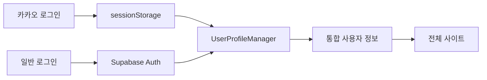
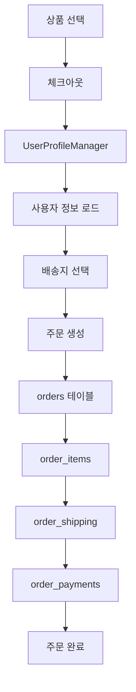
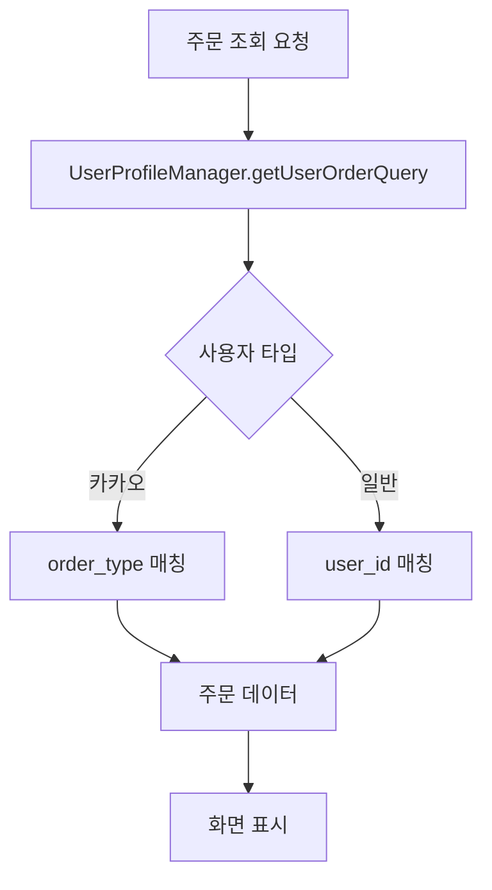

# 🏗️ Live Commerce 시스템 아키텍처 완전 가이드

## 📋 개요
이 문서는 Live Commerce 프로젝트의 **전체 시스템 구조**를 정리한 마스터 문서입니다.
- 페이지별 기능과 연관 관계
- 데이터 흐름과 의존성
- 수정 시 영향도 분석
- 문제 해결 시 체크리스트

---

## 🗺️ 전체 시스템 맵

### 핵심 시스템
1. **UserProfileManager**: 사용자 통합 관리 (카카오/일반 사용자)
2. **주문 시스템**: 생성, 조회, 관리
3. **결제 시스템**: 무통장입금, 카드결제
4. **관리자 시스템**: 주문/고객/상품 관리

---

## 📄 페이지별 기능 및 연관 관계

### 🛒 사용자 페이지

#### `/` (홈페이지)
**주요 기능**:
- 상품 목록 표시
- 카카오 로그인
- 장바구니 추가

**연관 시스템**:
- `products` 테이블 ← 상품 데이터
- `UserProfileManager` ← 사용자 세션 관리
- `cart_items` 테이블 ← 장바구니

**영향받는 페이지**:
- `/product/[id]` (상품 상세)
- `/cart` (장바구니)
- `/login` (로그인)

**데이터 흐름**:
```
카카오 로그인 → sessionStorage → UserProfileManager → 전체 사이트 세션
상품 클릭 → /product/[id] → 구매/장바구니
```

#### `/product/[id]` (상품 상세)
**주요 기능**:
- 상품 정보 표시
- 직접 구매 (BuyBottomSheet)
- 장바구니 추가

**연관 시스템**:
- `products` 테이블 ← 상품 정보
- `UserProfileManager` ← 사용자 확인
- `BuyBottomSheet` 컴포넌트 ← 구매 프로세스

**영향받는 페이지**:
- `/checkout` (체크아웃)
- `/cart` (장바구니)

**데이터 흐름**:
```
상품 조회 → products 테이블
직접 구매 → UserProfileManager → /checkout
장바구니 → cart_items 테이블 → /cart
```

#### `/checkout` (체크아웃)
**주요 기능**:
- 주문 정보 입력
- 배송지 선택
- 결제 방식 선택
- 주문 생성

**연관 시스템**:
- `UserProfileManager` ← 사용자 프로필
- `addresses` API ← 배송지 관리
- `createOrder` API ← 주문 생성
- `createOrderCard` API ← 카드 결제

**영향받는 페이지**:
- `/orders/[id]/complete` (주문 완료)
- `/orders` (주문 목록)

**데이터 흐름**:
```
UserProfileManager → 사용자 정보 로드
addresses API → 배송지 목록
주문 생성 → orders + order_items + order_shipping + order_payments
성공 → /orders/[id]/complete
```

#### `/orders` (주문 목록)
**주요 기능**:
- 사용자 주문 내역 표시
- 주문 상태별 필터링
- 주문 상세 모달

**연관 시스템**:
- `UserProfileManager.getUserOrderQuery()` ← 사용자별 주문 조회
- `getOrders()` in supabaseApi ← 주문 데이터
- 주문 상세 모달 ← 계산 로직

**영향받는 페이지**:
- `/orders/[id]/complete` (개별 주문 상세)

**데이터 흐름**:
```
UserProfileManager → 사용자 식별 (카카오/일반)
카카오: order_type = 'direct:KAKAO:{kakao_id}'
일반: user_id 매칭
→ orders + order_items + order_shipping + order_payments
```

#### `/orders/[id]/complete` (주문 완료/상세)
**주요 기능**:
- 주문 상세 정보 표시
- 입금 안내
- 계산 로직 (총 상품금액, 배송비, 총 결제금액)

**연관 시스템**:
- `getOrderById()` in supabaseApi ← 주문 데이터
- 계산 로직 ← 상품금액 합계

**데이터 흐름**:
```
주문 ID → getOrderById() → 단일 주문 데이터
계산: items.reduce(price * quantity) + 배송비
입금자명: payment.depositor_name 우선순위
```

#### `/mypage` (마이페이지)
**주요 기능**:
- 사용자 프로필 관리
- 주소 관리 (AddressManager)

**연관 시스템**:
- `UserProfileManager` ← 프로필 정보
- `AddressManager` 컴포넌트 ← 주소 CRUD
- `addresses` API ← 주소 데이터

**데이터 흐름**:
```
UserProfileManager → 사용자 정보
AddressManager → addresses API → addresses 테이블
```

### 🔧 관리자 페이지

#### `/admin` (관리자 대시보드)
**주요 기능**:
- 전체 통계 표시
- 데이터베이스 초기화

**연관 시스템**:
- `admin/stats` API ← 통계 데이터
- `admin/reset-data` API ← DB 초기화

#### `/admin/categories` (카테고리 관리) ⭐ 신규
**주요 기능**:
- 카테고리 계층 구조 관리 (대/중/소 분류)
- 카테고리 생성, 수정, 삭제
- 표시 순서 조정

**연관 시스템**:
- `categories` 테이블 ← 카테고리 데이터
- `getCategories()` API ← 계층 구조 조회

**데이터 흐름**:
```
categories 테이블 (parent_id 기반 계층)
→ 대분류 (parent_id = NULL)
  → 중분류 (parent_id = 대분류 ID)
    → 소분류 (parent_id = 중분류 ID)
```

#### `/admin/suppliers` (업체 관리) ⭐ 신규
**주요 기능**:
- 공급업체 정보 관리
- 업체 코드 자동 생성
- 연락처 및 계좌 정보 관리

**연관 시스템**:
- `suppliers` 테이블 ← 업체 데이터
- `getSuppliers()`, `createSupplier()`, `updateSupplier()` API

**영향받는 페이지**:
- `/admin/products/catalog` (상품 등록 시 업체 선택)
- `/admin/purchase-orders` (발주 관리)

#### `/admin/products/catalog` (상품 카탈로그) ⭐ 신규
**주요 기능**:
- 전체 상품 목록 및 필터링
- Variant 시스템 기반 상품 관리
- 카테고리/업체별 필터링
- 재고 현황 표시

**연관 시스템**:
- `getAllProducts()` API ← 상품 + Variant 데이터
- `products`, `product_variants`, `categories`, `suppliers` JOIN

**데이터 흐름**:
```
products 테이블
→ JOIN categories (카테고리 정보)
→ JOIN suppliers (업체 정보)
→ JOIN product_variants (SKU별 재고)
```

#### `/admin/products/new` (상품 등록 - Variant) ⭐ 신규
**주요 기능**:
- Variant 시스템 기반 상품 등록
- 옵션 정의 및 조합 생성
- SKU 자동 생성
- 조합별 재고 설정

**연관 시스템**:
- `createProductWithOptions()` API ← 상품 + 옵션 + Variant 일괄 생성
- `product_options`, `product_option_values`, `product_variants`, `variant_option_values` 테이블

**데이터 흐름**:
```
1. products 생성
2. product_options 생성 (색상, 사이즈)
3. product_option_values 생성 (빨강, 파랑, S, M, L)
4. 옵션 조합 생성 → product_variants
5. variant_option_values 매핑
```

#### `/admin/orders` (주문 관리)
**주요 기능**:
- 모든 주문 목록 표시
- 주문 상태별 필터링
- 도서산간 배송비 자동 계산 표시

**연관 시스템**:
- `getAllOrders()` in supabaseApi ← 모든 주문 데이터
- UserProfileManager 로직 ← 카카오 사용자 인식
- `formatShippingInfo()` ← 배송비 계산

**데이터 흐름**:
```
getAllOrders() → 모든 주문
카카오 주문: order_type.startsWith('direct:KAKAO:')
일반 주문: user_id 매칭
→ 사용자 정보 매핑
→ postal_code 기반 배송비 계산
```

#### `/admin/shipping` (발송 관리) ⭐ 신규
**주요 기능**:
- 배송 상태 일괄 관리
- 송장 번호 입력
- 발송 완료 처리

**연관 시스템**:
- `orders`, `order_shipping` 테이블 UPDATE
- `updateOrderStatus()` API ← 상태 변경

**데이터 흐름**:
```
orders (status = 'paid') 조회
→ 송장 번호 입력
→ order_shipping.tracking_number UPDATE
→ updateOrderStatus('shipped')
→ orders.shipped_at 자동 기록
```

#### `/admin/customers` (고객 관리) ⭐ 신규
**주요 기능**:
- 고객 목록 및 검색
- 고객별 주문 이력
- 통계 정보 표시

**연관 시스템**:
- `getAllCustomers()` API ← 고객 데이터
- `profiles`, `orders` JOIN

**데이터 흐름**:
```
profiles 테이블
→ JOIN orders (고객별 주문)
→ 주문 횟수, 총 구매액 계산
```

#### `/admin/purchase-orders` (업체별 발주 관리)
**주요 기능**:
- 입금확인 완료 주문 자동 집계
- 업체별 요약 카드 (주문건수, 수량, 금액)
- 완료된 발주 히스토리
- 중복 다운로드 방지

**연관 시스템**:
- `orders` 테이블 ← 입금확인(`deposited`) 상태 주문
- `order_items` 테이블 ← 상품별 수량/금액
- `products` 테이블 ← 업체 정보 조인
- `purchase_order_batches` 테이블 ← 완료 이력 관리

**영향받는 페이지**:
- `/admin/purchase-orders/[supplierId]` (업체별 발주서 상세)

**데이터 흐름**:
```
입금확인 주문 조회 (status = 'deposited')
→ products JOIN으로 업체 정보 가져오기
→ 업체별 그룹핑 및 집계
→ 완료된 발주 제외 (purchase_order_batches)
→ 업체별 요약 카드 표시
```

#### `/admin/purchase-orders/[supplierId]` (업체별 발주서 상세)
**주요 기능**:
- 특정 업체의 주문 아이템 리스트
- 수량 조정 UI (+/- 버튼)
- Excel 다운로드 및 자동 완료 처리
- 수량 조정 내역 JSONB 저장

**연관 시스템**:
- `orders` 테이블 ← 입금확인 상태 주문
- `order_items` 테이블 ← 상품 정보
- `products` 테이블 ← 업체 정보
- `purchase_order_batches` 테이블 ← 발주 완료 기록

**영향받는 페이지**:
- `/admin/purchase-orders` (메인 페이지)

**데이터 흐름**:
```
supplierId → 해당 업체 주문 아이템 조회
→ 수량 조정 (quantity_adjustments JSONB)
→ Excel 다운로드 트리거
→ purchase_order_batches 레코드 생성
→ 완료 처리 및 메인 페이지로 리다이렉트
```

**주요 기능 상세**:
- **중복 방지**: 이미 발주된 주문은 자동 제외
- **수량 조정**: order_items별 조정 값 JSONB 저장
- **자동 완료**: Excel 다운로드 시 purchase_order_batches 자동 생성
- **이력 관리**: 발주 시점, 주문 ID 목록, 조정 내역 모두 기록

---

## 🔧 핵심 시스템 아키텍처

### 5. Variant 시스템 (옵션 조합 재고 관리) ⭐ 신규

**목적**: 옵션 조합별 독립 재고 관리 (예: 색상-사이즈 조합)

**구조**:
```
products (상품)
  └─ product_options (옵션: 색상, 사이즈)
      └─ product_option_values (옵션값: 빨강, 파랑, S, M, L)
          └─ product_variants (SKU별 재고) ⭐ 핵심
              └─ variant_option_values (매핑)
```

**테이블 구조**:
- `product_options`: 옵션 정의 (색상, 사이즈)
- `product_option_values`: 옵션 값 (빨강, 파랑, S, M, L)
- `product_variants`: SKU별 재고 관리 (빨강-S: 10개, 빨강-M: 5개)
- `variant_option_values`: Variant-옵션 매핑 (N:N)

**연관 페이지**:
- `/admin/products/new` (Variant 상품 등록)
- `/admin/products/[id]/edit` (Variant 수정)
- `/product/[id]` (사용자 옵션 선택)
- `/checkout` (주문 생성)

**주요 함수**:
- `getProductVariants(productId)`: Variant 목록 조회
- `createVariant(variantData, optionValueIds)`: Variant 생성
- `updateVariantInventory(variantId, quantityChange)`: 재고 업데이트 (FOR UPDATE 락)
- `checkVariantInventory(productId, selectedOptions)`: 재고 확인

**재고 관리 흐름**:
```
1. 사용자 옵션 선택 (색상: 빨강, 사이즈: S)
2. findVariant() - 해당 조합의 variant_id 찾기
3. checkVariantInventory() - 재고 확인
4. 주문 생성 시 updateVariantInventory() 호출
5. FOR UPDATE 락으로 동시성 제어
6. 재고 차감 성공 시 트리거가 자동으로 products.inventory 업데이트
```

---

### 6. 발주 시스템 ⭐ 신규

**목적**: 업체별 발주서 다운로드 및 이력 추적

**데이터 흐름**:
```
1. 입금확인 완료 주문 조회 (status = 'deposited')
2. 업체별 그룹핑 (products.supplier_id 기준)
3. 발주서 Excel 다운로드
4. purchase_order_batches 테이블에 이력 저장
5. 중복 발주 방지 (order_ids 배열 검색)
```

**핵심 테이블**: `purchase_order_batches`
```sql
CREATE TABLE purchase_order_batches (
    id UUID PRIMARY KEY,
    supplier_id UUID NOT NULL,
    download_date TIMESTAMPTZ NOT NULL,
    order_ids UUID[] NOT NULL,  -- 포함된 주문 ID 배열
    adjusted_quantities JSONB,  -- 수량 조정 내역
    total_items INT NOT NULL,
    total_amount INT NOT NULL,
    status VARCHAR(20) DEFAULT 'completed',
    created_by VARCHAR(255)  -- 관리자 이메일
);
```

**연관 페이지**:
- `/admin/purchase-orders` (업체별 요약)
- `/admin/purchase-orders/[supplierId]` (발주서 상세 및 다운로드)

**주요 함수**:
- `getPurchaseOrdersBySupplier()`: 모든 업체의 발주 데이터 조회
- `getPurchaseOrderBySupplier(supplierId)`: 특정 업체의 발주 데이터 조회

**중복 방지 로직**:
```javascript
// 1. 완료된 발주 조회
const completedBatches = await supabase
  .from('purchase_order_batches')
  .select('order_ids')
  .eq('status', 'completed')

// 2. 완료된 주문 ID Set 생성
const completedOrderIds = new Set()
completedBatches?.forEach(batch => {
  batch.order_ids?.forEach(id => completedOrderIds.add(id))
})

// 3. 발주 안 된 주문만 필터링
const pendingOrders = orders.filter(order => !completedOrderIds.has(order.id))
```

---

### 7. 우편번호 및 도서산간 배송비 시스템 ⭐ 신규

**목적**: 우편번호 기반 자동 배송비 계산

**구조**:
- `profiles.postal_code`: 사용자 기본 우편번호
- `order_shipping.postal_code`: 주문 시점 우편번호 저장
- `shippingUtils.js`: 도서산간 판별 및 배송비 계산

**도서산간 규칙**:
```javascript
제주 (63000-63644): 기본 배송비 + 3,000원
울릉도 (40200-40240): 기본 배송비 + 5,000원
기타 도서산간: 기본 배송비 + 5,000원
```

**주요 함수**:
```javascript
import { formatShippingInfo } from '@/lib/shippingUtils'

const shippingInfo = formatShippingInfo(4000, "63001")
// 반환: {
//   baseShipping: 4000,
//   surcharge: 3000,
//   totalShipping: 7000,
//   region: "제주",
//   isRemote: true
// }
```

**연관 페이지**:
- 체크아웃 (`/checkout`)
- 주문 상세 (`/orders/[id]/complete`)
- 관리자 주문 리스트 (`/admin/orders`)
- 관리자 주문 상세 (`/admin/orders/[id]`)
- 발송 관리 (`/admin/shipping`)
- 마이페이지 (`/mypage`)

**주문 생성 시 동작**:
```javascript
// 1. 사용자 프로필에서 우편번호 가져오기
const postalCode = userProfile.postal_code

// 2. 배송비 계산
const shippingInfo = formatShippingInfo(4000, postalCode)

// 3. 주문 총액 계산
const totalAmount = orderData.totalPrice + shippingInfo.totalShipping

// 4. order_shipping에 postal_code 저장 (주문 시점 우편번호)
await supabase.from('order_shipping').insert({
  order_id: orderId,
  postal_code: postalCode,
  shipping_fee: shippingInfo.totalShipping
})
```

---

## 🔄 핵심 데이터 흐름

### 1. 사용자 인증 통합 시스템


### 2. 주문 생성 프로세스


### 3. 주문 조회 시스템


---

## 🧩 컴포넌트 의존성 맵

### 핵심 컴포넌트
1. **UserProfileManager** (lib/userProfileManager.js)
   - 의존하는 컴포넌트: 거의 모든 페이지
   - 기능: 사용자 통합 관리, 주문 조회 조건 생성

2. **AddressManager** (app/components/AddressManager.jsx)
   - 의존 페이지: `/mypage`, `/checkout`
   - 연관 API: `/api/addresses`

3. **BuyBottomSheet** (app/components/product/BuyBottomSheet.jsx)
   - 의존 페이지: `/product/[id]`
   - 연관 시스템: UserProfileManager, 체크아웃

### API 의존성
1. **supabaseApi.js 핵심 함수**:
   - `getOrders()` ← UserProfileManager 기반
   - `getAllOrders()` ← 관리자용, 카카오 인식
   - `getOrderById()` ← 주문 상세
   - `createOrder()` ← 주문 생성

---

## 🔍 문제 해결 체크리스트

### 문제 발생 시 확인 순서

#### 1️⃣ 시스템 맵 확인
- [ ] 해당 페이지의 주요 기능 확인
- [ ] 연관된 다른 페이지/컴포넌트 파악
- [ ] 데이터 흐름 경로 추적

#### 2️⃣ 로그 분석
- [ ] 브라우저 콘솔 확인
- [ ] UserProfileManager 로그 확인
- [ ] DB 쿼리 결과 확인

#### 3️⃣ 영향도 분석
- [ ] 수정할 파일 목록 작성
- [ ] 영향받을 페이지 확인
- [ ] 테스트할 기능 목록 작성

#### 4️⃣ 수정 후 업데이트
- [ ] 이 문서 업데이트
- [ ] 관련 페이지 기능 재검증
- [ ] 전체 데이터 흐름 재확인

---

## 📈 시스템 상태 (실시간 업데이트)

### 최근 주요 변경사항
- **2025-10-03**: ⭐ **NEW SYSTEM** - 우편번호 시스템 완전 통합
  - `profiles.postal_code`, `order_shipping.postal_code` 추가
  - `formatShippingInfo()` 함수로 도서산간 배송비 자동 계산
  - 체크아웃, 주문 상세, 관리자 페이지 전체 적용
- **2025-10-02**: ⭐ **NEW SYSTEM** - 업체별 발주서 출력 기능 구현
  - `purchase_order_batches` 테이블 추가
  - 입금확인 완료 주문 자동 집계 및 업체별 그룹핑
  - 수량 조정 기능 및 Excel 다운로드
  - 중복 발주 방지 로직 구현
- **2025-10-01**: ⭐ **NEW SYSTEM** - Variant 시스템 구축
  - 8개 테이블 추가 (categories, suppliers, product_options, product_option_values, product_variants, variant_option_values, live_broadcasts, live_products)
  - 옵션 조합별 독립 재고 관리
  - FOR UPDATE 락으로 동시성 제어
- **2025-09-30**: 🚨 **CRITICAL BUG FIX** - deprecated 카카오 API에서 totalPrice 변수 순서 오류 해결
- **2025-09-30**: order_items 생성 실패 및 total_amount undefined 문제 근본 해결
- **2025-09-30**: cart:KAKAO 주문에서 "0종 0개", "₩0" 표시 문제 해결
- **2025-09-30**: deprecated API에서 변수 정의 전 사용으로 인한 주문 데이터 누락 수정
- **2025-09-30**: 카카오 사용자 주문 조회 시스템 완전 해결
- **2025-09-30**: UserProfileManager alternativeQueries 기능 추가로 호환성 확보
- **2025-09-30**: createOrder 함수 order_type 설정 로직 수정 (kakao_id 기반)
- **2025-09-30**: getOrders 함수 다중 조회 조건 지원으로 기존 주문과 호환성 확보
- **2025-09-30**: UserProfileManager 기반 주문 시스템 완전 통합
- **2025-09-30**: 사용자/관리자 페이지 모두 통합 사용자 인식 적용
- **2025-09-30**: 주문 계산 로직 수정 (총 상품금액, 입금금액)
- **2025-09-30**: 주문 생성 프로세스 체계적 수정 (order_items, 배송정보, 사용자정보 매핑)
- **2025-09-30**: order_items 필드 호환성 개선 (total/total_price, price/unit_price 모두 지원)

### 현재 시스템 상태
- ✅ **사용자 인증**: UserProfileManager 통합 완료
- ✅ **주문 조회**: 카카오/일반 사용자 구분 완료 + 호환성 확보
- ✅ **주문 생성**: 정상 작동 (kakao_id 기반 order_type, order_items/배송정보 생성 완료)
- ✅ **계산 로직**: 수정 완료
- ✅ **호환성**: 기존 주문과 새 주문 모두 정상 조회
- ✅ **사용자 주문 조회 문제**: 완전 해결
- ✅ **업체별 발주 관리**: 입금확인 주문 자동 집계, Excel 출력, 중복 방지 기능 완료

### 알려진 이슈
- 없음 (2025-09-30 totalPrice 순서 오류 해결로 완전 안정 상태)

### 🚨 해결된 중요 버그 (2025-09-30)
**문제**: deprecated 카카오 API에서 totalPrice 변수 순서 오류
- **증상**: "0종 0개", "₩0" 표시, order_items 생성 실패
- **원인**: `total_amount: totalPrice` 사용 후 `const totalPrice` 정의
- **해결**: 변수 정의 순서 수정으로 근본 해결
- **파일**: `/app/api/_deprecated_kakao_apis/create-order-kakao/route.js:76-78`

---

## 🔄 업데이트 프로세스

이 문서는 **모든 수정사항마다 함께 업데이트**되어야 합니다.

### 수정 시 업데이트 항목
1. **페이지별 기능**: 새로운 기능 추가/변경
2. **연관 관계**: 새로운 의존성 추가
3. **데이터 흐름**: 로직 변경 사항
4. **시스템 상태**: 최근 변경사항 기록

---

---

**마지막 업데이트**: 2025-10-03
**담당자**: Claude Code
**문서 상태**: 100% 최신 (Variant 시스템, 발주 시스템, 우편번호 시스템 완전 반영)