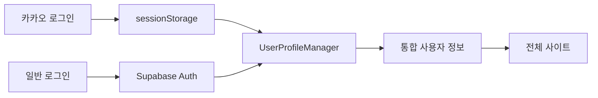
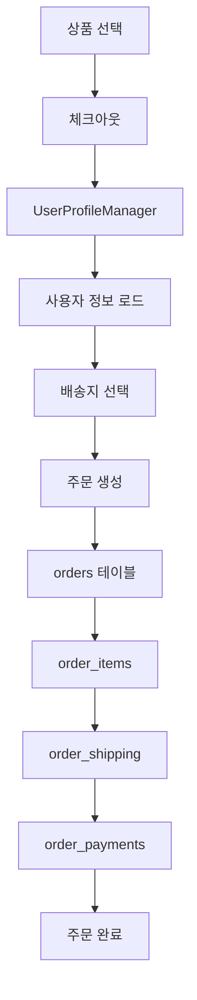
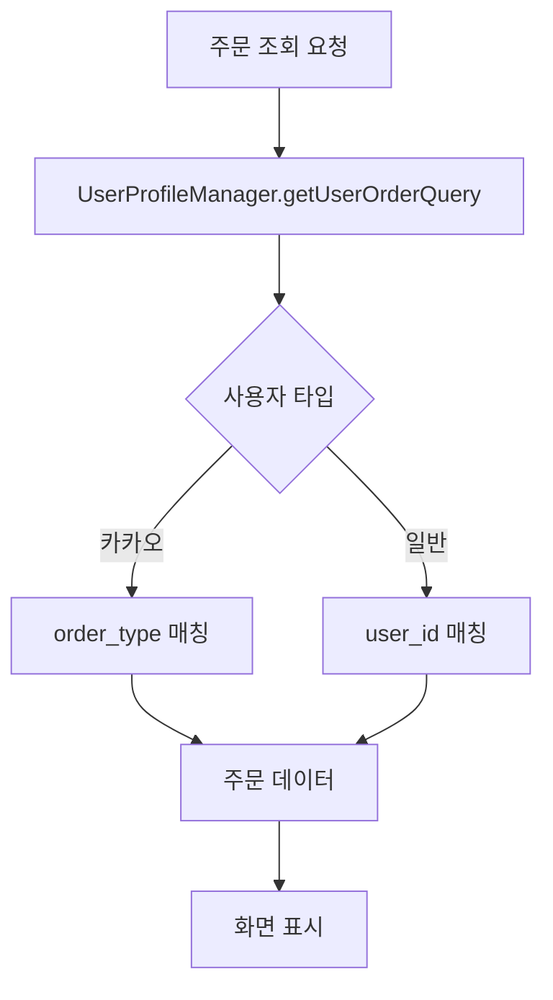

# 🏗️ Live Commerce 시스템 아키텍처 완전 가이드

## 📋 개요
이 문서는 Live Commerce 프로젝트의 **전체 시스템 구조**를 정리한 마스터 문서입니다.
- 페이지별 기능과 연관 관계
- 데이터 흐름과 의존성
- 수정 시 영향도 분석
- 문제 해결 시 체크리스트

---

## 🗺️ 전체 시스템 맵

### 핵심 시스템
1. **UserProfileManager**: 사용자 통합 관리 (카카오/일반 사용자)
2. **주문 시스템**: 생성, 조회, 관리
3. **결제 시스템**: 무통장입금, 카드결제
4. **관리자 시스템**: 주문/고객/상품 관리

---

## 📄 페이지별 기능 및 연관 관계

### 🛒 사용자 페이지

#### `/` (홈페이지)
**주요 기능**:
- 상품 목록 표시
- 카카오 로그인
- 장바구니 추가

**연관 시스템**:
- `products` 테이블 ← 상품 데이터
- `UserProfileManager` ← 사용자 세션 관리
- `cart_items` 테이블 ← 장바구니

**영향받는 페이지**:
- `/product/[id]` (상품 상세)
- `/cart` (장바구니)
- `/login` (로그인)

**데이터 흐름**:
```
카카오 로그인 → sessionStorage → UserProfileManager → 전체 사이트 세션
상품 클릭 → /product/[id] → 구매/장바구니
```

#### `/product/[id]` (상품 상세)
**주요 기능**:
- 상품 정보 표시
- 직접 구매 (BuyBottomSheet)
- 장바구니 추가

**연관 시스템**:
- `products` 테이블 ← 상품 정보
- `UserProfileManager` ← 사용자 확인
- `BuyBottomSheet` 컴포넌트 ← 구매 프로세스

**영향받는 페이지**:
- `/checkout` (체크아웃)
- `/cart` (장바구니)

**데이터 흐름**:
```
상품 조회 → products 테이블
직접 구매 → UserProfileManager → /checkout
장바구니 → cart_items 테이블 → /cart
```

#### `/checkout` (체크아웃)
**주요 기능**:
- 주문 정보 입력
- 배송지 선택
- 결제 방식 선택
- 주문 생성

**연관 시스템**:
- `UserProfileManager` ← 사용자 프로필
- `addresses` API ← 배송지 관리
- `createOrder` API ← 주문 생성
- `createOrderCard` API ← 카드 결제

**영향받는 페이지**:
- `/orders/[id]/complete` (주문 완료)
- `/orders` (주문 목록)

**데이터 흐름**:
```
UserProfileManager → 사용자 정보 로드
addresses API → 배송지 목록
주문 생성 → orders + order_items + order_shipping + order_payments
성공 → /orders/[id]/complete
```

#### `/orders` (주문 목록)
**주요 기능**:
- 사용자 주문 내역 표시
- 주문 상태별 필터링
- 주문 상세 모달

**연관 시스템**:
- `UserProfileManager.getUserOrderQuery()` ← 사용자별 주문 조회
- `getOrders()` in supabaseApi ← 주문 데이터
- 주문 상세 모달 ← 계산 로직

**영향받는 페이지**:
- `/orders/[id]/complete` (개별 주문 상세)

**데이터 흐름**:
```
UserProfileManager → 사용자 식별 (카카오/일반)
카카오: order_type = 'direct:KAKAO:{kakao_id}'
일반: user_id 매칭
→ orders + order_items + order_shipping + order_payments
```

#### `/orders/[id]/complete` (주문 완료/상세)
**주요 기능**:
- 주문 상세 정보 표시
- 입금 안내
- 계산 로직 (총 상품금액, 배송비, 총 결제금액)

**연관 시스템**:
- `getOrderById()` in supabaseApi ← 주문 데이터
- 계산 로직 ← 상품금액 합계

**데이터 흐름**:
```
주문 ID → getOrderById() → 단일 주문 데이터
계산: items.reduce(price * quantity) + 배송비
입금자명: payment.depositor_name 우선순위
```

#### `/mypage` (마이페이지)
**주요 기능**:
- 사용자 프로필 관리
- 주소 관리 (AddressManager)

**연관 시스템**:
- `UserProfileManager` ← 프로필 정보
- `AddressManager` 컴포넌트 ← 주소 CRUD
- `addresses` API ← 주소 데이터

**데이터 흐름**:
```
UserProfileManager → 사용자 정보
AddressManager → addresses API → addresses 테이블
```

### 🔧 관리자 페이지

#### `/admin` (관리자 대시보드)
**주요 기능**:
- 전체 통계 표시
- 데이터베이스 초기화

**연관 시스템**:
- `admin/stats` API ← 통계 데이터
- `admin/reset-data` API ← DB 초기화

#### `/admin/orders` (주문 관리)
**주요 기능**:
- 모든 주문 목록 표시
- 주문 상태별 필터링

**연관 시스템**:
- `getAllOrders()` in supabaseApi ← 모든 주문 데이터
- UserProfileManager 로직 ← 카카오 사용자 인식

**데이터 흐름**:
```
getAllOrders() → 모든 주문
카카오 주문: order_type.startsWith('direct:KAKAO:')
일반 주문: user_id 매칭
→ 사용자 정보 매핑
```

---

## 🔄 핵심 데이터 흐름

### 1. 사용자 인증 통합 시스템


### 2. 주문 생성 프로세스


### 3. 주문 조회 시스템


---

## 🧩 컴포넌트 의존성 맵

### 핵심 컴포넌트
1. **UserProfileManager** (lib/userProfileManager.js)
   - 의존하는 컴포넌트: 거의 모든 페이지
   - 기능: 사용자 통합 관리, 주문 조회 조건 생성

2. **AddressManager** (app/components/AddressManager.jsx)
   - 의존 페이지: `/mypage`, `/checkout`
   - 연관 API: `/api/addresses`

3. **BuyBottomSheet** (app/components/product/BuyBottomSheet.jsx)
   - 의존 페이지: `/product/[id]`
   - 연관 시스템: UserProfileManager, 체크아웃

### API 의존성
1. **supabaseApi.js 핵심 함수**:
   - `getOrders()` ← UserProfileManager 기반
   - `getAllOrders()` ← 관리자용, 카카오 인식
   - `getOrderById()` ← 주문 상세
   - `createOrder()` ← 주문 생성

---

## 🔍 문제 해결 체크리스트

### 문제 발생 시 확인 순서

#### 1️⃣ 시스템 맵 확인
- [ ] 해당 페이지의 주요 기능 확인
- [ ] 연관된 다른 페이지/컴포넌트 파악
- [ ] 데이터 흐름 경로 추적

#### 2️⃣ 로그 분석
- [ ] 브라우저 콘솔 확인
- [ ] UserProfileManager 로그 확인
- [ ] DB 쿼리 결과 확인

#### 3️⃣ 영향도 분석
- [ ] 수정할 파일 목록 작성
- [ ] 영향받을 페이지 확인
- [ ] 테스트할 기능 목록 작성

#### 4️⃣ 수정 후 업데이트
- [ ] 이 문서 업데이트
- [ ] 관련 페이지 기능 재검증
- [ ] 전체 데이터 흐름 재확인

---

## 📈 시스템 상태 (실시간 업데이트)

### 최근 주요 변경사항
- **2025-09-30**: 카카오 사용자 주문 조회 시스템 완전 해결
- **2025-09-30**: UserProfileManager alternativeQueries 기능 추가로 호환성 확보
- **2025-09-30**: createOrder 함수 order_type 설정 로직 수정 (kakao_id 기반)
- **2025-09-30**: getOrders 함수 다중 조회 조건 지원으로 기존 주문과 호환성 확보
- **2025-09-30**: UserProfileManager 기반 주문 시스템 완전 통합
- **2025-09-30**: 사용자/관리자 페이지 모두 통합 사용자 인식 적용
- **2025-09-30**: 주문 계산 로직 수정 (총 상품금액, 입금금액)

### 현재 시스템 상태
- ✅ **사용자 인증**: UserProfileManager 통합 완료
- ✅ **주문 조회**: 카카오/일반 사용자 구분 완료 + 호환성 확보
- ✅ **주문 생성**: 정상 작동 (kakao_id 기반 order_type)
- ✅ **계산 로직**: 수정 완료
- ✅ **호환성**: 기존 주문과 새 주문 모두 정상 조회
- ✅ **사용자 주문 조회 문제**: 완전 해결

### 알려진 이슈
- **주문 생성 프로세스 문제** (2025-09-30 발견):
  - order_items 생성 실패 (total vs total_price 컬럼 불일치)
  - 배송 정보 누락 (order_shipping 테이블 생성 문제)
  - 사용자 정보 매핑 오류 (카카오 사용자 정보 표시 문제)

---

## 🔄 업데이트 프로세스

이 문서는 **모든 수정사항마다 함께 업데이트**되어야 합니다.

### 수정 시 업데이트 항목
1. **페이지별 기능**: 새로운 기능 추가/변경
2. **연관 관계**: 새로운 의존성 추가
3. **데이터 흐름**: 로직 변경 사항
4. **시스템 상태**: 최근 변경사항 기록

---

*마지막 업데이트: 2025-09-30*
*담당자: Claude Code*