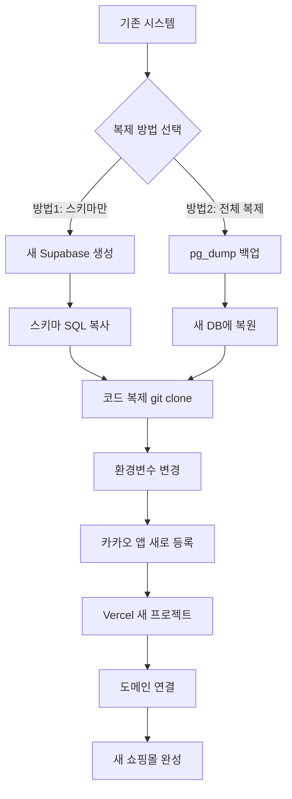

# 🔄 시스템 복제 가이드

**작성일**: 2025-10-01
**목적**: 동일한 쇼핑몰 시스템을 새로 만들 때 사용하는 가이드

---

## 🎯 핵심 정리

### ❌ 단순 복사-붙여넣기: **불가능**

**이유**:
```
현재 시스템 = 코드 + 환경변수 + 데이터베이스 + 설정
```

### ✅ 체계적 복제: **1시간이면 가능**

**필요한 작업**:
1. Supabase 프로젝트 생성 (새 DB)
2. 스키마 복제 (SQL 복사)
3. 코드 복제 (Git)
4. 환경변수 재설정
5. 외부 서비스 재등록 (카카오 등)

---

## 📋 전체 프로세스 맵



---

## 🛠️ 단계별 상세 가이드

### **Step 1: 새 Supabase 프로젝트 생성** (5분)

```
1. https://supabase.com 접속
2. New Project 클릭
3. 프로젝트명: "new-shop"
4. 리전 선택: Northeast Asia (Seoul)
5. 비밀번호 설정 및 저장
6. 생성 완료 대기 (2-3분)
```

---

### **Step 2: 데이터베이스 스키마 복제** (10분)

#### **방법 A: 스키마만 복제** (✅ 권장 - 깨끗한 시작)

```sql
-- 1. 기존 Supabase Dashboard → SQL Editor → 다음 실행하여 스키마 확인

SELECT table_name
FROM information_schema.tables
WHERE table_schema = 'public'
ORDER BY table_name;

-- 2. 각 테이블의 CREATE TABLE 문 가져오기
-- 기존 프로젝트의 /supabase_schema.sql 파일 사용

-- 3. 새 Supabase Dashboard → SQL Editor → 전체 스키마 실행
-- 순서대로 실행:
-- - profiles
-- - categories, products, product_options
-- - orders, order_items, order_shipping, order_payments
-- - cart_items, wishlist, reviews
-- - coupons, user_coupons
-- - kakao_users (카카오 로그인용)
```

**장점**:
- 깨끗한 데이터베이스
- 테스트 데이터 없음
- 빠름 (5분 내 완료)

**단점**:
- 상품 데이터를 다시 입력해야 함

---

#### **방법 B: 스키마 + 데이터 전체 복제** (복잡함 - 선택사항)

```bash
# 1. 기존 DB 전체 백업
# Supabase Dashboard → Settings → Database → Connection String 복사

pg_dump "postgresql://postgres:[PASSWORD]@[HOST]:5432/postgres" \
  --clean --if-exists \
  --exclude-table-data='auth.*' \
  > backup.sql

# 2. 새 Supabase 프로젝트에 복원
psql "postgresql://postgres:[NEW_PASSWORD]@[NEW_HOST]:5432/postgres" \
  < backup.sql

# 3. 불필요한 데이터 삭제
# - profiles (기존 사용자 데이터)
# - orders (기존 주문 데이터)
# - 테스트 데이터
```

**장점**:
- 모든 상품 데이터 그대로 복제

**단점**:
- auth.users는 복제 안 됨 (Supabase Auth 시스템)
- 불필요한 데이터 정리 필요
- 복잡함 (30분~1시간)

---

### **Step 3: 코드 복제** (5분)

```bash
# 1. 기존 프로젝트 복제
git clone https://github.com/your-repo/live-commerce.git new-shop

cd new-shop

# 2. Git 히스토리 제거 및 새 저장소 초기화
rm -rf .git
git init

# 3. 새 GitHub 저장소 생성 후 연결
# GitHub에서 "new-shop" 저장소 생성

git remote add origin https://github.com/your-repo/new-shop.git

# 4. 첫 커밋 및 푸시
git add .
git commit -m "Initial commit - cloned from live-commerce"
git branch -M main
git push -u origin main
```

---

### **Step 4: 환경변수 설정** (10분)

#### **로컬 환경변수 설정**

```bash
# 1. .env.local 파일 수정
cd new-shop

# 2. 새 Supabase 정보로 교체
# Supabase Dashboard → Settings → API

# .env.local
NEXT_PUBLIC_SUPABASE_URL=https://[NEW_PROJECT_ID].supabase.co
NEXT_PUBLIC_SUPABASE_ANON_KEY=[새로운_익명_키]
NEXT_PUBLIC_KAKAO_CLIENT_ID=[아직_미설정]
```

#### **Vercel 환경변수 설정** (나중에 Step 6에서)

---

### **Step 5: 카카오 앱 등록** (15분)

```
1. https://developers.kakao.com 접속

2. 내 애플리케이션 → 애플리케이션 추가하기
   - 앱 이름: "new-shop"
   - 사업자명: (기존과 동일)

3. 앱 설정 → 플랫폼 → Web 플랫폼 등록
   - 사이트 도메인: http://localhost:3000 (개발용)
   - 사이트 도메인: https://new-shop.vercel.app (배포용)

4. 제품 설정 → 카카오 로그인 활성화
   - Redirect URI 설정:
     * http://localhost:3000/auth/kakao/callback
     * https://new-shop.vercel.app/auth/kakao/callback

5. 앱 키 복사
   - JavaScript 키 복사

6. .env.local 업데이트
   NEXT_PUBLIC_KAKAO_CLIENT_ID=[복사한_JavaScript_키]
```

---

### **Step 6: Vercel 배포** (10분)

```
1. https://vercel.com 접속

2. New Project 클릭

3. Import Git Repository
   - GitHub에서 "new-shop" 저장소 선택

4. Configure Project
   - Framework Preset: Next.js (자동 감지)
   - Root Directory: ./
   - Build Command: npm run build
   - Output Directory: .next

5. Environment Variables 설정
   다음 3개 변수 추가:

   NEXT_PUBLIC_SUPABASE_URL
   → https://[NEW_PROJECT_ID].supabase.co

   NEXT_PUBLIC_SUPABASE_ANON_KEY
   → [새_익명_키]

   NEXT_PUBLIC_KAKAO_CLIENT_ID
   → [카카오_JavaScript_키]

6. Deploy 클릭

7. 배포 완료 후 URL 확인
   - https://new-shop.vercel.app

8. 카카오 개발자 센터 Redirect URI에 실제 URL 추가
   - https://new-shop.vercel.app/auth/kakao/callback
```

---

### **Step 7: 도메인 연결** (옵션 - 10분)

```
1. Vercel Dashboard → 프로젝트 선택

2. Settings → Domains

3. 커스텀 도메인 추가
   - 예: new-shop.com

4. DNS 설정
   - A Record: 76.76.21.21
   - CNAME: cname.vercel-dns.com

5. SSL 인증서 자동 발급 대기 (5-10분)

6. 도메인 연결 완료
```

---

## ⏱️ 총 소요 시간

| 작업 | 시간 | 난이도 | 필수 여부 |
|------|------|--------|-----------|
| Supabase 프로젝트 생성 | 5분 | ⭐ 쉬움 | ✅ 필수 |
| 스키마 복제 | 10분 | ⭐⭐ 보통 | ✅ 필수 |
| 코드 복제 | 5분 | ⭐ 쉬움 | ✅ 필수 |
| 환경변수 설정 | 10분 | ⭐⭐ 보통 | ✅ 필수 |
| 카카오 앱 등록 | 15분 | ⭐⭐ 보통 | ✅ 필수 |
| Vercel 배포 | 10분 | ⭐⭐ 보통 | ✅ 필수 |
| 도메인 연결 | 10분 | ⭐⭐⭐ 어려움 | ⬜ 옵션 |
| **총 소요 시간** | **55분 ~ 1시간 5분** | | |

---

## 🎯 더 쉬운 방법: "템플릿화" (향후 개선안)

### **한 번만 세팅하면 이후로는 더 쉬워지는 방법**

```bash
# 템플릿 저장소 구조
live-commerce-template/
├── README.md                    # 설정 가이드
├── .env.example                 # 환경변수 예시
├── supabase/
│   ├── schema.sql              # 전체 스키마
│   └── seed.sql                # 기본 데이터 (카테고리 등)
├── setup.sh                     # 자동 설정 스크립트
└── docs/
    ├── DEPLOYMENT.md           # 배포 가이드
    └── CUSTOMIZATION.md        # 커스터마이징 가이드
```

**setup.sh 스크립트 예시**:
```bash
#!/bin/bash
echo "🚀 새 쇼핑몰 설정 시작..."

# 1. 환경변수 입력받기
read -p "프로젝트명: " PROJECT_NAME
read -p "Supabase URL: " SUPABASE_URL
read -p "Supabase Anon Key: " SUPABASE_KEY
read -p "Kakao Client ID: " KAKAO_ID

# 2. .env.local 생성
cat > .env.local << EOF
NEXT_PUBLIC_SUPABASE_URL=$SUPABASE_URL
NEXT_PUBLIC_SUPABASE_ANON_KEY=$SUPABASE_KEY
NEXT_PUBLIC_KAKAO_CLIENT_ID=$KAKAO_ID
EOF

# 3. 의존성 설치
echo "📦 의존성 설치 중..."
npm install

# 4. 완료
echo "✅ 설정 완료!"
echo ""
echo "📋 다음 단계:"
echo "1. Supabase Dashboard에서 supabase/schema.sql 실행"
echo "2. Supabase Dashboard에서 supabase/seed.sql 실행 (선택)"
echo "3. npm run dev로 개발 서버 시작"
echo "4. Vercel에 배포 (vercel deploy)"
```

**사용법**:
```bash
# 1. 템플릿 복제
git clone https://github.com/your-repo/live-commerce-template.git my-new-shop

# 2. 자동 설정 실행
cd my-new-shop
chmod +x setup.sh
./setup.sh

# 3. 안내에 따라 진행
```

---

## 📋 체크리스트

### **복제 전 준비사항**
- [ ] 새 Supabase 계정 또는 프로젝트 슬롯 확인
- [ ] 새 GitHub 저장소 준비
- [ ] 카카오 개발자 계정 확인
- [ ] Vercel 계정 확인
- [ ] 도메인 준비 (선택사항)

### **복제 진행 체크리스트**
- [ ] Step 1: Supabase 프로젝트 생성 완료
- [ ] Step 2: 데이터베이스 스키마 복제 완료
- [ ] Step 3: 코드 복제 및 Git 설정 완료
- [ ] Step 4: 로컬 환경변수 설정 완료
- [ ] Step 5: 카카오 앱 등록 완료
- [ ] Step 6: Vercel 배포 완료
- [ ] Step 7: 도메인 연결 완료 (선택)

### **복제 후 테스트**
- [ ] 로컬 개발 서버 정상 작동 (`npm run dev`)
- [ ] 카카오 로그인 테스트
- [ ] 상품 목록 표시 확인
- [ ] 장바구니 기능 테스트
- [ ] 주문 프로세스 테스트
- [ ] 관리자 페이지 접근 테스트

---

## 🚨 주의사항

### **환경변수 절대 공유 금지**
```bash
# ❌ 절대 하지 말 것
# - .env.local을 Git에 커밋
# - Supabase Service Role Key 노출
# - 프로덕션 환경변수를 개발에 사용

# ✅ 올바른 방법
# - .env.local은 .gitignore에 포함
# - 환경변수는 각 환경에 맞게 개별 설정
# - Vercel 환경변수는 대시보드에서만 관리
```

### **데이터베이스 백업**
```bash
# 복제 작업 전 기존 DB 백업 필수
# Supabase Dashboard → Database → Backups
# 또는 pg_dump로 수동 백업
```

### **카카오 앱 분리**
```
- 프로덕션 쇼핑몰과 새 쇼핑몰은 별도의 카카오 앱 사용
- Redirect URI가 달라야 함
- 혼용 시 로그인 오류 발생 가능
```

---

## 📊 복제 방법 비교

| 구분 | 방법 A: 스키마만 | 방법 B: 전체 복제 | 템플릿 (향후) |
|------|------------------|-------------------|---------------|
| 소요 시간 | 1시간 | 1.5시간 | 30분 |
| 난이도 | ⭐⭐ 보통 | ⭐⭐⭐ 어려움 | ⭐ 쉬움 |
| 데이터 | 없음 | 있음 (정리 필요) | 기본 데이터만 |
| 깔끔함 | ✅ 매우 깔끔 | ⚠️ 정리 필요 | ✅ 매우 깔끔 |
| 추천 | ✅ 권장 | △ 특수한 경우 | ✅ 최고 |

---

## 🎯 다음 단계 (템플릿 시스템 구축 시)

**나중에 구현할 것**:
1. `setup.sh` 자동화 스크립트 작성
2. `.env.example` 템플릿 파일 생성
3. `supabase/seed.sql` 기본 데이터 작성
4. 상세한 `CUSTOMIZATION.md` 가이드 작성
5. GitHub Template Repository 설정

**예상 작업 시간**: 2-3시간
**효과**: 이후 복제 시간 1시간 → 30분으로 단축

---

*최종 업데이트: 2025-10-01*
*상태: 가이드 완성, 템플릿화는 나중에*
