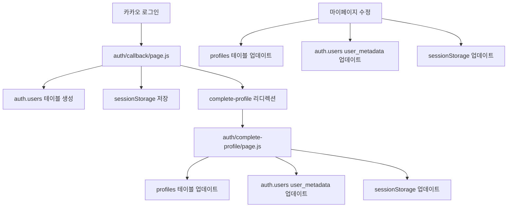
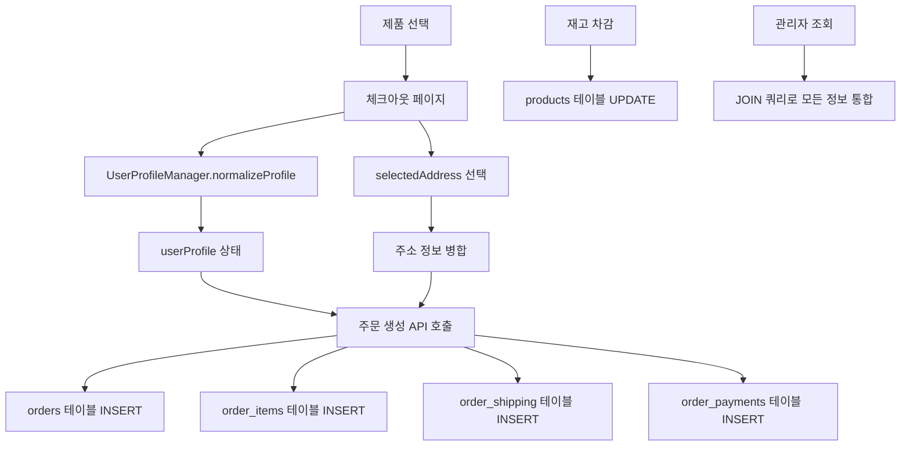
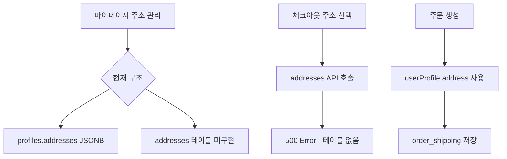
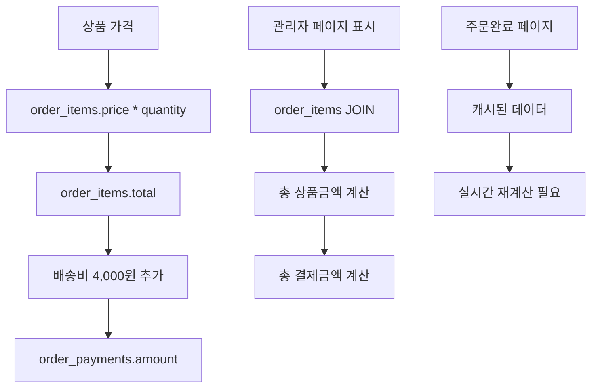

# 🔄 시스템 데이터 흐름 및 상호의존성 분석

## 📋 목표
**"어느곳을수정할때 그곳을 수정 변경하면 다른곳도 함께 수정 보완해야한다는 그런거를 파악하고 작업할수있자나"**

이 분석은 시스템의 모든 데이터 흐름과 상호의존성을 매핑하여 한 곳을 수정할 때 영향받는 모든 영역을 사전에 파악하고 최적화할 수 있도록 합니다.

---

## 🎯 핵심 데이터 흐름 매핑

### 1. 사용자 인증 및 프로필 관리 흐름

#### 🔑 **Kakao 사용자 데이터 흐름**


#### 📊 **데이터 저장 위치별 동기화 매트릭스**

| 수정 위치 | auth.users | profiles | sessionStorage | 관련 파일 |
|-----------|------------|----------|----------------|-----------|
| **카카오 신규 가입** | ✅ 자동생성 | ✅ complete-profile | ✅ complete-profile | `auth/callback/page.js`, `auth/complete-profile/page.js` |
| **프로필 완성** | ✅ user_metadata | ✅ 직접 업데이트 | ✅ 직접 업데이트 | `auth/complete-profile/page.js:153-162` |
| **마이페이지 수정** | ✅ user_metadata | ✅ 직접 업데이트 | ✅ 직접 업데이트 | `mypage/page.js:220-271` |
| **관리자 페이지 표시** | 🎯 **우선 조회** | 🔄 백업 조회 | ❌ 조회 안함 | `admin/customers/[id]/page.js` |

#### ⚠️ **중요 의존성 주의사항**
1. **관리자 페이지는 auth.users.user_metadata를 우선 조회**하므로 모든 프로필 수정 시 반드시 업데이트 필요
2. **카카오 사용자는 삼중 저장소 동기화** 필요: auth.users ↔ profiles ↔ sessionStorage
3. **일반 사용자는 이중 저장소**: auth.users ↔ profiles (sessionStorage 사용 안함)

---

### 2. 주문 생성 및 관리 흐름

#### 🛒 **주문 데이터 흐름**


#### 📋 **주문 관련 테이블 의존성**

| 테이블 | 의존 관계 | 영향 범위 | 수정 시 확인사항 |
|--------|----------|----------|------------------|
| **orders** | 🎯 핵심 테이블 | 모든 주문 관련 기능 | `user_id`, `order_type`, `status` 변경 시 연관 테이블 확인 |
| **order_items** | orders FK | 상품 표시, 계산 | `price`, `total`, `title` 수정 시 관리자 페이지 영향 |
| **order_shipping** | orders FK | 배송 정보 | 주소 수정 시 여러 위치 동기화 필요 |
| **order_payments** | orders FK | 결제 정보 | `depositor_name` 수정 시 입금 안내 영향 |
| **products** | order_items FK | 재고 관리 | 재고 수정 시 주문 가능 여부 변경 |

#### 🔗 **주문 생성 API 의존성 체인**

1. **카드결제 API** (`api/create-order-card/route.js`)
   - ✅ **입력**: userProfile (selectedAddress 포함), orderData, userId
   - 🔄 **처리**: users 테이블 확인/생성 → orders → order_items → order_shipping → order_payments → 재고 차감
   - ⚠️ **의존성**: UserProfileManager 제거, 직접 처리로 단순화됨

2. **카카오 주문 API** (`api/_deprecated_kakao_apis/create-order-kakao/route.js`)
   - ✅ **입력**: 동일한 구조
   - 🔄 **처리**: 동일한 플로우
   - ⚠️ **상태**: Deprecated - 통합 예정

---

### 3. 주소 관리 시스템 흐름

#### 🏠 **주소 데이터 이중 구조**

**현재 상황**: 프로덕션과 개발 환경 간 불일치 발견
- **프로덕션**: profiles 테이블 JSONB addresses 컬럼 사용
- **개발 계획**: 별도 addresses 테이블 사용 (미구현 상태)



#### ⚠️ **주소 관리 최적화 필요사항**

1. **addresses 테이블 구현 완료 필요**
   - 현재 API는 구현되어 있으나 DB 테이블 미생성
   - `supabase/migration-add-addresses-jsonb.sql` 실행 필요

2. **이중 주소 저장 구조 통합**
   - profiles.addresses (JSONB) → addresses 테이블로 마이그레이션
   - 기존 데이터 보존하면서 점진적 전환

---

### 4. 결제 및 계산 로직 흐름

#### 💰 **결제 금액 계산 체인**



#### 🔄 **계산 로직 의존성**

| 계산 위치 | 데이터 소스 | 업데이트 조건 | 영향 범위 |
|-----------|-------------|---------------|-----------|
| **주문 생성 시** | 실시간 계산 | 상품 가격 변경 | 새로운 주문만 |
| **관리자 페이지** | DB 조회 + 계산 | order_items 스키마 변경 | 기존 모든 주문 |
| **주문완료 페이지** | 캐시 + 재계산 | 계산 로직 변경 | 해당 주문만 |
| **그룹 주문 처리** | 집계 계산 | 그룹 로직 변경 | 그룹 주문 전체 |

---

## 🎯 수정 시 영향도 매트릭스

### 고위험 수정사항 (전체 시스템 영향)

#### 1. **데이터베이스 스키마 변경**
**영향 범위**: 🔴 전체 시스템
- ✅ **수정 완료**: production-to-development-schema 마이그레이션
- ⚠️ **확인 필요**: `order_items` 테이블의 신/구 컬럼 호환성
- 🔄 **관련 파일**: `lib/supabaseApi.js`, 모든 API endpoints, 관리자 페이지

**수정 시 체크리스트**:
```bash
# 1. 스키마 변경 적용
# 2. 기존 데이터 마이그레이션 확인
# 3. 모든 API 엔드포인트 테스트
# 4. 관리자 페이지 표시 확인
# 5. 주문 생성 플로우 테스트
```

#### 2. **사용자 인증 구조 변경**
**영향 범위**: 🔴 전체 사용자 시스템
- 🎯 **핵심 파일**: `hooks/useAuth.js`, `lib/userProfileManager.js`
- 📊 **동기화 포인트**: auth.users ↔ profiles ↔ sessionStorage
- 🔄 **의존 컴포넌트**: 모든 인증 필요 페이지, 관리자 시스템

**수정 시 체크리스트**:
```bash
# 1. 카카오/일반 사용자 로그인 테스트
# 2. 프로필 수정 시 3중 저장소 동기화 확인
# 3. 관리자 페이지 사용자 정보 표시 확인
# 4. 주문 생성 시 사용자 연결 확인
```

### 중위험 수정사항 (특정 기능 영향)

#### 3. **주문 생성 로직 변경**
**영향 범위**: 🟡 주문 관련 기능
- 🎯 **핵심 파일**: `api/create-order-*`, `lib/supabaseApi.js`
- 📊 **의존 테이블**: orders, order_items, order_shipping, order_payments
- 🔄 **연관 기능**: 재고 관리, 결제 처리, 배송 정보

#### 4. **주소 관리 시스템 변경**
**영향 범위**: 🟡 주소 및 배송 기능
- 🎯 **핵심 파일**: `components/address/*`, `api/addresses/*`
- 📊 **데이터 구조**: profiles.addresses vs addresses 테이블
- 🔄 **연관 기능**: 체크아웃, 주문 생성, 마이페이지

### 저위험 수정사항 (UI/표시 영향)

#### 5. **관리자 페이지 UI 변경**
**영향 범위**: 🟢 관리자 인터페이스만
- 🎯 **핵심 파일**: `admin/*` 디렉토리
- 📊 **데이터 의존성**: 기존 API 및 DB 구조 유지
- 🔄 **연관 기능**: 데이터 표시 방식만 변경

---

## 🔧 최적화 기회 식별

### 1. **데이터 저장 구조 최적화**

#### 🎯 **사용자 프로필 통합**
**현재 문제**: 카카오 사용자 삼중 저장으로 인한 동기화 복잡성
```javascript
// 현재: 3곳 저장 필요
auth.users.user_metadata
profiles 테이블
sessionStorage
```

**최적화 방안**:
```javascript
// 제안: 단일 소스 원칙 적용
auth.users.user_metadata (메인)
└── profiles 테이블 (캐시/백업)
└── sessionStorage (세션용)
```

#### 🎯 **주소 관리 통합**
**현재 문제**: JSONB vs 정규화 테이블 이중 구조
```sql
-- 현재: 혼재 구조
profiles.addresses JSONB
addresses 테이블 (미구현)
```

**최적화 방안**:
```sql
-- 제안: 완전 정규화 구조
addresses 테이블 (메인)
├── user_id FK
├── is_default 플래그
└── 확장 가능한 컬럼 구조
```

### 2. **API 호출 최적화**

#### 🎯 **병렬 처리 강화**
**현재**: 순차적 API 호출로 인한 성능 저하
**최적화**: 무관한 API 호출들 병렬 처리

```javascript
// 현재
await loadUserProfile()
await loadAddresses()
await loadOrderHistory()

// 최적화
await Promise.all([
  loadUserProfile(),
  loadAddresses(),
  loadOrderHistory()
])
```

### 3. **데이터 일관성 강화**

#### 🎯 **실시간 동기화**
**현재**: 수동 동기화로 인한 데이터 불일치 위험
**최적화**: 자동 동기화 메커니즘 도입

```javascript
// 제안: 통합 프로필 업데이트 함수
const updateUserProfile = async (userId, profileData) => {
  await Promise.all([
    updateAuthUserMetadata(userId, profileData),
    updateProfilesTable(userId, profileData),
    updateSessionStorage(profileData)
  ])
}
```

---

## 📋 수정 작업 가이드라인

### 🔴 **고위험 수정 시 필수 체크포인트**

1. **스키마 변경**
   ```bash
   ✅ 백업 생성
   ✅ 마이그레이션 스크립트 테스트
   ✅ 기존 데이터 호환성 확인
   ✅ 모든 API 엔드포인트 테스트
   ✅ 프론트엔드 표시 확인
   ```

2. **인증 시스템 수정**
   ```bash
   ✅ 카카오 로그인 테스트
   ✅ 일반 로그인 테스트
   ✅ 프로필 수정 테스트
   ✅ 관리자 페이지 표시 확인
   ✅ 세션 유지 확인
   ```

### 🟡 **중위험 수정 시 확인사항**

1. **주문 시스템 수정**
   ```bash
   ✅ 새 주문 생성 테스트
   ✅ 기존 주문 조회 테스트
   ✅ 관리자 페이지 확인
   ✅ 계산 로직 검증
   ```

2. **주소 관리 수정**
   ```bash
   ✅ 주소 추가/수정/삭제 테스트
   ✅ 체크아웃 주소 선택 확인
   ✅ 주문 생성 시 주소 연동 확인
   ```

### 🟢 **저위험 수정 시 간단 체크**

1. **UI 변경**
   ```bash
   ✅ 시각적 표시 확인
   ✅ 반응형 레이아웃 확인
   ✅ 기본 기능 동작 확인
   ```

---

## 🚀 다음 단계 최적화 계획

### 즉시 필요한 작업

1. **addresses 테이블 생성**
   - `supabase/migration-add-addresses-jsonb.sql` 실행
   - API 500 에러 해결

2. **데이터 일관성 검증**
   - 카카오 사용자 프로필 동기화 확인
   - 주문 계산 로직 정확성 검증

### 중기 최적화 목표

1. **통합 사용자 관리 시스템**
   - 삼중 저장소 → 단일 소스 원칙 적용
   - 자동 동기화 메커니즘 구현

2. **주소 관리 시스템 완성**
   - JSONB → 정규화 테이블 완전 전환
   - 확장 가능한 구조로 개선

3. **성능 최적화**
   - API 호출 병렬 처리
   - 불필요한 중복 조회 제거
   - 캐싱 전략 도입

---

**📊 분석 완료 시간**: 2025-10-01
**🎯 목표**: 수정 시 영향 범위를 사전에 파악하여 안전하고 효율적인 개발 프로세스 구축