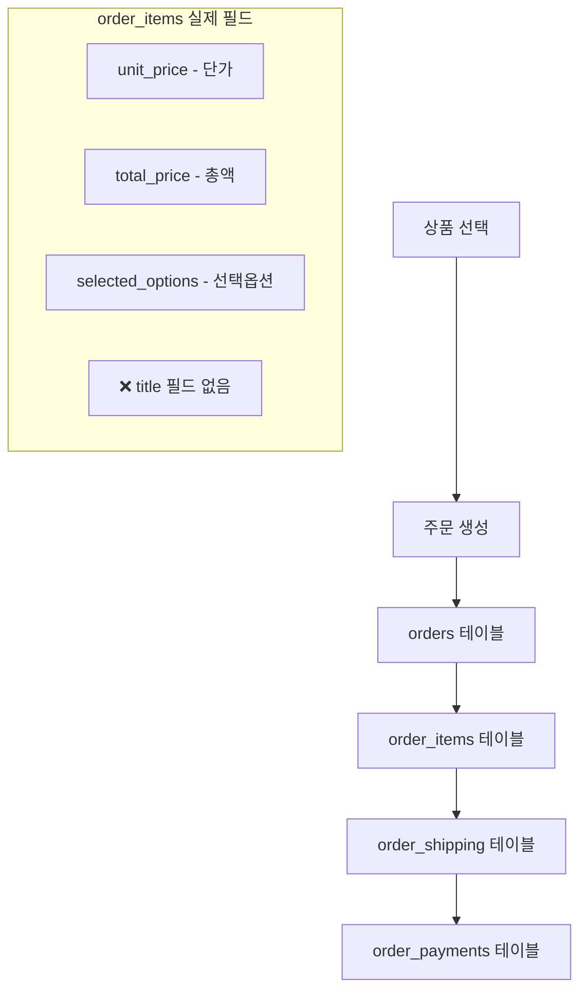
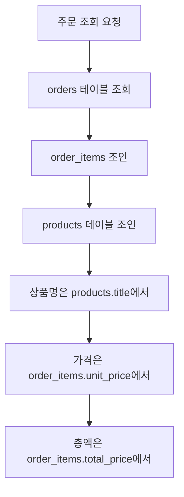

# 🏗️ Live Commerce 실제 프로덕션 시스템 아키텍처

## 📋 개요
이 문서는 **실제 프로덕션 서버(supabase_schema.sql) 기준**으로 작성된 시스템 구조 문서입니다.
- 실제 DB 스키마 기준 분석
- 프로덕션 데이터 흐름 매핑
- 실제 테이블 구조 반영

---

## 🗄️ 실제 프로덕션 데이터베이스 구조

### 핵심 테이블 스키마

#### 1. orders (주문)
```sql
CREATE TABLE IF NOT EXISTS orders (
    id UUID DEFAULT gen_random_uuid() PRIMARY KEY,
    customer_order_number VARCHAR(50) UNIQUE,
    user_id UUID REFERENCES auth.users(id),
    status VARCHAR(20) DEFAULT 'pending',
    order_type VARCHAR(20) DEFAULT 'direct',
    total_amount DECIMAL(10, 2),
    created_at TIMESTAMPTZ DEFAULT NOW(),
    updated_at TIMESTAMPTZ DEFAULT NOW()
);
```

#### 2. order_items (주문 상품) ⚠️ 중요
```sql
CREATE TABLE IF NOT EXISTS order_items (
    id UUID DEFAULT gen_random_uuid() PRIMARY KEY,
    order_id UUID REFERENCES orders(id) ON DELETE CASCADE,
    product_id UUID REFERENCES products(id),
    quantity INTEGER NOT NULL DEFAULT 1,
    unit_price DECIMAL(10, 2),           -- ❗ price가 아닌 unit_price
    total_price DECIMAL(10, 2) NOT NULL,
    selected_options JSONB DEFAULT '{}',
    created_at TIMESTAMPTZ DEFAULT NOW()
    -- ❗ title 컬럼 없음 (products 테이블에서 조인)
);
```

#### 3. order_shipping (배송 정보)
```sql
CREATE TABLE IF NOT EXISTS order_shipping (
    id UUID DEFAULT gen_random_uuid() PRIMARY KEY,
    order_id UUID REFERENCES orders(id) ON DELETE CASCADE,
    name VARCHAR(100) NOT NULL,
    phone VARCHAR(20) NOT NULL,
    address TEXT NOT NULL,
    detail_address TEXT,
    shipping_fee DECIMAL(10, 2) DEFAULT 4000,
    created_at TIMESTAMPTZ DEFAULT NOW()
);
```

#### 4. order_payments (결제 정보)
```sql
CREATE TABLE IF NOT EXISTS order_payments (
    id UUID DEFAULT gen_random_uuid() PRIMARY KEY,
    order_id UUID REFERENCES orders(id) ON DELETE CASCADE,
    method VARCHAR(50) NOT NULL,
    amount DECIMAL(10, 2) NOT NULL,
    status VARCHAR(20) DEFAULT 'pending',
    depositor_name VARCHAR(100),
    created_at TIMESTAMPTZ DEFAULT NOW()
);
```

---

## 🔄 실제 데이터 흐름

### 주문 생성 프로세스 (실제 DB 기준)


### 주문 조회 프로세스 (실제 DB 기준)


---

## 📊 코드와 실제 DB 매핑

### ✅ 올바른 order_items 생성 코드
```javascript
const itemData = {
  order_id: orderId,
  product_id: productId,
  quantity: quantity,
  unit_price: price,           // ❗ price가 아닌 unit_price
  total_price: totalPrice,
  selected_options: options    // ❗ JSONB 형태
  // ❗ title 필드 없음
}
```

### ✅ 올바른 order_items 조회 코드
```javascript
items: order.order_items.map(item => ({
  id: item.id,
  product_id: item.product_id,
  title: item.products?.title || '상품',    // ❗ products 테이블에서
  quantity: item.quantity,
  price: item.unit_price || 0,             // ❗ unit_price 사용
  totalPrice: item.total_price || 0,       // ❗ total_price 사용
  selectedOptions: item.selected_options || {}
}))
```

---

## 🚨 주요 주의사항

### ❌ 잘못된 코드 (이전)
```javascript
// 틀린 필드명들
price: item.price                // ❌ 실제로는 unit_price
total: item.total               // ❌ 실제로는 total_price
title: item.product_title       // ❌ order_items에 title 컬럼 없음
```

### ✅ 올바른 코드 (현재)
```javascript
// 실제 DB 스키마 반영
unit_price: item.price          // ✅ DB는 unit_price 사용
total_price: item.totalPrice    // ✅ DB는 total_price 사용
title: item.products?.title     // ✅ products 테이블에서 조인
```

---

## 🛠️ 핵심 API 함수 (실제 DB 기준)

### createOrder (lib/supabaseApi.js)
**실제 DB 스키마 반영**:
- `unit_price` 필드 사용
- `total_price` 필드 사용
- `title` 필드 제거 (DB에 없음)

### getOrders (lib/supabaseApi.js)
**실제 DB 조회 로직**:
- products 테이블 조인으로 상품명 확보
- `unit_price`에서 개별 가격
- `total_price`에서 총액

---

## 📋 문제 해결 체크리스트 (프로덕션 기준)

### 1️⃣ 스키마 확인
- [ ] supabase_schema.sql 기준인지 확인
- [ ] order_items 필드명 정확한지 확인
- [ ] products 조인 여부 확인

### 2️⃣ 로그 분석
- [ ] "Could not find column" 에러 → 필드명 불일치
- [ ] "상품명 없음" → products 조인 누락
- [ ] "₩0" 표시 → unit_price/total_price 매핑 오류

### 3️⃣ 코드 검증
- [ ] createOrder에서 unit_price 사용하는지
- [ ] getOrders에서 products 조인하는지
- [ ] title은 products.title에서 가져오는지

---

## 🎯 현재 시스템 상태 (실제 프로덕션)

### ✅ 해결된 사항
- **2025-09-30**: 실제 DB 스키마 (supabase_schema.sql) 완전 반영
- **order_items 생성**: unit_price, total_price 정확 매핑
- **order_items 조회**: products 조인으로 title 확보
- **0종 0개, ₩0 문제**: 실제 DB 스키마 반영으로 해결

### 📁 핵심 파일
- `/supabase_schema.sql` - **실제 프로덕션 스키마**
- `/lib/supabaseApi.js` - 실제 DB 반영된 API 로직
- `/SYSTEM_ARCHITECTURE.md` - 이전 개발용 문서 (참고용)

---

*최종 업데이트: 2025-09-30 (실제 프로덕션 기준)*
*담당자: Claude Code*